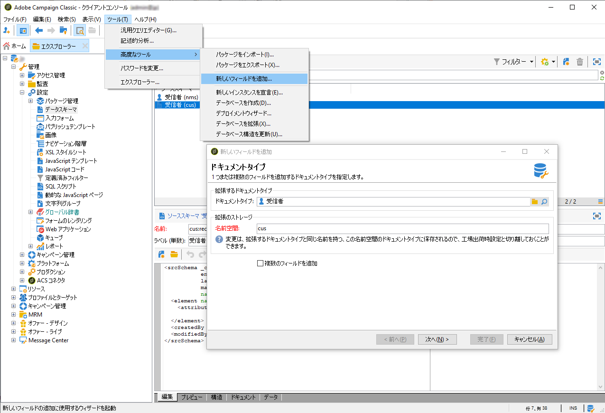
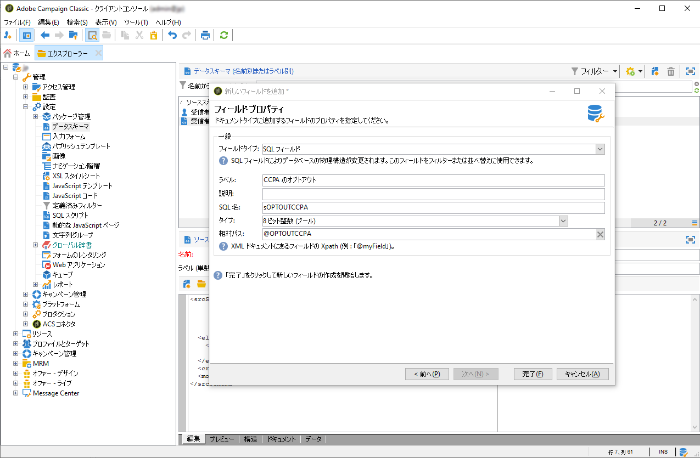
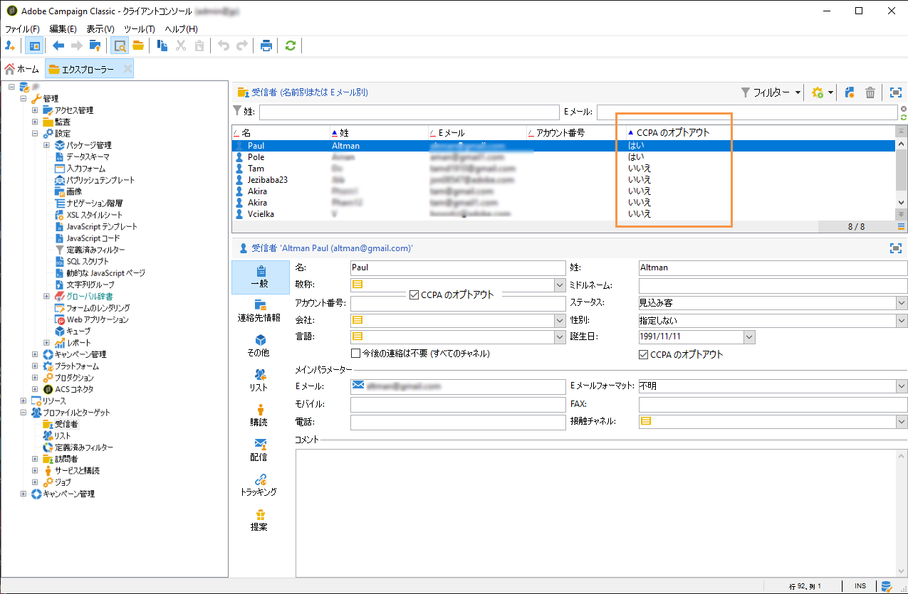

# 個人情報の販売のオプトアウト（CCPA） {#sale-of-personal-information-ccpa}


**カリフォルニア州消費者プライバシー法**（CCPA）は、カリフォルニア州民に個人情報に関する新しい権利を提供し、カリフォルニア州でビジネスをおこなう特定の事業者に対してデータ保護の責任を課します。

アクセスリクエストおよび削除リクエストの設定および使用方法は、GDPR と CCPA で共通です。ここでは、CCPA に固有の個人データ販売のオプトアウトについて説明します。

Adobe Campaign が提供する[同意管理](privacy-management.md#consent-management)ツールに加えて、消費者が個人情報の販売をオプトアウトしたかどうかをトラッキングすることもできます。

コンタクト先は、自分の個人情報が第三者に販売されることを禁止するかどうかを、システムを通じて決定することができます。Adobe Campaign では、この情報を保存してトラッキングできます。

これをおこなうには、プロファイルテーブルを拡張して、「**[!UICONTROL CCPA のオプトアウト]**」フィールドを追加する必要があります。

>[!IMPORTANT]
>
>データ主体のリクエストを受け取り、CCPA のリクエスト日を追跡するのは、データ管理者の責任です。アドビはテクノロジープロバイダーとして、オプトアウトの方法を提供するだけです。 データ管理者としての役割について詳しくは、[個人データとペルソナ](privacy-and-recommendations.md#personal-data)を参照してください。

## 前提条件 {#ccpa-prerequisite}

この情報を活用するには、Adobe Campaign Classic でこのフィールドを作成する必要があります。この場合、**[!UICONTROL 受信者]**&#x200B;テーブルにブール値フィールドを追加します。新しいフィールドが作成されると、Campaign API によって自動的にサポートされます。

また、カスタム受信者テーブルを使用する場合、この操作を実行する必要があります。

新しいフィールドの作成方法について詳しくは、[スキーマエディションのドキュメント](../../configuration/using/about-schema-edition.md)を参照してください。

>[!IMPORTANT]
>
>スキーマの変更は機密性の高い操作であり、エキスパートユーザーのみが実行する必要があります。

1. **[!UICONTROL ツール]**／**[!UICONTROL 詳細設定]**／**[!UICONTROL 新しいフィールドを追加]**&#x200B;をクリックし、**[!UICONTROL 受信者]**&#x200B;を「**[!UICONTROL ドキュメントタイプ]**」として選択して、「**[!UICONTROL 次へ]**」をクリックします。テーブルへのフィールドの追加について詳しくは、[こちら](../../configuration/using/new-field-wizard.md)を参照してください。

   

1. 「**[!UICONTROL フィールドタイプ]**」で「**[!UICONTROL SQL フィールド]**」を選択します。ラベルには、「**[!UICONTROL CCPA のオプトアウト]**」を使用します。**[!UICONTROL 8 ビット整数（ブール値）]**&#x200B;タイプを選択して、一意の&#x200B;**[!UICONTROL 相対パス]**「@OPTOUTCCPA」を定義します。「**[!UICONTROL 完了]**」をクリックします。

   

   これにより、**[!UICONTROL 受信者（cus）]**&#x200B;スキーマが拡張または作成されます。フィールドが正しく追加されていることを確認するには、これをクリックします。

   

1. エクスプローラーの&#x200B;**[!UICONTROL 設定]**／**[!UICONTROL 入力フォーム]**&#x200B;ノードをクリックします。**[!UICONTROL 受信者（nms）]**&#x200B;の「一般的なパッケージ」で、`<input>` 要素を追加して、xpath 値に、手順 2 で定義した相対パスを使用します。フォームの識別について詳しくは、[こちら](../../configuration/using/identifying-a-form.md)を参照してください。

   ```
   <input  colspan="2" type="checkbox" xpath="@OPTOUTCCPA"/>
   ```

   

1. 接続を解除し、再接続します。次の節で説明する手順に従って、受信者の詳細でフィールドが使用可能であることを確認します。

## 使用状況 {#usage}

フィールドの値を入力し、データ販売に関する CCPA ガイドラインおよびルールに従うことは、データ管理者の責務です。

値はいくつかの方法で入力できます。

* Campaign のインターフェイスを使用した受信者の詳細の編集
* API の使用
* データインポートワークフローの使用

次に、オプトアウトしたプロファイルの個人情報を第三者に販売しないようにする必要があります。

1. オプトアウトステータスを変更するには、**[!UICONTROL プロファイルとターゲット]**／**[!UICONTROL 受信者]**&#x200B;で、受信者を選択します。「**[!UICONTROL 一般]**」タブには、前の節で設定したフィールドが表示されます。

   

1. 受信者リストを設定して、オプトアウト列を表示します。リストの設定方法については、[詳細なドキュメント](../../platform/using/adobe-campaign-workspace.md#configuring-lists)を参照してください。

   

1. 列をクリックすると、オプトアウト情報に従って受信者を並べ替えることができます。オプトアウトした受信者のみを表示するフィルターを作成することもできます。フィルターの作成について詳しくは、[こちら](../../platform/using/creating-filters.md)を参照してください。

   
