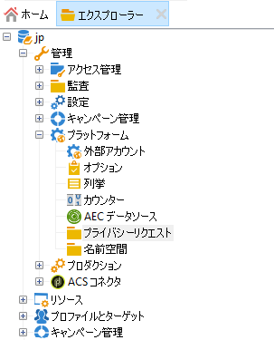
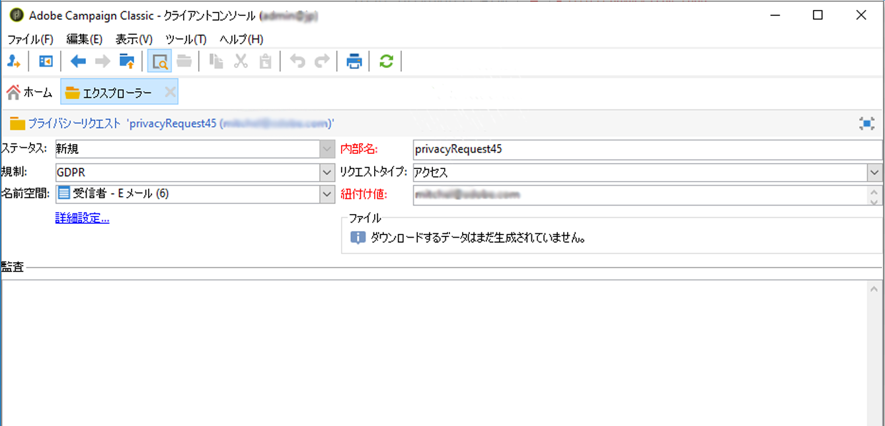
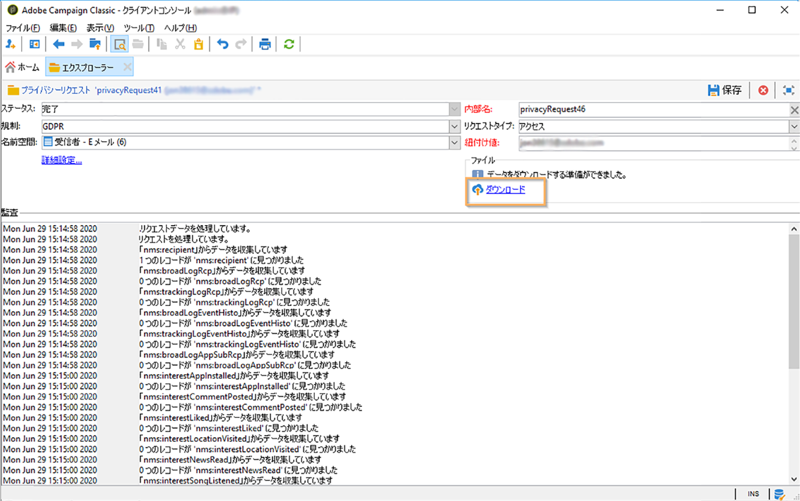
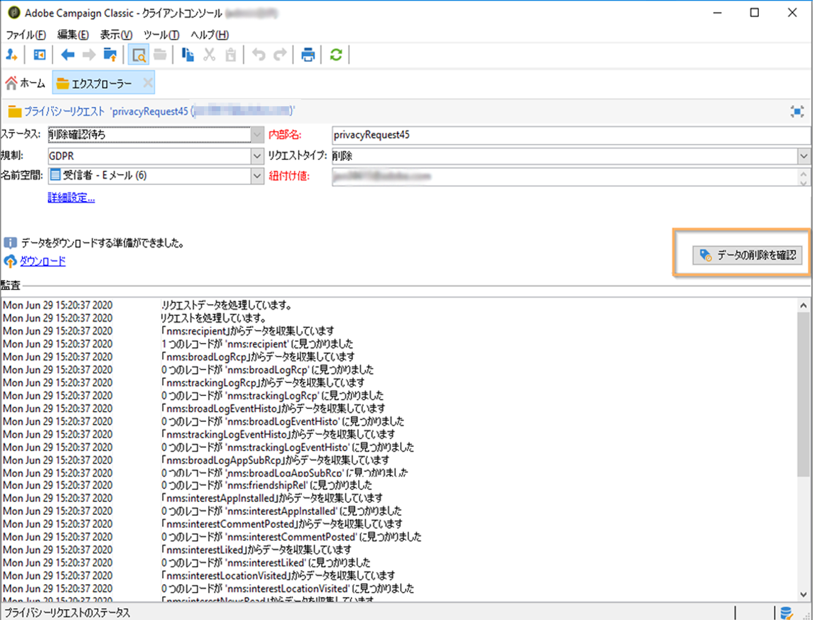

# プライバシーリクエストの作成と管理 {#privacy-request-ui}


この節では、アクセスリクエストと削除リクエストの作成方法のほか、それらのリクエストを Adobe Campaign がどのように処理するかについて説明します。

## プライバシーリクエストの作成 {#create-privacy-request-ui}

**Adobe Campaign インターフェイス**&#x200B;では、プライバシーリクエストを作成し、その推移をトラッキングできます。新しいプライバシーリクエストを作成するには、次の手順に従います。

1. **[!UICONTROL 管理]**／**[!UICONTROL プラットフォーム]**／**[!UICONTROL プライバシーリクエスト]**&#x200B;のプライバシーリクエストフォルダーにアクセスします。

   

1. この画面では、現在のすべてのプライバシーリクエストとそのステータス、ログを表示できます。新しいプライバシーリクエストを作成するには、「**[!UICONTROL 新規]**」をクリックします。

   

1. **[!UICONTROL 規制]**（GDPR、CCPA、PDPA、LGPD）、**[!UICONTROL リクエストタイプ]**（アクセスまたは削除）、**[!UICONTROL 名前空間]**&#x200B;を選択し、**[!UICONTROL 紐付け値]**&#x200B;を入力します。名前空間としてメールを使用する場合は、データ主体のメールアドレスを入力します。

   

プライバシーのテクニカルワークフローは毎日 1 回実行され、新しいリクエストが個別に処理されます。

* 削除リクエスト：Adobe Campaign に保存されている受信者のデータが消去されます。
* アクセスリクエスト：Adobe Campaign に保存されている受信者のデータが生成され、リクエスト画面の左側で XML ファイルとして取得できるようになります。



## テーブルのリスト {#list-of-tables}

プライバシーに関連する削除またはアクセスリクエストの実行時に、受信者テーブル（独自タイプ）にリンクされたすべてのテーブルの&#x200B;**[!UICONTROL 紐付け値]**&#x200B;に基づいて、データ主体のすべてのデータを検索します。

以下は、プライバシーリクエストの実行時に考慮される標準テーブルをリストしたものです。

* 受信者（recipient）
* 受信者配信ログ（broadLogRcp）
* 受信者トラッキングログ（trackingLogRcp）
* アーカイブしたイベント配信ログ（broadLogEventHisto）
* 受信者リストのコンテンツ（rcpGrpRel）
* 訪問者オファー提案（propositionVisitor）
* 訪問者（visitor）
* 購読履歴（subHisto）
* 購読（subscription）
* 受信者のオファーの提案（propositionRcp）

受信者テーブル（独自タイプ）にリンクされるカスタムテーブルを作成した場合は、そのテーブルも考慮されます。例えば、受信者テーブルにリンクしているトランザクションテーブルと、そのトランザクションテーブルにリンクしているトランザクション詳細テーブルがある場合、両方のテーブルが考慮されます。

>[!IMPORTANT]
>
>プロファイル削除ワークフローを使用してプライバシーバッチリクエストを実行する場合は、次の注意点を考慮に入れてください。
>* ワークフローを使用したプロファイル削除では、子テーブルが処理されません。
>* すべての子テーブルに対して削除処理をおこなう必要があります。
>* プライバシーアクセステーブル内で削除する行を追加する ETL ワークフローを作成し、**[!UICONTROL プライバシー要求データの削除]**&#x200B;ワークフローで削除を実行することをお勧めします。パフォーマンス上の理由から、削除するプロファイルの数は 1 日あたり 200 個までに制限することをお勧めします。

## プライバシーリクエストのステータス {#privacy-request-statuses}

プライバシーリクエストには、次のようなステータスがあります。

* **[!UICONTROL 新規]**／**[!UICONTROL 再試行保留]**：ワークフローは進行中で、リクエストの処理は完了していません。
* **[!UICONTROL 処理中]**／**[!UICONTROL 再試行中]**：ワークフローはリクエストを処理しています。
* **[!UICONTROL 削除保留]**：ワークフローにおいて、削除対象のすべての受信者データが特定済みです。
* **[!UICONTROL 削除中]**：ワークフローは削除を処理しています。
* **[!UICONTROL 削除確認保留]**：（2 段階処理モードの削除リクエスト）ワークフローでアクセスリクエストの処理が完了しました。削除を実行するための手動確認がリクエストされています。ボタンは 15 日間有効です。
* **[!UICONTROL 完了]**：リクエストの処理が終了しました。エラーは発生していません。
* **[!UICONTROL エラー]**：ワークフローにおいて、エラーが発生しました。理由は、プライバシーリクエストのリストの「**[!UICONTROL リクエストのステータス]**」列に表示されます。例えば、「**[!UICONTROL エラー: データが見つかりません]**」は、データ主体の&#x200B;**[!UICONTROL 紐付け値]**&#x200B;と一致する受信者データがデータベースに見つからなかったことを示します。

## 2 段階プロセス {#two-step-process}

デフォルトでは、**2 段階プロセス**&#x200B;が有効になっています。このモードで新しい削除リクエストを作成した場合、必ずアクセスリクエストが先に実行されます。これにより、削除前にデータを確認することができます。

このモードはプライバシーリクエスト編集画面から変更できます。「**[!UICONTROL 詳細設定]**」をクリックします。


2 段階モードが有効になっていると、新しい削除リクエストのステータスは「**[!UICONTROL 削除確認保留]**」に変わります。生成された XML ファイルをプライバシーリクエスト画面からダウンロードし、データを確認します。データの消去を確定するには、「**[!UICONTROL データの削除を確認]**」ボタンをクリックします。



## JSSP URL {#jspp-url}

Adobe Campaign は、アクセスリクエストの処理時に JSSP を生成します。この JSSP は、データベースから受信者のデータを取得し、ローカルマシンに保存されている XML ファイルにエクスポートします。JSSP の URL は次のように定義されます。

```
"$(serverUrl)+'/nms/gdpr.jssp?id='+@id"
```

ここで、@id はプライバシーリクエスト ID です.

この URL は、プライバシーリクエスト（gdprRequest）スキーマの&#x200B;**[!UICONTROL 「ファイルの場所」（@urlFile）]**&#x200B;フィールドに保存されます。****

この情報はデータベースで 90 日間有効です。テクニカルワークフローによりリクエストがクリーンアップされると、この情報はデータベースから削除され、URL は無効になります。データを Web ページからダウンロードする前に、URL がまだ有効であるか確認してください。

データ主体のデータファイルの例を以下に示します。


データ管理者は JSSP URL が含まれる Web アプリケーションを簡単に作成できます。これにより、データ主体のデータファイルを Web ページから使用できるようになります。


Web アプリケーションの&#x200B;**[!UICONTROL ページ]**&#x200B;アクティビティで例として使用できるコードスニペットを以下に示します。


```
<!DOCTYPE html PUBLIC "-//W3C//DTD XHTML 1.0 Transitional//EN" "http://www.w3.org/TR/xhtml1/DTD/xhtml1-transitional.dtd"> <html xmlns="http://www.w3.org/1999/xhtml"> <head> <meta http-equiv="Content-Language" content="en"> <meta http-equiv="Content-Type" content="text/html; charset=utf-8" /> <link rel="stylesheet" type="text/css" href="/nl/webForms/landingPage.css"/> <title>Clickthrough</title> <style type="text/css" media="all"> /* override formulary area */ .formulary { top: 200px; position: absolute; left: 0; } </style> </head> <body style="" class="">
<center>
<div id="wrap">
<div id="header">
<div class="header-title center-title">DOWNLOAD GDPR DATA</div>
<div class="formulary center-formulary"><form>
<div class="button large-button"><a href=[SERVER_URL]/nms/gdpr.jssp?id=13000" data-nl-type="externalLink">CLICK TO DOWNLOAD</a></div>
</form></div>
</div>
<div id="content">
<div class="row">
<div class="info">
<div class="desc">
<div class="title">EFFICIENCY</div>
<div class="desc">Our service is guaranteed to improve your efficiency. Increase performance and use our high-technology service to implement even the most ambitious of projects.</div>
</div>
</div>
</div>
</div>
<div id="footer">
<div style="text-align: center;">
<div style="float: left;"><a href="#">Contact us</a></div>
<div style="float: right;">&copy; Copyrights</div>
<div><a href="#"></a> <a href="#"></a> <a href="#"></a> <a href="#"></a></div>
</div>
</div>
</div>
</center>
</body> </html>
```

データ主体のデータファイルへのアクセスは制限されているため、Web ページへの匿名アクセスは無効にする必要があります。**[!UICONTROL プライバシーデータ権限]**&#x200B;ネームド権限があるオペレーターだけが、ページにログオンしてデータをダウンロードすることができます。
