# Managing privacy requests {#privacy-requests}

For a general presentation on Privacy Management, refer to [this section](../../platform/using/privacy-management.md).

この情報は、GDPR、CCPA、PDPA、LGPD に適用されます。これらの規制について詳しくは、[こちら](../../platform/using/privacy-management.md#privacy-management-regulations)を参照してください。

The opt-out for the Sale of Personal Information, which is specific to CCPA, is explained in [this section](#sale-of-personal-information-ccpa).

>[!IMPORTANT]
>
>このドキュメントで説明するインストール手順は、Campaign Classic18.4（ビルド8931+）以降で適用されます。 以前のバージョンを使用している場合は、この[テクニカルノート](https://helpx.adobe.com/jp/campaign/kb/how-to-install-gdpr-package-on-legacy-versions.html)を参照してください。

## プライバシーリクエストについて {#about-privacy-requests}

プライバシーの準備を容易にするために、Adobe Campaignではアクセスおよび削除の要求を処理できます。 この節では、 **アクセス権** と「忘れ去られる **権利** 」（削除要求）について説明 [します](../../platform/using/privacy-management.md#right-access-forgotten)。

アクセスリクエストと削除リクエストの作成方法、およびAdobe Campaignによる処理方法を見てみましょう。

### 原則 {#principles}

Adobe Campaign では、データ管理者は 2 とおりの方法でプライバシーのアクセスリクエストおよび削除リクエストをおこなうことができます。

* **Adobe Campaignインターフェースを使用**:各プライバシーリクエストに対して、データコントローラーはAdobe Campaignに新しいプライバシーリクエストを作成します。 [こちらの節](#create-privacy-request-ui)を参照してください。
* Via the **API**: Adobe Campaign provides an API that allows the automatic process of Privacy requests using SOAP. [こちらの節](#automatic-privacy-request-api)を参照してください。

>[!NOTE]
>
>個人データおよびデータを管理する様々なエンティティ（データ管理者、データ処理者、データ主体）について詳しくは、[個人データとペルソナ](../../platform/using/privacy-and-recommendations.md#personal-data)を参照してください。

### 前提条件 {#prerequesites}

Adobe Campaignオファーデータコントローラーツールを使用して、Adobe Campaignに保存されたデータに対するプライバシー要求を作成し、処理します。 ただし、データ主体とのやり取り（電子メール、カスタマーサポート、Web ポータル）はデータ管理者がおこなう必要があります。

また、要求者であるデータ主体の身元の確認、および要求者に返されるデータがデータ主体に関するものであることの確認は、データ管理者がおこないます。

### Installing the Privacy package {#install-privacy-package}

In order to use this feature, you need to install the **[!UICONTROL Privacy Data Protection Regulation]** package via the **[!UICONTROL Tools]** > **[!UICONTROL Advanced]** > **[!UICONTROL Import package]** > **[!UICONTROL Adobe Campaign Package]** menu. パッケージのインストール方法について詳しくは、[詳細ドキュメント](../../installation/using/installing-campaign-standard-packages.md)を参照してください。

Two new folders, specific to Privacy, are created under **[!UICONTROL Administration]** > **[!UICONTROL Platform]**:

* **[!UICONTROL プライバシーの要請]**:ここで、プライバシーリクエストを作成し、その進展を追跡します。
* **[!UICONTROL 名前空間]**：Adobe Campaign データベースでデータ主体を識別するために使用するフィールドを定義する場所です。

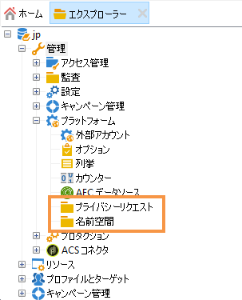

**[!UICONTROL 管理]** / **[!UICONTROL 実稼働]** / ****&#x200B;テクニカルワークフローでは、3人のテクニカルワークフローが毎日実行し、プライバシーの要求を処理します。

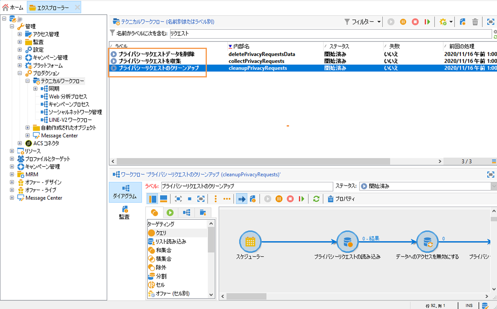

* **[!UICONTROL プライバシー要求の収集]**：このワークフローでは、Adobe Campaign に保存されている受信者のデータを生成し、プライバシー要求の画面でダウンロードできるようにします。
* **[!UICONTROL プライバシー要求データの削除]**：このワークフローでは、Adobe Campaign に保存されている受信者のデータを削除します。
* **[!UICONTROL プライバシー要求のクリーンアップ]**：このワークフローでは、90 日より古いアクセス要求ファイルが消去されます。

**[!UICONTROL 管理]**／**[!UICONTROL アクセス管理]**／**[!UICONTROL ネームド権限]**&#x200B;に、**[!UICONTROL プライバシーデータ権限]**&#x200B;というネームド権限が追加されました。このネームド権限は、データ管理者がプライバシーツールを使用する場合に必要となります。これにより、新しい要求の作成、推移のトラッキング、API の使用などができるようになります。

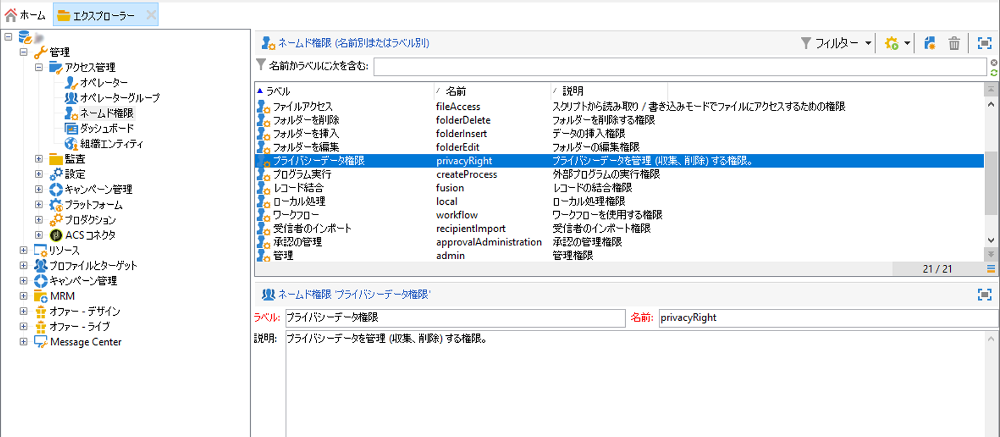

### 名前空間 {#namesspaces}

プライバシーリクエストを作成する前に、使用する名前空間を定義する必要があります。 これは、Adobe Campaignデータベース内のData Subjectを識別するために使用されるキーです。

標準では、E メール、電話、携帯電話の 3 つの名前空間を使用できます。別の名前空間（受信者用のカスタムフィールドなど）が必要な場合、**[!UICONTROL 管理]**／**[!UICONTROL プラットフォーム]**／**[!UICONTROL 名前空間]**&#x200B;で新しく作成することができます。

## プライバシーリクエストの作成 {#create-privacy-request-ui}

The **Adobe Campaign interface** allows you to create your Privacy requests and track their evolution. 新しいプライバシーリクエストを作成するには、次の手順に従います。

1. **[!UICONTROL 管理]**／**[!UICONTROL プラットフォーム]**／**[!UICONTROL プライバシー要求]**&#x200B;のプライバシー要求フォルダーにアクセスします。

   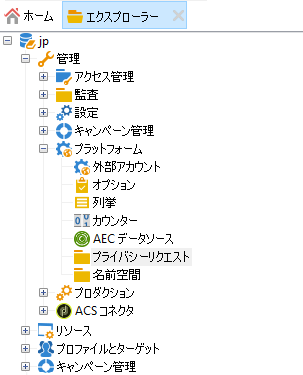

1. この画面では、現在のすべてのプライバシー要求、そのステータスおよびログを表示できます。 Click **[!UICONTROL New]** to create a Privacy request.

   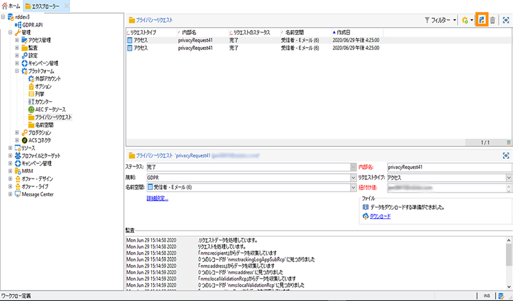

1. Select the **[!UICONTROL Regulation]** (GDPR, CCPA, PDPA or LGPD),  **[!UICONTROL Request type]** (Access or Delete), select a **[!UICONTROL Namespace]** and enter the **[!UICONTROL Reconciliation value]**. 名前空間として E メールを使用する場合は、データ主体の E メールアドレスを入力します。

   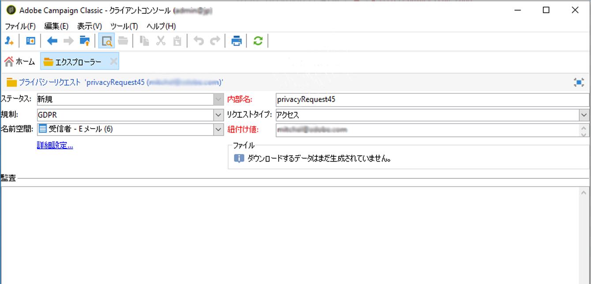

プライバシーテクニカルワークフローは毎日1回実行し、新しい要求を処理します。

* 削除要求：Adobe Campaign に保存されている受信者のデータが消去されます。
* アクセス要求：Adobe Campaign に保存されている受信者のデータが生成され、要求画面の左側で XML ファイルとして取得できるようになります。

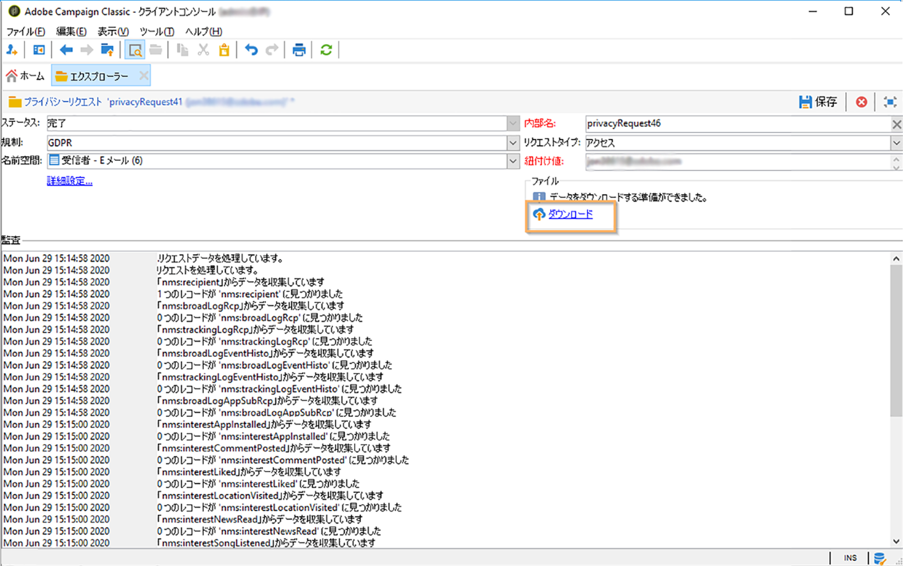

### テーブルのリスト {#list-of-tables}

When performing a Delete or Access Privacy request, Adobe Campaign searches all the Data Subject&#39;s data based on the **[!UICONTROL Reconciliation value]** in all the tables that have a link to the recipient table (own type).

次に、プライバシーリクエストを実行する際にあらかじめ用意されている表のリストを示します。

* 受信者（recipient）
* 受信者配信ログ（broadLogRcp）
* 受信者トラッキングログ（trackingLogRcp）
* アーカイブしたイベント配信ログ（broadLogEventHisto）
* 受信者リストのコンテンツ（rcpGrpRel）
* 訪問者オファー提案（propositionVisitor）
* 訪問者（visitor）
* 購読履歴（subHisto）
* 購読（subscription）
* 受信者のオファーの提案（propositionRcp）

受信者テーブル（独自タイプ）にリンクされるカスタムテーブルを作成した場合は、そのテーブルも考慮されます。例えば、受信者テーブルにリンクしているトランザクションテーブルと、そのトランザクションテーブルにリンクしているトランザクション詳細テーブルがある場合、両方のテーブルが考慮されます。

>[!IMPORTANT]
>
>プロファイルの削除ワークフローを使用してプライバシーバッチ要求を実行する場合は、次のコメントを考慮してください。
>* ワークフローを使用したプロファイル削除では、子テーブルが処理されません。
>* すべての子テーブルに対して削除処理をおこなう必要があります。
>* Adobe recommends that you create an ETL workflow that add the lines to delete in the Privacy Access table and let the **[!UICONTROL Delete privacy requests data]** perform the deletion. パフォーマンス上の理由から、削除するプロファイルの数は 1 日あたり 200 個までに制限することをお勧めします。


### プライバシー要求のステータス {#privacy-request-statuses}

プライバシーリクエストの様々なステータスを次に示します。

* **[!UICONTROL 新規]**／**[!UICONTROL 再試行待ち]**：ワークフローは進行中で、要求の処理は完了していません。
* **[!UICONTROL 処理中]**／**[!UICONTROL 再試行中]**：ワークフローにおいて、要求が処理中です。
* **[!UICONTROL 削除待ち]**：ワークフローにおいて、削除対象のすべての受信者データが特定済みです。
* **[!UICONTROL 削除中]**：ワークフローにおいて、削除を実行中です。
* **[!UICONTROL 削除確認保留]** （2ステップのプロセスモードでの削除要求）:ワークフローがアクセス要求を処理しました。 削除を実行するための手動確認が要求されています。ボタンは 15 日間有効です。
* **[!UICONTROL 完了]**：要求の処理が完了しました。エラーは発生していません。
* **[!UICONTROL エラー]**：ワークフローにおいて、エラーが発生しました。The reason appears in the list of Privacy requests in the **[!UICONTROL Request status]** column. 例えば、「**[!UICONTROL エラー: データが見つかりません]**」は、データ主体の&#x200B;**[!UICONTROL 紐付け値]**&#x200B;と一致する受信者データがデータベースに見つからなかったことを示します。

### 2段階のプロセス {#two-step-process}

By default, the **2-step process** is activated. このモードで新しい削除要求を作成した場合、必ずアクセス要求が先に実行されます。これにより、削除前にデータを確認することができます。

このモードはプライバシー要求編集画面から変更できます。Click **[!UICONTROL Advanced settings]**.

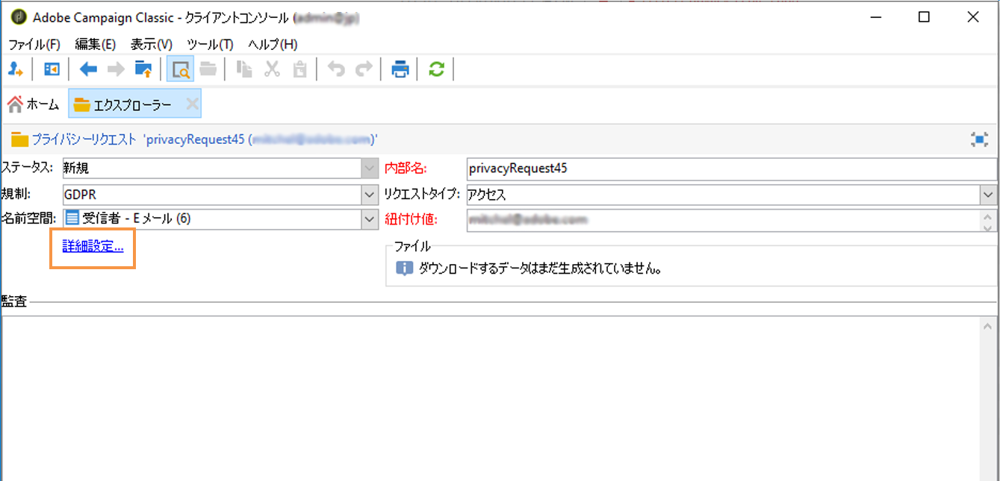

With the 2-step mode activated, the status of a new Delete request changes to **[!UICONTROL Confirm Delete Pending]**. 生成された XML ファイルをプライバシー要求画面からダウンロードし、データを確認します。To confirm erasing the data, click the **[!UICONTROL Confirm delete data]** button.

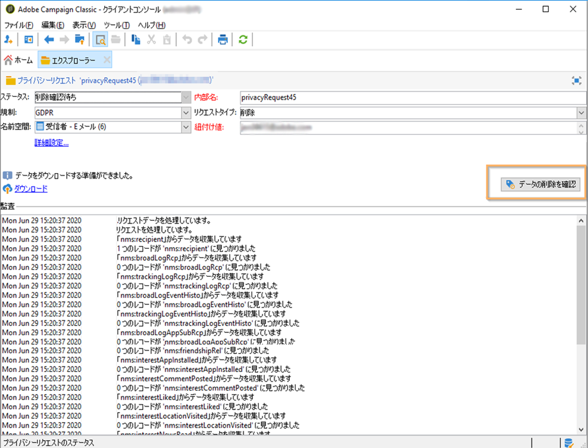

### JSSP URL {#jspp-url}

Adobe Campaign は、アクセス要求の処理時に JSSP を生成します。この JSSP は、データベースから受信者のデータを取得し、ローカルマシンに保存されている XML ファイルにエクスポートします。JSSP の URL は次のように定義されます。

```
"$(serverUrl)+'/nms/gdpr.jssp?id='+@id"
```

ここで、@id はプライバシーリクエスト ID です.

This URL is stored in the **[!UICONTROL &quot;File location&quot; (@urlFile)]** field of the **[!UICONTROL Privacy Requests (gdprRequest)]** schema.

この情報はデータベースで 90 日間有効です。テクニカルワークフローにより要求がクリーンアップされると、この情報はデータベースから削除され、URL は無効になります。データを Web ページからダウンロードする前に、URL がまだ有効であるか確認してください。

データ主体のデータファイルの例を以下に示します。


データ管理者は JSSP URL が含まれる Web アプリケーションを簡単に作成できます。これにより、データ主体のデータファイルを Web ページから使用できるようになります。

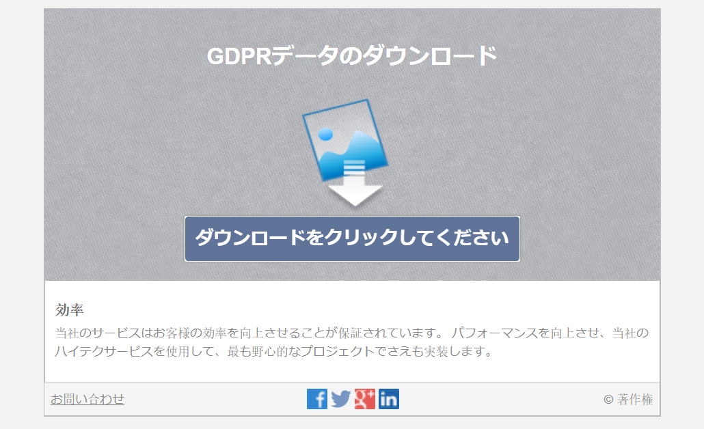

Web アプリケーションの&#x200B;**[!UICONTROL ページ]**&#x200B;アクティビティで例として使用できるコードスニペットを以下に示します。

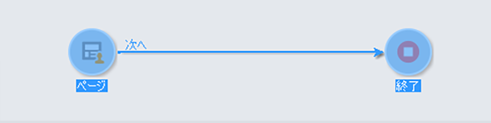

```
<!DOCTYPE html PUBLIC "-//W3C//DTD XHTML 1.0 Transitional//EN" "http://www.w3.org/TR/xhtml1/DTD/xhtml1-transitional.dtd"> <html xmlns="http://www.w3.org/1999/xhtml"> <head> <meta http-equiv="Content-Language" content="en"> <meta http-equiv="Content-Type" content="text/html; charset=utf-8" /> <link rel="stylesheet" type="text/css" href="/nl/webForms/landingPage.css"/> <title>Clickthrough</title> <style type="text/css" media="all"> /* override formulary area */ .formulary { top: 200px; position: absolute; left: 0; } </style> </head> <body style="" class="">
<center>
<div id="wrap">
<div id="header">
<div class="header-title center-title">DOWNLOAD GDPR DATA</div>
<div class="formulary center-formulary"><form>
<div class="button large-button"><a href=[SERVER_URL]/nms/gdpr.jssp?id=13000" data-nl-type="externalLink">CLICK TO DOWNLOAD</a></div>
</form></div>
</div>
<div id="content">
<div class="row">
<div class="info">
<div class="desc">
<div class="title">EFFICIENCY</div>
<div class="desc">Our service is guaranteed to improve your efficiency. Increase performance and use our high-technology service to implement even the most ambitious of projects.</div>
</div>
</div>
</div>
</div>
<div id="footer">
<div style="text-align: center;">
<div style="float: left;"><a href="#">Contact us</a></div>
<div style="float: right;">&copy; Copyrights</div>
<div><a href="#"></a> <a href="#"></a> <a href="#"></a> <a href="#"></a></div>
</div>
</div>
</div>
</center>
</body> </html>
```

データ主体のデータファイルへのアクセスは制限されているため、Web ページへの匿名アクセスは無効にする必要があります。**[!UICONTROL プライバシーデータ権限]**&#x200B;ネームド権限があるオペレーターだけが、ページにログオンしてデータをダウンロードすることができます。

## 自動プライバシーリクエストプロセス {#automatic-privacy-request-api}

Adobe Campaign provides an **API** which allows you to setup an automatic Privacy request process.

With the API, the general Privacy process is the same as [using the interface](#create-privacy-request-ui). 唯一の違いは、プライバシーリクエストの作成です。 Adobe Campaign で要求を作成するかわりに、要求情報を含む POST が Campaign に送信されます。要求ごとに、新しいエントリが&#x200B;**[!UICONTROL プライバシー要求]**&#x200B;画面に追加されます。次に、プライバシーテクニカルワークフローは、インターフェイスを使用して追加された要求と同じ方法で要求を処理します。

If you&#39;re using the API to submit Privacy requests, we recommend that you leave the **2-step process** activated for the first Delete requests, in order to test the returned data. テストが完了したら、2ステップのプロセスを非アクティブ化して、削除リクエストプロセスを自動的に実行できるようにします。

**[!UICONTROL CreateRequestByName]** JS API は次のように定義されます。

>[!NOTE]
>
>**gdprRequest** API を使用していた場合は引き続き使用できますが、新しい **privacyRequest** API を使用することをお勧めします。

>[!IMPORTANT]
>
>The **[!UICONTROL Privacy Data Right]** named right is required to use the API.

```
<method library="nms:gdpr.js" name="CreateRequestByName" static="true">
 <help>Create a new GDPR Request using namespace internal name</help>
 <parameters>
  <param name="namespaceName" type="string" desc="Namespace internal name"/>
  <param name="reconciliationValue" type="string" desc="Reconciliation value"/>
  <param name="type" type="long" desc="Reconciliation value"/>
  <param name="confirmDeletePending" type="boolean" desc="Request confirm before deleting data"/>
  <param name="regulation" type="long" desc="regulation of newly created request"/>
  <param name="id" type="long" inout="out" desc="ID of newly created request"/>
 </parameters>
</method>
```

>[!NOTE]
>
>「regulation」フィールドは、Campaign Classic 20.2（ビルド 9178 以降）を使用している場合にのみ使用可能です。
>
>20.2 に移行しており既に API を使用している場合は、上記のように「regulation」フィールドを追加する必要があります。以前のビルドを使用している場合は、「regulation」フィールドなしで API を引き続き使用できます。

### 外部からの API の呼び出し {#invoking-api-externally}

APIを外部から呼び出す方法の例を以下に示します（APIを介した認証、特にプライバシーAPIの詳細）。 For more information on the Privacy API, consult the [API documentation](https://docs.adobe.com/content/help/en/campaign-classic/technicalresources/api/s-nms-privacyRequest.html). また、[Web サービス呼び出しに関するドキュメント](../../configuration/using/web-service-calls.md)も参照してください。

最初に、API を通じて認証を実行する必要があります。

1. 次のURLから **xtk:session** WSDLをダウンロードします。 **`<server url>`/nl/jsp/schemawsdl.jsp?スキーマ=xtk:session**.

1. &quot;Logon&quot; メソッドを使用し、要求のパラメーターとしてユーザー名とパスワードを渡します。セッショントークンを含む応答が返されます。SoapUI を使用する場合の例を以下に示します。

   

1. 返されたセッショントークンを後続のすべての API 呼び出しの認証として使用します。これは 24 時間後に有効期限切れになります。

次に、プライバシーAPIを呼び出します。

1. Download the WSDL from this URL: **`<server url>`/nl/jsp/schemawsdl.jsp?schema=nms:privacyRequest**.

1. Use **[!UICONTROL CreateRequestByName]** to create a specific Privacy request.

   **[!UICONTROL CreateRequestByName]** を使用する場合の例を以下に示します。上記で提供されたセッショントークンを認証として使用する方法に注目してください。応答は、作成された要求の ID になります。

   

   上記の手順の実行に役立つように、以下の点を考慮してください。

   * You can use a **queryDef** on the **nms:gdprRequest** schema to check the status of the Access request.
   * You can use a **queryDef** on the **nms:gdprRequestData** schema to get the result of the Access request.
   * To be able to download the XML file from **&quot;$(serverUrl)&#39;/nms/gdpr.jssp?id=&#39;@id&quot;**, you must be logged in and accessing it from a whitelisted IP. これを行うには、JSSPで生成されたファイルにアクセスできるWebアプリケーションを作成します。

### JS からの API の呼び出し {#invoking-api-from-js}

Campaign Classic 内で JS から API を呼び出す方法の例を以下に示します。

>[!NOTE]
>
>「regulation」フィールドは、Campaign Classic 20.2（ビルド 9178 以降）を使用している場合にのみ使用可能です。
>
>20.2 に移行しており、既に API を使用している場合は、「regulation」フィールドを追加する必要があります。以前のビルドを使用している場合は、「regulation」フィールドなしで API を引き続き使用できます。

* If you are **using a previous build (with GDPR package)**, you can continue to use the API without the ‘regulation’ field as shown below:

   ```
   loadLibrary("nms:gdpr.js");
   /**************************** 
   This code calls an API to create new Privay request on the DB.
   It requires 4 parameters below.
   Feel free to change parameter values.
   ****************************/
   // 1. Namespace internal name
   var namespaceName = "defaultNamespace1";
   // 2. Reconciliation value for privacy request
   var reconciliationValue = "example@adobe.com";
   // 3. Privacy request type
   // GDPR_REQUEST_TYPE_ACCESS = 1;
   // GDPR_REQUEST_TYPE_DELETE = 2;
   var requestType = GDPR_REQUEST_TYPE_ACCESS;
   // 4. Confirm deleting data required.
   // value : true or false
   var ConfirmDeletePending = true;
   // BEGIN
   var requestId = nms.privacyRequest.CreateRequestByName(namespaceName, reconciliationValue, requestType, ConfirmDeletePending);
   // User can use a simple queryDef with requestID as a parameter to check request status.
   ```

* If you are **migrating to 20.2** and if you were already using the API, you must add the ‘regulation’ field as shown below:

   ```
   loadLibrary("nms:gdpr.js");
   /**************************** 
   This code calls an API to create new Privay request on the DB.
   It requires 5 parameters below.
   Feel free to change parameter values.
   ****************************/
   // 1. Namespace internal name
   var namespaceName = "defaultNamespace1";
   // 2. Reconciliation value for privacy request
   var reconciliationValue = "example@adobe.com";
   // 3. Privacy request type
   // PRIVACY_REQUEST_TYPE_ACCESS = 1;
   // PRIVACY_REQUEST_TYPE_DELETE = 2;
   var requestType = PRIVACY_REQUEST_TYPE_ACCESS;
   // 4. Confirm deleting data required.
   // value : true or false
   var ConfirmDeletePending = true;
   // 5. Specify which regulation applies to newly created request. This is mandatory parameter.
   // GDPR = 1
   // CCPA = 2
   // PDPA = 3
   // LGPD = 4
   var regulation = 1;
   // BEGIN
   var requestId = nms.privacyRequest.CreateRequestByName(namespaceName, reconciliationValue, requestType, ConfirmDeletePending, regulation);
   // User can use a simple queryDef with requestID as a parameter to check request status.
   ```

* If you are **using Campaign Classic 20.2 (build 9178+) or above**, the &#39;regulation&#39; field is optional, as shown below:

   ```
   loadLibrary("nms:gdpr.js");
   /**************************** 
   This code calls an API to create new Privay request on the DB.
   It requires 5 parameters below.
   Feel free to change parameter values 
   ****************************/
   // 1. Namespace internal name
   var namespaceName = "defaultNamespace1";
   // 2. Reconciliation value for privacy request
   var reconciliationValue = "example@adobe.com";
   // 3. Privacy request type
   // PRIVACY_REQUEST_TYPE_ACCESS = 1;
   // PRIVACY_REQUEST_TYPE_DELETE = 2;
   var requestType = PRIVACY_REQUEST_TYPE_ACCESS;
   // 4. Confirm deleting data required.
   // value : true or false
   var ConfirmDeletePending = true;
   // 5. Specify which regulation applies to newly created request. This is optional parameter.
   // GDPR = 1
   // CCPA = 2
   // PDPA = 3
   // LGPD = 4
   var regulation = 1;
   // BEGIN
   var requestId = nms.privacyRequest.CreateRequestByName(namespaceName, reconciliationValue, requestType, ConfirmDeletePending, regulation);
   // User can use a simple queryDef with requestID as a parameter to check request status.
   ```

## 個人情報の販売のオプトアウト（CCPA）{#sale-of-personal-information-ccpa}

The **California Consumer Privacy Act** (CCPA) provides California residents new rights in regards to their personal information and imposes data protection responsibilities on certain entities whom conduct business in California.

アクセス要求および削除要求の設定および使用方法は、GDPR と CCPA で共通です。ここでは、CCPAに固有の個人データ販売のオプトアウトについて説明します。

In addition to the [Consent management](../../platform/using/privacy-management.md#consent-management) tools provided by Adobe Campaign, you have the possibility to track whether a consumer has opted-out for the sale of Personal Information.

消費者は、自分の個人情報を第三者に売り渡すことを自分のシステムを通じて許可しないと判断する。 Adobe Campaignでは、この情報を保存して追跡できます。

For this to work, you need to extend the Profiles table and add an **[!UICONTROL Opt-Out for CCPA]** field.

>[!IMPORTANT]
>
>データサブジェクトのリクエストを受け取り、CCPAのリクエスト日を追跡するのは、データコントローラーとしてのお客様の責任です。 テクノロジープロバイダーとして、オプトアウトの方法を提供するだけです。 データコントローラーとしての役割について詳しくは、「 [個人データと個人」を参照してください](../../platform/using/privacy-and-recommendations.md#personal-data)。

### 前提条件 {#ccpa-prerequisite}

この情報を活用するには、Adobe Campaign Classicでこのフィールドを作成する必要があります。 この場合、 **[!UICONTROL 受信者テーブルにブール値フィールドを追加します]** 。 新しいフィールドが作成されると、Campaign API によって自動的にサポートされます。

カスタム受信者テーブルを使用する場合は、この操作も実行する必要があります。

新しいフィールドの作成方法について詳しくは、[スキーマエディションのドキュメント](../../configuration/using/about-schema-edition.md)を参照してください。

>[!IMPORTANT]
>
>スキーマの変更は慎重に行う必要があるので、エキスパートユーザーのみが行う必要があります。

1. Go to **[!UICONTROL Tools]** > **[!UICONTROL Advanced]** > **[!UICONTROL Add new fields]**, select **[!UICONTROL Recipients]** as the **[!UICONTROL Document type]** and click **[!UICONTROL Next]**. For more on adding fields to a table, see [this section](../../configuration/using/new-field-wizard.md).

   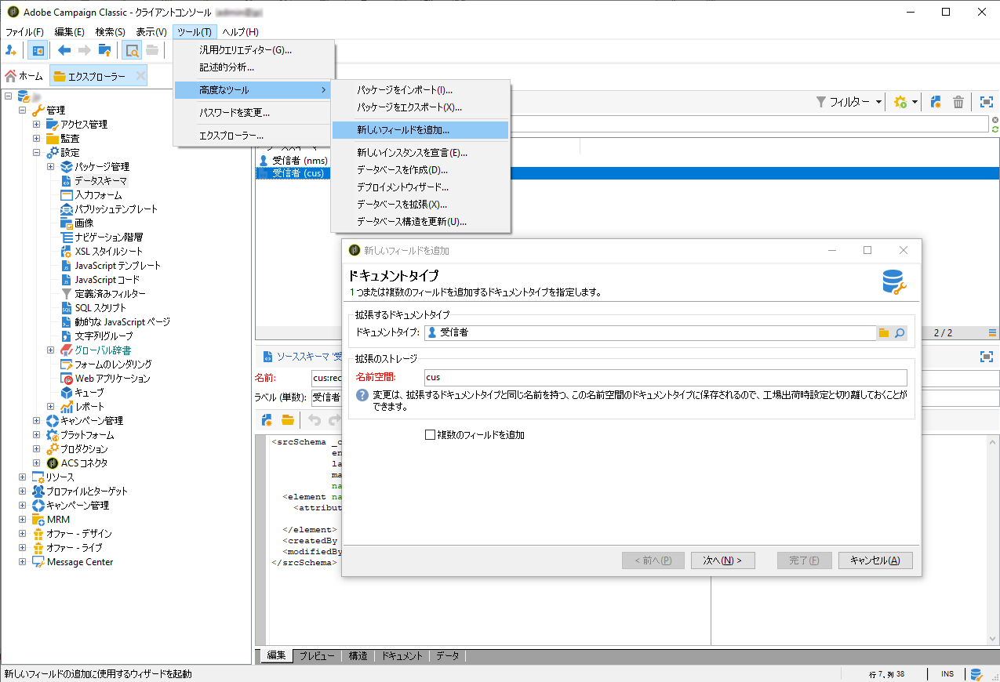

1. 「 **[!UICONTROL Field type]**」で「 **[!UICONTROL SQL field]**」を選択します。 For the Label, use **[!UICONTROL Opt-Out for CCPA]**. **[!UICONTROL 8ビット整数（ブール値）型を選択し、次の一意の]** 相対パスを定義します ****。@OPTOUTCCPA. 「**[!UICONTROL 完了]**」をクリックします。

   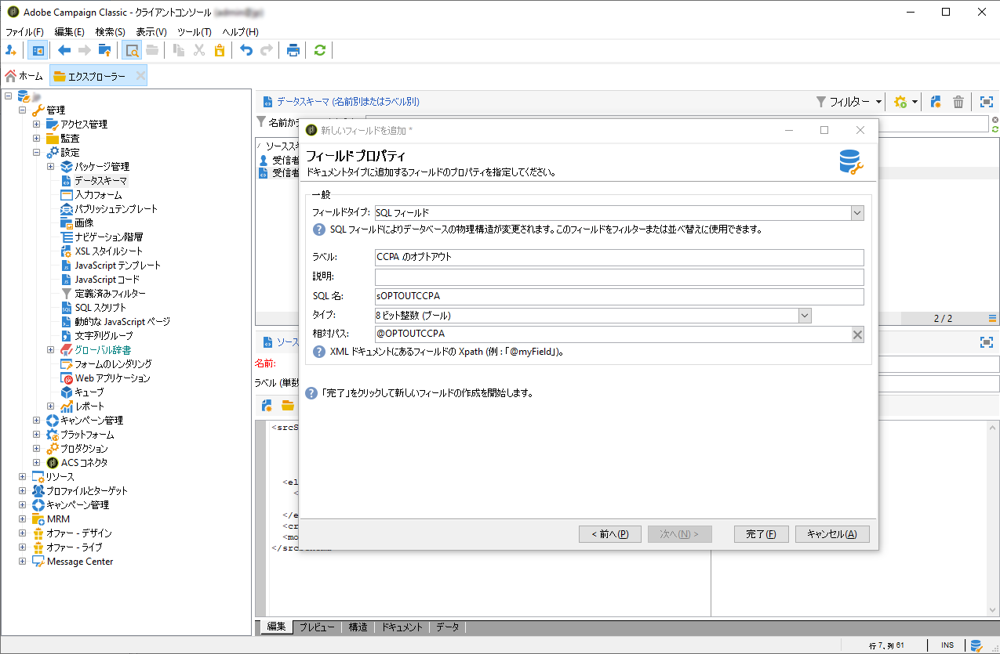

   これにより、 **[!UICONTROL 受信者（カスタム）]** スキーマが拡張または作成されます。 フィールドが正しく追加されていることを確認するには、このフィールドをクリックします。

   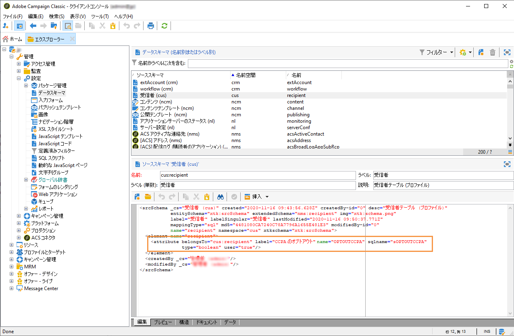

1. エクスプローラーの **[!UICONTROL Configuration]** / **[!UICONTROL Input forms]** ノードをクリックします。 In **[!UICONTROL Recipient (nms)]**, under &quot;General Package&quot;, add an `<input>` element and use, for the xpath value, the relative path defined in step 2. For more on identifying a form, see [this section](../../configuration/using/identifying-a-form.md).

   ```
   <input  colspan="2" type="checkbox" xpath="@OPTOUTCCPA"/>
   ```

   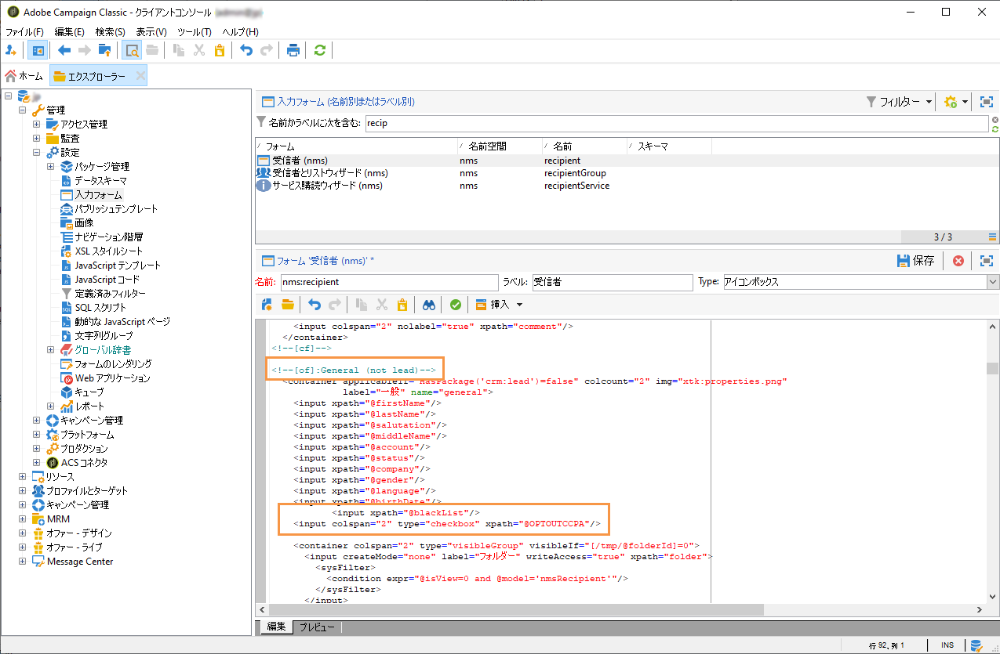

1. 接続を解除し、再接続します。 次のセクションで説明する手順に従って、受信者の詳細に対してフィールドが使用可能であることを確認します。

### 使用状況 {#usage}

フィールドの値を入力し、データ販売に関するCCPAのガイドラインとルールに従うのは、データコントローラーの責任です。

値はいくつかの方法で入力できます。

* Campaign のインターフェイスを使用した受信者の詳細の編集
* API の使用
* データインポートワークフローの使用

その後、オプトアウトしたプロファイルの個人情報を第三者に販売しないようにする必要があります。

オプトアウトステータスを変更するには、「 **[!UICONTROL プロファイルとターゲット]** / **[!UICONTROL 受信者]** 」で、受信者を選択します。 「 **[!UICONTROL 一般]** 」タブには、前の節で設定したフィールドが表示されます。

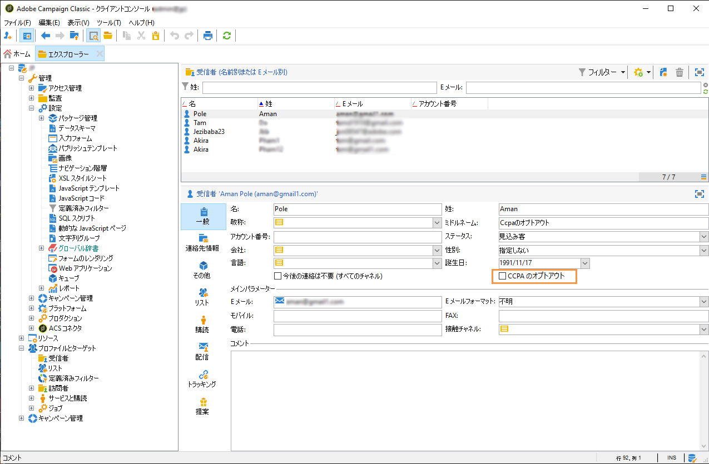

受信者リストを設定して、オープアウト列を表示します。 リストの設定方法については、 [詳細なドキュメントを参照してください](../../platform/using/adobe-campaign-workspace.md#configuring-lists)。

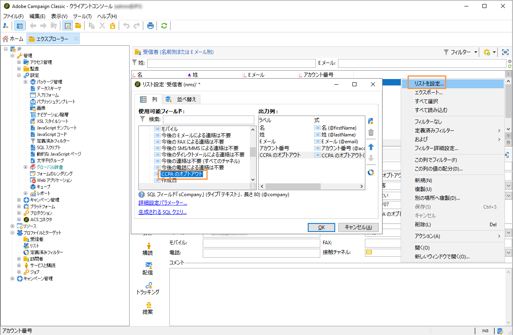

列をクリックすると、オプトアウト情報に従って受信者を並べ替えることができます。 オプトアウトした受信者のみを表示するフィルターを作成することもできます。 For more on creating filters, see [this section](../../platform/using/creating-filters.md).

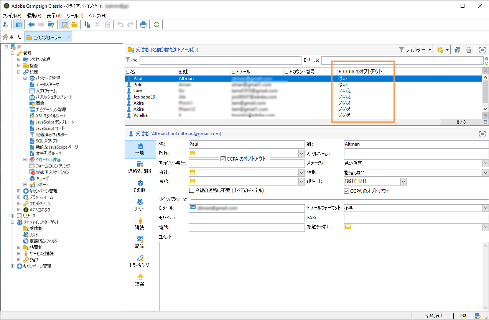
