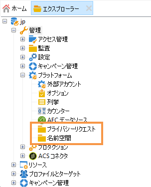
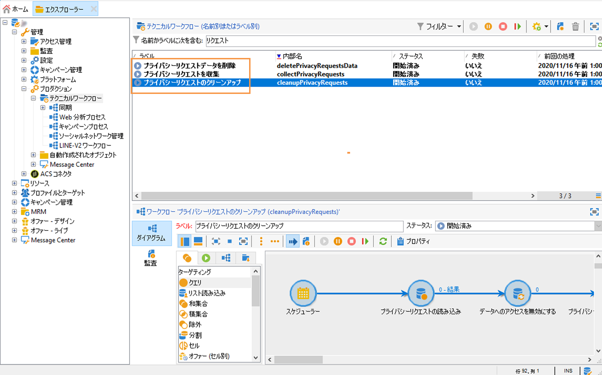
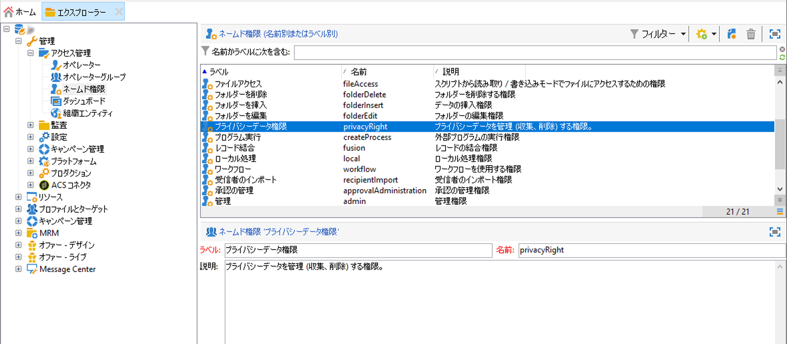

# プライバシーリクエストについて {#privacy-requests}

プライバシー管理に関する一般的なプレゼンテーションについては、[この節](privacy-management.md)を参照してください。

この情報は、GDPR、CCPA、PDPA、LGPD に適用されます。 これらの規制について詳しくは、[こちら](privacy-management.md#privacy-management-regulations)を参照してください。

>[!NOTE]
>
>個人情報の販売のオプトアウト（CCPA に特有）については、[この節](#sale-of-personal-information-ccpa)を参照してください。

<!--Installation procedures described in this document are applicable starting Campaign Classic 18.4 (build 8931+). If you are running on a previous version, refer to this [technote](https://helpx.adobe.com/campaign/kb/how-to-install-gdpr-package-on-legacy-versions.html).-->

プライバシーの準備を容易にするために、Adobe Campaign でアクセス要求と削除要求の処理が可能になりました。 **アクセス権利**&#x200B;と&#x200B;**忘れられる権利**（削除要求）については、[この節](privacy-management.md#right-access-forgotten)で説明しています。

Adobe Campaign では、データ管理者は 2 とおりの方法でプライバシーのアクセスリクエストおよび削除リクエストをおこなうことができます。

* **Adobe Campaign インターフェイス**&#x200B;を使用する：データ管理者はプライバシーリクエストごとに Adobe Campaign で新しいプライバシーリクエストを作成できます。 詳しくは、[この節](privacy-requests-ui.md)を参照してください。
* **API** を使用する：Adobe Campaign の API により、SOAP を使用してプライバシーリクエストを自動処理できます。 詳しくは、[この節](privacy-requests-api.md)を参照してください。

>[!NOTE]
>
>* 個人データおよびデータを管理する様々なエンティティ（データ管理者、データ処理者、データ主体）について詳しくは、[個人データとペルソナ](privacy-and-recommendations.md#personal-data)を参照してください。
>* プライバシーリクエストについて詳しくは、[Campaign v8 ドキュメント](https://experienceleague.adobe.com/ja/docs/campaign/campaign-v8/privacy/privacy){target=_blank}を参照してください。

<!--
## Prerequisites {#prerequesites}

Adobe Campaign offers Data Controllers tools to create and process Privacy requests for data stored in Adobe Campaign. However, it is the Data Controller's responsibility to handle the relationship with the Data Subject (email, customer care or a web portal).

It is therefore your responsibility as a Data Controller to confirm the identity of the Data Subject making the request and to confirm that the data returned to the requester is about the Data Subject.

## Installing the Privacy package {#install-privacy-package}

In order to use this feature, you need to install the **[!UICONTROL Privacy Data Protection Regulation]** package via the **[!UICONTROL Tools]** > **[!UICONTROL Advanced]** > **[!UICONTROL Import package]** > **[!UICONTROL Adobe Campaign Package]** menu. For more information on how to install packages, refer to the [detailed documentation](../../installation/using/installing-campaign-standard-packages.md).

Two new folders, specific to Privacy, are created under **[!UICONTROL Administration]** > **[!UICONTROL Platform]**:

* **[!UICONTROL Privacy Requests]**: this is where you will create your Privacy requests and track their evolution.
* **[!UICONTROL Namespaces]**: this is where you will define the field that will be used to identify the Data Subject in the Adobe Campaign database.

In **[!UICONTROL Administration]** > **[!UICONTROL Production]** > **[!UICONTROL Technical workflows]**, three technical workflows run every day to process Privacy requests.

* **[!UICONTROL Collect privacy requests]**: this workflow generates the recipient's data stored in Adobe Campaign and makes it available for download in the privacy request's screen.
* **[!UICONTROL Delete privacy requests data]**: this workflow deletes the recipient's data stored in Adobe Campaign.
* **[!UICONTROL Privacy request cleanup]**: this workflow erases the access request files that are older than 90 days.

In **[!UICONTROL Administration]** > **[!UICONTROL Access Management]** > **[!UICONTROL Named rights]**, the **[!UICONTROL Privacy Data Right]** named right has been added. This named right is required for Data Controllers in order for them to use privacy tools. This allows them to create new requests, track their evolution, use the API, etc.

## Namespaces {#namesspaces}

Before creating Privacy requests, you need to define the namespace you will use. This is the key that will be used to identify the Data Subject in the Adobe Campaign database.

Three namespaces are available out-of-the-box: email, phone and mobile phone. If you need a different namespace (a recipient custom field, for example), you can create a new one from **[!UICONTROL Administration]** > **[!UICONTROL Platform]** > **[!UICONTROL Namespaces]**.

>[!NOTE]
>
>For optimal performance, it is recommended to use out-of-the-box namespaces.
-->