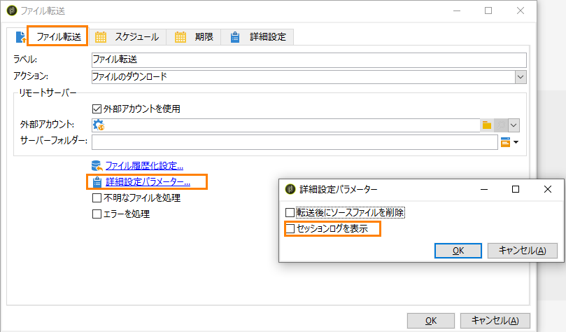

# SFTP サーバーのベストプラクティスとトラブルシューティング {#sftp-server-usage}

## SFTP サーバーのベストプラクティス {#sftp-server-best-practices}

ETL のためのファイルやデータを管理する際、これらのファイルはアドビがホストする SFTP サーバー上に保存されます。この SFTP は、ファイルの保持や削除を制御できる一時的なストレージスペースになるように設計されています。

このスペースの使用または監視が適切におこなわれていない場合、サーバー上の使用可能な物理スペースがすぐにいっぱいになって、その後のアップロードでファイルが切り詰められる可能性があります。スペースがいっぱいになると、自動パージがトリガーされ、SFTP ストレージから一番古いファイルが消去されることがあります。

こうした問題を回避するために、アドビでは以下のベストプラクティスに従うことをお勧めします。

>[!NOTE]
>
>インスタンスが AWS でホストされている場合、Campaign Classic [コントロールパネル](https://docs.adobe.com/content/help/ja-JP/control-panel/using/sftp-management/sftp-storage-management.html)で SFTP サーバーストレージを監視できます。
>
>インスタンスが AWS でホストされているかどうかを確認するには、[この節](https://docs.adobe.com/content/help/ja-JP/control-panel/using/faq.html#ims-org-id)に記載されている手順に従います。

* サーバーのサイズ機能は、ライセンスによって異なります。いずれの場合でも、最小限のデータを保持し、必要な期間だけデータを保持します（最長で 15 日）。
* パスワードが期限切れになるのを避けるために、パスワード認証ではなく、キーベースの認証を使用します（パスワードの有効期間は 90 日間です）。さらに、キーベースの認証では、複数のエンティティを管理する場合などに、複数のキーを生成できます。一方、パスワード認証では、管理しているすべてのエンティティとパスワードを共有する必要があります。

   サポートされているキーの形式は、SSH-2 RSA 2048 です。キーは、PyTTY（Windows）や ssh-keygen（Unix）などのツールを使用して生成できます。公開キーを Campaign サーバーにアップロードするために、[サポートチケット](https://support.neolane.net)を介してアドビサポートチームに公開キーを渡す必要があります。

* データを適切に削除するには、ワークフローを使用します（データを消費しているワークフローから保持を管理）。
* SFTP アップロードやワークフローでバッチ処理を使用します。
* エラー／例外を処理します。
* 時々 SFTP にログインして、問題がないか直接確認します。
* SFTP のディスク管理は、基本的に管理者の責任となります。
* デフォルトでは、作成したすべてのフォルダーは自分の識別子に対してのみ読み取り／書き込みモードになります。Campaign からアクセスする必要のあるフォルダーを作成する場合は、グループ全体に対して読み取り／書き込み権限を付与するように必ず設定します。そうしないと、同じグループ内の別の識別子でワークフローが実行された場合に、セキュリティ上の理由により、ファイルを作成または削除できないことがあります。
* SFTP 接続を開始しようとしているパブリック IP は、Campaign インスタンスの許可リストに登録されている必要があります。許可リストへの IP アドレスの追加は、[サポートチケット](https://support.neolane.net)を通じてリクエストできます。

>[!CAUTION]
>
>独自の SFTP サーバーを使用する場合は、上記の推奨事項にできるだけ従ってください。

## アドビがホストする SFTP サーバーとの接続の問題 {#sftp-server-troubleshooting}

以下の節では、アドビがホストする SFTP サーバーとの接続で問題が発生した場合の確認事項および[サポートチケット](https://support.neolane.net)を介してアドビサポートに提供する情報を示します。

1. インスタンスが実行中であることを確認します。そのためには、ブラウザーを開き、インスタンスの **[!UICONTROL /r/test]** エンドポイントに対して **[!UICONTROL GET]** 呼び出しをおこないます。

   ```
   https://instanceUrl/r/test
   ```

   インスタンスが実行中である場合は、次のタイプの応答が返されます。

   ```
   <redir status='OK' date='YYYY-MM-DD HH:MM:SS' build='XXXX' instance='instanceName'
   sourceIP='AAA.BB.CCC.DD' host='instanceUrl' localHost='instanceName'/>
   ```

   いずれの場合も、サポートチケットでコマンドの応答を提供してください。

1. SFTP 接続を開始しようとしているサイトでアウトバウンドポート 22 が開いているかどうかを確認します。それには、次のコマンドを使用します。

   ```
   bash-3.2$ nc -vz <SFTP_URL> 22
   # Replace the SFTP_URL with actual SFTP instance URL
   # If the port 22 is opened you will see output similar to the below one
   # for e.g. the  output for the command on myCompany-stage-sftp.neolane.net after ssh-out, will give
   bash-3.2$ nc -vz myCompagny-stage-sftp.neolane.net 22
   myCompany-stage-sftp.neolane.net [AAA.BBB.CCC.D] 22 (ssh) open
   ```

   >[!NOTE]
   >
   >Netcat ツールを使用すると、様々なオペレーティングシステムでネットワーク接続を簡単に管理できます（[https://eternallybored.org/misc/netcat/](https://eternallybored.org/misc/netcat/) を参照）。

   ポートが開いていない場合は、接続元でアウトバウンド接続を開いてから、もう一度やり直してください。接続の問題が解消されない場合は、コマンドの出力をアドビサポートチームに連絡してください。

1. SFTP 接続を開始しようとしているパブリック IP が、許可リストへの登録のためにアドビサポートに提供した IP であることを確認します。
1. パスワードベースの認証を使用している場合は、パスワードの有効期限が切れている可能性があります（パスワードの有効期間は 90 日間です）。そのため、キーベースの認証を使用することを強くお勧めします（[SFTP サーバーのベストプラクティス](#sftp-server-best-practices)を参照）。
1. キーベースの認証を使用している場合は、使用しているキーがインスタンス設定のためにアドビサポートチームに提供したものと同じであることを確認します。
1. FileZilla または同等の FTP ツールを使用している場合は、サポートチケットで接続ログの詳細を提供してください。

## 「ホスト名を解決できませんでした」エラー

この節では、Campaign Classic から FTP サーバーに接続した後に「ホスト名を解決できませんでした」というエラーが発生した場合に実行する確認および操作について説明します。

ワークフロージャーナルには、次のログが表示されます。

```
16/05/2016 12:49:03    fileTransfer    Upload error in cURL
16/05/2016 12:49:03    fileTransfer    Couldn't resolve host name
16/05/2016 12:49:03    fileTransfer    Couldn't resolve host name
16/05/2016 12:49:03    fileTransfer    Starting transfer of '/usr/local/neolane/nl6/var/williamreed/export/Recipients' to 'ftp://213.253.61.250/Recipients'
16/05/2016 12:49:03    fileTransfer    1 file(s) to transfer
```

このエラーは、FileZilla または WinSCP を使用して FTP 経由で接続できる状態で、ワークフローから FTP サーバーに接続してサーバーからファイルをダウンロードしようとすると発生します。

このエラーは、FTP サーバーのドメイン名が正しく解決されなかったことを示します。トラブルシューティングには、次の手順を実行します。

1. **DNS サーバー設定**&#x200B;のトラブルシューティング

   1. サーバー名がローカル DNS サーバーに追加されているかどうかを確認します。
   1. 追加されている場合、Adobe Campaign サーバーで次のコマンドを実行して IP アドレスを取得します。

      `nslookup <server domain name>`

      これにより、FTP サーバーが動作しており、Adobe Campaign アプリケーションサーバーから到達可能であることが確認されます。

1. **セッションログ**&#x200B;のトラブルシューティング

   1. ワークフローで、「[ファイル転送](../../workflow/using/file-transfer.md)」アクティビティをダブルクリックします。
   1. 「**[!UICONTROL ファイル転送]**」タブに移動し、「**[!UICONTROL 詳細設定パラメーター]**」をクリックします。
   1. 「**[!UICONTROL セッションログを表示]**」オプションをオンにします。

      

   1. 「監査」ワークフローに移動し、ログに「ホスト名を解決できませんでした」というエラーが表示されるかどうかを確認します。

1. SFTP サーバーがアドビでホストされている場合は、カスタマーケアに問い合わせて、IP が許可リストに追加されているかどうかを確認します。

   それ以外の場合は、次を確認します。

   * パスワードに「@」が含まれていない。パスワードに「@」が含まれている場合、接続に失敗します。
   * Adobe Campaign アプリケーションサーバーと SFTP サーバー間の通信を妨げる可能性のあるファイアウォールの問題がない。
   * キャンペーンサーバーから SFTP に対して tracert および telnet コマンドを実行し、接続に問題があるかどうかを確認します。
   * 通信プロトコルの問題がない。
   * ポートが開いている。
