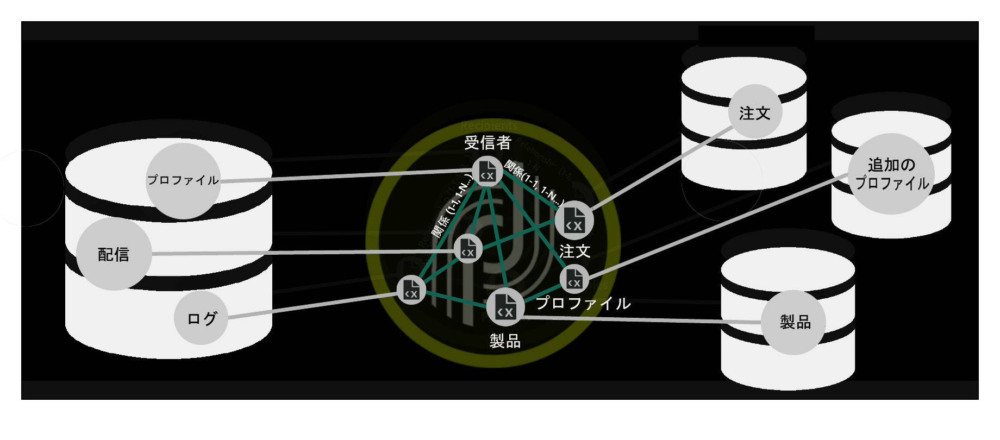
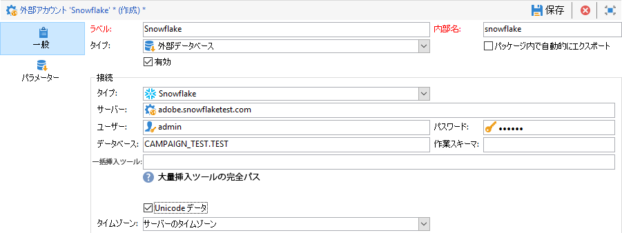
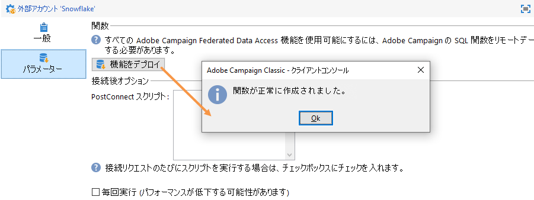
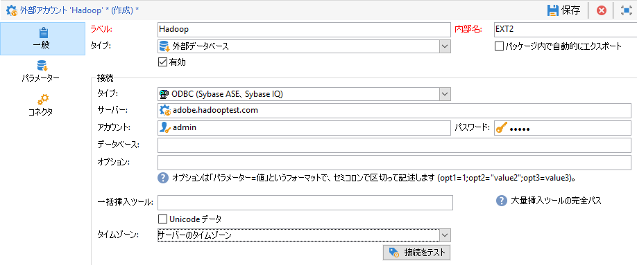

# データベースタイプ別の特定の設定 {#specific-configurations-by-database-type}

Adobe Campaign から外部データベースにアクセスできるようにするには、使用する外部データベースに応じて特定の設定をおこなう必要があります。これらの設定は、基本的には、ドライバーをインストールし、Adobe Campaign サーバー上の各 RDBMS に属する環境変数を宣言することです。

原則として、外部データベースの対応するクライアントレイヤーを Adobe Campaign サーバーにインストールする必要があります。

>[!NOTE]
>
>互換性のあるバージョンは [Campaign 互換性マトリクス](https://helpx.adobe.com/campaign/kb/compatibility-matrix.html#FederatedDataAccessFDA)に記載されています。

<!--
## Configure access to Azure Synapse {#configure-access-to-azure-synapse}

### Azure Synapse on CentOS {#azure-centos}

1. Download mysql57-community-release.noarch.rpm. You can find it in this [page](https://dev.mysql.com/downloads/repo/yum).

1. Install the client library:

    ```
    $ yum install mysql57-community-release-el7-9.noarch.rpm
    $ yum install mysql-community-libs
    ```

1. You now need to configure the external account. In Campaign Classic, unfold the **[!UICONTROL Platform]** menu and click **[!UICONTROL External accounts]**.

1. Select the out-of-the box **[!UICONTROL Azure Synapse]** external account.

1. To configure the **[!UICONTROL Azure Synapse]** external account:

    * **[!UICONTROL Server]**
  
      URL of the Azure Synapse server.

    * **[!UICONTROL Account]**

      Name of the user.

    * **[!UICONTROL Password]**

      User account password.

    * **[!UICONTROL Database]**

      Name of your database

    >[!NOTE]
    >
    >Make sure the **[!UICONTROL Time zone]** and **[!UICONTROL Unicode data]** are set according to your database.

### Azure Synapse on Debian {#azure-debian}

1. Download mysql-apt-config.deb. You can find it in this [page](https://dev.mysql.com/doc/mysql-apt-repo-quick-guide/en).

1. Install the client library:

    ```
    $ dpkg -i mysql-apt-config_*_all.deb # choose mysql-5.7 in the configuration menu
    $ apt update
    $ apt install libmysqlclient20
    ```

1. You now need to configure the external account. In Campaign Classic, unfold the **[!UICONTROL Platform]** menu and click **[!UICONTROL External accounts]**.

1. Select the out-of-the box **[!UICONTROL Azure Synapse]** external account.

1. To configure the **[!UICONTROL Azure Synapse]** external account:

    * **[!UICONTROL Server]**
  
      URL of the Azure Synapse server.

    * **[!UICONTROL Account]**

      Name of the user.

    * **[!UICONTROL Password]**

      User account password.

    * **[!UICONTROL Database]**

      Name of your database

    >[!NOTE]
    >
    >Make sure the **[!UICONTROL Time zone]** and **[!UICONTROL Unicode data]** are set according to your database.

### Azure Synapse on Windows {#azure-windows}

1. Download the C connector. You can find it in this [page](https://dev.mysql.com/downloads/connector/c).

1. Make sure the directory that contains libmysqlclient.dll is added to the PATH environment variable that nlserver will use.

1. You now need to configure the external account. In Campaign Classic, unfold the **[!UICONTROL Platform]** menu and click **[!UICONTROL External accounts]**.

1. You now need to configure the external account. In Campaign Classic, unfold the **[!UICONTROL Platform]** menu and click **[!UICONTROL External accounts]**.

1. Select the out-of-the box **[!UICONTROL Azure Synapse]** external account.

1. To configure the **[!UICONTROL Azure Synapse]** external account:

    * **[!UICONTROL Server]**
  
      URL of the Azure Synapse server.

    * **[!UICONTROL Account]**

      Name of the user.

    * **[!UICONTROL Password]**

      User account password.

    * **[!UICONTROL Database]**

      Name of your database

    >[!NOTE]
    >
    >Make sure the **[!UICONTROL Time zone]** and **[!UICONTROL Unicode data]** are set according to your database.

-->

## 雪片へのアクセスの設定 {#configure-access-to-snowflake}

>[!NOTE]
>
>雪片コネクタは、ホスト型およびオンプレミスのデプロイメントで使用できます。 詳しくは、この[ページ](https://helpx.adobe.com/campaign/kb/acc-on-prem-vs-hosted.html)を参照してください。



### CentOSの雪片 {#snowflake-centos}

1. Snowflake用のODBCドライバをダウンロードします。 スノーフレークの運転手はこちら [です](https://sfc-repo.snowflakecomputing.com/odbc/linux/latest/snowflake-odbc-2.20.2.x86_64.rpm)。

1. 次のコマンドを使用して、CentOsにODBCドライバをインストールする必要があります。

   ```
   rpm -Uvh unixodbc
   rpm -Uvh snowflake-odbc-2.20.2.x86_64.rpm
   ```

1. ODBCドライバーをダウンロードしてインストールした後、Campaign Classicを再起動する必要があります。 これを行うには、次のコマンドを実行します。

   ```
   /etc/init.d/nlserver6 stop
   /etc/init.d/nlserver6 start
   ```
1. Campaign Classicで、Campaign Classicのスノーフレーク外部アカウントを設定します。 から、メニ **[!UICONTROL Explorer]**&#x200B;ューを展開し **[!UICONTROL Administration]** ます。

1. メニューを展開し **[!UICONTROL Platform]** 、をクリックしま **[!UICONTROL External accounts]**&#x200B;す。

1. 標準搭載の外部アカウントを選 **[!UICONTROL Snowflake]** 択します。

1. To configure the **[!UICONTROL Snowflake]** external account:

   * **[!UICONTROL Server]**

      雪片サーバのURL。

   * **[!UICONTROL Account]**

      ユーザーの名前。

   * **[!UICONTROL Password]**

      アカウントのパスワード

   * **[!UICONTROL Database]**

      データベースの名前。
   

1. タブをクリック **[!UICONTROL Parameters]** し、ボタンをク **[!UICONTROL Deploy function]** リックして関数を作成します。

   

コネクタは、次のオプションをサポートします。

| オプション | 値 | 説明 |
|---|---|---|
| workschema |  | 作業テーブルに使用するデータベーススキーマ |
| 倉庫 |  | 使用するデフォルトの倉庫の名前。 ユーザーのデフォルト設定に優先します。 |
| TimeZoneName |  | デフォルトでは空です。つまり、Campaign Classicアプリサーバーのシステムタイムゾーンが使用されます。 このオプションは、TIMEZONEセッション・パラメータを強制的に指定するために使用できます。 <br>[詳しくは、このページ](https://docs.snowflake.net/manuals/sql-reference/parameters.html#timezone)を参照してください。 |
| WeekStart | 0, 1-7 | デフォルトでは0に設定されています。 （WEEK_STARTセッション・パラメータ） <br>詳しくは、このページを参照してく [ださい](https://docs.snowflake.net/manuals/sql-reference/parameters.html#week-start)。 |
| UseCachedResult | TRUE/FALSE | デフォルトではTRUEに設定されています。 このオプションは、Snowflakeキャッシュ結果（USE_CACHED_RESULTSセッションパラメータ）を無効にするた <br>めに使用できます。詳しくは、このページを参照してく [ださい](https://docs.snowflake.net/manuals/user-guide/querying-persisted-results.html)。 |

### 雪片オンデビアン {#snowflake-debian}

1. Snowflake用のODBCドライバをダウンロードします。 スノーフレークの運転手はこちら [です](https://sfc-repo.snowflakecomputing.com/odbc/linux/latest/index.html)。

1. その後、次のコマンドを使用してDebianにODBCドライバをインストールする必要があります。

   ```
   apt-get install unixodbc
   apt-get install snowflake-odbc-x.xx.x.x86_64.deb
   ```

1. ODBCドライバーをダウンロードしてインストールした後、Campaign Classicを再起動する必要があります。 これを行うには、次のコマンドを実行します。

   ```
   systemctl stop nlserver.service
   systemctl start nlserver.service
   ```

1. Campaign Classicで、Campaign Classicのスノーフレーク外部アカウントを設定します。 から、メニ **[!UICONTROL Explorer]**&#x200B;ューを展開し **[!UICONTROL Administration]** ます。

1. メニューを展開し **[!UICONTROL Platform]** 、をクリックしま **[!UICONTROL External accounts]**&#x200B;す。

1. 標準搭載の外部アカウントを選 **[!UICONTROL Snowflake]** 択します。

1. To configure the **[!UICONTROL Snowflake]** external account:

   * **[!UICONTROL Server]**

      雪片サーバのURL。

   * **[!UICONTROL Account]**

      ユーザーの名前。

   * **[!UICONTROL Password]**

      アカウントのパスワード

   * **[!UICONTROL Database]**

      データベースの名前
   

1. タブをクリック **[!UICONTROL Parameters]** し、ボタンをク **[!UICONTROL Deploy function]** リックして関数を作成します。

   

コネクタは、次のオプションをサポートします。

| オプション | 値 | 説明 |
|---|---|---|
| workschema |   | 作業テーブルに使用するデータベーススキーマ |
| 倉庫 |   | 使用するデフォルトの倉庫の名前。 ユーザーのデフォルト設定に優先します。 |
| TimeZoneName |   | デフォルトでは空です。つまり、Campaign Classicアプリサーバーのシステムタイムゾーンが使用されます。 このオプションは、TIMEZONEセッション・パラメータを強制的に指定するために使用できます。 <br>[詳しくは、このページ](https://docs.snowflake.net/manuals/sql-reference/parameters.html#timezone)を参照してください。 |
| WeekStart | 0, 1-7 | デフォルトでは0に設定されています。 （WEEK_STARTセッション・パラメータ） <br>詳しくは、このページを参照してく [ださい](https://docs.snowflake.net/manuals/sql-reference/parameters.html#week-start)。 |
| UseCachedResult | TRUE/FALSE | デフォルトではTRUEに設定されています。 このオプションは、Snowflakeキャッシュ結果（USE_CACHED_RESULTSセッションパラメータ）を無効にするた <br>めに使用できます。詳しくは、このページを参照してく [ださい](https://docs.snowflake.net/manuals/user-guide/querying-persisted-results.html)。 |

### ウィンドウの雪片 {#snowflake-windows}

1. Windows用の [ODBCドライバをダウンロードします](https://docs.snowflake.net/manuals/user-guide/odbc-download.html)。 ドライバをインストールするには、管理者レベルの権限が必要です。 For more on this, refer to this [page](https://docs.snowflake.net/manuals/user-guide/admin-user-management.html)

1. ODBC ドライバーを設定します。For more on this, refer to this [page](https://docs.snowflake.net/manuals/user-guide/odbc-windows.html#step-2-configure-the-odbc-driver)

1. ODBCドライバをインストールして設定したら、Campaign Classicでスノーフレーク外部アカウントを設定する必要があります。 から、メニ **[!UICONTROL Explorer]**&#x200B;ューを展開し **[!UICONTROL Administration]** ます。

1. メニューを展開し **[!UICONTROL Platform]** 、をクリックしま **[!UICONTROL External accounts]**&#x200B;す。

1. 標準搭載の外部アカウントを選 **[!UICONTROL Snowflake]** 択します。

1. To configure the **[!UICONTROL Snowflake]** external account:

   * **[!UICONTROL Server]**

      雪片サーバのURL。

   * **[!UICONTROL Account]**

      ユーザーの名前。

   * **[!UICONTROL Password]**

      アカウントのパスワード

   * **[!UICONTROL Database]**

      データベースの名前
   

1. タブをクリック **[!UICONTROL Parameters]** し、ボタンをク **[!UICONTROL Deploy function]** リックして関数を作成します。

   

コネクタは、次のオプションをサポートします。

| オプション | 値 | 説明 |
|---|---|---|
| workschema |   | 作業テーブルに使用するデータベーススキーマ |
| 倉庫 |   | 使用するデフォルトの倉庫の名前。 ユーザーのデフォルト設定に優先します。 |
| TimeZoneName |   | デフォルトでは空です。つまり、Campaign Classicアプリサーバーのシステムタイムゾーンが使用されます。 このオプションは、TIMEZONEセッション・パラメータを強制的に指定するために使用できます。 <br>[詳しくは、このページ](https://docs.snowflake.net/manuals/sql-reference/parameters.html#timezone)を参照してください。 |
| WeekStart | 0, 1-7 | デフォルトでは0に設定されています。 （WEEK_STARTセッション・パラメータ） <br>詳しくは、このページを参照してく [ださい](https://docs.snowflake.net/manuals/sql-reference/parameters.html#week-start)。 |
| UseCachedResult | TRUE/FALSE | デフォルトではTRUEに設定されています。 このオプションは、Snowflakeキャッシュ結果（USE_CACHED_RESULTSセッションパラメータ）を無効にするた <br>めに使用できます。詳しくは、このページを参照してく [ださい](https://docs.snowflake.net/manuals/user-guide/querying-persisted-results.html)。 |

## Configure access to Hadoop 3.0 {#configure-access-to-hadoop-3}

FDAでHadoop外部データベースに接続するには、Adobe Campaignサーバーで次の設定を行う必要があります。 この設定はWindowsとLinuxの両方で利用できます。

1. ご使用のOSバージョンに応じて、Hadoop用のODBCドライバーをダウンロードします。 ドライバはこのページで見つか [ります](https://www.cloudera.com/downloads.html)。

1. その後、ODBCドライバーをインストールし、Hive接続用のDSNを作成する必要があります。 説明はこちらをご覧くだ [さい](https://docs.cloudera.com/documentation/other/connectors/hive-odbc/2-6-5/Cloudera-ODBC-Driver-for-Apache-Hive-Install-Guide.pdf)

1. ODBCドライバーをダウンロードしてインストールした後、Campaign Classicを再起動する必要があります。 これを行うには、次のコマンドを実行します。

   ```
   systemctl stop nlserver.service
   systemctl start nlserver.service
   ```

1. Campaign Classicで、Hadoop外部アカウントをCampaign Classicで設定します。 から、メニ **[!UICONTROL Explorer]**&#x200B;ューを展開し **[!UICONTROL Administration]** ます。

1. メニューを展開し **[!UICONTROL Platform]** 、をクリックしま **[!UICONTROL External accounts]**&#x200B;す。

1. をクリック **[!UICONTROL Create]** し、「アカウントタ **[!UICONTROL External database]** イプ」を選択します。

1. To configure the **[!UICONTROL  Hadoop]** external account:

   * **[!UICONTROL Type]**

      ODBC（Sybase ASE、Sybase IQ）

   * **[!UICONTROL Server]**

      DNSの名前。

   * **[!UICONTROL Account]**

      ユーザーの名前。

   * **[!UICONTROL Password]**

      アカウントのパスワード

   * **[!UICONTROL Database]**

      DSNで指定されていない場合のデータベースの名前。 DSNで指定した場合は、空のままにすることができます。

   * **[!UICONTROL Time zone]**

      サーバーのタイムゾーン
   

コネクタは、次のODBCオプションをサポートします。

| 名前 | 値 |
|---|---|
| ODBCMgr | iODBC |
| 倉庫 | 1/2/4 |

コネクタは、次のHiveオプションもサポートします。

| 名前 | 値 | 説明 |
|---|---|---|
| bulkKey | Azure BLOBまたはDataLakeアクセスキー | wasb://またはwasbs://のバルクローダ(つまり、バルクロードツールがwasb://またはwasbs://で始まる場合) <br>これは、一括読み込み用のBLOBまたはDataLakeバケットのアクセスキーです。 |
| hdfsPort | デフォルト <br>で8020に設定されたポート番号 | HDFSの一括読み込みの場合(つまり、一括読み込みツールがwebhdfs://またはwebhdfss://で始まる場合)。 |
| bucketsNumber | 20 | クラスタ化テーブルの作成時のグループ数。 |
| fileFormat | パケ | 作業テーブルの既定のファイル形式です。 |

## Configure access to Hadoop 2.1 {#configure-access-to-hadoop}

For more information on how to configure your Hadoop external database in FDA, refer to this [article](https://helpx.adobe.com/campaign/kb/access-hadoop-2.html).

### Windows の場合 {#for-windows}

1. Windows 用の ODBC ドライバーと [Azure HD Insight](https://www.microsoft.com/en-us/download/details.aspx?id=40886) ドライバーをインストールします。
1. ODBC DataSource Adminstrator ツールを実行して、DSN（データソース名）を作成します。ユーザーが変更できる Hive 用 System DSN サンプルが提供されています。

   ```
   Description: vorac (or any name you like)
   Host: vorac.azurehdinsight.net
   Port: 443
   Database: sm_tst611 (or your database name)
   Mechanism: Azure HDInsight Service
   User/Password: admin/<your password here>
   ```

1. 「共有接続の作成」の節に従って、Hadoop外部ア [カウントを作成します](#creating-a-shared-connection) 。

### Linux の場合 {#for-linux}

1. Linux 用の unixODBC をインストールします。

   ```
   apt-get install unixodbc
   ```

1. Download and install ODBC drivers for Apache Hive from HortonWorks: [https://www.hortonworks.com/downloads/](https://www.hortonworks.com/downloads/).

   ```
   dpkg -i hive-odbc-native_2.1.10.1014-2_amd64.deb
   ```

1. ODBC ファイルの場所を確認します。

   ```
   root@campadpac71:/tmp# odbcinst -j
   unixODBC 2.3.1
   DRIVERS............: /etc/odbcinst.ini
   SYSTEM DATA SOURCES: /etc/odbc.ini
   FILE DATA SOURCES..: /etc/ODBCDataSources
   USER DATA SOURCES..: /root/.odbc.ini
   SQLULEN Size.......: 8
   SQLLEN Size........: 8
   SQLSETPOSIROW Size.: 8
   ```

1. DSN（データソース名）を作成し、odbc.ini ファイルを編集します。次に、Hive 接続用の DSN を作成します。

   HDInsight で「バイラル」と呼ばれる接続を設定する場合の例を以下に示します。

   ```
   [ODBC Data Sources]
   vorac 
   
   [vorac]
   Driver=/usr/lib/hive/lib/native/Linux-amd64-64/libhortonworkshiveodbc64.so
   HOST=vorac.azurehdinsight.net
   PORT=443
   Schema=sm_tst611
   HiveServerType=2
   AuthMech=6
   UID=admin
   PWD=<your password here>
   HTTPPath=
   UseNativeQuery=1
   ```

   >[!NOTE]
   >
   >ここで、**UseNativeQuery** パラメーターは非常に重要です。Campaign は Hive 対応ですが、UseNativeQuery を設定しないと正しく機能しません。通常、ドライバーまたは Hive SQL コネクタがクエリを上書きして列の順序を勝手に変更してしまいます。

   認証設定は Hive や Hadoop の構成に依存します。例えば HD Insight では、[ここ](http://www.simba.com/products/Spark/doc/ODBC_InstallGuide/unix/content/odbc/hi/configuring/authenticating/azuresvc.htm)で説明しているように、ユーザー／パスワード認証に AuthMech=6 を使用します。

1. 変数をエクスポートします。

   ```
   export ODBCINI=/etc/myodbc.ini
   export ODBCSYSINI=/etc/myodbcinst.ini
   ```

1. Hortonworks ドライバーを /usr/lib/hive/lib/native/Linux-amd64-64/hortonworks.hiveodbc.ini を介して設定します。

   Campaign と unix-odbc（libodbcinst）に接続するには、UTF-16 を使用する必要があります。

   ```
   [Driver]
   
   DriverManagerEncoding=UTF-16
   ErrorMessagesPath=/usr/lib/hive/lib/native/hiveodbc/ErrorMessages/
   LogLevel=0
   LogPath=/tmp/hive
   SwapFilePath=/tmp
   
   ODBCInstLib=libodbcinst.so
   ```

1. これで、isql を使用した接続をテストできます。

   ```
   isql vorac
   isql vorac -v
   ```

1. 「共有接続の作成」の節に従って、Hadoop外部ア [カウントを作成します](#creating-a-shared-connection) 。

## Netezza へのアクセスの設定 {#configure-access-to-netezza}

FDA で Netezza 外部データベースに接続するには、Adobe Campaign サーバーで追加の設定が必要になります。

1. 使用するオペレーティングシステムに応じて、Netezza 用の ODBC ドライバーをインストールします。

   * **Linux の場合は、nz-linuxclient-v7.2.0.0.tar.gz です。**&#x200B;オペレーティングシステムに対応するフォルダー（linux または linux64）を選択し、解凍コマンドを開始します。デフォルトで推奨されるリポジトリにインストールを実行したままにすることができます。&quot;/usr/local/nz&quot;
   * **Windows の場合は、nz-winclient-v7.2.0.0.zip です。**&#x200B;ファイルを解凍し、オペレーティングシステムに対応する実行可能スクリプト（nzodbcsetup.exe または nzodbcsetup64.exe）を開始します。ウィザードの手順に従ってドライバーのインストールを完了します。

1. ODBC ドライバーを設定します。設定は、次の標準ファイルで実行できます。一般パ **ラメーターの場合は/etc/odbc.ini** 、ドライ **バーの宣言の場合は/etc/odbcinst.ini** 。

   * **/etc/odbc.ini**

      ```
      [ODBC]
      InstallDir=/etc/
      ```

      「InstallDir」は、odbcinst.ini ファイルの保存場所です。

   * **/etc/odbcinst.ini**

      ```
      [ODBC Drivers]
      NetezzaSQL = Installed
      
      [NetezzaSQL]
      Driver           = /usr/local/nz/lib/libnzsqlodbc3.so
      Setup            = /usr/local/nz/lib/libnzsqlodbc3.so
      APILevel         = 1
      ConnectFunctions = YYN
      Description      = Netezza ODBC driver
      DriverODBCVer    = 03.51
      DebugLogging     = false
      LogPath          = /tmp
      UnicodeTranslationOption = utf8
      CharacterTranslationOption = all
      PreFetch         = 256
      Socket           = 16384
      ```

1. Adobe Campaign サーバーの環境変数を指定します。

   * **LD_LIBRARY_PATH**:/usr/local/nz/libおよび/usr/local/nz/lib64 「/usr/local/nz」は、ドライバーのインストール時にデフォルトで提示されるインストールリポジトリです。インストール先として選択したリポジトリを指定する必要があります。
   * **ODBCINI**:odbc.iniファイルの場所(/etc/odbc.iniなど)。
   * **NZ_ODBC_INI_PATH**:odbc.iniファイルの場所。 Netezza で odbc.ini ファイルを使用するには、この 2 番目の変数も必要になります。

1. 「共有接続の作成」の節に従って、Netezza外部ア [カウントを作成します](#creating-a-shared-connection) 。

>[!NOTE]
>
>自動で生成されるプライマリキーを含むスキーマの操作は考慮されません。
>
>テーブルでは、スキーマで定義された最初のインデックスに対して **Organize on** 句が使用されます。Netezza では、この句が 1～4 列に制限されるので、このインデックスに 4 列までしか格納できません。

## Oracle へのアクセスの設定 {#configure-access-to-oracle}

FDA で Oracle 外部データベースに接続するには、Adobe Campaign サーバーで追加の設定が必要になります。

### Linux の場合 {#for-linux-1}

1. お使いのバージョンの Oracle に対応した Oracle フルクライアントをインストールします。
1. インストールに TNS の定義を追加します。これは、/etc/oracle リポジトリの「**tnsnames.ora**」ファイルで指定します。このリポジトリが存在しない場合は作成します。

   その後、TNS_ADMIN 環境変数を新規に作成し、TNS_ADMIN=/etc/oracle をエクスポートしてマシンを再起動します。

1. Oracle を Adobe Campaign サーバー（nlserver）に統合します。そのためには、Adobe Campaign サーバーツリー構造の「nl6」フォルダーに「**customer.sh**」ファイルがあり、そのファイルに Oracle ライブラリへのリンクが含まれていることを確認します。T

   クライアントのバージョンが 11.2 の場合の例を次に示します。

   ```
   export ORACLE_HOME=/usr/lib/oracle/11.2
   export TNS_ADMIN=/etc/oracle
   export LD_LIBRARY_PATH=$ORACLE_HOME/client64/lib:$LD_LIBRARY_PATH
   ```

   >[!NOTE]
   >
   >これらの値（特に ORACLE_HOME）はインストールリポジトリによって異なります。これらの値を参照する前に、ツリー構造を確認してください。

1. Oracle に必要なライブラリをインストールします。

   * **libclntsh.so**

      ```
      cd /usr/lib/oracle/<version>/client<architecture>/lib
      ln -s libclntsh.so.<version> libclntsh.so
      ```

   * **libaio1**

      ```
      aptitude install libaio1
      or
      yum install libaio1
      ```

### Windows の場合 {#for-windows-1}

1. Oracle クライアントをインストールします。
1. In the C:Oracle folder, create a **tnsnames.ora** file containing your TNS definition.

   C:Oracleを値としてTNS_ADMIN環境変数を追加し、マシンを再起動します。

## Sybase IQ へのアクセスを設定する {#configure-access-to-sybase-iq}

FDA で Sybase IQ 16 外部データベースに接続するには、Adobe Campaign サーバーで追加の設定が必要になります。

1. unixodbc パッケージがサーバーにあることを確認します。
1. **iq_odbc** をインストールします。インストールの終了時にエラーが発生することがあります。このエラーは無視してかまいません。
1. **iq_client_common** をインストールします。インストールの終了時に Java のエラーが発生することがあります。このエラーは無視してかまいません。
1. ODBC ドライバーを設定します。設定は、次の標準ファイルで実行できます。一般パラメーターの/etc/odbc.iniと、ドライバーの宣言用の/etc/odbcinst.ini

   * **/etc/odbc.ini** (文字などの値を自 `<server_alias>` 分で置き換える):

      ```
      [ODBC Data Sources]
      <server_alias>=libdbodbc.so
      
      [<server_alias>]
      Driver=/opt/sybase/IQ-16_0/lib64/libdbodbc16.so
      Description=<description>
      Username=<username>
      Password=<password>
      ServerName=<server_name>
      CommLinks=tcpip(host=<host>)
      ```

   * **/etc/odbcinst.ini**

      ```
      [ODBC DRIVERS]
      SAP SybaseIQ=Installed
      
      [SAP SybaseIQ]
      Driver=/opt/sybase/IQ-16_0/lib64/libdbodbc16.so
      ```

1. 新しい libodbc16.so ライブラリのパスを LD_LIBRARY_PATH 変数に追加します。方法は次のとおりです。

   * customer.sh ファイルを使用してパスを宣言する場合は、パス /opt/sybase/IQ-16_0/lib64 を LD_LIBRARY_PATH 変数に追加します。
   * それ以外の場合は、Unix コマンドを使用します。

1. 「共有接続の作成」の説明に従って、新しいFDA外部ア [カウントを作成します](#creating-a-shared-connection) 。 For Sybase IQ, the server name corresponds to the ODBC connection (`<server_alias>`) defined in step 5. 必ずしもサーバー自体の名前であるとは限りません。

>[!NOTE]
>
>Windows の場合は、Sybase IQ クライアントを Adobe Campaign サーバーにインストールし、ODBC 接続を作成する必要があります。Adobe Campaignサーバー(nlserver)がWindowsのサービスとして実行されている場合は、必ずシステムデータソースを作成してください。

## Teradata へのアクセスの設定 {#configure-access-to-teradata}

FDA で Teradata 外部データベースに接続するには、Adobe Campaign サーバーで追加の設定が必要になります。Teradata データベースの設定方法については、[この記事](https://helpx.adobe.com/campaign/kb/campaign_fda_teradata.html)を参照してください。

1. [Teradata 用の ODBC ドライバー](http://downloads.teradata.com/download/connectivity/odbc-driver/linux)をインストールします。

   これは 3 つのパッケージで構成され、Red Hat（または CentOS）／Suse に次の順序でインストールできます。

   * TeraGSS
   * tdicu1510（setup_wrapper.sh を使用してインストール）
   * tdodbc1510（setup_wrapper.shを使用してインストール）

1. ODBC ドライバーを設定します。設定は、次の標準ファイルで実行できます。一般パ **ラメーターの場合は/etc/odbc.ini** 、ドライバーの宣言の場合は/etc/odbcinst.iniを参照してください。

   * **/etc/odbc.ini**

      ```
      [ODBC]
      InstallDir=/etc/
      ```

      「InstallDir」は、**odbcinst.ini** ファイルの保存場所です。

   * **/etc/odbcinst.ini**

      ```
      [ODBC DRIVERS]
      teradata=Installed
      
      [teradata]
      Driver=/opt/teradata/client/15.10/lib64/tdata.so
      APILevel=CORE
      ConnectFunctions=YYY
      DriverODBCVer=3.51
      SQLLevel=1
      ```

1. Adobe Campaign サーバーの環境変数を指定します。

   * **LD_LIBRARY_PATH**:/opt/teradata/client/15.10/lib64および/opt/teradata/client/15.10/odbc_64/lib。
   * **ODBCINI**:odbc.iniファイルの場所(/etc/odbc.iniなど)。
   * **NLSPATH**:opermsgs.catファイルの場所(/opt/teradata/client/15.10/msg/opermsgs.cat)

## SAP HANA へのアクセスを設定する {#configure-access-to-sap-hana}

FDA で SAP HANA 外部データベースに接続するには、Adobe Campaign サーバーで追加の設定が必要になります。

1. 使用するオペレーティングシステムに応じて、SAP HANA 用の ODBC ドライバーをインストールします。

   * **hdb_client_linux.tgz（Linux 用）：**&#x200B;解凍後、hdbinst コマンドを開始し、指示に従ってドライバーのインストールを完了します。
   * **hdb_client_windows.zip（Windows 用）：** Unzip the file and start the executable: **hdbinst.exe**. ウィザードの手順に従ってドライバーのインストールを完了します。

1. ODBC ドライバーを設定します。設定は、次の標準ファイルで実行できます。一般的なパラメーターの場合は/etc/odbc.ini、宣言するドライバーの場合は/etc/odbcinst.iniです。

   * **/etc/odbc.ini**

      ```
      [ODBC]
      InstallDir=/etc/
      
      [HDB]
      Driver=HDBODBC
      servernode=localhost:39013 (this value depend of your server)
      User:SYSTEM
      ```

      「InstallDir」は、**odbcinst.ini** ファイルの保存場所です。

   * **/etc/odbcinst.ini**

      ```
      [HDBODBC]
      Description = "SmartCloudPT HANA"
      Driver = /usr/sap/hdbclient/libodbcHDB.so
      ```

1. Adobe Campaign サーバーの環境変数を指定します。

   * **LD_LIBRARY_PATH**:デフォルトでは、SAP Hanaクライアント(/usr/sap/hdbclient/libodbcHDB.so)へのリンクが含まれている必要があります。
   * **ODBCINI**:odbc.iniファイルの場所(/etc/odbc.iniなど)。

1. 「共有接続の作成」の節に従って、SAP Hana外部ア [カウントを作成します](#creating-a-shared-connection) 。
