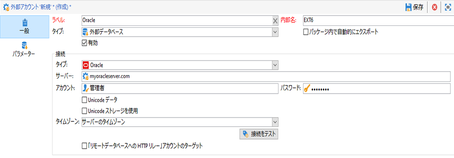

# FDA コネクタの設定 {#specific-configurations-by-database-type}

Adobe Campaign から外部データベースにアクセスできるようにするには、使用する外部データベースに応じて特定の設定をおこなう必要があります。これらの設定は、基本的には、ドライバーをインストールし、Adobe Campaign サーバー上の各 RDBMS に属する環境変数を宣言することです。

Teradata、Hadoop 2.1、Netezza などのレガシーコネクタについて詳しくは、この[ページ](../../platform/using/legacy-connectors.md)を参照してください。

原則として、外部データベースの対応するクライアントレイヤーを Adobe Campaign サーバーにインストールする必要があります。

>[!NOTE]
>
>互換性のあるバージョンは [Campaign 互換性マトリックス](https://helpx.adobe.com/jp/campaign/kb/compatibility-matrix.html#FederatedDataAccessFDA)に記載されています。

## Azure Synapse へのアクセスの設定 {#configure-access-to-azure-synapse}

### Azure Synapse 外部アカウント {#azure-external}

[!DNL Azure] 外部アカウントを使用すれば、Campaign インスタンスを Azure Synapse 外部データベースに接続することができます。[!DNL Azure Synapse] 外部アカウントを作成するには、以下を実行します。

1. Campaign Classic で、[!DNL Azure Synapse] 外部アカウントを設定します。**[!UICONTROL エクスプローラー]**&#x200B;で、**[!UICONTROL 管理]**／**[!UICONTROL プラットフォーム]**／**[!UICONTROL 外部アカウント]**&#x200B;をクリックします。

1. 「**[!UICONTROL 新規]**」をクリックします。

1. 外部アカウント&#x200B;**[!UICONTROL タイプ]**&#x200B;として、「**[!UICONTROL 外部データベース]**」を選択します。

1. [!DNL Azure Synapse] 外部アカウントを設定するには、次を指定する必要があります。

   * **[!UICONTROL タイプ]**：Azure Synapse Analytics

   * **[!UICONTROL サーバー]**：Azure Synapse サーバーの URL

   * **[!UICONTROL アカウント]**：ユーザーの名前

   * **[!UICONTROL パスワード]**：ユーザーアカウントのパスワード

   * **[!UICONTROL データベース]**：データベースの名前

   

### CentOS での Azure Synapse {#azure-centos}

**前提条件：**

* ODBC ドライバーをインストールするには、ルート権限が必要です。
* Microsoft が提供する Red Hat Enterprise ODBC ドライバーは、CentOS と組み合わせて SQL Server に接続することもできます。
* バージョン 13.0 は Red Hat 6 および 7 で動作します。

CentOS で Azure Synapse を設定するには、以下を実行します。

1. まず、ODBC ドライバーをインストールします。こちらの[ページ](https://www.microsoft.com/en-us/download/details.aspx?id=50420)にあります。

   >[!NOTE]
   >
   >これは、ODBC ドライバーのバージョン 13 専用です。

   ```
   sudo su
   curl https://packages.microsoft.com/config/rhel/6/prod.repo > /etc/yum.repos.d/mssql-release.repo
   exit
   # Uninstall if already installed Unix ODBC driver
   sudo yum remove unixODBC-utf16 unixODBC-utf16-devel #to avoid conflicts
   
   sudo ACCEPT_EULA=Y yum install msodbcsql
   
   sudo ACCEPT_EULA=Y yum install mssql-tools
   echo 'export PATH="$PATH:/opt/mssql-tools/bin"' >> ~/.bash_profile
   echo 'export PATH="$PATH:/opt/mssql-tools/bin"' >> ~/.bashrc
   source ~/.bashrc
   
   # the Microsoft driver expects unixODBC to be here /usr/lib64/libodbc.so.1, so add soft links to the '.so.2' files
   cd /usr/lib64
   sudo ln -s libodbccr.so.2   libodbccr.so.1
   sudo ln -s libodbcinst.so.2 libodbcinst.so.1
   sudo ln -s libodbc.so.2     libodbc.so.1
   
   # Set the path for unixODBC
   export ODBCINI=/usr/local/etc/odbc.ini
   export ODBCSYSINI=/usr/local/etc
   source ~/.bashrc
   
   #Add a DSN information to /etc/odbc.ini
   sudo vi /etc/odbc.ini
   
   #Add the following:
   [Azure Synapse Analytics]
   Driver      = ODBC Driver 13 for SQL Server
   Description = Azure Synapse Analytics DSN
   Trace       = No
   Server      = [insert your server here]
   ```

1. 必要に応じて、次のコマンドを実行して unixODBC 開発ヘッダーをインストールできます。

   ```
   sudo yum install unixODBC-devel
   ```

1. ドライバーをインストールした後、必要に応じて、ODBC ドライバーをテストおよび検証し、データベースにクエリをおこなうことができます。次のコマンドを実行します。

   ```
   /opt/mssql-tools/bin/sqlcmd -S yourServer -U yourUserName -P yourPassword -q "your query" # for example -q "select 1"
   ```

1. Campaign Classic では、[!DNL Azure Synapse] 外部アカウントを設定できます。外部アカウントの設定方法について詳しくは、この[節](../../platform/using/specific-configuration-database.md#azure-external)を参照してください。

1. Azure Synapse Analytics は TCP 1433 ポートを通じて通信するので、ファイアウォール上でこのポートを開く必要があります。次のコマンドを使用します。

   ```
   firewall-cmd --permanent --add-rich-rule='rule family="ipv4" source address="[server_ip_here]/32" port port="1433" protocol="tcp" accept'
   # you can ping your hostname and the ping command will translate the hostname to IP address which you can use here
   ```

   >[!NOTE]
   >
   >Azure Synapse Analytics側からの通信を許可するには、パブリックIPを許可リストに追加する必要がある場合があります。 その場合は、[Azure のドキュメント](https://docs.microsoft.com/ja-jp/azure/azure-sql/database/firewall-configure)を参照してください。

1. iptables の場合は、次のコマンドを実行します。

   ```
   iptables -A OUTPUT -p tcp -d [server_hostname_here] --dport 1433 -j ACCEPT
   ```

### Windows での Azure Synapse {#azure-windows}

>[!NOTE]
>
>これは ODBC ドライバーのバージョン 13 専用ですが、Adobe Campaign Classic では SQL Server Native Client ドライバー 11.0 および 10.0 も使用できます。

Windows で Azure Synaps を設定するには、以下を実行します。

1. まず、Microsoft ODBC ドライバーをインストールします。こちらの[ページ](https://www.microsoft.com/en-us/download/details.aspx?id=50420)にあります。

1. 次のファイルを選択してインストールします。

   ```
   your_language\your_architecture\msodbcsql.msi (i.e: English\X64\msodbcsql.msi)
   ```

1. ODBC ドライバーをインストールした後、必要に応じてテストできます。詳しくは、この[ページ](https://docs.microsoft.com/ja-jp/sql/connect/odbc/windows/system-requirements-installation-and-driver-files?view=sql-server-ver15)を参照してください。

1. Campaign Classic では、[!DNL Azure Synapse] 外部アカウントを設定できます。外部アカウントの設定方法について詳しくは、この[節](../../platform/using/specific-configuration-database.md#azure-external)を参照してください。

1. Azure Synapse Analytics は TCP 1433 ポートを通じて通信するので、Windows Defender ファイアウォール上でこのポートを開く必要があります。詳しくは、[Windows のドキュメント](https://docs.microsoft.com/ja-jp/windows/security/threat-protection/windows-firewall/create-an-outbound-program-or-service-rule)を参照してください。

### Debian での Azure Synapse {#azure-debian}

**前提条件：**

* ODBC ドライバーをインストールするには、ルート権限が必要です。
* msodbcsql パッケージをインストールするには、curl が必要です。インストールしていない場合は、次のコマンドを実行します。

   ```
   sudo apt-get install curl
   ```

Debian で Azure Synapse を設定するには、以下を実行します。

1. まず、SQL Server 用の Microsoft ODBC ドライバーをインストールします。次のコマンドを使用して、SQL Server 用の ODBC ドライバー 13.1 をインストールします。

   ```
   sudo su
   curl https://packages.microsoft.com/keys/microsoft.asc | apt-key add -
   curl https://packages.microsoft.com/config/debian/8/prod.list > /etc/apt/sources.list.d/mssql-release.list
   exit
   sudo apt-get update
   sudo ACCEPT_EULA=Y apt-get install msodbcsql
   ```

1. **sudo apt-get update** を呼び出すときに、「**メソッドドライバー /usr/lib/apt/methods/https が見つかりません**」というエラーが発生した場合は、以下のコマンドを実行してください。

   ```
   sudo apt-get install apt-transport-https ca-certificates
   ```

1. 次のコマンドを使用して、mssql-tools をインストールする必要があります。一括コピープログラム（または BCP）ユーティリティを使用してクエリを実行するには、mssq-tools が必要です。

   ```
   sudo ACCEPT_EULA=Y apt-get install mssql-tools
   echo 'export PATH="$PATH:/opt/mssql-tools/bin"' >> ~/.bash_profile
   echo 'export PATH="$PATH:/opt/mssql-tools/bin"' >> ~/.bashrc
   source ~/.bashrc
   ```

1. 必要に応じて、次のコマンドを実行して unixODBC 開発ヘッダーをインストールできます。

   ```
   sudo yum install unixODBC-devel
   ```

1. ドライバーをインストールした後、必要に応じて、ODBC ドライバーをテストおよび検証し、データベースにクエリをおこなうことができます。次のコマンドを実行します。

   ```
   /opt/mssql-tools/bin/sqlcmd -S yourServer -U yourUserName -P yourPassword -q "your query" # for example -q "select 1"
   ```

1. Campaign Classic では、[!DNL Azure Synapse] 外部アカウントを設定できます。外部アカウントの設定方法について詳しくは、この[節](../../platform/using/specific-configuration-database.md#azure-external)を参照してください。

1. Azure Synapse Analytics と確実に接続できるように Debian で iptables を設定するには、次のコマンドを使用して、ホスト名に対してアウントバウンド TCP 1433 ポートを有効にします。

   ```
   iptables -A OUTPUT -p tcp -d [server_hostname_here] --dport 1433 -j ACCEPT
   ```

   >[!NOTE]
   >
   >Azure Synapse Analytics側からの通信を許可するには、パブリックIPを許可リストに追加する必要がある場合があります。 その場合は、[Azure のドキュメント](https://docs.microsoft.com/ja-jp/azure/azure-sql/database/firewall-configure)を参照してください。

## Snowflake へのアクセスの設定 {#configure-access-to-snowflake}

>[!NOTE]
>
>[!DNL Snowflake] コネクタは、ホスト型およびオンプレミスのデプロイメントで使用できます。詳しくは、[この記事](https://helpx.adobe.com/jp/campaign/kb/acc-on-prem-vs-hosted.html)を参照してください。


### Snowflake 外部アカウント{#snowflake-external}

[!DNL Snowflake] 外部アカウントを使用すれば、Campaign インスタンスを Snowflake 外部データベースに接続することができます。

1. Campaign Classic で、[!DNL Snowflake] 外部アカウントを設定します。**[!UICONTROL エクスプローラー]**&#x200B;で、**[!UICONTROL 管理]**／**[!UICONTROL プラットフォーム]**／**[!UICONTROL 外部アカウント]**&#x200B;をクリックします。

1. 「**[!UICONTROL 新規]**」をクリックします。

1. 外部アカウント&#x200B;**[!UICONTROL タイプ]**&#x200B;として、「**[!UICONTROL 外部データベース]**」を選択します。

1. **[!UICONTROL Snowflake]** 外部アカウントを設定するには、次を指定する必要があります。

   * **[!UICONTROL タイプ]**：[!DNL Snowflake]

   * **[!UICONTROL サーバー]**：[!DNL Snowflake] サーバーの URL

   * **[!UICONTROL アカウント]**：ユーザーの名前

   * **[!UICONTROL パスワード]**：ユーザーアカウントのパスワード

   * **[!UICONTROL データベース]**：データベースの名前

   

1. 「**[!UICONTROL パラメーター]**」タブをクリックし、「**[!UICONTROL 機能をデプロイ]**」ボタンをクリックして機能を作成します。

   

コネクタは、次のオプションをサポートしています。

| オプション | 説明 |
|---|---|
| workschema | 作業用テーブルに使用するデータベーススキーマ |
| warehouse | 使用するデフォルトのウェアハウスの名前。ユーザーのデフォルト値より優先されます。 |
| TimeZoneName | デフォルトでは空で、Campaign Classic アプリケーションサーバーのシステムのタイムゾーンが使用されます。このオプションは、TIMEZONE セッションパラメーターを強制的に指定するために使用できます。<br>詳しくは、[このページ](https://docs.snowflake.net/manuals/sql-reference/parameters.html#timezone)を参照してください。 |
| WeekStart | WEEK_START セッションパラメーター。デフォルトでは 0 に設定されています。<br>詳しくは、[このページ](https://docs.snowflake.com/en/sql-reference/parameters.html#week-start)を参照してください。 |
| UseCachedResult | USE_CACHED_RESULTS セッションパラメーター。デフォルトでは TRUE に設定されています。このオプションは、Snowflake でキャッシュされた結果を無効にするために使用できます。<br>詳しくは、[このページ](https://docs.snowflake.net/manuals/user-guide/querying-persisted-results.html)を参照してください。 |

### CentOS での Snowflake {#snowflake-centos}

1. [!DNL Snowflake] 用の ODBC ドライバーをダウンロードします。ダウンロードを開始するには、[ここをクリック](https://sfc-repo.snowflakecomputing.com/odbc/linux/latest/snowflake-odbc-2.20.2.x86_64.rpm)します。
1. 次のコマンドを使用して、CentOs に ODBC ドライバーをインストールする必要があります。

   ```
   rpm -Uvh unixodbc
   rpm -Uvh snowflake-odbc-2.20.2.x86_64.rpm
   ```

1. ODBC ドライバーをダウンロードしてインストールした後、Campaign Classic を再起動する必要があります。これをおこなうには、次のコマンドを実行します。

   ```
   /etc/init.d/nlserver6 stop
   /etc/init.d/nlserver6 start
   ```

1. Campaign Classic では、[!DNL Snowflake] 外部アカウントを設定できます。外部アカウントの設定方法について詳しくは、この[節](../../platform/using/specific-configuration-database.md#snowflake-external)を参照してください。

### Debian での Snowflake{#snowflake-debian}

1. [!DNL Snowflake] 用の ODBC ドライバーをダウンロードします。[ここをクリック](https://sfc-repo.snowflakecomputing.com/odbc/linux/latest/index.html)して、ダウンロードを開始します。

1. 次のコマンドを使用して、Debian に ODBC ドライバーをインストールする必要があります。

   ```
   apt-get install unixodbc
   apt-get install snowflake-odbc-x.xx.x.x86_64.deb
   ```

1. ODBC ドライバーをダウンロードしてインストールした後、Campaign Classic を再起動する必要があります。これをおこなうには、次のコマンドを実行します。

   ```
   systemctl stop nlserver.service
   systemctl start nlserver.service
   ```

1. Campaign Classic では、[!DNL Snowflake] 外部アカウントを設定できます。外部アカウントの設定方法について詳しくは、この[節](../../platform/using/specific-configuration-database.md#snowflake-external)を参照してください。

### Windows での Snowflake。{#snowflake-windows}

1. [Windows 用の ODBC ドライバー](https://docs.snowflake.net/manuals/user-guide/odbc-download.html)をダウンロードします。ドライバーをインストールするには、管理者レベルの権限が必要です。詳しくは、[このページ](https://docs.snowflake.net/manuals/user-guide/admin-user-management.html)を参照してください。

1. ODBC ドライバーを設定します。詳しくは、[このページ](https://docs.snowflake.net/manuals/user-guide/odbc-windows.html#step-2-configure-the-odbc-driver)を参照してください。

1. Campaign Classic では、[!DNL Snowflake] 外部アカウントを設定できます。外部アカウントの設定方法について詳しくは、この[節](../../platform/using/specific-configuration-database.md#snowflake-external)を参照してください。

## Hadoop 3.0 へのアクセスの設定 {#configure-access-to-hadoop-3}

### Hadoop 外部アカウント {#hadoop-external}

[!DNL Hadoop] 外部アカウントを使用すれば、Campaign インスタンスを Hadoop 外部データベースに接続することができます。

1. Campaign Classic で、[!DNL Hadoop] 外部アカウントを設定します。**[!UICONTROL エクスプローラー]**&#x200B;で、**[!UICONTROL 管理]**／**[!UICONTROL プラットフォーム]**／**[!UICONTROL 外部アカウント]**&#x200B;をクリックします。

1. 「**[!UICONTROL 新規]**」をクリックします。

1. 外部アカウント&#x200B;**[!UICONTROL タイプ]**&#x200B;として、「**[!UICONTROL 外部データベース]**」を選択します。

1. **[!UICONTROL Hadoop]** 外部アカウントを設定するには、次を指定する必要があります。

   * **[!UICONTROL タイプ]**：ODBC（Sybase ASE、Sybase IQ）

   * **[!UICONTROL サーバー]**：DNS の名前

   * **[!UICONTROL アカウント]**：ユーザーの名前

   * **[!UICONTROL パスワード]**：ユーザーアカウントのパスワード

   * **[!UICONTROL データベース]**：DSN で指定されていない場合のデータベースの名前。DSN で指定した場合は、空のままにできます

   * **[!UICONTROL タイムゾーン]**：サーバーのタイムゾーン

   

コネクタは、次の ODBC オプションをサポートしています。

| 名前 | 値 |
|---|---|
| ODBCMgr | iODBC |
| warehouse | 1/2/4 |

コネクタは、次の Hive オプションもサポートします。

| 名前 | 値 | 説明 |
|---|---|---|
| bulkKey | Azure BLOB または DataLake アクセスキー | wasb:// または wasbs:// の一括ローダーの場合（wasb:// または wasbs:// で始まる一括ロードツールの場合）。<br>一括読み込みの BLOB または DataLake バケットのアクセスキーです。 |
| hdfsPort | ポート番号<br>（デフォルトでは 8020 に設定） | HDFS の一括ローダーの場合（webhdfs:// または webhdfss:// で始まる一括ロードツールの場合）。 |
| bucketsNumber | 20 | クラスター化テーブルを作成する際のバケット数。 |
| fileFormat | PARQUET | 作業用テーブルのデフォルトのファイル形式です。 |

### Hadoop 3.0 の設定 {#configuring-hadoop}

FDA で Hadoop 外部データベースに接続するには、Adobe Campaign サーバーで次の設定が必要になります。この設定は、Windows と Linux の両方で利用できます。

1. ご使用の OS のバージョンに応じて、Hadoop 用の ODBC ドライバーをダウンロードします。ドライバーは[このページ](https://www.cloudera.com/downloads.html)にあります。

1. 次に、ODBC ドライバーをインストールし、Hive 接続用の DSN を作成する必要があります。手順は、[このページ](https://docs.cloudera.com/documentation/other/connectors/hive-odbc/2-6-5/Cloudera-ODBC-Driver-for-Apache-Hive-Install-Guide.pdf)に記載されています。

1. ODBC ドライバーをダウンロードしてインストールした後、Campaign Classic を再起動する必要があります。これをおこなうには、次のコマンドを実行します。

   ```
   systemctl stop nlserver.service
   systemctl start nlserver.service
   ```

1. Campaign Classic では、[!DNL Hadoop] 外部アカウントを設定できます。外部アカウントの設定方法について詳しくは、この[節](../../platform/using/specific-configuration-database.md#hadoop-external)を参照してください。

## Oracle へのアクセスの設定 {#configure-access-to-oracle}

### Oracle 外部アカウント {#oracle-external}

[!DNL Oracle] 外部アカウントを使用すれば、Campaign インスタンスを Hadoop 外部データベースに接続することができます。

1. Campaign Classic で、[!DNL oracle] 外部アカウントを設定します。**[!UICONTROL エクスプローラー]**&#x200B;で、**[!UICONTROL 管理]**／**[!UICONTROL プラットフォーム]**／**[!UICONTROL 外部アカウント]**&#x200B;をクリックします。

1. 「**[!UICONTROL 新規]**」をクリックします。

1. 外部アカウント&#x200B;**[!UICONTROL タイプ]**&#x200B;として、「**[!UICONTROL 外部データベース]**」を選択します。

1. **[!UICONTROL Oracle]** 外部アカウントを設定するには、次を指定する必要があります。

   * **[!UICONTROL タイプ]**：Oracle

   * **[!UICONTROL サーバー]**：DNS の名前

   * **[!UICONTROL アカウント]**：ユーザーの名前

   * **[!UICONTROL パスワード]**：ユーザーアカウントのパスワード

   * **[!UICONTROL タイムゾーン]**：サーバーのタイムゾーン

   

### Oracle（Linux） {#for-linux-1}

FDA で Oracle 外部データベースに接続するには、Adobe Campaign サーバーで追加の設定が必要になります。

1. お使いのバージョンの Oracle に対応した Oracle フルクライアントをインストールします。
1. インストールに TNS の定義を追加します。これは、/etc/oracle リポジトリの「**tnsnames.ora**」ファイルで指定します。このリポジトリが存在しない場合は作成します。

   その後、TNS_ADMIN 環境変数を新規に作成し、TNS_ADMIN=/etc/oracle をエクスポートしてマシンを再起動します。

1. Oracle を Adobe Campaign サーバー（nlserver）に統合します。そのためには、Adobe Campaign サーバーツリー構造の「nl6」フォルダーに「**customer.sh**」ファイルがあり、そのファイルに Oracle ライブラリへのリンクが含まれていることを確認します。T

   クライアントのバージョンが 11.2 の場合の例を次に示します。

   ```
   export ORACLE_HOME=/usr/lib/oracle/11.2
   export TNS_ADMIN=/etc/oracle
   export LD_LIBRARY_PATH=$ORACLE_HOME/client64/lib:$LD_LIBRARY_PATH
   ```

   >[!NOTE]
   >
   >これらの値（特に ORACLE_HOME）はインストールリポジトリによって異なります。これらの値を参照する前に、ツリー構造を確認してください。

1. Oracle に必要なライブラリをインストールします。

   * **libclntsh.so**

      ```
      cd /usr/lib/oracle/<version>/client<architecture>/lib
      ln -s libclntsh.so.<version> libclntsh.so
      ```

   * **libaio1**

      ```
      aptitude install libaio1
      or
      yum install libaio1
      ```

1. Campaign Classic では、[!DNL Oracle] 外部アカウントを設定できます。外部アカウントの設定方法について詳しくは、この[節](../../platform/using/specific-configuration-database.md#oracle-external)を参照してください。

### Oracle（Windows） {#for-windows-1}

FDA で Oracle 外部データベースに接続するには、Adobe Campaign サーバーで追加の設定が必要になります。

1. Oracle クライアントをインストールします。

1. C:\Oracle フォルダーに、TNS の定義を含む **tnsnames.ora** ファイルを作成します。

1. TNS_ADMIN 環境変数を追加して値を C:\Oracle に設定し、マシンを再起動します。

1. Campaign Classic では、[!DNL Oracle] 外部アカウントを設定できます。外部アカウントの設定方法について詳しくは、この[節](../../platform/using/specific-configuration-database.md#oracle-external)を参照してください。