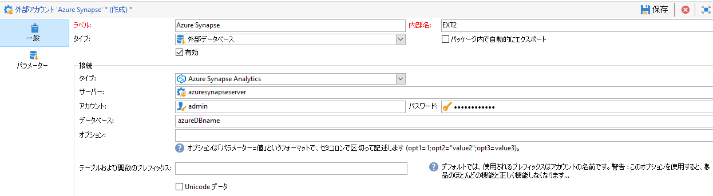

# データベースタイプ別の特定の設定 {#specific-configurations-by-database-type}

Adobe Campaign から外部データベースにアクセスできるようにするには、使用する外部データベースに応じて特定の設定をおこなう必要があります。これらの設定は、基本的には、ドライバーをインストールし、Adobe Campaign サーバー上の各 RDBMS に属する環境変数を宣言することです。

原則として、外部データベースの対応するクライアントレイヤーを Adobe Campaign サーバーにインストールする必要があります。

>[!NOTE]
>
>互換性のあるバージョンは [Campaign 互換性マトリックス](https://helpx.adobe.com/jp/campaign/kb/compatibility-matrix.html#FederatedDataAccessFDA)に記載されています。

## Azure Synapseへのアクセスの構成 {#configure-access-to-azure-synapse}

### Azure synapse external account {#azure-external}

The [!DNL Azure] external account allows you to connect your Campaign instance to your Azure Synapse external database.
[!DNL Azure Synapse] 外部アカウント外部アカウントを作成するには：

1. Campaign Classicで、 [!DNL Azure Synapse] 外部アカウントを設定します。 **[!UICONTROL エクスプローラー]**&#x200B;で、**[!UICONTROL 管理]**／**[!UICONTROL プラットフォーム]**／**[!UICONTROL 外部アカウント]**&#x200B;をクリックします。

1. 「**[!UICONTROL 作成]**」をクリックします。

1. [!DNL Azure Synapse] 外部アカウントを設定するには、次を指定する必要があります。

   * **[!UICONTROL タイプ]**: アズールシナプスAnalytics

   * **[!UICONTROL サーバー]**: Azure SynapseサーバーのURL

   * **[!UICONTROL アカウント]**：ユーザーの名前

   * **[!UICONTROL パスワード]**：ユーザーアカウントのパスワード

   * **[!UICONTROL データベース]**：データベースの名前
   

### CentOSでのAzure Synapse {#azure-centos}

**前提条件:**

* ODBCドライバをインストールするには、root権限が必要です。
* Microsoftが提供するRed Hat Enterprise ODBCドライバは、CentOSと組み合わせてSQL Serverに接続することもできます。
* バージョン13.0はRed Hat 6および7で動作します。

CentOSでAzure Synapseを構成するには：

1. まず、ODBCドライバをインストールします。 この [ページで見つかります](https://www.microsoft.com/en-us/download/details.aspx?id=50420)。

   >[!NOTE]
   >
   >これは、ODBCドライバのバージョン13専用です。

   ```
   sudo su
   curl https://packages.microsoft.com/config/rhel/6/prod.repo > /etc/yum.repos.d/mssql-release.repo
   exit
   # Uninstall if already installed Unix ODBC driver
   sudo yum remove unixODBC-utf16 unixODBC-utf16-devel #to avoid conflicts
   
   sudo ACCEPT_EULA=Y yum install msodbcsql
   
   sudo ACCEPT_EULA=Y yum install mssql-tools
   echo 'export PATH="$PATH:/opt/mssql-tools/bin"' >> ~/.bash_profile
   echo 'export PATH="$PATH:/opt/mssql-tools/bin"' >> ~/.bashrc
   source ~/.bashrc
   
   # the Microsoft driver expects unixODBC to be here /usr/lib64/libodbc.so.1, so add soft links to the '.so.2' files
   cd /usr/lib64
   sudo ln -s libodbccr.so.2   libodbccr.so.1
   sudo ln -s libodbcinst.so.2 libodbcinst.so.1
   sudo ln -s libodbc.so.2     libodbc.so.1
   
   # Set the path for unixODBC
   export ODBCINI=/usr/local/etc/odbc.ini
   export ODBCSYSINI=/usr/local/etc
   source ~/.bashrc
   
   #Add a DSN information to /etc/odbc.ini
   sudo vi /etc/odbc.ini
   
   #Add the following:
   [Azure Synapse Analytics]
   Driver      = ODBC Driver 13 for SQL Server
   Description = Azure Synapse Analytics DSN
   Trace       = No
   Server      = [insert your server here]
   ```

1. 必要に応じて、次のコマンドを実行してunixODBC開発ヘッダをインストールできます。

   ```
   sudo yum install unixODBC-devel
   ```

1. ドライバをインストールした後、必要に応じて、ODBCドライバをテストし、データベースのクエリを確認できます。 次のコマンドを実行します。

   ```
   /opt/mssql-tools/bin/sqlcmd -S yourServer -U yourUserName -P yourPassword -q "your query" # for example -q "select 1"
   ```

1. Campaign Classic では、[!DNL Azure Synapse] 外部アカウントを設定できます。外部アカウントの設定方法の詳細については、この [節を参照してください](../../platform/using/specific-configuration-database.md#azure-external)。

1. Azure SynapseAnalyticsはTCP 1433ポートを通じて通信するので、ファイアウォールでこのポートを開く必要があります。 次のコマンドを使用します。

   ```
   firewall-cmd --permanent --add-rich-rule='rule family="ipv4" source address="[server_ip_here]/32" port port="1433" protocol="tcp" accept'
   # you can ping your hostname and the ping command will translate the hostname to IP address which you can use here
   ```

   >[!NOTE]
   >
   >Azure Synapse Analytics側からの通信を許可するには、パブリックIPを許可リストに追加する必要がある場合があります。 その場合は、 [Azureのドキュメントを参照してください](https://docs.microsoft.com/en-us/azure/sql-database/sql-database-firewall-configure#use-the-azure-portal-to-manage-server-level-ip-firewall-rules)。

1. iptablesの場合は、次のコマンドを実行します。

   ```
   iptables -A OUTPUT -p tcp -d [server_hostname_here] --dport 1433 -j ACCEPT
   ```

### WindowsでのAzure Synapse {#azure-windows}

>[!NOTE]
>
>これはODBCドライバのバージョン13専用ですが、Adobe CampaignクラシックではSQL Serverネイティブクライアントドライバ11.0および10.0も使用できます。

WindowsでAzure Synapsを構成するには：

1. まず、Microsoft ODBCドライバをインストールします。 この [ページで見つかります](https://www.microsoft.com/en-us/download/details.aspx?id=50420)。

1. 次のファイルを選択してインストールします。

   ```
   your_language\your_architecture\msodbcsql.msi (i.e: English\X64\msodbcsql.msi)
   ```

1. ODBCドライバをインストールした後、必要に応じてテストできます。 詳しくは、この[ページ](https://docs.microsoft.com/en-us/sql/connect/odbc/windows/system-requirements-installation-and-driver-files?view=sql-server-ver15#installing-microsoft-odbc-driver-for-sql-server)を参照してください。

1. Campaign Classic では、[!DNL Azure Synapse] 外部アカウントを設定できます。外部アカウントの設定方法の詳細については、この [節を参照してください](../../platform/using/specific-configuration-database.md#azure-external)。

1. Azure SynapseAnalyticsはTCP 1433ポートを通じて通信するので、Windows Defenderファイアウォールでこのポートを開く必要があります。 For more on this, refer to [Windows documentation](https://docs.microsoft.com/en-us/windows/security/threat-protection/windows-firewall/create-an-outbound-program-or-service-rule).

### デビアンのAzure Synapse {#azure-debian}

**前提条件:**

* ODBCドライバをインストールするには、root権限が必要です。
* msodbcsqlパッケージをインストールするには、curlが必要です。 インストールしていない場合は、次のコマンドを実行します。

   ```
   sudo apt-get install curl
   ```

DebianでAzure Synapseを構成するには：

1. まず、SQL Server用のMicrosoft ODBCドライバをインストールします。 次のコマンドを使用して、SQL Server用のODBC Driver 13.1をインストールします。

   ```
   sudo su
   curl https://packages.microsoft.com/keys/microsoft.asc | apt-key add -
   curl https://packages.microsoft.com/config/debian/8/prod.list > /etc/apt/sources.list.d/mssql-release.list
   exit
   sudo apt-get update
   sudo ACCEPT_EULA=Y apt-get install msodbcsql
   ```

1. sudo apt-get update **を呼び出すときに、次のエラー「The method driver /usr/lib/apt/methods/https could not found（メソッドドライバ/usr/lib/apt/methods/httpsが見つかりません）」が発生した場合は、******&#x200B;コマンドを実行してください。

   ```
   sudo apt-get install apt-transport-https ca-certificates
   ```

1. 次のコマンドを使用して、mssql-toolsをインストールする必要があります。 バルクコピープログラム（またはBCP）ユーティリティを使用し、クエリを実行するには、mssq-toolsが必要です。

   ```
   sudo ACCEPT_EULA=Y apt-get install mssql-tools
   echo 'export PATH="$PATH:/opt/mssql-tools/bin"' >> ~/.bash_profile
   echo 'export PATH="$PATH:/opt/mssql-tools/bin"' >> ~/.bashrc
   source ~/.bashrc
   ```

1. 必要に応じて、次のコマンドを実行してunixODBC開発ヘッダをインストールできます。

   ```
   sudo yum install unixODBC-devel
   ```

1. ドライバをインストールした後、必要に応じて、ODBCドライバをテストし、データベースのクエリを確認できます。 次のコマンドを実行します。

   ```
   /opt/mssql-tools/bin/sqlcmd -S yourServer -U yourUserName -P yourPassword -q "your query" # for example -q "select 1"
   ```

1. In Campaign Classic, you can now configure your [!DNL Azure Synapse] external account. 外部アカウントの設定方法の詳細については、この [節を参照してください](../../platform/using/specific-configuration-database.md#azure-external)。

1. Azure SynapseAnalyticsとの接続を確実に行うようにDebianでiptablesを構成するには、次のコマンドを使用して、ホスト名に対して送信TCP 1433ポートを有効にします。

   ```
   iptables -A OUTPUT -p tcp -d [server_hostname_here] --dport 1433 -j ACCEPT
   ```

   >[!NOTE]
   >
   >Azure Synapse Analytics側からの通信を許可するには、パブリックIPを許可リストに追加する必要がある場合があります。 その場合は、 [Azureのドキュメントを参照してください](https://docs.microsoft.com/en-us/azure/sql-database/sql-database-firewall-configure#use-the-azure-portal-to-manage-server-level-ip-firewall-rules)。

## Snowflake へのアクセスの設定 {#configure-access-to-snowflake}

>[!NOTE]
>
>[!DNL Snowflake] コネクタは、ホスト型およびオンプレミスのデプロイメントで使用できます。詳しくは、[この記事](https://helpx.adobe.com/jp/campaign/kb/acc-on-prem-vs-hosted.html)を参照してください。


### Snowflake 外部アカウント{#snowflake-external}

[!DNL Snowflake] 外部アカウントを使用すれば、Campaign インスタンスを Snowflake 外部データベースに接続することができます。

1. Campaign Classicで、 [!DNL Snowflake] 外部アカウントを設定します。 **[!UICONTROL エクスプローラー]**&#x200B;で、**[!UICONTROL 管理]**／**[!UICONTROL プラットフォーム]**／**[!UICONTROL 外部アカウント]**&#x200B;をクリックします。

1. 組み込みの **[!UICONTROL Snowflake]** 外部アカウントを選択します。

1. **[!UICONTROL Snowflake]** 外部アカウントを設定するには、次を指定する必要があります。

   * **[!UICONTROL サーバー]**：[!DNL Snowflake] サーバーの URL

   * **[!UICONTROL アカウント]**：ユーザーの名前

   * **[!UICONTROL パスワード]**：ユーザーアカウントのパスワード

   * **[!UICONTROL データベース]**：データベースの名前
   

1. 「**[!UICONTROL パラメーター]**」タブをクリックし、「**[!UICONTROL 機能をデプロイ]**」ボタンをクリックして機能を作成します。

   

コネクタは、次のオプションをサポートしています。

| オプション | 説明 |
|---|---|
| workschema | 作業用テーブルに使用するデータベーススキーマ |
| warehouse | 使用するデフォルトのウェアハウスの名前。ユーザーのデフォルト値より優先されます。 |
| TimeZoneName | デフォルトでは空で、Campaign Classic アプリケーションサーバーのシステムのタイムゾーンが使用されます。このオプションは、TIMEZONE セッションパラメーターを強制的に指定するために使用できます。<br>詳しくは、[このページ](https://docs.snowflake.net/manuals/sql-reference/parameters.html#timezone)を参照してください。 |
| WeekStart | WEEK_START セッションパラメーター。デフォルトでは 0 に設定されています。<br>詳しくは、[このページ](https://docs.snowflake.com/en/sql-reference/parameters.html#week-start)を参照してください。 |
| UseCachedResult | USE_CACHED_RESULTS セッションパラメーター。デフォルトでは TRUE に設定されています。このオプションは、Snowflake でキャッシュされた結果を無効にするために使用できます。<br>詳しくは、[このページ](https://docs.snowflake.net/manuals/user-guide/querying-persisted-results.html)を参照してください。 |

### CentOS での Snowflake {#snowflake-centos}

1. [!DNL Snowflake] 用の ODBC ドライバーをダウンロードします。ダウンロードを開始するには、[ここをクリック](https://sfc-repo.snowflakecomputing.com/odbc/linux/latest/snowflake-odbc-2.20.2.x86_64.rpm)します。
1. 次のコマンドを使用して、CentOs に ODBC ドライバーをインストールする必要があります。

   ```
   rpm -Uvh unixodbc
   rpm -Uvh snowflake-odbc-2.20.2.x86_64.rpm
   ```

1. ODBC ドライバーをダウンロードしてインストールした後、Campaign Classic を再起動する必要があります。これをおこなうには、次のコマンドを実行します。

   ```
   /etc/init.d/nlserver6 stop
   /etc/init.d/nlserver6 start
   ```

1. Campaign Classic では、[!DNL Snowflake] 外部アカウントを設定できます。外部アカウントの設定方法の詳細については、この [節を参照してください](../../platform/using/specific-configuration-database.md#snowflake-external)。

### Debian での Snowflake{#snowflake-debian}

1. [!DNL Snowflake] 用の ODBC ドライバーをダウンロードします。[ここをクリック](https://sfc-repo.snowflakecomputing.com/odbc/linux/latest/index.html)して、ダウンロードを開始します。

1. 次のコマンドを使用して、Debian に ODBC ドライバーをインストールする必要があります。

   ```
   apt-get install unixodbc
   apt-get install snowflake-odbc-x.xx.x.x86_64.deb
   ```

1. ODBC ドライバーをダウンロードしてインストールした後、Campaign Classic を再起動する必要があります。これをおこなうには、次のコマンドを実行します。

   ```
   systemctl stop nlserver.service
   systemctl start nlserver.service
   ```

1. Campaign Classic では、[!DNL Snowflake] 外部アカウントを設定できます。外部アカウントの設定方法の詳細については、この [節を参照してください](../../platform/using/specific-configuration-database.md#snowflake-external)。

### Windows での Snowflake。{#snowflake-windows}

1. [Windows 用の ODBC ドライバー](https://docs.snowflake.net/manuals/user-guide/odbc-download.html)をダウンロードします。ドライバーをインストールするには、管理者レベルの権限が必要です。詳しくは、[このページ](https://docs.snowflake.net/manuals/user-guide/admin-user-management.html)を参照してください。

1. ODBC ドライバーを設定します。詳しくは、[このページ](https://docs.snowflake.net/manuals/user-guide/odbc-windows.html#step-2-configure-the-odbc-driver)を参照してください。

1. Campaign Classic では、[!DNL Snowflake] 外部アカウントを設定できます。外部アカウントの設定方法の詳細については、この [節を参照してください](../../platform/using/specific-configuration-database.md#snowflake-external)。

## Hadoop 3.0 へのアクセスの設定 {#configure-access-to-hadoop-3}

FDA で Hadoop 外部データベースに接続するには、Adobe Campaign サーバーで次の設定が必要になります。この設定は、Windows と Linux の両方で利用できます。

1. ご使用の OS のバージョンに応じて、Hadoop 用の ODBC ドライバーをダウンロードします。ドライバーは[このページ](https://www.cloudera.com/downloads.html)にあります。

1. 次に、ODBC ドライバーをインストールし、Hive 接続用の DSN を作成する必要があります。手順は、[このページ](https://docs.cloudera.com/documentation/other/connectors/hive-odbc/2-6-5/Cloudera-ODBC-Driver-for-Apache-Hive-Install-Guide.pdf)に記載されています。

1. ODBC ドライバーをダウンロードしてインストールした後、Campaign Classic を再起動する必要があります。これをおこなうには、次のコマンドを実行します。

   ```
   systemctl stop nlserver.service
   systemctl start nlserver.service
   ```

1. Campaign Classic では、Snowflake 外部アカウントを設定できます。**[!UICONTROL エクスプローラー]**&#x200B;で、**[!UICONTROL 管理]**／**[!UICONTROL プラットフォーム]**／**[!UICONTROL 外部アカウント]**&#x200B;をクリックします。

1. 「**[!UICONTROL 作成]**」をクリックし、「アカウントタイプ」として「**[!UICONTROL 外部データベース]**」を選択します。

1. **[!UICONTROL Hadoop]** 外部アカウントを設定するには、次を指定する必要があります。

   * **[!UICONTROL タイプ]**：ODBC（Sybase ASE、Sybase IQ）

   * **[!UICONTROL サーバー]**：DNS の名前

   * **[!UICONTROL アカウント]**：ユーザーの名前

   * **[!UICONTROL パスワード]**：ユーザーアカウントのパスワード

   * **[!UICONTROL データベース]**：DSN で指定されていない場合のデータベースの名前。DSN で指定した場合は、空のままにできます

   * **[!UICONTROL タイムゾーン]**：サーバーのタイムゾーン
   

コネクタは、次の ODBC オプションをサポートしています。

| 名前 | 値 |
|---|---|
| ODBCMgr | iODBC |
| warehouse | 1/2/4 |

コネクタは、次の Hive オプションもサポートします。

| 名前 | 値 | 説明 |
|---|---|---|
| bulkKey | Azure BLOB または DataLake アクセスキー | wasb:// または wasbs:// の一括ローダーの場合（wasb:// または wasbs:// で始まる一括ロードツールの場合）。<br>一括読み込みの BLOB または DataLake バケットのアクセスキーです。 |
| hdfsPort | ポート番号<br>（デフォルトでは 8020 に設定） | HDFS の一括ローダーの場合（webhdfs:// または webhdfss:// で始まる一括ロードツールの場合）。 |
| bucketsNumber | 20 | クラスター化テーブルを作成する際のバケット数。 |
| fileFormat | PARQUET | 作業用テーブルのデフォルトのファイル形式です。 |

## Hadoop 2.1 へのアクセスの設定 {#configure-access-to-hadoop}

### Windows の場合 {#for-windows}

1. Windows 用の ODBC ドライバーと [Azure HD Insight](https://www.microsoft.com/en-us/download/details.aspx?id=40886) ドライバーをインストールします。
1. ODBC DataSource Adminstrator ツールを実行して、DSN（データソース名）を作成します。ユーザーが変更できる Hive 用 System DSN サンプルが提供されています。

   ```
   Description: vorac (or any name you like)
   Host: vorac.azurehdinsight.net
   Port: 443
   Database: sm_tst611 (or your database name)
   Mechanism: Azure HDInsight Service
   User/Password: admin/<your password here>
   ```

1. Hadoop 外部アカウントを作成します。手順について詳しくは、[このページ](../../platform/using/external-accounts.md#hadoop-external-account)の節を参照してください。

### Linux の場合 {#for-linux}

1. Linux 用の unixODBC をインストールします。

   ```
   apt-get install unixodbc
   ```

1. HortonWorks（[https://www.hortonworks.com/downloads/](https://www.hortonworks.com/downloads/)）から Apache Hive 用の ODBC ドライバーをダウンロードして、インストールします。

   ```
   dpkg -i hive-odbc-native_2.1.10.1014-2_amd64.deb
   ```

1. ODBC ファイルの場所を確認します。

   ```
   root@campadpac71:/tmp# odbcinst -j
   unixODBC 2.3.1
   DRIVERS............: /etc/odbcinst.ini
   SYSTEM DATA SOURCES: /etc/odbc.ini
   FILE DATA SOURCES..: /etc/ODBCDataSources
   USER DATA SOURCES..: /root/.odbc.ini
   SQLULEN Size.......: 8
   SQLLEN Size........: 8
   SQLSETPOSIROW Size.: 8
   ```

1. DSN（データソース名）を作成し、odbc.ini ファイルを編集します。次に、Hive 接続用の DSN を作成します。

   HDInsight で「バイラル」と呼ばれる接続を設定する場合の例を以下に示します。

   ```
   [ODBC Data Sources]
   vorac 
   
   [vorac]
   Driver=/usr/lib/hive/lib/native/Linux-amd64-64/libhortonworkshiveodbc64.so
   HOST=vorac.azurehdinsight.net
   PORT=443
   Schema=sm_tst611
   HiveServerType=2
   AuthMech=6
   UID=admin
   PWD=<your password here>
   HTTPPath=
   UseNativeQuery=1
   ```

   >[!NOTE]
   >
   >ここで、**UseNativeQuery** パラメーターは非常に重要です。Campaign は Hive 対応ですが、UseNativeQuery を設定しないと正しく機能しません。通常、ドライバーまたは Hive SQL コネクタがクエリを上書きして列の順序を勝手に変更してしまいます。

   認証設定は Hive や Hadoop の構成に依存します。例えば HD Insight では、[ここ](https://www.simba.com/products/Spark/doc/ODBC_InstallGuide/unix/content/odbc/hi/configuring/authenticating/azuresvc.htm)で説明しているように、ユーザー／パスワード認証に AuthMech=6 を使用します。

1. 変数をエクスポートします。

   ```
   export ODBCINI=/etc/myodbc.ini
   export ODBCSYSINI=/etc/myodbcinst.ini
   ```

1. Hortonworks ドライバーを /usr/lib/hive/lib/native/Linux-amd64-64/hortonworks.hiveodbc.ini を介して設定します。

   Campaign と unix-odbc（libodbcinst）に接続するには、UTF-16 を使用する必要があります。

   ```
   [Driver]
   
   DriverManagerEncoding=UTF-16
   ErrorMessagesPath=/usr/lib/hive/lib/native/hiveodbc/ErrorMessages/
   LogLevel=0
   LogPath=/tmp/hive
   SwapFilePath=/tmp
   
   ODBCInstLib=libodbcinst.so
   ```

1. これで、isql を使用した接続をテストできます。

   ```
   isql vorac
   isql vorac -v
   ```

1. Hadoop 外部アカウントを作成します。手順について詳しくは、[このページ](../../platform/using/external-accounts.md#hadoop-external-account)の節を参照してください。

## Netezza へのアクセスの設定 {#configure-access-to-netezza}

FDA で Netezza 外部データベースに接続するには、Adobe Campaign サーバーで追加の設定が必要になります。

1. 使用するオペレーティングシステムに応じて、Netezza 用の ODBC ドライバーをインストールします。

   * **Linux の場合は、nz-linuxclient-v7.2.0.0.tar.gz です。**&#x200B;オペレーティングシステムに対応するフォルダー（linux または linux64）を選択し、解凍コマンドを開始します。インストール先はデフォルトで提示されるリポジトリ、「/usr/local/nz」のままでかまいません。
   * **Windows の場合は、nz-winclient-v7.2.0.0.zip です。**&#x200B;ファイルを解凍し、オペレーティングシステムに対応する実行可能スクリプト（nzodbcsetup.exe または nzodbcsetup64.exe）を開始します。ウィザードの手順に従ってドライバーのインストールを完了します。

1. ODBC ドライバーを設定します。設定は、標準のファイル（一般的なパラメーターは **/etc/odbc.ini**、ドライバーの宣言は **/etc/odbcinst.ini**）でおこなえます。

   * **/etc/odbc.ini**

      ```
      [ODBC]
      InstallDir=/etc/
      ```

      「InstallDir」は、odbcinst.ini ファイルの保存場所です。

   * **/etc/odbcinst.ini**

      ```
      [ODBC Drivers]
      NetezzaSQL = Installed
      
      [NetezzaSQL]
      Driver           = /usr/local/nz/lib/libnzsqlodbc3.so
      Setup            = /usr/local/nz/lib/libnzsqlodbc3.so
      APILevel         = 1
      ConnectFunctions = YYN
      Description      = Netezza ODBC driver
      DriverODBCVer    = 03.51
      DebugLogging     = false
      LogPath          = /tmp
      UnicodeTranslationOption = utf8
      CharacterTranslationOption = all
      PreFetch         = 256
      Socket           = 16384
      ```

1. Adobe Campaign サーバーの環境変数を指定します。

   * **LD_LIBRARY_PATH**：/usr/local/nz/lib および /usr/local/nz/lib64。「/usr/local/nz」は、ドライバーのインストール時にデフォルトで提示されるインストールリポジトリです。インストール先として選択したリポジトリを指定する必要があります。
   * **ODBCINI**：odbc.ini ファイルの保存場所（例：/etc/odbc.ini）。
   * **NZ_ODBC_INI_PATH**：odbc.ini ファイルの保存場所。Netezza で odbc.ini ファイルを使用するには、この 2 番目の変数も必要になります。

1. Campaign Classic では、Netezza 外部アカウントを設定できます。**[!UICONTROL エクスプローラー]**&#x200B;で、**[!UICONTROL 管理]**／**[!UICONTROL プラットフォーム]**／**[!UICONTROL 外部アカウント]**&#x200B;をクリックします。

1. 「**[!UICONTROL 新規]**」をクリックし、「**[!UICONTROL タイプ]**」として「**[!UICONTROL 外部データベース]**」を選択します。

1. **[!UICONTROL Netezza]** 外部アカウントを設定するには、次を指定する必要があります。

   * **[!UICONTROL タイプ]**：Netezza

   * **[!UICONTROL サーバー]**：Netezza サーバーの URL

   * **[!UICONTROL アカウント]**：ユーザーの名前

   * **[!UICONTROL パスワード]**：ユーザーアカウントのパスワード

   * **[!UICONTROL データベース]**：データベースの名前

>[!NOTE]
>
>自動で生成されるプライマリキーを含むスキーマの操作は考慮されません。
>
>テーブルでは、スキーマで定義された最初のインデックスに対して **Organize on** 句が使用されます。Netezza では、この句が 1～4 列に制限されるので、このインデックスに 4 列までしか格納できません。

## Oracle へのアクセスの設定 {#configure-access-to-oracle}

FDA で Oracle 外部データベースに接続するには、Adobe Campaign サーバーで追加の設定が必要になります。

### Linux の場合 {#for-linux-1}

1. お使いのバージョンの Oracle に対応した Oracle フルクライアントをインストールします。
1. インストールに TNS の定義を追加します。これは、/etc/oracle リポジトリの「**tnsnames.ora**」ファイルで指定します。このリポジトリが存在しない場合は作成します。

   その後、TNS_ADMIN 環境変数を新規に作成し、TNS_ADMIN=/etc/oracle をエクスポートしてマシンを再起動します。

1. Oracle を Adobe Campaign サーバー（nlserver）に統合します。そのためには、Adobe Campaign サーバーツリー構造の「nl6」フォルダーに「**customer.sh**」ファイルがあり、そのファイルに Oracle ライブラリへのリンクが含まれていることを確認します。T

   クライアントのバージョンが 11.2 の場合の例を次に示します。

   ```
   export ORACLE_HOME=/usr/lib/oracle/11.2
   export TNS_ADMIN=/etc/oracle
   export LD_LIBRARY_PATH=$ORACLE_HOME/client64/lib:$LD_LIBRARY_PATH
   ```

   >[!NOTE]
   >
   >これらの値（特に ORACLE_HOME）はインストールリポジトリによって異なります。これらの値を参照する前に、ツリー構造を確認してください。

1. Oracle に必要なライブラリをインストールします。

   * **libclntsh.so**

      ```
      cd /usr/lib/oracle/<version>/client<architecture>/lib
      ln -s libclntsh.so.<version> libclntsh.so
      ```

   * **libaio1**

      ```
      aptitude install libaio1
      or
      yum install libaio1
      ```

### Windows の場合 {#for-windows-1}

1. Oracle クライアントをインストールします。
1. C:\Oracle フォルダーに、TNS の定義を含む **tnsnames.ora** ファイルを作成します。

   TNS_ADMIN 環境変数を追加して値を C:\Oracle に設定し、マシンを再起動します。

## Sybase IQ へのアクセスを設定する {#configure-access-to-sybase-iq}

FDA で Sybase IQ 外部データベースに接続するには、Adobe Campaign サーバーで追加の設定が必要になります。

1. unixodbc パッケージがサーバーにあることを確認します。
1. **iq_odbc** をインストールします。インストールの終了時にエラーが発生することがあります。このエラーは無視してかまいません。
1. **iq_client_common** をインストールします。インストールの終了時に Java のエラーが発生することがあります。このエラーは無視してかまいません。
1. ODBC ドライバーを設定します。設定は、標準のファイル（一般的なパラメーターは /etc/odbc.ini、ドライバーの宣言は /etc/odbcinst.ini）でおこなえます。

   * **/etc/odbc.ini**（「`<server_alias>`」などの部分は独自の値に置き換えてください）：

      ```
      [ODBC Data Sources]
      <server_alias>=libdbodbc.so
      
      [<server_alias>]
      Driver=/opt/sybase/IQ-16_0/lib64/libdbodbc16.so
      Description=<description>
      Username=<username>
      Password=<password>
      ServerName=<server_name>
      CommLinks=tcpip(host=<host>)
      ```

   * **/etc/odbcinst.ini**

      ```
      [ODBC DRIVERS]
      SAP SybaseIQ=Installed
      
      [SAP SybaseIQ]
      Driver=/opt/sybase/IQ-16_0/lib64/libdbodbc16.so
      ```

1. 新しい libodbc16.so ライブラリのパスを LD_LIBRARY_PATH 変数に追加します。方法は次のとおりです。

   * customer.sh ファイルを使用してパスを宣言する場合は、パス /opt/sybase/IQ-16_0/lib64 を LD_LIBRARY_PATH 変数に追加します。
   * それ以外の場合は、Unix コマンドを使用します。

1. Campaign Classic では、Sybase IQ 外部アカウントを構成できます。**[!UICONTROL エクスプローラー]**&#x200B;で、**[!UICONTROL 管理]**／**[!UICONTROL プラットフォーム]**／**[!UICONTROL 外部アカウント]**&#x200B;をクリックします。

1. 「**[!UICONTROL 新規]**」をクリックし、「**[!UICONTROL タイプ]**」として「**[!UICONTROL 外部データベース]**」を選択します。

1. **[!UICONTROL Sybase IQ]** 外部アカウントを構成するには、次を指定する必要があります。

   * **[!UICONTROL タイプ]**：ODBC（Sybase ASE、Sybase IQ）

   * **[!UICONTROL サーバー]**：手順 5 で定義した ODBC 接続（`<server_alias>`）に対応します。必ずしもサーバー自体の名前であるとは限りません。

   * **[!UICONTROL アカウント]**：ユーザーの名前

   * **[!UICONTROL パスワード]**：ユーザーアカウントのパスワード

   * **[!UICONTROL データベース]**：データベースの名前

>[!NOTE]
>
>Windows の場合は、Sybase IQ クライアントを Adobe Campaign サーバーにインストールし、ODBC 接続を作成する必要があります。Adobe Campaign サーバー（nlserver）を Windows でサービスとして実行しているときに、システムデータソースを作成してください。

## Teradata へのアクセスの設定 {#configure-access-to-teradata}

FDA で Teradata 外部データベースに接続するには、Adobe Campaign サーバーで追加の設定が必要になります。Teradata データベースの設定方法については、[この記事](https://helpx.adobe.com/jp/campaign/kb/campaign_fda_teradata.html)を参照してください。

1. [Teradata 用の ODBC ドライバー](https://downloads.teradata.com/download/connectivity/odbc-driver/linux)をインストールします。

   これは 3 つのパッケージで構成され、Red Hat（または CentOS）／Suse に次の順序でインストールできます。

   * TeraGSS
   * tdicu1510（setup_wrapper.sh を使用してインストール）
   * tdodbc1510（setup_wrapper.sh を使用してインストール）

1. ODBC ドライバーを設定します。設定は、標準のファイル（一般的なパラメーターは **/etc/odbc.ini**、ドライバーの宣言は /etc/odbcinst.ini）でおこなえます。

   * **/etc/odbc.ini**

      ```
      [ODBC]
      InstallDir=/etc/
      ```

      「InstallDir」は、**odbcinst.ini** ファイルの保存場所です。

   * **/etc/odbcinst.ini**

      ```
      [ODBC DRIVERS]
      teradata=Installed
      
      [teradata]
      Driver=/opt/teradata/client/15.10/lib64/tdata.so
      APILevel=CORE
      ConnectFunctions=YYY
      DriverODBCVer=3.51
      SQLLevel=1
      ```

1. Adobe Campaign サーバーの環境変数を指定します。

   * **LD_LIBRARY_PATH**：/opt/teradata/client/15.10/lib64 および /opt/teradata/client/15.10/odbc_64/lib。
   * **ODBCINI**：odbc.ini ファイルの保存場所（例：/etc/odbc.ini）。
   * **NLSPATH**：opermsgs.cat ファイルの保存場所（/opt/teradata/client/15.10/msg/opermsgs.cat）。

1. Campaign Classic では、Teradata 外部アカウントを設定できます。**[!UICONTROL エクスプローラー]**&#x200B;で、**[!UICONTROL 管理]**／**[!UICONTROL プラットフォーム]**／**[!UICONTROL 外部アカウント]**&#x200B;をクリックします。

1. 「**[!UICONTROL 新規]**」をクリックし、「**[!UICONTROL タイプ]**」として「**[!UICONTROL 外部データベース]**」を選択します。

1. Teradata **[!UICONTROL 外部アカウントを設定するには]**、次を指定する必要があります。

   * **[!UICONTROL タイプ]**：Teradata

   * **[!UICONTROL サーバー]**：Teradata サーバーの URL

   * **[!UICONTROL アカウント]**：ユーザーの名前

   * **[!UICONTROL パスワード]**：ユーザーアカウントのパスワード

   * **[!UICONTROL データベース]**：データベースの名前

## SAP HANA へのアクセスを設定する {#configure-access-to-sap-hana}

FDA で SAP HANA 外部データベースに接続するには、Adobe Campaign サーバーで追加の設定が必要になります。

1. 使用するオペレーティングシステムに応じて、SAP HANA 用の ODBC ドライバーをインストールします。

   * **hdb_client_linux.tgz（Linux 用）：**&#x200B;解凍後、hdbinst コマンドを開始し、指示に従ってドライバーのインストールを完了します。
   * **hdb_client_windows.zip（Windows 用）：**&#x200B;ファイルを解凍し、実行可能ファイル **hdbinst.exe** を起動します。ウィザードの手順に従ってドライバーのインストールを完了します。

1. ODBC ドライバーを設定します。設定は、標準のファイル（一般的なパラメーターは /etc/odbc.ini、ドライバーの宣言は /etc/odbcinst.ini）でおこなえます。

   * **/etc/odbc.ini**

      ```
      [ODBC]
      InstallDir=/etc/
      
      [HDB]
      Driver=HDBODBC
      servernode=localhost:39013 (this value depend of your server)
      User:SYSTEM
      ```

      「InstallDir」は、**odbcinst.ini** ファイルの保存場所です。

   * **/etc/odbcinst.ini**

      ```
      [HDBODBC]
      Description = "SmartCloudPT HANA"
      Driver = /usr/sap/hdbclient/libodbcHDB.so
      ```

1. Adobe Campaign サーバーの環境変数を指定します。

   * **LD_LIBRARY_PATH**：SAP HANA クライアントへのリンク（デフォルトでは /usr/sap/hdbclient/libodbcHDB.so）を含める必要があります。
   * **ODBCINI**：odbc.ini ファイルの保存場所（例：/etc/odbc.ini）。

1. Campaign Classic では、SAP Hana 外部アカウントを設定できます。**[!UICONTROL エクスプローラー]**&#x200B;で、**[!UICONTROL 管理]**／**[!UICONTROL プラットフォーム]**／**[!UICONTROL 外部アカウント]**&#x200B;をクリックします。

1. 「**[!UICONTROL 新規]**」をクリックし、「**[!UICONTROL タイプ]**」として「**[!UICONTROL 外部データベース]**」を選択します。

1. **[!UICONTROL SAP Hana]** 外部アカウントを設定するには、次を指定する必要があります。

   * **[!UICONTROL タイプ]**：SAP Hana

   * **[!UICONTROL サーバー]**：SAP Hana サーバーの URL

   * **[!UICONTROL アカウント]**：ユーザーの名前

   * **[!UICONTROL パスワード]**：ユーザーアカウントのパスワード
