# クエリの作成手順{#steps-to-create-a-query}

Adobe Campaign でクエリを作成する手順は次のとおりです。

1. 作業用テーブルを選択します。手順1 - [表の選択を参照](#step-1---choose-a-table)。
1. 抽出するデータを選択します。詳しくは、手 [順2 — 抽出するデータの選択を参照してください](#step-2---choose-data-to-extract)。
1. データの並べ替え順を定義します。手順3 — デ [ータの並べ替えを参照](#step-3---sort-data)。
1. データをフィルターします。手順4 — デ [ータのフィルタを参照](#step-4---filter-data)。
1. データを書式設定します。手順5 — デ [ータのフォーマットを参照](#step-5---format-data)。
1. 結果を表示します。手順6 — デー [タのプレビューを参照](#step-6---preview-data)。

>[!NOTE]
>
>これらの手順はすべて汎用クエリエディターで実行できます。他のコンテキストでクエリを作成する場合は、一部の手順を省略できます。\
>The Query activity is presented in [this section](../../workflow/using/query.md).

## 手順 1 - テーブルの選択 {#step-1---choose-a-table}

Select the table containing the data you want to query in the **[!UICONTROL Document type]** window. If necessary, filter the data using the filter field or the **[!UICONTROL Filters]** button.

## 手順 2 - 抽出するデータの選択 {#step-2---choose-data-to-extract}

In the **[!UICONTROL Data to extract]** window, select the data to display: these fields will make up the output columns.

例えば、、、、 **[!UICONTROL Age]**、とを **[!UICONTROL Primary key]**&#x200B;選択 **[!UICONTROL Email domain]** します **[!UICONTROL City]**。 結果は、この選択内容に基づいて構成されます。列の順序を変更するには、ウィンドウの右側にある青色の矢印を使用します。

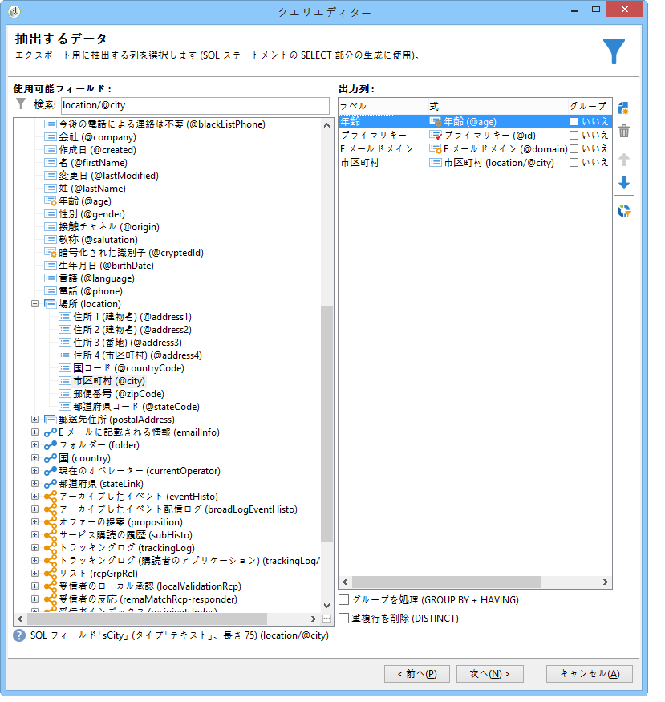

数式を挿入したり、集計関数のプロセスを実行したりして、式を編集できます。これを行うには、列フィールドを **[!UICONTROL Expression]** クリックし、を選択しま **[!UICONTROL Edit expression]**&#x200B;す。

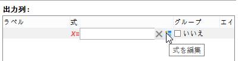

It is possible to group output column data: to do this, check **[!UICONTROL Yes]** in the **[!UICONTROL Group]** column of the **[!UICONTROL Data to extract]** window. この機能では、オンにしたグループ化項目に関する結果が生成されます。グループ化を使用したクエリの例は[この節](../../workflow/using/querying-delivery-information.md)で確認できます。

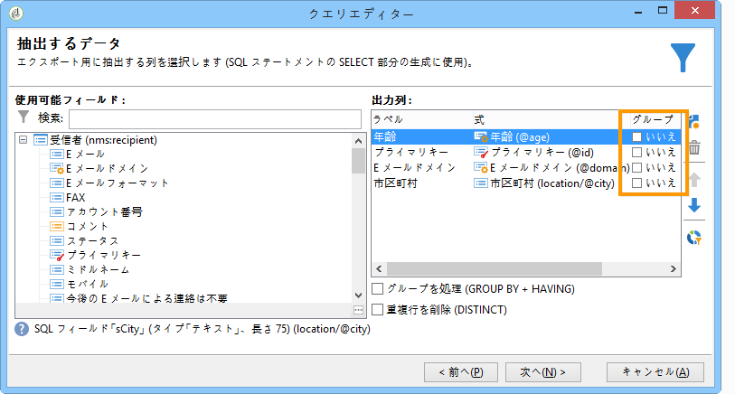

* この関 **[!UICONTROL Handle groupings (GROUP BY + HAVING)]** 数を使用すると、グループ化(「having」)したものを「group by」して選択できます。 この機能は、出力列のすべてのフィールドに適用されます。例えば、このオプションを使用して、出力列のすべての選択肢をグループ化し、35 ～ 50 の受信者など、特定のタイプの情報を収集できます。

   詳しくは、[この節](../../workflow/using/querying-using-grouping-management.md)を参照してください。

* この関 **[!UICONTROL Remove duplicate rows (DISTINCT)]** 数を使用すると、出力列で取得した同一の結果を複製できます。 例えば、出力列で「姓」、「名」および「E メール」フィールドを選択して調査を行った場合、同じデータが含まれるフィールドは、同じ連絡先が複数回データベースに入力されたことを意味するので、除外されます。これにより、1 つの結果のみが考慮されるようになります。

## 手順 3 - データの並べ替え {#step-3---sort-data}

The **[!UICONTROL Sorting]** window lets you sort column content. 矢印を使用して列の順序を変更します。

* The **[!UICONTROL Sorting]** column enables a simple sort and arranges column content from A to Z or in ascending order.
* The **[!UICONTROL Descending sort]** arranges the content from Z to A and in descending order. これは、売上レコードなどを表示する場合に便利で、最も大きい数字がリストの一番上に表示されます。

この例では、データは受信者の年齢に基づいて昇順で並べ替えられています。

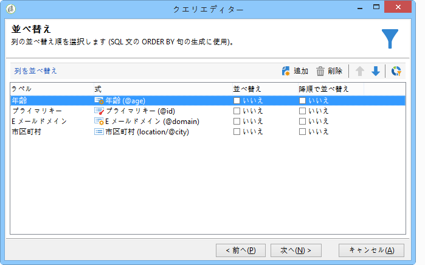

## 手順 4 - データのフィルター {#step-4---filter-data}

クエリエディターでは、データをフィルターして検索を絞り込むことができます。

使用できるフィルターは、クエリが対象とするテーブルに応じて異なります。

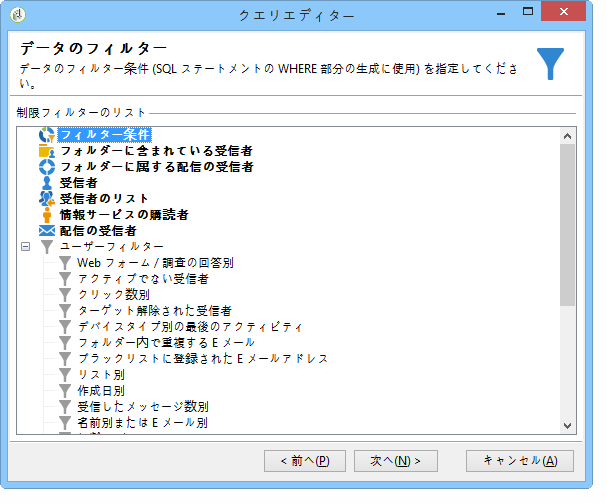

Once you select the **[!UICONTROL Filtering conditions]** you will access the **[!UICONTROL Target elements]** section: this lets you define how to filter the data to collect.

* 新しいフィルターを作成するには、データを選択するために検証する数式の作成に必要なフィールド、演算子および値を選択します。It&#39;s possible to combine several conditions (for more on this, refer to [Defining filter conditions](../../platform/using/defining-filter-conditions.md)).
* To use previously saved filters, open the drop-down list by clicking the **[!UICONTROL Add]** button, click **[!UICONTROL Predefined filter]** and select the one you want.

   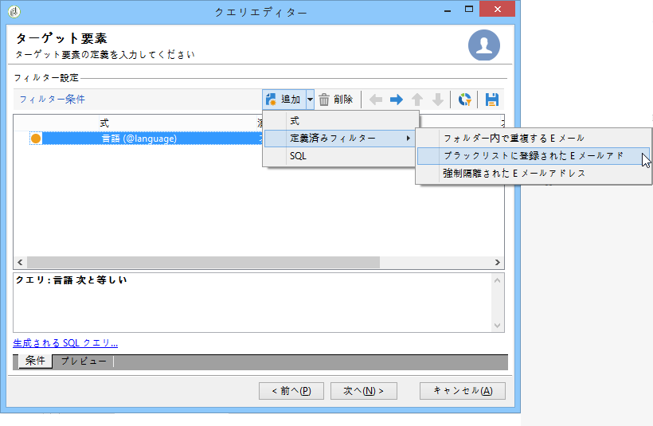

* The filters created in the **[!UICONTROL Generic query editor]** are available in other query applications and vice versa. To save a filter, click the **[!UICONTROL Save]** icon.

   >[!NOTE]
   >
   >For more on creating and using filters, refer to [Filtering options](../../platform/using/filtering-options.md).

次の例に示すように、英語を話すすべての受信者を回復するには、次を選択します。&quot;受信者の言 **語が** ENに等しい&quot;。

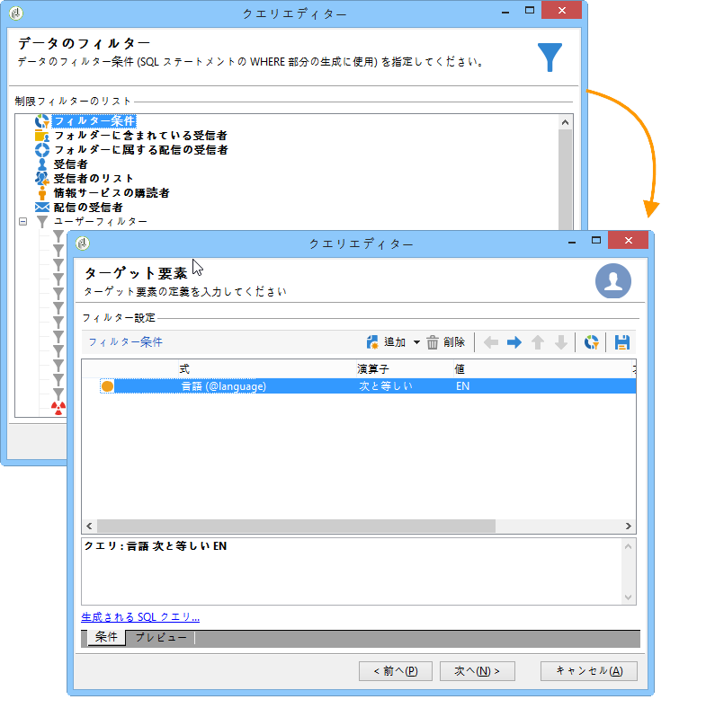

>[!NOTE]
>
>You can directly access an option by typing the following formula in the **Value** field: **$(options:OPTION_NAME)**.

Click the **[!UICONTROL Preview]** tab to view the result of the filtering condition. この例では、英語を話すすべての受信者の姓、名および E メールアドレスが表示されます。

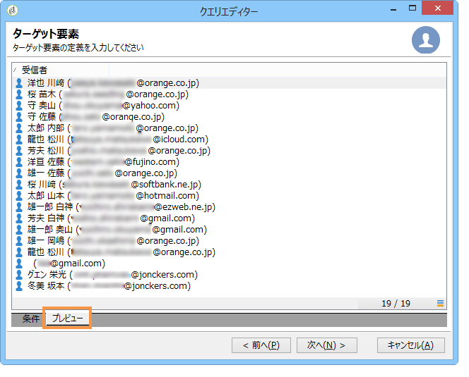

Users familiar with SQL language can click **[!UICONTROL Generate SQL query]** to view the query in SQL.

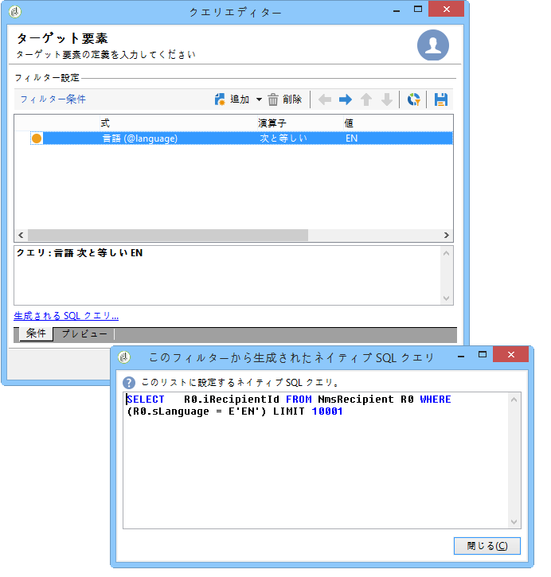

## 手順 5 - データのフォーマット {#step-5---format-data}

Once you have configured the restriction filters, you will access the **[!UICONTROL Data formatting]** window. このウィンドウでは出力列の再編成、データの変換および列ラベルの大／小文字の変更をおこなうことができます。計算フィールドを使用して、最終結果に数式を適用することもできます。

>[!NOTE]
>
>For more information on the types of calculated fields, refer to [Creating calculated fields](../../platform/using/defining-filter-conditions.md#creating-calculated-fields).

オフになっている列は、データのプレビューウィンドウに表示されません。

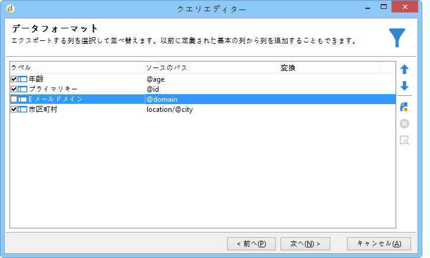

The **[!UICONTROL Transformation]** column lets you change a column label to upper or lower case. Select the column and click in the **[!UICONTROL Transformation]** column. 次を選択できます。

* **[!UICONTROL Switch to lower case]**、
* **[!UICONTROL Switch to upper case]**、
* **[!UICONTROL First letter in upper case]**&#x200B;を参照してください。

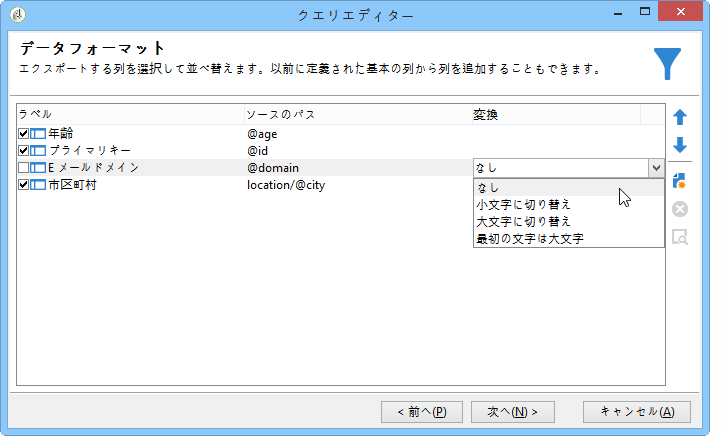

## 手順 6 - データのプレビュー {#step-6---preview-data}

窓が **[!UICONTROL Data preview]** 最後のステージです。 をクリッ **[!UICONTROL Start the preview of the data]** クして、クエリ結果を取得します。 クエリ結果は、列または XML フォーマットで使用可能です。Click the **[!UICONTROL Generated SQL queries]** tab to view the query in SQL format.

この例では、データは受信者の年齢に基づいて昇順で並べ替えられています。

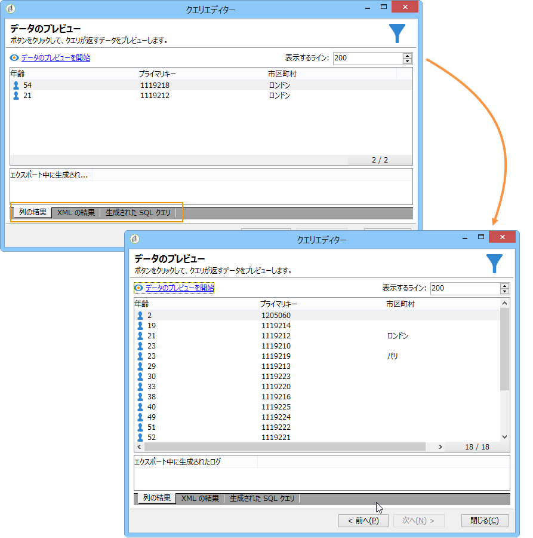

>[!NOTE]
>
>By default, only the first 200 lines are displayed in the **[!UICONTROL Data preview]** window. これを変更するには、ボックスに数値を入力し **[!UICONTROL Lines to display]** てをクリックしま **[!UICONTROL Start the preview of the data]**&#x200B;す。

