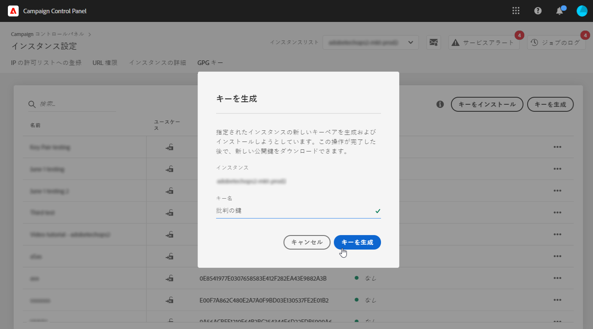
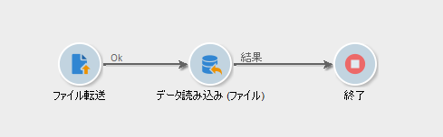
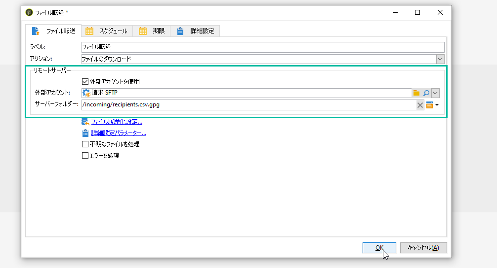
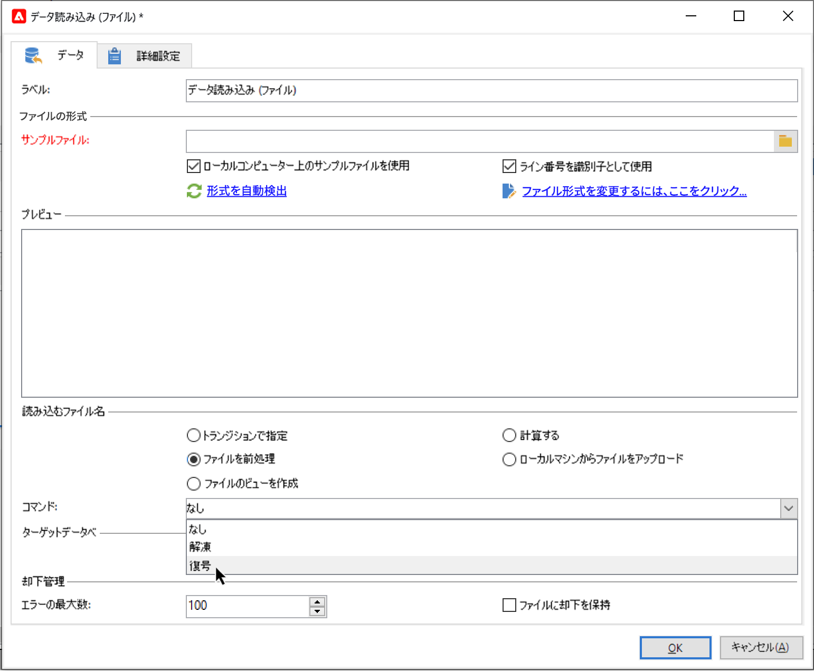
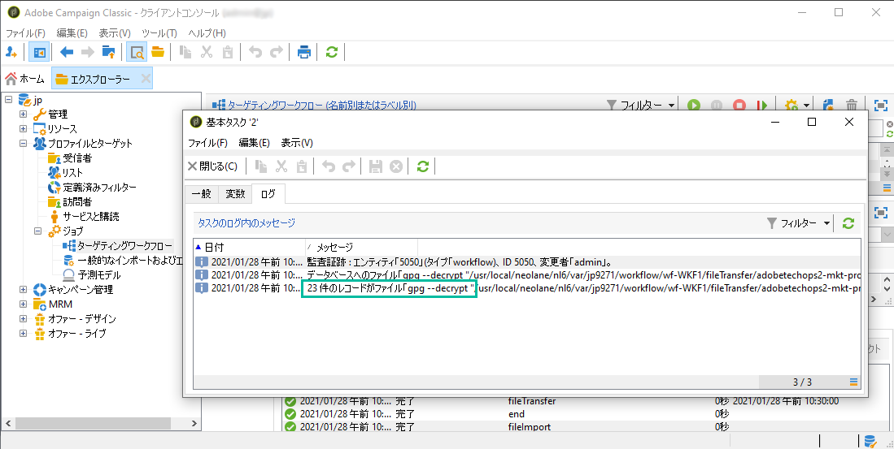

# ファイル{#unzipping-or-decrypting-a-file-before-processing}を解凍または復号化する

Adobe Campaign では、圧縮されたファイルや暗号化されたファイルをインポートできます。「[データ読み込み（ファイル）](../../workflow/using/data-loading--file-.md)」アクティビティで読み取る前にファイルを解凍または復号化する前処理を定義できます。

手順は以下のとおりです。

1. [Campaign コントロールパネル](https://docs.adobe.com/content/help/ja/control-panel/using/instances-settings/gpg-keys-management.html#decrypting-data)を使用して、公開鍵と秘密鍵のペアを生成します。

   >[!NOTE]
   >
   >Campaign コントロールパネルは、すべての管理者ユーザーがアクセスできます。 ユーザーに管理者アクセスを許可する手順については、[このページ](https://experienceleague.adobe.com/docs/control-panel/using/discover-control-panel/managing-permissions.html?lang=en#discover-control-panel)を参照してください。
   >
   >インスタンスはAWSでホストされ、最新の[Gold Standard](../../rn/using/gs-overview.md)ビルドまたは[最新のGAビルド(21.1)](../../rn/using/latest-release.md)でアップグレードする必要があります。 [このセクション](../../platform/using/launching-adobe-campaign.md#getting-your-campaign-version)でバージョンを確認する方法を説明します。 インスタンスがAWSでホストされているかどうかを確認するには、[このページ](https://experienceleague.adobe.com/docs/control-panel/using/faq.html)に記載されている手順に従ってください。

1. インストールした Adobe Campaign がアドビでホストされている場合は、必要なユーティリティをサーバーにインストールするよう[アドビカスタマーケア](https://helpx.adobe.com/jp/enterprise/admin-guide.html/enterprise/using/support-for-experience-cloud.ug.html)に依頼します。
1. Adobe Campaign のインストールがオンプレミスの場合：使用するユーティリティ（例：GPG、GZIP）およびアプリケーションサーバー上の必要なキー（暗号化キー）をインストールします。

次に、目的の前処理コマンドをワークフローで使用します。

1. ワークフローに「**[!UICONTROL ファイル転送]**」アクティビティを追加して設定します。
1. 「**[!UICONTROL データ読み込み（ファイル）]**」アクティビティを追加し、ファイルのフォーマットを定義します。
1. 「**[!UICONTROL ファイルを前処理]**」オプションをオンにします。
1. 適用する前処理コマンドを指定します。
1. ファイルから取得したデータを管理するために必要なその他のアクティビティを追加します。
1. 保存して、ワークフローを実行します。

例として、次のユースケースを示します。

**関連トピック：**

* [データの読み込み（ファイル）アクティビティ](../../workflow/using/data-loading--file-.md).
* [ファイルを圧縮または暗号化します](../../workflow/using/how-to-use-workflow-data.md#zipping-or-encrypting-a-file)。

## 使用例：Campaign コントロールパネル{#use-case-gpg-decrypt}が生成した鍵を使用して暗号化したデータを読み込む

このユースケースでは、外部システムで暗号化されたデータを Campaign コントロールパネルで生成された鍵を使用してインポートするためのワークフローを作成します。

 [この機能をビデオで確認](#video)

このユースケースを実行する手順は次のとおりです。

1. Campaign コントロールパネルを使用して、キーペア（公開鍵と秘密鍵）を生成します。詳細な手順については、[Campaign コントロールパネルのドキュメント](https://docs.adobe.com/content/help/en/control-panel/using/instances-settings/gpg-keys-management.html#decrypting-data)を参照してください。

   * 公開鍵は外部システムと共有され、外部システムはこのキーを使用して Campaign に送信するデータを暗号化します。
   * 秘密鍵は、受信する暗号化されたデータを復号化するために Campaign Classic で使用されます。

   

1. 外部システムでは、Campaign コントロールパネルからダウンロードした公開鍵を使用して、Campaign Classic にインポートするデータを暗号化します。

1. Campaign Classic で、暗号化されたデータをインポートするワークフローを作成し、Campaign コントロールパネル経由でインストールされた秘密鍵を使用して復号化します。これをおこなうには、次のようにワークフローを作成します。

   

   * **[!UICONTROL ファイル転送]**&#x200B;アクティビティ：ファイルを外部ソースから Campaign Classic に転送します。この例では、SFTP サーバーからファイルを転送します。
   * **[!UICONTROL データ読み込み（ファイル）]**&#x200B;アクティビティ：ファイルからデータベースにデータを読み込み、Campaign コントロールパネルで生成された秘密鍵を使用して復号化します。

1. **[!UICONTROL ファイル転送]**&#x200B;アクティビティを開き、暗号化された .gpg ファイルのインポート元の外部アカウントを指定します。

   

   アクティビティの設定方法に関するグローバルな概念については、[こちら](../../workflow/using/file-transfer.md)を参照してください。

1. **[!UICONTROL データ読み込み（ファイル）]**&#x200B;アクティビティを開き、必要に応じて設定します。アクティビティの設定方法に関するグローバルな概念については、[こちら](../../workflow/using/data-loading--file-.md)を参照してください。

   受信データを復号化するために、アクティビティに前処理ステージを追加します。それには、「**[!UICONTROL ファイルを前処理]**」オプションを選択したあと、この復号化コマンドを「**[!UICONTROL コマンド]**」フィールドにコピー＆ペーストします。

   `gpg --batch --passphrase passphrase --decrypt <%=vars.filename%>`

   

   >[!CAUTION]
   >
   >この例では、Campaign コントロールパネルでデフォルトで使用されるパスフレーズ（「passphrase」）を使用しています。
   >
   >カスタマーサポートへの依頼を通じて GPG キーがインスタンスに既にインストールされている場合は、そのパスフレーズが変更され、デフォルトとは異なるものになっている可能性があります。

1. 「**[!UICONTROL OK]**」をクリックして、アクティビティの設定を確定します。

1. これで、ワークフローを開始できます。ワークフローを実行したら、復号化が実行されたことと、ファイルのデータがインポートされたことをワークフローログで確認できます。

   

## チュートリアルビデオ {#video}

このビデオでは、GPG キーを使用してデータを復号化する方法を紹介します。

>[!VIDEO](https://video.tv.adobe.com/v/36482?quality=12)

Campaign Classic に関するその他のハウツービデオは[こちら](https://experienceleague.adobe.com/docs/campaign-classic-learn/tutorials/overview.html?lang=ja)で参照できます。
