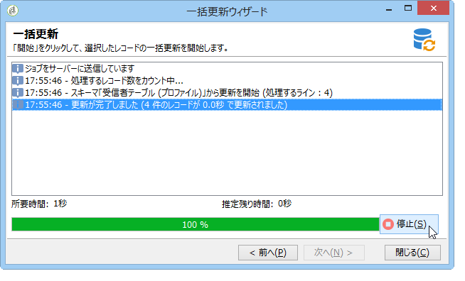

# データの更新{#updating-data}

受信者のプロファイルにリンクされているデータは、手動または自動で更新できます。

## 自動更新の設定 {#setting-up-an-automatic-update}

自動更新は、ワークフローを使用して設定できます。詳しくは、[この節](../../workflow/using/update-data.md)を参照してください。

## 一括更新の実行 {#performing-a-mass-update}

手動更新を実行するには、選択した受信者を右クリックして「**[!UICONTROL アクション]**」ショートカットメニューを使用するか、**[!UICONTROL アクション]**&#x200B;アイコンを使用します。

更新には、一連の受信者の一括更新と、2 つのプロファイル間のデータ結合の 2 種類があります。各アクションについて、ウィザードに従って更新を設定できます。

### 一括更新 {#mass-update}

一括更新の場合は、**[!UICONTROL アクション／選択されたラインを一括更新...]**&#x200B;を使用します。ウィザードを使用して、更新を設定および実行することができます。

ウィザードの最初の手順では、更新するフィールドを指定します。

ウィザードの左側のセクションに、使用可能フィールドのリストが表示されます。「**[!UICONTROL 検索]**」フィールドを使用して、これらのフィールドの検索を実行します。**Enter** キーを押してリストを参照します。次に示すように、入力内容に一致するフィールド名が太字で表示されます。

更新するフィールドをダブルクリックすると、それらのフィールドがウィザードの右側のセクションに表示されます。

エラーが発生した場合は、**[!UICONTROL 削除]**&#x200B;ボタンを使用して、更新するフィールドのリストからフィールドを削除します。

更新するプロファイルに適用する値を選択するか、入力します。

**[!UICONTROL 値の配分]**&#x200B;をクリックして、（更新の影響を受ける受信者のみではなく）現在のフォルダーに存在する受信者について、選択したフィールドの値の配分を表示できます。

このウィンドウで値の配分を表示するためのフィルターを定義したり、現在のフォルダーを変更して別のフォルダーの値の配分を表示したりできます。これらは読み取り専用のアクションであり、定義する更新の設定に影響を与えることはありません。

このウィンドウを閉じ、「**[!UICONTROL 次へ]**」をクリックして更新ウィザードの 2 番目の手順を表示します。この手順では、「**[!UICONTROL 開始]**」をクリックして更新を実行できます。

更新の実行に関する情報がウィザードの上部セクションに表示されます。

「**[!UICONTROL 停止]**」を使用すると更新をキャンセルできますが、一部のレコードは更新されている場合があり、プロセスを停止してもこれらの更新内容をキャンセルすることはできません。プログレスバーに操作の進捗状況が表示されます。

### データの結合 {#merge-data}

「**[!UICONTROL 選択した行を結合]**」を選択して、2 つの受信者プロファイルの結合を実行します。オプションを選択する前に、結合するプロファイルを選択する必要があります。結合の設定および実行には、ウィザードを使用します。

ウィザードには、いずれかのソースプロファイルで入力された各フィールドについて取得する値が表示されます。結合するプロファイルの 1 つ以上のフィールドの値が異なる場合、それらは「**[!UICONTROL 競合のリスト]**」セクションに表示されます。その場合、次の例に示すように、リストの下のラジオボタンを使用してデフォルトプロファイルを選択できます。

「**[!UICONTROL 計算]**」をクリックして、選択の結果を表示します。

ウィンドウの両方のセクションの「**[!UICONTROL 結果]**」列を確認し、「**[!UICONTROL 完了]**」をクリックして結合を実行します。

## データのエクスポート {#exporting-data}

リストのコンテンツをエクスポートできます。エクスポートを設定して実行するには、以下の手順に従います。

1. エクスポートするレコードを選択します。
1. 右クリックして、**[!UICONTROL エクスポート...]** を選択します。

   

1. 次に、抽出するデータを選択します。デフォルトでは、表示されているすべての列が出力列に追加されます。

   

   エクスポートウィザードを設定する方法について詳しくは、[エクスポートウィザード](../../platform/using/exporting-data.md#export-wizard)を参照してください。

## サービスの購読登録 {#subscribing-to-a-service}

ほとんどの場合、受信者は専用のランディングページからニュースレターを購読します。詳しくは、[この節](../../delivery/using/managing-subscriptions.md)を参照してください。一方で、フィルターを適用した受信者のプロファイルを、手動でサービス（ニュースレターやバイラルサービス）に購読登録することもできます。手順は次のとおりです。

1. 購読登録する受信者を選択して、右クリックします。
1. **[!UICONTROL アクション／サービスの購読選択...]** を選択します。

   

1. 目的のサービスを選択し、「**[!UICONTROL 次へ]**」をクリックします。

   

   >[!NOTE]
   >
   >このエディターでは新しいサービスを作成できます。作成するには、**[!UICONTROL 作成]**&#x200B;ボタンをクリックします。

1. 「**[!UICONTROL 確認メッセージを送信]**」をオンにして受信者に確認メッセージを送信できます。このメッセージの内容は、選択したサービスにリンクされた購読シナリオで設定できます。
1. 「**[!UICONTROL 開始]**」ボタンをクリックして購読登録プロセスを開始します。

   

ウィンドウの上部セクションで実行プロセスを監視できます。「**[!UICONTROL 停止]**」ボタンを使用してプロセスを停止できます。ただし、既に処理された受信者は購読登録されます。

「**[!UICONTROL データベースでこのジョブのトレースを保持しない]**」オプションをオフにした場合、このプロセスに関する情報を保存する実行フォルダーを選択（または作成）できます。

プロセスを確認するには、この操作のターゲットとなる受信者のプロファイルの「**[!UICONTROL 購読]**」タブ、または&#x200B;**[!UICONTROL プロファイルとターゲット／サービスと購読]**&#x200B;ノードからアクセスする「**[!UICONTROL 購読]**」タブに移動します。

>[!NOTE]
>
>情報サービスの作成と設定について詳しくは、[このページ](../../delivery/using/managing-subscriptions.md)を参照してください。

