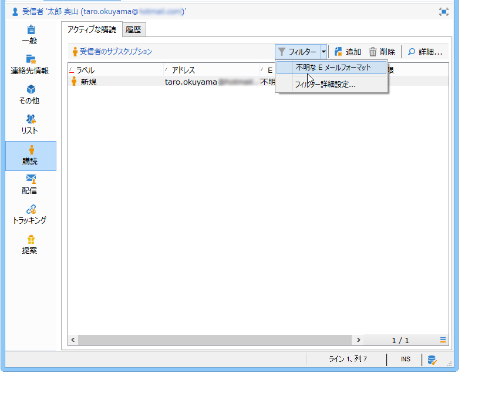

# ユースケース{#use-case}

## 購読者のメールフォーマットに対するフィルターの作成 {#creating-a-filter-on-the-email-format-of-subscribers}

この使用例では、受信者のメールフォーマットに基づいてニュースレターの購読を並べ替えるフィルターの作成方法を示します。

そのためには、定義済みフィルターを使用する必要があります。これらのフィルターは、ドキュメントタイプにリンクされており、**[!UICONTROL 管理／設定／定義済みフィルター]**&#x200B;ノードを使用してアクセスされます。これらのデータフィルターは、アプリケーションでエディター（またはドキュメント）の各タイプに対して使用できます。

データフィルターは定義済みフィルターと同じ方法で作成されますが、フィルターが適用されるドキュメントタイプを選択するための追加のフィールドがあります。

次の手順に従います。

1. **[!UICONTROL 管理／設定／定義済みフィルター]**&#x200B;ノードを使用して新しいフィルターを作成します。
1. **[!UICONTROL リンクを選択]**&#x200B;アイコンをクリックして、対象のドキュメントを選択します。

   

1. 購読スキーマ（nms:subscription）を選択して、「**[!UICONTROL OK]**」をクリックします。

   

1. **[!UICONTROL リンクを編集]**&#x200B;をクリックして、選択したドキュメントのフィールドを表示します。

   

   選択したドキュメントのコンテンツを確認できます。

   

   これらのフィールドにアクセスして、フィルターエディターの本文でフィルター条件を定義できます。アプリケーションフィルターは、詳細フィルターと同じ方法で定義されます。[詳細フィルターの作成](../../platform/using/creating-filters.md#creating-an-advanced-filter)を参照してください。

1. メールフォーマットが定義されていない購読のみを表示する、購読の新しいフィルターを作成します。

   

1. 「**[!UICONTROL 保存]**」をクリックして、このタイプのリストの定義済みフィルターにフィルターを追加します。
1. これで、受信者プロファイルの「**[!UICONTROL 購読]**」タブでこのフィルターを使用できます。「**[!UICONTROL フィルター]**」ボタンをクリックすると、「不明なメールフォーマット」フィルターにアクセスできます。

   

   現在のフィルターの名前は、リストの上に表示されます。フィルターをキャンセルするには、**[!UICONTROL このフィルターを削除]**&#x200B;アイコンをクリックします。

   
