# データパッケージの使用{#working-with-data-packages}

## データパッケージについて {#about-data-packages}

Adobe Campaign では、パッケージシステムを通じて、プラットフォーム設定とデータをエクスポートまたはインポートできます。パッケージには、様々な種類の設定や要素を含めることができ、フィルターされている場合とそうでない場合があります。

データパッケージを使用すると、XML 形式のファイル経由で Adobe Campaign データベース内のエンティティを表示できます。パッケージに含まれる 1 つのエンティティは、それに該当するすべてのデータによって表現されます。

**データパッケージ**&#x200B;の原則とは、データの設定をエクスポートして別の Adobe Campaign システム内に組み込むことです。一貫性のあるデータパッケージセットの維持方法について詳しくは、[テクニカルノート](https://docs.campaign.adobe.com/doc/AC/en/technicalResources/Technotes/AdobeCampaign_How_to_maintain_a_consistent_set_of_data_packages.pdf)を参照してください。

### パッケージの種類 {#types-of-packages}

エクスポート可能なパッケージとしては、ユーザーパッケージ、プラットフォームパッケージ、管理パッケージの 3 種類があります。

* **ユーザーパッケージ**：エクスポートするエンティティのリストを選択できます。このタイプのパッケージでは、依存関係の管理とエラーの検証がおこなわれます。
* **プラットフォームパッケージ**：スキーマ、JavaScript コードなど、すべての付加的な技術リソースが含まれています（非標準）。

   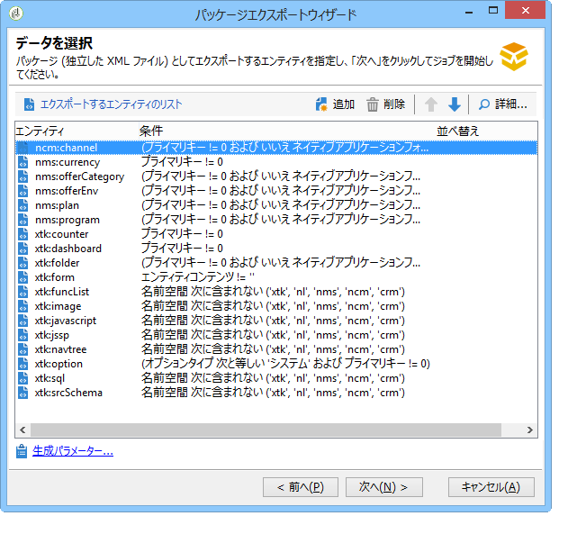

* **管理パッケージ**：テンプレート、ライブラリなど、すべての付加的なテンプレートやビジネスオブジェクトが含まれています（非標準）。

   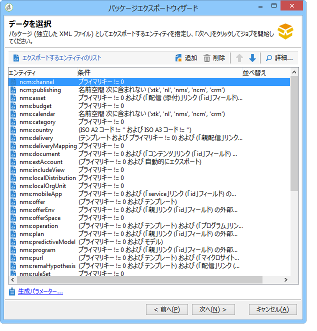

>[!CAUTION]
>
>**プラットフォーム**&#x200B;タイプと&#x200B;**管理**&#x200B;タイプのパッケージには、事前に定義された、エクスポートするエンティティのリストが含まれます。個々のエンティティは、作成したパッケージに含まれる事前定義のリソースを削除するためのフィルター条件にリンクされています。

## データ構造 {#data-structure}

1 つのデータパッケージは、**xrk:navtree** データスキーマの文法に準拠した 1 個の構造化 XML ドキュメントによって記述されます。

データパッケージの例：

```
<package>
  <entities schema="nms:recipient">
    <recipient email="john.smith@adobe.com" lastName="Smith" firstName="John">      
      <folder _operation="none" name="nmsRootFolder"/>      
      <company _operation="none" name="Adobe"/>
    </recipient>
  </entities>
  <entities schema="sfa:company">
    <company name="Adobe">
      location city="London" zipCode="W11 2BQ"/>
    </company>
  </entities>
</package>
```

The XML document must begin and end with the **`<package>`** element. Any **`<entities>`** elements that follow distribute the data by document type.

An **`<entities>`** element contains the data of the package in the format of the data schema entered in the **schema** attribute.

パッケージ内のデータには、例えば自動生成キー（**autopk** オプション）のような、ベース間の互換性がない内部キーが含まれていてはなりません。

この例では、&quot;folder&quot; リンクと &quot;company&quot; リンクが、宛先テーブル内のいわゆる &quot;ハイレベル&quot; キーで次のように置き換えられています。

```
<recipient>
  <folder _operation="none" name="nmsRootFolder"/>
  <company _operation="none" name="Adobe"/>
</recipient>
```

The **`operation`** attribute with the value &quot;none&quot; defines a reconciliation link.

データパッケージの作成は、任意のテキストエディターを使って手作業でおこなうことができます。ただし、XML ドキュメントの構造は常に &quot;xtk:navtree&quot; データスキーマに準拠している必要があります。Adobe Campaign コンソールには、データパッケージのエクスポートとインポートを実行できるモジュールがあります。

## パッケージのエクスポート {#exporting-packages}

### パッケージのエクスポートについて {#about-package-export}

パッケージは次の 3 つの方法でエクスポートできます。

* The **[!UICONTROL Package Export Wizard]** enables you to export a set of objects in a single package. この詳細については、「パッケージ内 [のオブジェクトのセットの書き出し」を参照してください。](#exporting-a-set-of-objects-in-a-package)
* A **single object** can be exported in a package directly by right-clicking on it and selecting **[!UICONTROL Actions > Export in a package]**.
* **パッケージ定義**&#x200B;を使用して、パッケージ構造を作成し、オブジェクトを追加した後、パッケージにエクスポートできます。詳しくは、「パッケージ定義の管理」を参 [照してください。](#managing-package-definitions)

パッケージをエクスポートした後、そのパッケージと追加されたエンティティを他の Campaign インスタンスにインポートすることもできます。

### パッケージでのオブジェクトセットのエクスポート {#exporting-a-set-of-objects-in-a-package}

The package export wizard is accessible via the **[!UICONTROL Tools > Advanced > Export package...]** menu of the Adobe Campaign client console.

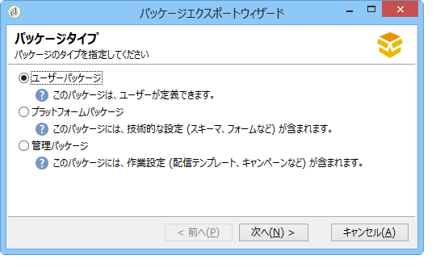

パッケージエクスポートウィザードでは、これら 3 種類のパッケージを以下に示す手順で扱います。

1. エクスポートの対象とするエンティティのリストをドキュメントタイプ別に表示します。

   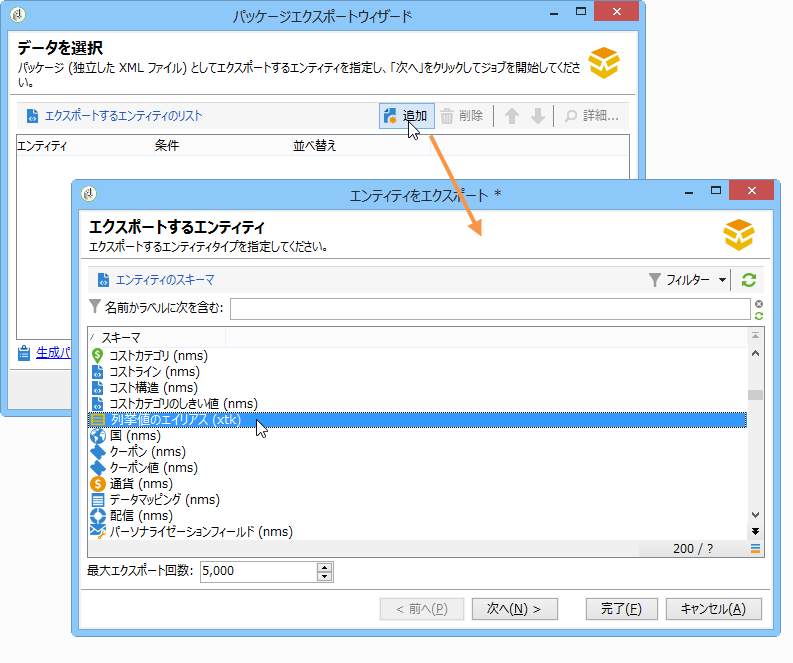

   >[!CAUTION]
   >
   >If you export an **[!UICONTROL Offer category]**, **[!UICONTROL Offer environment]**, **[!UICONTROL Program]** or **[!UICONTROL Plan]** type folder, don&#39;t ever select the **xtk:folder** as you may lose some data. フォルダーに対応するエンティティを選択します。nms:offerCategory **（オファーカテゴリ用）、** nms:offerEnv **（オファー環境用）、** nms:program（プログラム用）、 **nms:plan(プ****** ラン用)。

   リスト管理機能により、エクスポートの対象として設定に含めるエンティティを追加および削除できます。Click **[!UICONTROL Add]** to select a new entity.

   The **[!UICONTROL Detail]** button edits the selected configuration.

   >[!NOTE]
   >
   >エンティティのエクスポート処理の流れは、依存関係メカニズムによってコントロールされます。For more on this, refer to [Managing dependencies](#managing-dependencies).

1. エンティティ設定画面で、抽出するドキュメントのタイプに関するフィルタークエリを定義します。

   ここでは、データ抽出用のフィルタリング節を設定する必要があります。

   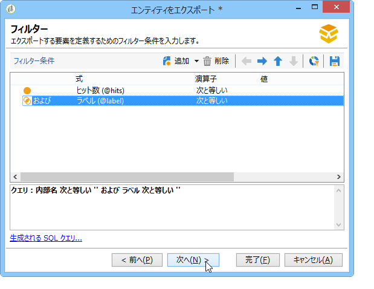

   >[!NOTE]
   >
   >Query Editor については、[この節](../../platform/using/about-queries-in-campaign.md)を参照してください。

1. Click **[!UICONTROL Next]** and select the sorting columns to order the data during extraction:

   

1. エクスポートを実行する前に、抽出するデータのプレビューを確認します。

   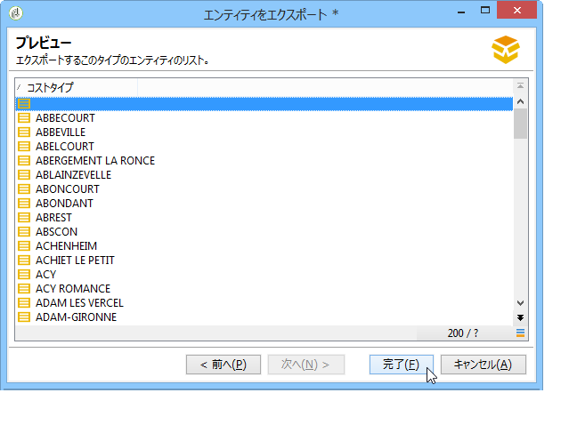

1. パッケージエクスポートウィザードの最終ページで、エクスポート処理を開始します。The data will be stored in the file indicated in the **[!UICONTROL File]** field.

   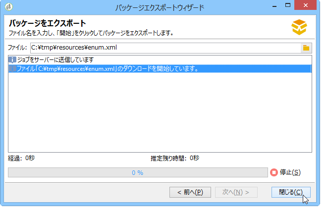

### 依存関係の管理 {#managing-dependencies}

Adobe Campaign のエクスポートメカニズムでは、エクスポートされる様々な要素間のリンクをトラッキングできます。

このメカニズムは次の 2 つのルールに基づいて機能します。

* リンクの整合性タイプ **own** または **owncopy** を使ってリンクされたオブジェクトは、エクスポート対象オブジェクトと同じパッケージに含めてエクスポートされます。
* リンクの整合性タイプ **neutral** または **define** を使ってリンク（定義リンク）されたオブジェクトは、別途エクスポートする必要があります。

>[!NOTE]
>
>スキーマ要素に関連付けられる整合性タイプの定義については、[この節](../../configuration/using/database-mapping.md#links--relation-between-tables)を参照してください。

#### キャンペーンのエクスポート {#exporting-a-campaign}

キャンペーンをエクスポートする方法の例を以下に示します。エクスポートするマーケティングキャンペーンにタスク(ラベル：&quot;MyTask&quot;)とワークフロー(ラベル：「CampaignWorkflow」)を「MyWorkflow」フォルダー(ノード：管理/実稼働/技術ワークフロー/キャンペーンプロセス/マイワークフロー)。

タスクとワークフローはキャンペーンと同じパッケージ内にエクスポートされます。これは、対応するスキーマが &quot;own&quot; 整合性タイプのリンクで結びつけられているからです。

パッケージの内容：

```
<?xml version='1.0'?>
<package author="Administrator (admin)" buildNumber="7974" buildVersion="6.1" img=""
label="" name="" namespace="" vendor="">
 <desc></desc>
 <version buildDate="2013-01-09 10:30:18.954Z"/>
 <entities schema="nms:operation">
  <operation duration="432000" end="2013-01-14" internalName="OP1" label="MyCampaign"
  modelName="opEmpty" start="2013-01-09">
   <controlGroup>
    <where filteringSchema=""/>
   </controlGroup>
   <seedList>
    <where filteringSchema="nms:seedMember"></where>
    <seedMember internalName="SDM1"></seedMember>
   </seedList>
   <parameter useAsset="1" useBudget="1" useControlGroup="1" useDeliveryOutline="1"
   useDocument="1" useFCPValidation="0" useSeedMember="1" useTask="1"
   useValidation="1" useWorkflow="1"></parameter>
   <fcpSeed>
    <where filteringSchema="nms:seedMember"></where>
   </fcpSeed>
   <owner _operation="none" name="admin" type="0"/>
   <program _operation="none" name="nmsOperations"/>
   <task end="2013-01-17 10:07:51.000Z" label="MyTask" name="TSK2" start="2013-01-16 10:07:51.000Z"
   status="1">
    <owner _operation="none" name="admin" type="0"/>
    <operation _operation="none" internalName="OP1"/>
    <folder _operation="none" name="nmsTask"/>
   </task>
   <workflow internalName="WKF12" label="CampaignWorkflow" modelName="newOpEmpty"
   order="8982" scenario-cs="Notification of the workflow supervisor (notifySupervisor)"
   schema="nms:recipient">
    <scenario internalName="notifySupervisor"/>
    <desc></desc>
    <folder _operation="none" name="Folder4"/>
    <operation _operation="none" internalName="OP1"/>
   </workflow>
  </operation>
 </entities>
</package>   
```

パッケージのタイプに対する所属関係は、スキーマ内では **@pkgAdmin および @pkgPlatform** 属性によって定義されています。どちらの属性にも、パッケージへの所属条件を定義する XTK 式が指定されます。

```
<element name="offerEnv" img="nms:offerEnv.png" 
template="xtk:folder" pkgAdmin="@id != 0">
```

最後に、**@pkgStatus** 属性は、これらの要素または属性に関するエクスポートルールの定義に使われます。この属性の値に応じて、該当する要素または属性はエクスポートされるパッケージに含まれます。この属性に指定できる値は次の 3 種類です。

* **never**：そのフィールドやリンクをエクスポートしない
* **always**：そのフィールドを必ずエクスポートする
* **preCreate**：リンクされたエンティティの作成を許可する

>[!NOTE]
>
>**preCreate** 値は、リンクタイプのイベントに対してのみ使用できます。この値を指定すると、エクスポートされるパッケージ内のまだロードされていないエンティティを参照するリンクを作成することが認められます。

## パッケージ定義の管理 {#managing-package-definitions}

### パッケージ定義について {#about-package-definitions}

パッケージ定義では、パッケージ構造を作成し、エンティティを追加してから、単一のパッケージにエクスポートできます。その後、このパッケージと追加されたすべてのエンティティを他の Campaign インスタンスにインポートできます。

**関連トピック：**

* [パッケージ定義の作成](#creating-a-package-definition)
* [パッケージ定義へのエンティティの追加](#adding-entities-to-a-package-definition)
* [パッケージ定義の生成に関する設定](#configuring-package-definitions-generation)
* [パッケージ定義からのパッケージのエクスポート](#exporting-packages-from-a-package-definition)

### パッケージ定義の作成 {#creating-a-package-definition}

パッケージ定義はメニューからアクセスで **[!UICONTROL Administration > Configuration > Package management > Package definitions]** きます。

To create a package definition, click the **[!UICONTROL New]** button, then fill in the package definition general information.

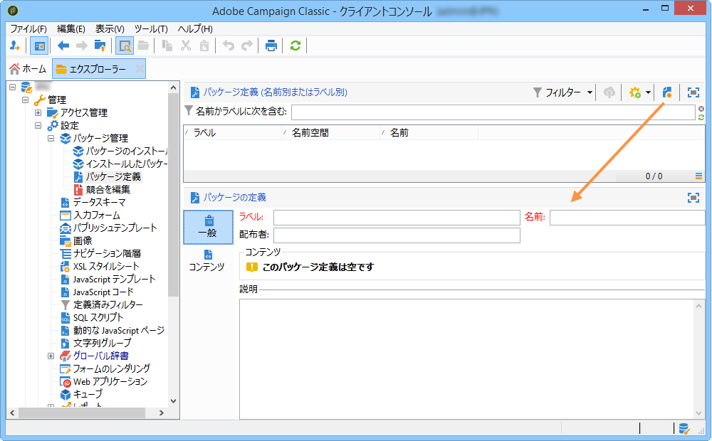

その後、パッケージ定義にエンティティを追加し、XML ファイルパッケージにエクスポートします。

**関連トピック：**

* [パッケージ定義へのエンティティの追加](#adding-entities-to-a-package-definition)
* [パッケージ定義の生成に関する設定](#configuring-package-definitions-generation)
* [パッケージ定義からのパッケージのエクスポート](#exporting-packages-from-a-package-definition)

### パッケージ定義へのエンティティの追加 {#adding-entities-to-a-package-definition}

In the **[!UICONTROL Content]** tab, click the **[!UICONTROL Add]** button to select the entities to export with the package. エンティティを選択する際のベストプラクティスは、「パッケージ内のオブ [ジェクトのセットの書き出し](#exporting-a-set-of-objects-in-a-package) 」の節に記載されています。

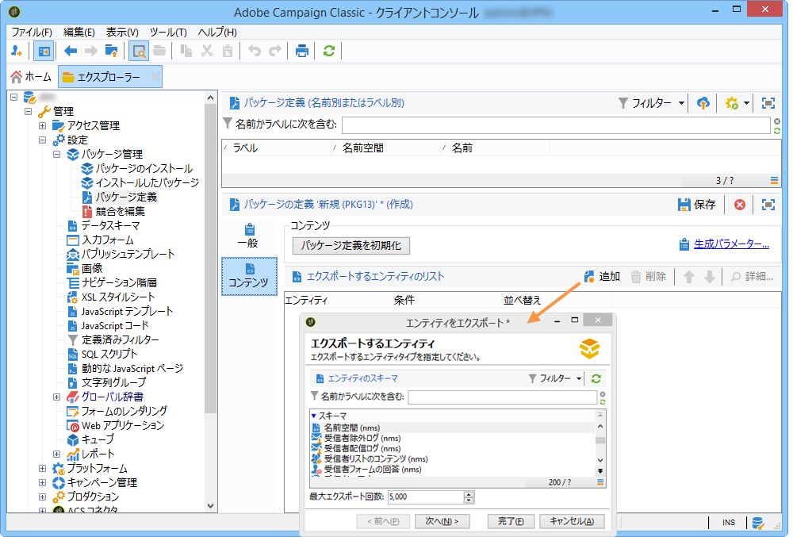

エンティティは、インスタンス内の場所から直接パッケージ定義に追加できます。これをおこなうには、以下の手順に従います。

1. 目的のエンティティを右クリックし、を選択しま **[!UICONTROL Actions > Export in a package]**&#x200B;す。

   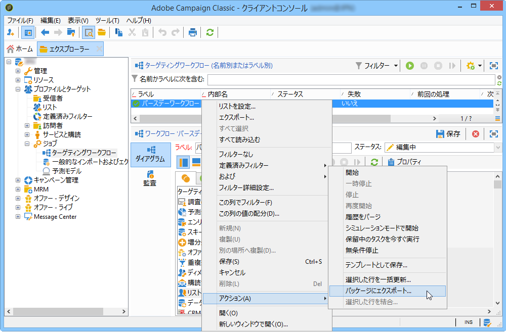

1. を選 **[!UICONTROL Add to a package definition]**&#x200B;択し、エンティティを追加するパッケージ定義を選択します。

   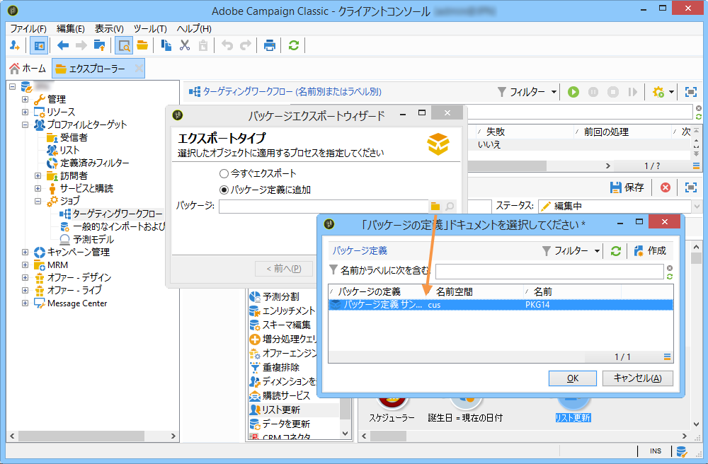

1. エンティティがパッケージ定義に追加され、パッケージと共にエクスポートされます(パッケージ定義 [からのパッケージのエクスポートを参照](#exporting-packages-from-a-package-definition))。

   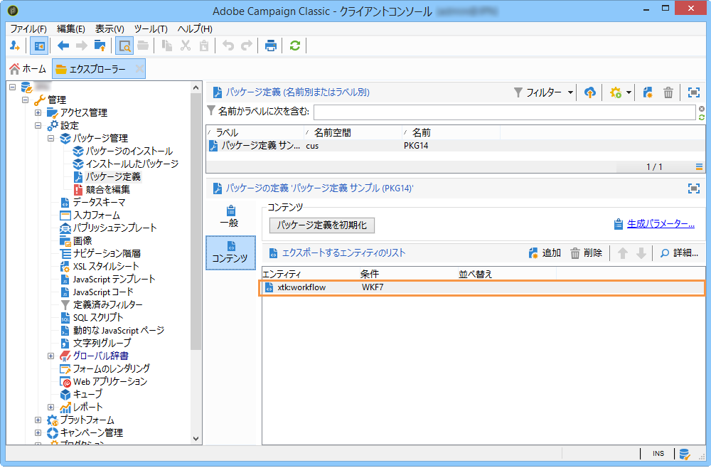

### パッケージ定義の生成に関する設定 {#configuring-package-definitions-generation}

Package generation can be configured from the package definition **[!UICONTROL Content]** tab. これを行うには、リンクをクリック **[!UICONTROL Generation parameters]** します。

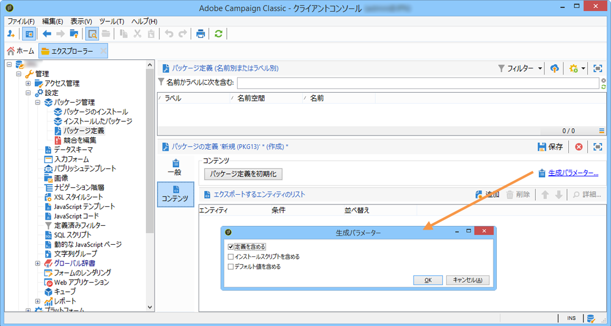

* **[!UICONTROL Include the definition]**:パッケージ定義で現在使用されている定義が含まれます。
* **[!UICONTROL Include an installation script]**:パッケージのインポート時に実行するJavaScriptスクリプトを追加できます。 When selected, a **[!UICONTROL Script]** tab is added in the package definition screen.
* **[!UICONTROL Include default values]**:すべてのエンティティの属性の値をパッケージに追加します。

   このオプションは、エクスポート内容が長くなりすぎないように、デフォルトでは選択されません。つまり、デフォルト値（スキーマで別途定義されていない場合の、空の文字列、「0」、「false」）を持つエンティティ属性はパッケージに追加されず、エクスポートもおこなわれません。

   >[!CAUTION]
   >
   >このオプションの選択を解除すると、ローカルのバージョンとインポートされたバージョンが結合されます。
   >
   >パッケージのインポート先のインスタンスに、パッケージと同じエンティティ（同じ外部 ID など）が含まれている場合は、そのエンティティの属性は更新されません。元のインスタンスにデフォルト値を持つ属性がある場合、それらがパッケージに含まれないので、こうしたことが起こります。
   >
   >In that case, selecting the **[!UICONTROL Include default values]** option would prevent versions merging, as all attributes from the former instance would be exported with the package.

### パッケージ定義からのパッケージのエクスポート {#exporting-packages-from-a-package-definition}

パッケージ定義からパッケージをエクスポートするには、以下の手順に従います。

1. 書き出すパッケージ定義を選択し、ボタンをクリッ **[!UICONTROL Actions]** クしてを選択しま **[!UICONTROL Export the package]**&#x200B;す。
1. エクスポートするパッケージに対応した XML ファイルがデフォルトで選択されます。パッケージ定義の名前空間と名前に基づいて名前が付けられます。
1. Once the package name and location defined, click the **[!UICONTROL Start]** button to launch the export.

   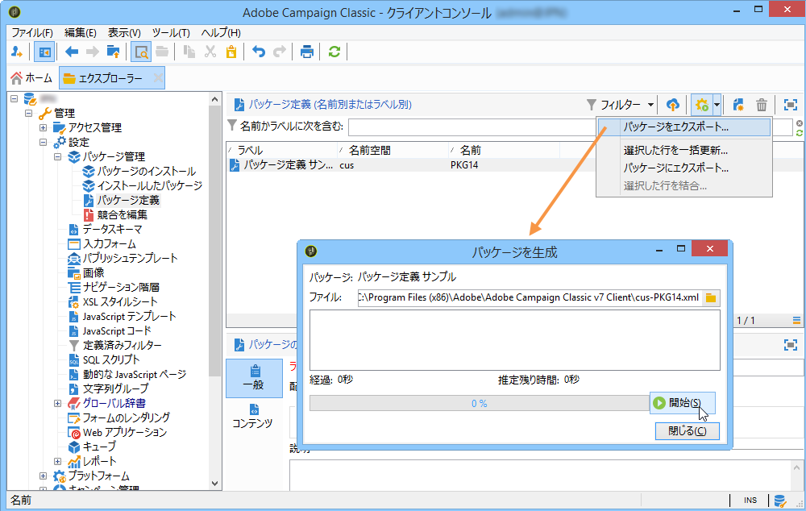

## パッケージのインポート {#importing-packages}

### パッケージのインポートについて {#about-package-import}

The package import wizard is accessible via the main menu **[!UICONTROL Tools > Advanced > Package import...]** of the Adobe Campaign client console.

事前に（例えば、別の Adobe Campaign インスタンスから）エクスポートしたパッケージをインポートするか、ライセンス条件によっては標準パッケージをインポートすることができます。

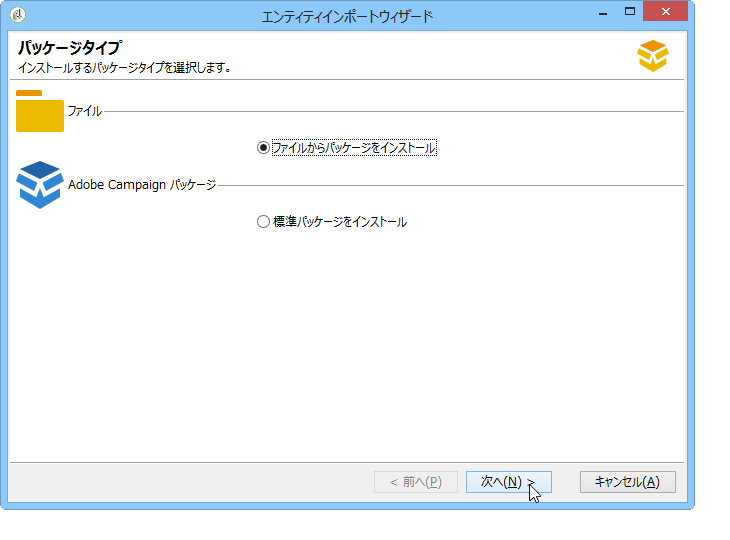

### ファイルからのパッケージインストール {#installing-a-package-from-a-file}

To import an existing data package, select the XML file and click **[!UICONTROL Open]**.

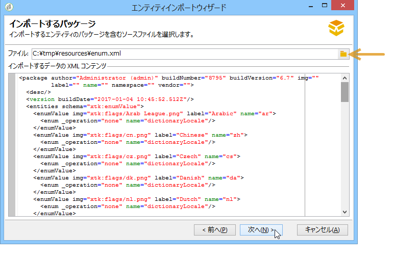

インポートされるパッケージの内容が、エディターの中央部セクションに表示されます。

とをクリ **[!UICONTROL Next]** ックし **[!UICONTROL Start]** てインポートを開始します。

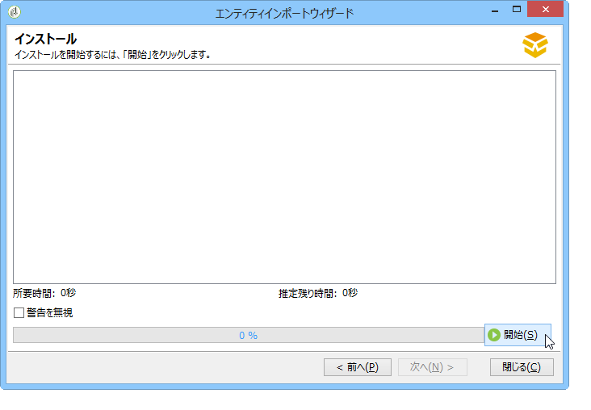

### 標準パッケージのインストール {#installing-a-standard-package}

標準パッケージは Adobe Campaign を設定するときにインストールされます。権限とデプロイメントモデルに応じて、新しいオプションやアドオンを入手する場合や、新しいオファーにアップグレードする場合に、新しい標準パッケージをインポートできます。

インストールできるパッケージを確認するには、ライセンス契約を参照してください。

標準パッケージについて詳しくは、[このページ](../../installation/using/installing-campaign-standard-packages.md)を参照してください。
