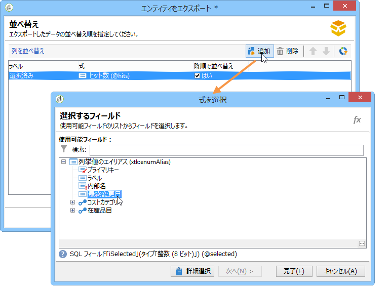

# データパッケージの使用{#working-with-data-packages}

## データパッケージについて {#about-data-packages}

Adobe Campaign では、パッケージシステムを通じて、プラットフォーム設定とデータをエクスポートまたはインポートできます。パッケージには、様々な種類の設定や要素を含めることができ、フィルターされている場合とそうでない場合があります。

データパッケージを使用すると、XML 形式のファイル経由で Adobe Campaign データベース内のエンティティを表示できます。パッケージに含まれる 1 つのエンティティは、それに該当するすべてのデータによって表現されます。

**データパッケージ**&#x200B;の原則とは、データの設定をエクスポートして別の Adobe Campaign システム内に組み込むことです。一貫性のあるデータパッケージセットの維持方法について詳しくは、[テクニカルノート](https://docs.campaign.adobe.com/doc/AC/en/technicalResources/Technotes/AdobeCampaign_How_to_maintain_a_consistent_set_of_data_packages.pdf)を参照してください。

### パッケージの種類 {#types-of-packages}

エクスポート可能なパッケージとしては、ユーザーパッケージ、プラットフォームパッケージ、管理パッケージの 3 種類があります。

* **ユーザーパッケージ**：エクスポートするエンティティのリストを選択できます。このタイプのパッケージでは、依存関係の管理とエラーの検証がおこなわれます。
* **プラットフォームパッケージ**：スキーマ、JavaScript コードなど、すべての付加的な技術リソースが含まれています（非標準）。

   

* **管理パッケージ**：テンプレート、ライブラリなど、すべての付加的なテンプレートやビジネスオブジェクトが含まれています（非標準）。

   

>[!CAUTION]
>
>**プラットフォーム**&#x200B;タイプと&#x200B;**管理**&#x200B;タイプのパッケージには、事前に定義された、エクスポートするエンティティのリストが含まれます。個々のエンティティは、作成したパッケージに含まれる事前定義のリソースを削除するためのフィルター条件にリンクされています。

## データ構造 {#data-structure}

1 つのデータパッケージは、**xrk:navtree** データスキーマの文法に準拠した 1 個の構造化 XML ドキュメントによって記述されます。

データパッケージの例：

```
<package>
  <entities schema="nms:recipient">
    <recipient email="john.smith@adobe.com" lastName="Smith" firstName="John">      
      <folder _operation="none" name="nmsRootFolder"/>      
      <company _operation="none" name="Adobe"/>
    </recipient>
  </entities>
  <entities schema="sfa:company">
    <company name="Adobe">
      location city="London" zipCode="W11 2BQ"/>
    </company>
  </entities>
</package>
```

XML ドキュメントの先頭と末尾には必ず **`<package>`** 要素を記述します。それに続くすべての **`<entities>`** 要素によって、データがドキュメントタイプ別に配置されます。

1 つの **`<entities>`** 要素には、その要素の **schema** 属性で指定されたデータスキーマの形式に基づくパッケージのデータが含まれます。

パッケージ内のデータには、例えば自動生成キー（**autopk** オプション）のような、ベース間の互換性がない内部キーが含まれていてはなりません。

この例では、&quot;folder&quot; リンクと &quot;company&quot; リンクが、宛先テーブル内のいわゆる &quot;ハイレベル&quot; キーで次のように置き換えられています。

```
<recipient>
  <folder _operation="none" name="nmsRootFolder"/>
  <company _operation="none" name="Adobe"/>
</recipient>
```

**`operation`** 属性の値が &quot;none&quot; であることが、紐付けリンクの定義であることを意味します。

データパッケージの作成は、任意のテキストエディターを使って手作業でおこなうことができます。ただし、XML ドキュメントの構造は常に &quot;xtk:navtree&quot; データスキーマに準拠している必要があります。Adobe Campaign コンソールには、データパッケージのエクスポートとインポートを実行できるモジュールがあります。

## パッケージのエクスポート {#exporting-packages}

### パッケージのエクスポートについて {#about-package-export}

パッケージは次の 3 つの方法でエクスポートできます。

* **[!UICONTROL パッケージエクスポートウィザード]**&#x200B;を使用して、単一のパッケージにオブジェクトセットをエクスポートできます。詳しくは、[パッケージでのオブジェクトセットのエクスポート](#exporting-a-set-of-objects-in-a-package)を参照してください。
* **単一のオブジェクト**&#x200B;を右クリックして、**[!UICONTROL アクション／パッケージにエクスポート]**&#x200B;を選択して、パッケージにエクスポートできます。
* **パッケージ定義**&#x200B;を使用して、パッケージ構造を作成し、オブジェクトを追加した後、パッケージにエクスポートできます。詳しくは、[パッケージ定義の管理](#managing-package-definitions)を参照してください。

パッケージをエクスポートした後、そのパッケージと追加されたエンティティを他の Campaign インスタンスにインポートすることもできます。

### パッケージでのオブジェクトセットのエクスポート {#exporting-a-set-of-objects-in-a-package}

Adobe Campaign クライアントコンソールの&#x200B;**[!UICONTROL ツール／詳細設定／パッケージをエクスポート]**&#x200B;メニューを選択すると、パッケージエクスポートウィザードにアクセスできます。


パッケージエクスポートウィザードでは、これら 3 種類のパッケージを以下に示す手順で扱います。

1. エクスポートの対象とするエンティティのリストをドキュメントタイプ別に表示します。

   

   >[!CAUTION]
   >
   >エクスポートの対象が&#x200B;**[!UICONTROL オファーカテゴリ]**、**[!UICONTROL オファー環境]**、**[!UICONTROL プログラム]**&#x200B;または&#x200B;**[!UICONTROL プラン]**&#x200B;タイプのフォルダーである場合は、**xtk:folder** を絶対に選択しないでください。選択するとデータの一部が失われることがあります。フォルダーに対応するエンティティ（オファーカテゴリには **nms:offerCategory**、オファー環境には **nms:offerEnv**、プログラムには **nms:program**、プランには **nms:plan**）を選択します。

   リスト管理機能により、エクスポートの対象として設定に含めるエンティティを追加および削除できます。新しいエンティティを追加するには「**[!UICONTROL 追加]**」をクリックします。

   「**[!UICONTROL 詳細]**」ボタンをクリックすると、選択されている設定内容を編集できます。

   >[!NOTE]
   >
   >エンティティのエクスポート処理の流れは、依存関係メカニズムによってコントロールされます。詳しくは、[依存関係の管理](#managing-dependencies)を参照してください。

1. エンティティ設定画面で、抽出するドキュメントのタイプに関するフィルタークエリを定義します。

   ここでは、データ抽出用のフィルタリング節を設定する必要があります。

   

   >[!NOTE]
   >
   >Query Editor については、[この節](../../platform/using/about-queries-in-campaign.md)を参照してください。

1. 「**[!UICONTROL 次へ]**」をクリックし、抽出処理時にデータの順序を決める並べ替え基準の列を選択します。

   

1. エクスポートを実行する前に、抽出するデータのプレビューを確認します。

   

1. パッケージエクスポートウィザードの最終ページで、エクスポート処理を開始します。「**[!UICONTROL ファイル]**」フィールドで指定されたファイルにデータが格納されます。

   

### 依存関係の管理 {#managing-dependencies}

Adobe Campaign のエクスポートメカニズムでは、エクスポートされる様々な要素間のリンクをトラッキングできます。

このメカニズムは次の 2 つのルールに基づいて機能します。

* リンクの整合性タイプ **own** または **owncopy** を使ってリンクされたオブジェクトは、エクスポート対象オブジェクトと同じパッケージに含めてエクスポートされます。
* リンクの整合性タイプ **neutral** または **define** を使ってリンク（定義リンク）されたオブジェクトは、別途エクスポートする必要があります。

>[!NOTE]
>
>スキーマ要素に関連付けられる整合性タイプの定義については、[この節](../../configuration/using/database-mapping.md#links--relation-between-tables)を参照してください。

#### キャンペーンのエクスポート {#exporting-a-campaign}

キャンペーンをエクスポートする方法の例を以下に示します。エクスポートするマーケティングキャンペーンには、「MyWorkflow」フォルダー（ノード：管理／プロダクション／テクニカルワークフロー／キャンペーンプロセス／MyWorkflow）内のタスク（ラベル：「MyTask」）およびワークフロー（ラベル：「CampaignWorkflow」）が含まれます。

タスクとワークフローはキャンペーンと同じパッケージ内にエクスポートされます。これは、対応するスキーマが &quot;own&quot; 整合性タイプのリンクで結びつけられているからです。

パッケージの内容：

```
<?xml version='1.0'?>
<package author="Administrator (admin)" buildNumber="7974" buildVersion="6.1" img=""
label="" name="" namespace="" vendor="">
 <desc></desc>
 <version buildDate="2013-01-09 10:30:18.954Z"/>
 <entities schema="nms:operation">
  <operation duration="432000" end="2013-01-14" internalName="OP1" label="MyCampaign"
  modelName="opEmpty" start="2013-01-09">
   <controlGroup>
    <where filteringSchema=""/>
   </controlGroup>
   <seedList>
    <where filteringSchema="nms:seedMember"></where>
    <seedMember internalName="SDM1"></seedMember>
   </seedList>
   <parameter useAsset="1" useBudget="1" useControlGroup="1" useDeliveryOutline="1"
   useDocument="1" useFCPValidation="0" useSeedMember="1" useTask="1"
   useValidation="1" useWorkflow="1"></parameter>
   <fcpSeed>
    <where filteringSchema="nms:seedMember"></where>
   </fcpSeed>
   <owner _operation="none" name="admin" type="0"/>
   <program _operation="none" name="nmsOperations"/>
   <task end="2013-01-17 10:07:51.000Z" label="MyTask" name="TSK2" start="2013-01-16 10:07:51.000Z"
   status="1">
    <owner _operation="none" name="admin" type="0"/>
    <operation _operation="none" internalName="OP1"/>
    <folder _operation="none" name="nmsTask"/>
   </task>
   <workflow internalName="WKF12" label="CampaignWorkflow" modelName="newOpEmpty"
   order="8982" scenario-cs="Notification of the workflow supervisor (notifySupervisor)"
   schema="nms:recipient">
    <scenario internalName="notifySupervisor"/>
    <desc></desc>
    <folder _operation="none" name="Folder4"/>
    <operation _operation="none" internalName="OP1"/>
   </workflow>
  </operation>
 </entities>
</package>   
```

パッケージのタイプに対する所属関係は、スキーマ内では **@pkgAdmin および @pkgPlatform** 属性によって定義されています。どちらの属性にも、パッケージへの所属条件を定義する XTK 式が指定されます。

```
<element name="offerEnv" img="nms:offerEnv.png" 
template="xtk:folder" pkgAdmin="@id != 0">
```

最後に、**@pkgStatus** 属性は、これらの要素または属性に関するエクスポートルールの定義に使われます。この属性の値に応じて、該当する要素または属性はエクスポートされるパッケージに含まれます。この属性に指定できる値は次の 3 種類です。

* **never**：そのフィールドやリンクをエクスポートしない
* **always**：そのフィールドを必ずエクスポートする
* **preCreate**：リンクされたエンティティの作成を許可する

>[!NOTE]
>
>**preCreate** 値は、リンクタイプのイベントに対してのみ使用できます。この値を指定すると、エクスポートされるパッケージ内のまだロードされていないエンティティを参照するリンクを作成することが認められます。

## パッケージ定義の管理 {#managing-package-definitions}

### パッケージ定義について {#about-package-definitions}

パッケージ定義では、パッケージ構造を作成し、エンティティを追加してから、単一のパッケージにエクスポートできます。その後、このパッケージと追加されたすべてのエンティティを他の Campaign インスタンスにインポートできます。

**関連トピック：**

* [パッケージ定義の作成](#creating-a-package-definition)
* [パッケージ定義へのエンティティの追加](#adding-entities-to-a-package-definition)
* [パッケージ定義の生成に関する設定](#configuring-package-definitions-generation)
* [パッケージ定義からのパッケージのエクスポート](#exporting-packages-from-a-package-definition)

### パッケージ定義の作成 {#creating-a-package-definition}

パッケージ定義には、**[!UICONTROL 管理／設定／パッケージ管理／パッケージ定義]**&#x200B;メニューからアクセスできます。

パッケージ定義を作成するには、「**[!UICONTROL 新規]**」ボタンをクリックし、パッケージ定義の一般情報を入力します。


その後、パッケージ定義にエンティティを追加し、XML ファイルパッケージにエクスポートします。

**関連トピック：**

* [パッケージ定義へのエンティティの追加](#adding-entities-to-a-package-definition)
* [パッケージ定義の生成に関する設定](#configuring-package-definitions-generation)
* [パッケージ定義からのパッケージのエクスポート](#exporting-packages-from-a-package-definition)

### パッケージ定義へのエンティティの追加 {#adding-entities-to-a-package-definition}

「**[!UICONTROL コンテンツ]**」タブで「**[!UICONTROL 追加]**」ボタンをクリックし、パッケージでエクスポートするエンティティを選択します。エンティティを選択する際のベストプラクティスは、[パッケージでのオブジェクトセットのエクスポート](#exporting-a-set-of-objects-in-a-package)の節で説明しています。


エンティティは、インスタンス内の場所から直接パッケージ定義に追加できます。これをおこなうには、以下の手順に従います。

1. 目的のエンティティを右クリックして、**[!UICONTROL アクション／パッケージにエクスポート]**&#x200B;を選択します。

   

1. **[!UICONTROL パッケージ定義に追加]**&#x200B;を選択し、エンティティを追加するパッケージ定義を選択します。

   

1. エンティティがパッケージ定義に追加され、パッケージと共にエクスポートされます（[パッケージ定義からのパッケージのエクスポート](#exporting-packages-from-a-package-definition)を参照）。

   

### パッケージ定義の生成に関する設定 {#configuring-package-definitions-generation}

パッケージの生成は、パッケージ定義の「**[!UICONTROL コンテンツ]**」タブで設定できます。設定をおこなうには、「**[!UICONTROL 生成パラメーター]**」リンクをクリックします。


* **[!UICONTROL 定義を含める]**：パッケージ定義で現在使用されている定義を含めます。
* **[!UICONTROL インストールスクリプトを含める]**：パッケージのインポート時に実行する JavaScript スクリプトを追加できます。選択すると、パッケージ定義画面に「**[!UICONTROL スクリプト]**」タブが表示されます。
* **[!UICONTROL デフォルト値を含める]**：すべてのエンティティ属性の値をパッケージに追加します。

   このオプションは、エクスポート内容が長くなりすぎないように、デフォルトでは選択されません。つまり、デフォルト値（スキーマで別途定義されていない場合の、空の文字列、「0」、「false」）を持つエンティティ属性はパッケージに追加されず、エクスポートもおこなわれません。

   >[!CAUTION]
   >
   >このオプションの選択を解除すると、ローカルのバージョンとインポートされたバージョンが結合されます。
   >
   >パッケージのインポート先のインスタンスに、パッケージと同じエンティティ（同じ外部 ID など）が含まれている場合は、そのエンティティの属性は更新されません。元のインスタンスにデフォルト値を持つ属性がある場合、それらがパッケージに含まれないので、こうしたことが起こります。
   >
   >この場合は「**[!UICONTROL デフォルト値を含める]**」オプションを選択すると、元のインスタンスからすべての属性がパッケージにエクスポートされるので、複数のバージョンが結合されることはありません。

### パッケージ定義からのパッケージのエクスポート {#exporting-packages-from-a-package-definition}

パッケージ定義からパッケージをエクスポートするには、以下の手順に従います。

1. エクスポートするパッケージ定義を選択し、「**[!UICONTROL アクション]**」ボタンをクリックし、「**[!UICONTROL パッケージをエクスポート]**」を選択します。
1. エクスポートするパッケージに対応した XML ファイルがデフォルトで選択されます。パッケージ定義の名前空間と名前に基づいて名前が付けられます。
1. パッケージ名と場所を定義したら、「**[!UICONTROL 開始]**」ボタンをクリックしてエクスポートを開始します。

   

## パッケージのインポート {#importing-packages}

### パッケージのインポートについて {#about-package-import}

Adobe Campaign クライアントコンソールの&#x200B;**[!UICONTROL ツール／詳細設定／パッケージインポート]**&#x200B;メニューを選択すると、パッケージインポートウィザードにアクセスできます。

事前に（例えば、別の Adobe Campaign インスタンスから）エクスポートしたパッケージをインポートするか、ライセンス条件によっては標準パッケージをインポートすることができます。


### ファイルからのパッケージインストール {#installing-a-package-from-a-file}

既存のデータパッケージをインポートするには、パッケージの XML ファイルを選択し、「**[!UICONTROL 開く]**」をクリックします。


インポートされるパッケージの内容が、エディターの中央部セクションに表示されます。

「**[!UICONTROL 次へ]**」、「**[!UICONTROL 開始]**」の順にクリックすると、インポートが開始されます。


### 標準パッケージのインストール {#installing-a-standard-package}

標準パッケージは Adobe Campaign を設定するときにインストールされます。権限とデプロイメントモデルに応じて、新しいオプションやアドオンを入手する場合や、新しいオファーにアップグレードする場合に、新しい標準パッケージをインポートできます。

インストールできるパッケージを確認するには、ライセンス契約を参照してください。

標準パッケージについて詳しくは、[このページ](../../installation/using/installing-campaign-standard-packages.md)を参照してください。
