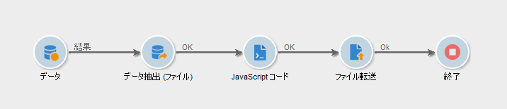
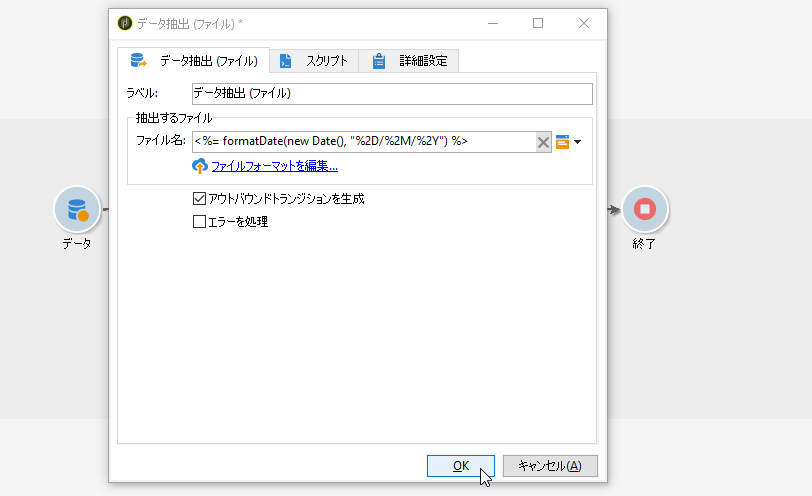
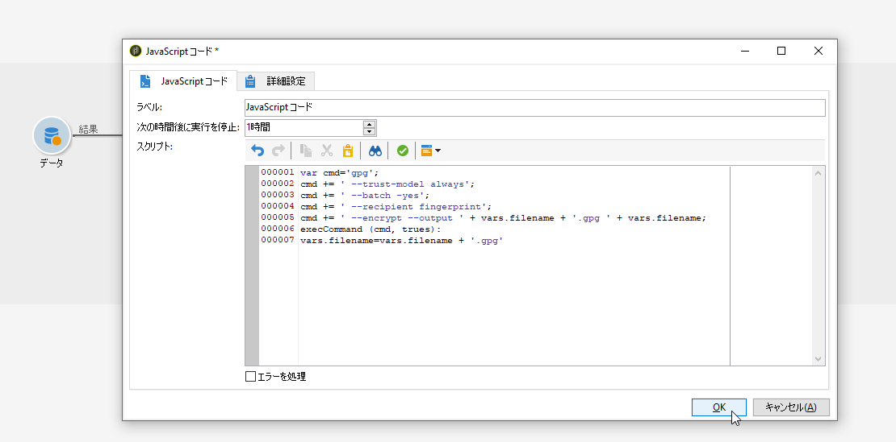
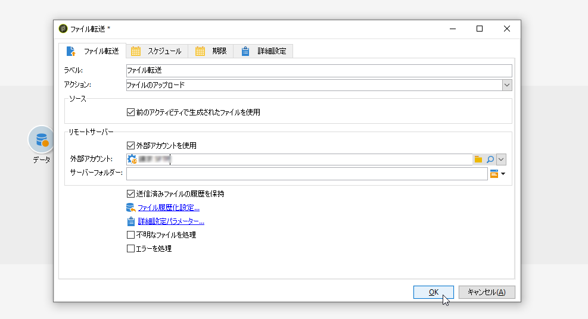

# ファイルの圧縮または暗号化 {#zipping-or-encrypting-a-file}

Adobe Campaign では、圧縮されたファイルや暗号化されたファイルをエクスポートできます。「**[!UICONTROL データ抽出（ファイル）]**」アクティビティを通じてエクスポートを定義する際にファイルを圧縮または暗号化する後処理を定義できます。

手順は以下のとおりです。

1. [Campaign コントロールパネル](https://docs.adobe.com/content/help/ja/control-panel/using/instances-settings/gpg-keys-management.html#encrypting-data)を使用して、インスタンスに GPG キーペアをインストールします。

   >[!NOTE]
   >
   >Campaign コントロールパネルは、AWS でホストされるすべてのお客様が利用できます（自分のマーケティングインスタンスをオンプレミスでホストするお客様を除く）。

1. インストールした Adobe Campaign がアドビでホストされている場合は、必要なユーティリティをサーバーにインストールするよう[アドビカスタマーケア](https://helpx.adobe.com/jp/enterprise/admin-guide.html/enterprise/using/support-for-experience-cloud.ug.html)に依頼します。
1. Adobe Campaign のインストールがオンプレミスの場合：使用するユーティリティ（例：GPG、GZIP）およびアプリケーションサーバー上の必要なキー（暗号化キー）をインストールします。

その後、アクティビティの「**[!UICONTROL スクリプト]**」タブまたは「**[!UICONTROL JavaScript コード]**」アクティビティでコマンドまたはコードを使用できます。例として、次のユースケースを示します。

**関連トピック：**

* [処理前のファイルの解凍または復号化](../../platform/using/unzip-decrypt.md)
* [データ抽出（ファイル）アクティビティ](../../workflow/using/extraction--file-.md)

## ユースケース：コントロールパネルにインストールされたキーを使用したデータの暗号化および書き出し {#use-case-gpg-encrypt}

このユースケースでは、Campaign コントロールパネルにインストールされたキーを使用してデータを暗号化およびエクスポートするためのワークフローを作成します。

 [この機能をビデオで確認](#video)

このユースケースを実行する手順は次のとおりです。

1. GPG ユーティリティを使用して GPG キーペア（公開鍵／秘密鍵）を生成し、公開キーを Campaign コントロールパネルにインストールします。詳細な手順については、[Campaign コントロールパネルのドキュメント](https://docs.adobe.com/content/help/ja-JP/control-panel/using/instances-settings/gpg-keys-management.html#encrypting-data)を参照してください。

1. Campaign Classic で、データをエクスポートするワークフローを作成し、Campaign コントロールパネル経由でインストールされた秘密鍵を使用してデータを暗号化します。これをおこなうには、次のようにワークフローを作成します。

   

   * **[!UICONTROL クエリ]**&#x200B;アクティビティ：この例では、クエリを実行して、エクスポートするデータをデータベースから選択します。
   * **[!UICONTROL データ抽出（ファイル）]**&#x200B;アクティビティ:データをファイルに抽出します。
   * **[!UICONTROL JavaScript コード]**&#x200B;アクティビティ:抽出するデータを暗号化します。
   * **[!UICONTROL ファイル転送]**&#x200B;アクティビティ：データを外部ソース（この例では SFTP サーバー）に送信します。

1. **[!UICONTROL クエリ]**&#x200B;アクティビティを設定して、目的のデータをデータベースから選択します。詳しくは、[この節](../../workflow/using/query.md)を参照してください。

1. データ&#x200B;**[!UICONTROL 抽出（ファイル）]**&#x200B;アクティビティを開き、必要に応じて設定します。アクティビティの設定方法に関するグローバルな概念については、[こちら](../../workflow/using/extraction--file-.md)を参照してください。

   

1. **[!UICONTROL JavaScript コード]**&#x200B;アクティビティを開き、次のコマンドをコピー＆ペーストして、抽出するデータを暗号化します。

   >[!IMPORTANT]
   >
   >コマンドの&#x200B;**フィンガープリント**&#x200B;の値を、Campaign コントロールパネルにインストールされた公開鍵のフィンガープリントに置き換えてください。

   ```
   var cmd='gpg ';
   cmd += ' --trust-model always';
   cmd += ' --batch --yes';
   cmd += ' --recipient fingerprint';
   cmd += ' --encrypt --output ' + vars.filename + '.gpg ' + vars.filename;
   execCommand(cmd,true);
   vars.filename=vars.filename + '.gpg'
   ```

   

1. **[!UICONTROL ファイル転送]**&#x200B;アクティビティを開き、ファイルの送信先の SFTP サーバーを指定します。アクティビティの設定方法に関するグローバルな概念については、[こちら](../../workflow/using/file-transfer.md)を参照してください。

   

1. これで、ワークフローを開始できます。ワークフローを実行すると、クエリで選択された対象データが、暗号化された .gpg ファイルにエクスポートされ、SFTP サーバーに転送されます。

## チュートリアルビデオ {#video}

このビデオでは、GPG キーを使用してデータを暗号化する方法について説明します。

>[!VIDEO](https://video.tv.adobe.com/v/36399?quality=12)

Campaign Classic に関するその他のハウツービデオは[こちら](https://experienceleague.adobe.com/docs/campaign-classic-learn/tutorials/overview.html?lang=ja)で参照できます。
