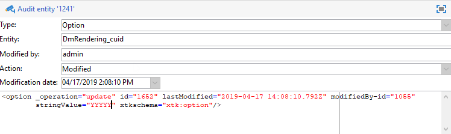

# 監査記録{#audit-trail}

Adobe Campaignでは、 **[!UICONTROL 監査証跡]** では、インスタンス内でおこなわれた変更の完全な履歴にアクセスできます。

**[!UICONTROL 監査記録を使用すると、Adobe Campaign のインスタンス内で発生するアクションとイベントの包括的なリストをリアルタイムで記録できます。]**&#x200B;これには、データの履歴を確認することにより、ワークフローで発生した事象、ワークフローの最終更新者、インスタンス内でユーザーが行った操作などを知るのに役立つセルフサービス式の方法が含まれています。

>[!NOTE]
>
>Adobe Campaignは、ユーザー権限、テンプレート、パーソナライゼーションまたはキャンペーンでおこなわれた変更を監査しません。\
>監査記録は、インスタンスの管理者のみが管理できます。

監査証跡は、次の 3 つのコンポーネントで構成されます。

* **スキーマ監査証跡**：アクティビティおよびスキーマに対する最後の変更を確認します。

  スキーマについて詳しくは、 [ページ](../../configuration/using/data-schemas.md).

* **ワークフロー監査証跡**：アクティビティおよびワークフローに対する最後の変更、さらに次のようなワークフローの状態を確認します。

   * 開始
   * 一時停止
   * 停止
   * 再度開始
   * クリーンアップ アクション「履歴をパージ」と等しい
   * アクションと等しいシミュレーションシミュレーションモードで開始
   * アクションと等しいウェイクアップ保留中のタスクを今すぐ実行
   * 無条件停止

  ワークフローについて詳しくは、 [ページ](../../workflow/using/about-workflows.md).

  ワークフローの監視方法について詳しくは、 [専用セクション](../../workflow/using/monitoring-workflow-execution.md).

* **オプション監査証跡**：アクティビティおよびオプションに対する最後の変更を確認します。

  オプションについて詳しくは、 [ページ](../../installation/using/configuring-campaign-options.md).

## 監査証跡へのアクセス {#accessing-audit-trail}

インスタンスの **[!UICONTROL 監査証跡]** :

1. 次にアクセス： **[!UICONTROL エクスプローラ]** メニューに表示されます。
1. の下 **[!UICONTROL 管理]** メニュー、選択 **[!UICONTROL 監査]** .

   

1. The **[!UICONTROL 監査証跡]** ウィンドウが開き、エンティティのリストが表示されます。 Adobe Campaignは、ワークフロー、オプションおよびスキーマの作成、編集および削除アクションに対する監査を実施します。

   エンティティを 1 つ選択して、最後の変更の詳細を確認します。

   

1. The **[!UICONTROL エンティティを監査]** ウィンドウには、選択したエンティティに関するより詳細な情報が表示されます。次に例を示します。

   * **[!UICONTROL タイプ]** ：ワークフロー、オプション、またはスキーマ。
   * **[!UICONTROL エンティティ]** ：アクティビティの内部名。
   * **[!UICONTROL 変更者]** ：このエンティティを最後に変更した人のユーザー名。
   * **[!UICONTROL アクション]** ：このエンティティに対して実行された最後のアクション（作成済み、編集済みまたは削除済み）。
   * **[!UICONTROL 変更日]** ：このエンティティで最後に実行されたアクションの日付。

   コードブロックには、エンティティ内での変更内容に関する詳細情報が表示されます。

   

>[!NOTE]
>
>デフォルトでは、のリテンション期間は 180 日に設定されています。 **[!UICONTROL 監査ログ]** . リテンション期間の変更方法について詳しくは、次を参照してください： [ページ](../../production/using/database-cleanup-workflow.md#deployment-wizard).

## 監査証跡を有効/無効にする {#enable-disable-audit-trail}

例えば、データベースの領域を保存する場合など、特定のアクティビティに対して監査記録を簡単にアクティブ化または非アクティブ化できます。

それには、次の手順に従います。

1. 次にアクセス： **[!UICONTROL エクスプローラ]** メニューに表示されます。
1. の下 **[!UICONTROL 管理]** メニュー、選択 **[!UICONTROL Platform]** その後 **[!UICONTROL オプション]** .

   

1. アクティブ化/非アクティブ化するエンティティに応じて、次のいずれかのオプションを選択します。

   * ワークフローの場合： **[!UICONTROL XtkAudit_Workflows]**
   * スキーマの場合： **[!UICONTROL XtkAudit_DataSchema]**
   * オプションの場合： **[!UICONTROL XtkAudit_Option]**
   * すべてのエンティティに対して： **[!UICONTROL XtkAudit_Enable_All]**

   

1. 次を変更： **[!UICONTROL 値]** エンティティを有効にする場合は 1 に、無効にする場合は 0 に設定します。

   

1. 「**[!UICONTROL 保存]**」をクリックします。
