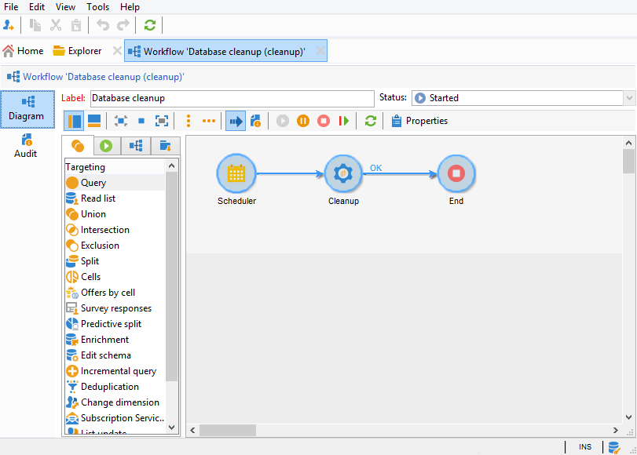
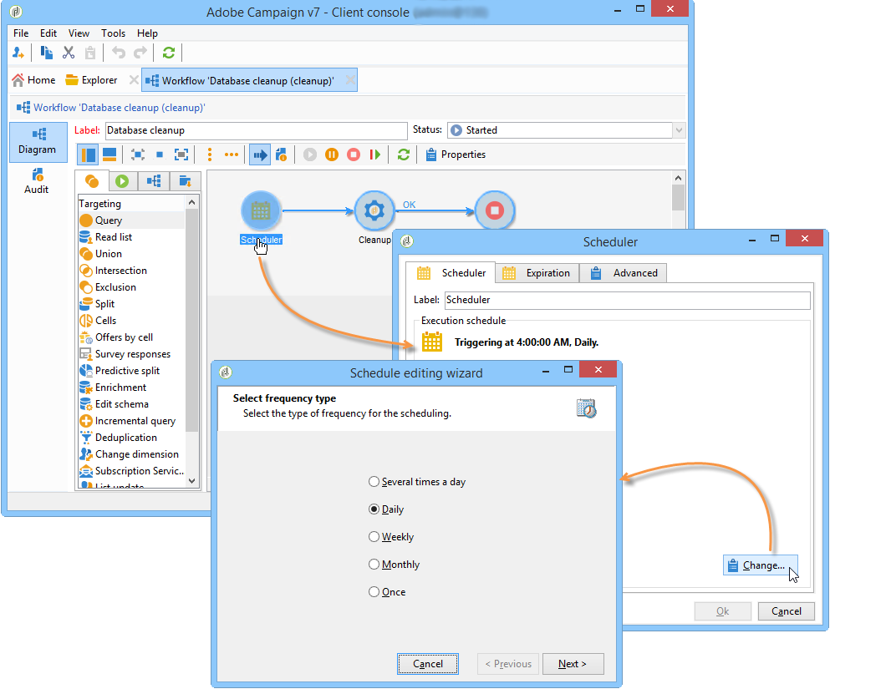
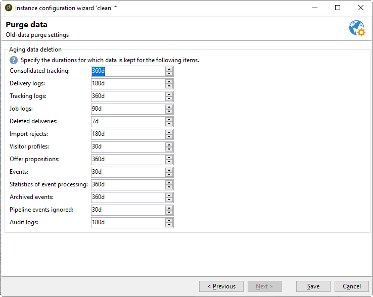

# データベースクリーンアップのワークフロー{#database-cleanup-workflow}


## はじめに {#introduction}

**[!UICONTROL 管理／プロダクション／テクニカルワークフロー]**&#x200B;ノードからアクセスできる&#x200B;**[!UICONTROL データベースクリーンアップ]**&#x200B;ワークフローを使用すると、古いデータを削除して、データベースの急激な増加を回避できます。 ワークフローは、ユーザーの操作なしで自動的にトリガーされます。



## 設定 {#configuration}

データベースのクリーンアップは、ワークフロースケジューラーとデプロイメントウィザードの2つのレベルで設定されます。

### ワークフロースケジューラー {#the-scheduler}

>[!NOTE]
>
>スケジューラーについて詳しくは、[Campaign v8 ドキュメント &#x200B;](https://experienceleague.adobe.com/docs/campaign/automation/workflows/wf-activities/flow-control-activities/scheduler.html?lang=ja){target="_blank"}を参照してください。

デフォルトでは、**[!UICONTROL データベースクリーンアップ]** ワークフローは、毎日4時に開始するように設定されています。 スケジューラーを使用すると、ワークフローのトリガー頻度を変更できます。 次の周波数を使用できます。

* **[!UICONTROL 1日に数回]**
* **[!UICONTROL 日別]**
* **[!UICONTROL 週単位]**
* **[!UICONTROL 1回]**



>[!IMPORTANT]
>
>**[!UICONTROL データベースのクリーンアップ]** ワークフローをスケジューラーで定義された日時に開始するには、ワークフローエンジン （wfserver）を開始する必要があります。

### デプロイメントウィザード {#deployment-assistant}

**[!UICONTROL デプロイメントウィザード]**&#x200B;は、**[!UICONTROL ツール/詳細]** メニューからアクセスでき、データの保存期間を設定できます。 値は日数で表されます。 これらの値が変更されない場合、ワークフローはデフォルト値を使用します。



データのパージ **ウィンドウの** フィールドは、次のオプションと一致しています。 これらは、**[!UICONTROL データベース クリーンアップ]** ワークフローによって実行される一部のタスクで使用されます。

* 統合トラッキング：**NmsCleanup_TrackingStatPurgeDelay** （[&#x200B; トラッキングログのクリーンアップ &#x200B;](#cleanup-of-tracking-logs)を参照）
* 配信ログ：**NmsCleanup_BroadLogPurgeDelay** （[配信ログのクリーンアップ &#x200B;](#cleanup-of-delivery-logs)を参照）
* トラッキングログ：**NmsCleanup_TrackingLogPurgeDelay** （[&#x200B; トラッキングログのクリーンアップ &#x200B;](#cleanup-of-tracking-logs)を参照）
* 削除された配信：**NmsCleanup_RecycledDeliveryPurgeDelay** （[削除またはリサイクルされる配信のクリーンアップ &#x200B;](#cleanup-of-deliveries-to-be-deleted-or-recycled)を参照）
* 拒否の読み込み：**NmsCleanup_RejectsPurgeDelay** （[imports](#cleanup-of-rejects-generated-by-imports-)によって生成された拒否のクリーンアップを参照）
* 訪問者プロファイル：**NmsCleanup_VisitorPurgeDelay** （[訪問者のクリーンアップ &#x200B;](#cleanup-of-visitors)を参照）
* オファーの提案：**NmsCleanup_PropositionPurgeDelay** （[提案のクリーンアップ &#x200B;](#cleanup-of-propositions)を参照）

  >[!NOTE]
  >
  >**[!UICONTROL オファー提案]** フィールドは、**インタラクション** モジュールがインストールされている場合にのみ使用できます。

* イベント：**NmsCleanup_EventPurgeDelay** （[期限切れイベントのクレンジング &#x200B;](#cleansing-expired-events)を参照）
* アーカイブされたイベント：**NmsCleanup_EventHistoPurgeDelay** （[期限切れイベントのクレンジング &#x200B;](#cleansing-expired-events)を参照）

  >[!NOTE]
  >
  >**[!UICONTROL イベント]**&#x200B;および&#x200B;**[!UICONTROL アーカイブ済みイベント]** フィールドは、**Message Center** モジュールがインストールされている場合にのみ使用できます。

* 監査記録：**XtkCleanup_AuditTrailPurgeDelay** （[監査記録のクリーンアップ &#x200B;](#cleanup-of-audit-trail)を参照）

**[!UICONTROL データベースクリーンアップ]** ワークフローによって実行されるすべてのタスクについては、次の節で説明します。

## データベースのクリーンアップワークフローによって実行されるタスク {#tasks-carried-out-by-the-database-cleanup-workflow}

ワークフロースケジューラーで定義された日時（[&#x200B; スケジューラー](#the-scheduler)を参照）に、ワークフローエンジンはデータベースのクリーンアッププロセスを開始します。 データベースのクリーンアップはデータベースに接続し、以下に示す順序でタスクを実行します。

>[!IMPORTANT]
>
>これらのタスクのいずれかが失敗した場合、次のタスクは実行されません。
>
>**LIMIT**&#x200B;属性を持つSQL クエリは、すべての情報が処理されるまで繰り返し実行されます。


### クリーンアップを削除するリスト {#lists-to-delete-cleanup}

**[!UICONTROL データベース クリーンアップ]** ワークフローによって実行された最初のタスクは、**deleteStatus != 0**&#x200B;属性を持つすべてのグループを&#x200B;**NmsGroup**&#x200B;から削除します。 これらのグループにリンクされ、他のテーブルに存在するレコードも削除されます。

1. 削除するリストは、次のSQL クエリを使用して復元されます。

   ```sql
   SELECT iGroupId, sLabel, iType FROM NmsGroup WHERE iDeleteStatus <> 0 OR tsExpirationDate <= GetDate() 
   ```

1. 各リストには、他のテーブルへのリンクがいくつかあります。 これらのリンクはすべて、次のクエリを使用して一括で削除されます。

   ```sql
   DELETE FROM $(relatedTable) WHERE iGroupId=$(l) IN (SELECT iGroupId FROM $(relatedTable) WHERE iGroupId=$(l) LIMIT 5000) 
   ```

   `$(relatedTable)`は&#x200B;**NmsGroup**&#x200B;に関連するテーブルで、`$(l)`はリスト識別子です。

1. リストが「リスト」タイプのリストの場合、関連するテーブルは次のクエリを使用して削除されます。

   ```sql
   DROP TABLE grp$(l)
   ```

1. 操作によって復元された&#x200B;**Select**&#x200B;型リストは、次のクエリを使用して削除されます。

   ```sql
   DELETE FROM NmsGroup WHERE iGroupId=$(l) 
   ```

   ここで、`$(l)`はリスト識別子です

### 削除またはリサイクルする配信のクリーンアップ {#cleanup-of-deliveries-to-be-deleted-or-recycled}

このタスクは、削除またはリサイクルされるすべての配信をパージします。

1. **[!UICONTROL データベースのクリーンアップ]** ワークフローでは、**deleteStatus** フィールドの値&#x200B;**[!UICONTROL Yes]**&#x200B;または&#x200B;**[!UICONTROL Recycled]**&#x200B;が設定され、削除日がデプロイメントウィザードの&#x200B;**[!UICONTROL 削除済み配信]** （**NmsCleanup_RecycledDeliveryPurgeDelay**）フィールドで定義された期間より前の配信をすべて選択します。 詳しくは、[&#x200B; デプロイメントウィザード &#x200B;](#deployment-assistant)を参照してください。 この期間は、現在のサーバーの日付に関連して計算されます。
1. ミッドソーシングサーバーごとに、タスクは削除する配信のリストを選択します。
1. **[!UICONTROL データベース クリーンアップ]** ワークフローは、配信ログ、添付ファイル、ミラーページ情報およびその他すべての関連データを削除します。
1. 配信を削除する前に、ワークフローはリンクされた情報を次のテーブルから消去します。

   * 配信除外テーブル （**NmsDlvExclusion**）では、次のクエリが使用されます。

     ```sql
     DELETE FROM NmsDlvExclusion WHERE iDeliveryId=$(l)
     ```

     ここで、**$（l）**&#x200B;は配信の識別子です。

   * クーポンテーブル （**NmsCouponValue**）では、次のクエリが使用されます（一括削除を含む）。

     ```sql
     DELETE FROM NmsCouponValue WHERE iMessageId IN (SELECT iMessageId FROM NmsCouponValue WHERE EXISTS (SELECT B.iBroadLogId FROM $(BroadLogTableName) B WHERE B.iDeliveryId = $(l) AND B.iBroadLogId = iMessageId ) LIMIT 5000)
     ```

     ここで、`$(l)`は配信の識別子です。

   * 配信ログテーブル （**NmsBroadlogXxx**）では、一括削除が20,000 レコードのバッチで実行されます。
   * オファー提案テーブル （**NmsPropositionXxx**）では、一括削除が20,000 レコードのバッチで実行されます。
   * トラッキングログテーブル （**NmsTrackinglogXxx**）では、一括削除が20,000 レコードのバッチで実行されます。
   * 配信フラグメントテーブル （**NmsDeliveryPart**）では、一括削除が500,000 レコードのバッチで実行されます。 このテーブルには、配信する残りのメッセージに関するパーソナライゼーション情報が含まれています。
   * ミラーページのデータフラグメントテーブル （**NmsMirrorPageInfo**）では、期限切れの配信部分と完了またはキャンセル済みの配信部分に対して、20,000 レコードの一括削除が実行されます。 この表には、ミラーページの生成に使用されるすべてのメッセージに関するパーソナライゼーション情報が含まれています。
   * ミラーページ検索テーブル （**NmsMirrorPageSearch**）では、一括削除が20,000 レコードのバッチで実行されます。 このテーブルは、**NmsMirrorPageInfo** テーブルに保存されているパーソナライゼーション情報へのアクセスを提供する検索インデックスです。
   * バッチプロセスログテーブル （**XtkJobLog**）では、一括削除が20,000 レコードのバッチで実行されます。 このテーブルには、削除する配信のログが含まれます。
   * 配信URL トラッキングテーブル （**NmsTrackingUrl**）では、次のクエリが使用されます。

     ```sql
     DELETE FROM NmsTrackingUrl WHERE iDeliveryId=$(l)
     ```

     ここで、`$(l)`は配信の識別子です。

     このテーブルには、トラッキングを有効にするために削除される配信に見つかったURLが含まれています。

1. 配信が配信テーブル （**NmsDelivery**）から削除されます。

   ```sql
   DELETE FROM NmsDelivery WHERE iDeliveryId = $(l)
   ```

   ここで、`$(l)`は配信の識別子です。

#### ミッドソーシングを使用した配信 {#deliveries-using-mid-sourcing}

**[!UICONTROL データベースのクリーンアップ]** ワークフローでは、ミッドソーシングサーバー上の配信も削除されます。

1. これを行うには、ワークフローは各配信が（ステータスに基づいて）非アクティブであることを確認します。 配信がアクティブな場合、削除される前に停止されます。 チェックは、次のクエリを実行して実行します。

   ```sql
   SELECT iState FROM NmsDelivery WHERE iDeliveryId = $(l) AND iState <> 100;
   ```

   ここで、**$（l）**&#x200B;は配信の識別子です。

1. ステータスの値が&#x200B;**[!UICONTROL Start pending]**、**[!UICONTROL In progress]**、**[!UICONTROL Recovery pending]**、**[!UICONTROL Recovery in progress]**、**[!UICONTROL Pause requested]**、**[!UICONTROL Pause in progress]**、または&#x200B;**[!UICONTROL Paused]** （値51、55、61、62、71、72、75）の場合、配信は停止され、タスクはリンクされた情報をパージします。

### 期限切れの配信のクリーンアップ {#cleanup-of-expired-deliveries}

このタスクは、有効期限が切れた配信を停止します。

1. **[!UICONTROL データベースのクリーンアップ]** ワークフローは、有効期限が切れた配信のリストを作成します。 このリストには、**[!UICONTROL Finished]**&#x200B;以外のステータスを持つ期限切れの配信と、最近停止した配信のうち、10,000件を超える未処理メッセージが含まれています。 次のクエリが使用されます。

   ```sql
   SELECT iDeliveryId, iState FROM NmsDelivery WHERE iDeleteStatus=0 AND iIsModel=0 AND iDeliveryMode=1 AND ( (iState >= 51 AND iState < 85 AND tsValidity IS NOT NULL AND tsValidity < $(currentDate) ) OR (iState = 85 AND DateMinusDays(15) < tsLastModified AND iToDeliver - iProcessed >= 10000 ))
   ```

   `delivery mode 1`が&#x200B;**[!UICONTROL 大量配信]** モードに一致し、`state 51`が&#x200B;**[!UICONTROL 保留開始]**&#x200B;状態に一致し、`state 85`が&#x200B;**[!UICONTROL 停止済み]**&#x200B;状態に一致し、配信サーバーで一括更新された配信ログの最大数が10,000に等しくなります。

1. ワークフローには、ミッドソーシングを使用する最近期限切れになった配信のリストが含まれます。 ミッドソーシングサーバーを介して配信ログがまだ復元されていない配信は除外されます。

   次のクエリが使用されます。

   ```sql
   SELECT iDeliveryId, tsValidity, iMidRemoteId, mData FROM NmsDelivery WHERE (iDeliveryMode = 4 AND (iState = 85 OR iState = 95) AND tsValidity IS NOT NULL AND (tsValidity < SubDays(GetDate() , 15) OR tsValidity < $(DateOfLastLogPullUp)) AND tsLastModified > SubDays(GetDate() , 15))
   ```

1. 次のクエリは、日付で配信をフィルタリングするために、外部アカウントがアクティブかどうかを検出するために使用されます。

   ```sql
   SELECT iExtAccountId FROM NmsExtAccount WHERE iActive<>0 AND sName=$(providerName)
   ```

1. 期限切れの配信のリストで、ステータスが&#x200B;**[!UICONTROL 保留中]**&#x200B;で、**[!UICONTROL 配信がキャンセルされました]**&#x200B;に切り替え、このリスト内のすべての配信が&#x200B;**[!UICONTROL 完了]**&#x200B;に切り替わります。

   次のクエリが使用されます。

   ```sql
   UPDATE $(BroadLogTableName) SET tsLastModified=$(curdate), iStatus=7, iMsgId=$(bl) WHERE iDeliveryId=$(dl) AND iStatus=6
   ```

   `$(curdate)`はデータベースサーバーの現在の日付、`$(bl)`は配信ログメッセージの識別子、`$(dl)`は配信の識別子、`delivery status 6`は&#x200B;**[!UICONTROL 保留中]**&#x200B;のステータス、`delivery status 7`は&#x200B;**[!UICONTROL 配信がキャンセル済み]**&#x200B;のステータスに一致します。

   ```sql
   UPDATE NmsDelivery SET iState = 95, tsLastModified = $(curdate), tsBroadEnd = tsValidity WHERE iDeliveryId = $(dl)
   ```

   ここで、`delivery state 95`は&#x200B;**[!UICONTROL Finished]** ステータスと一致し、`$(dl)`は配信の識別子です。

1. 古い配信のすべてのフラグメント （**deliveryParts**）が削除され、進行中の通知配信のすべての古いフラグメントが削除されます。 これらの両方のタスクには一括削除が使用されます。

   次のクエリが使用されます。

   ```sql
   DELETE FROM NmsDeliveryPart WHERE iDeliveryPartId IN (SELECT iDeliveryPartId FROM NmsDeliveryPart WHERE iDeliveryId IN (SELECT iDeliveryId FROM NmsDelivery WHERE iState=95 OR iState=85) LIMIT 5000)
   ```

   ```sql
   DELETE FROM NmsDeliveryPart WHERE iDeliveryPartId IN (SELECT iDeliveryPartId FROM NmsDeliveryPart WHERE tsValidity < $(curDate) LIMIT 500000)
   ```

   `delivery state 95`は&#x200B;**[!UICONTROL Finished]** ステータスに、`delivery state 85`は&#x200B;**[!UICONTROL Stopped]** ステータスに一致し、`$(curDate)`は現在のサーバー日付です。

### ミラーページのクリーンアップ {#cleanup-of-mirror-pages}

このタスクは、配信で使用されるweb リソース（ミラーページ）を削除します。

1. まず、次のクエリを使用して、パージする配信のリストを復元します。

   ```sql
   SELECT iDeliveryId, iNeedMirrorPage FROM NmsDelivery WHERE iWebResPurged = 0 AND tsWebValidity IS NOT NULL AND tsWebValidity < $(curdate)
   ```

   ここで、`$(curDate)`は現在のサーバー日付です。

1. **NmsMirrorPageInfo** テーブルは、以前に復元した配信の識別子を使用して必要に応じてパージされます。 一括削除を使用して、次のクエリを生成します。

   ```sql
   DELETE FROM NmsMirrorPageInfo WHERE iMirrorPageInfoId IN (SELECT iMirrorPageInfoId FROM NmsMirrorPageInfo WHERE iDeliveryId = $(dl)) LIMIT 5000
   ```

   ```sql
   DELETE FROM NmsMirrorPageSearch WHERE iMessageId IN (SELECT iMessageId FROM NmsMirrorPageSearch WHERE iDeliveryId = $(dl)) LIMIT 5000
   ```

   ここで、`$(dl)`は配信の識別子です。

1. その後、エントリが配信ログに追加されます。
1. パージされた配信は識別され、後で再処理する必要がなくなります。 次のクエリが実行されます。

   ```sql
   UPDATE NmsDelivery SET iWebResPurged = 1 WHERE iDeliveryId IN ($(strIn))
   ```

   ここで、`$(strIn)`は配信識別子のリストです。

### 作業テーブルのクリーンアップ {#cleanup-of-work-tables}

このタスクは、ステータスが&#x200B;**[!UICONTROL 編集中]**、**[!UICONTROL 停止]**、**[!UICONTROL 削除済み]**&#x200B;の配信に一致するすべての作業テーブルをデータベースから削除します。

1. **wkDlv_**&#x200B;で始まる名前のテーブルのリストは、次のクエリ （postgresql）で最初に復元されます。

   ```sql
   SELECT relname FROM pg_class WHERE relname LIKE Lower('wkDlv_%') ESCAPE E'\\' AND relkind IN ('r','v') AND pg_get_userbyid(relowner)<>'postgres'
   ```

1. 処理中のワークフローで使用されているテーブルは除外されます。 これを行うには、処理中の配信のリストを次のクエリを使用して復元します。

   ```sql
   SELECT iDeliveryId FROM NmsDelivery WHERE iDeliveryId<>0 AND iDeleteStatus=0 AND iState NOT IN (0,85,100);
   ```

   `0`は&#x200B;**[!UICONTROL 編集中]**&#x200B;配信ステータスに一致する値です。`85`は&#x200B;**[!UICONTROL 停止中]** ステータスに一致し、`100`は&#x200B;**[!UICONTROL 削除済み]** ステータスに一致します。

1. 使用されなくなったテーブルは、次のクエリを使用して削除されます。

   ```sql
   DROP TABLE wkDlv_15487_1;
   ```

### インポートによって生成された却下のクリーンアップ {#cleanup-of-rejects-generated-by-imports-}

この手順では、読み込み中にすべてのデータが処理されなかったレコードを削除できます。

1. 次のクエリを使用して、**XtkReject** テーブルで一括削除が実行されます。

   ```sql
   DELETE FROM XtkReject WHERE iRejectId IN (SELECT iRejectId FROM XtkReject WHERE tsLog < $(curDate)) LIMIT $(l)
   ```

   ここで、`$(curDate)`は、**NmsCleanup_RejectsPurgeDelay** オプションに定義された期間を減算する現在のサーバーの日付です（[&#x200B; デプロイメントウィザード &#x200B;](#deployment-assistant)を参照）。`$(l)`は、一括削除するレコードの最大数です。

1. その後、次のクエリを使用してすべての孤立した拒否が削除されます。

   ```sql
   DELETE FROM XtkReject WHERE iJobId NOT IN (SELECT iJobId FROM XtkJob)
   ```

### ワークフローインスタンスのクリーンアップ {#cleanup-of-workflow-instances}

このタスクは、識別子（**lWorkflowId**）と履歴（**lHistory**）を使用して、各ワークフローインスタンスをパージします。 ワークテーブルのクリーンアップタスクを再度実行すると、非アクティブなテーブルが削除されます。 クリーンアップでは、削除されたワークフローの孤立したワークテーブル（wkf%およびwkfhisto%）もすべて削除されます。

>[!NOTE]
>
>履歴のパージ頻度は、**日の履歴** フィールドで各ワークフローに対して指定されます（デフォルト値は30日）。 このフィールドは、ワークフロープロパティの「**実行**」タブにあります。 詳しくは、[この節](../../workflow/using/workflow-properties.md#execution)を参照してください。

1. 削除するワークフローのリストを復元するには、次のクエリを使用します。

   ```sql
   SELECT iWorkflowId, iHistory FROM XtkWorkflow WHERE iWorkflowId<>0
   ```

1. このクエリは、次のクエリを使用して、リンクされたすべてのログ、完了したタスク、完了したイベントの削除に使用されるワークフローのリストを生成します。

   ```sql
   DELETE FROM XtkWorkflowLog WHERE iWorkflowId=$(lworkflow) AND tsLog < DateMinusDays($(lhistory))
   ```

   ```sql
   DELETE FROM XtkWorkflowTask WHERE iWorkflowId=$(lworkflow) AND iStatus<>0 AND tsCompletion < DateMinusDays($(lhistory)) 
   ```

   ```sql
   DELETE FROM XtkWorkflowEvent WHERE iWorkflowId=$(l) AND iStatus>2 AND tsProcessing < DateMinusDays($(lHistory))
   ```

   ここで、`$(lworkflow)`はワークフローの識別子、`$(lhistory)`は履歴の識別子です。

1. 未使用のテーブルはすべて削除されます。 この目的のために、次のクエリ（postgresql）を使用して&#x200B;**wkf%**&#x200B;型マスクを使用することで、すべてのテーブルが収集されます。

   ```sql
   SELECT relname FROM pg_class WHERE relname LIKE Lower('wkf%') ESCAPE E'\\' AND relkind IN ('r','v') AND pg_get_userbyid(relowner)<>'postgres'
   ```

1. その後、保留中のワークフローインスタンスで使用されているすべてのテーブルが除外されます。 アクティブなワークフローのリストは、次のクエリを使用して復元されます。

   ```sql
   SELECT iWorkflowId FROM XtkWorkflow WHERE iWorkflowId<>0 AND iState<>20
   ```

1. 各ワークフロー識別子は、処理中のワークフローで使用されているテーブルの名前を検索するために復元されます。 これらの名前は、以前に復元したテーブルのリストから除外されます。
1. 「増分クエリ」タイプのアクティビティ履歴テーブルは、次のクエリを使用して除外されます。

   ```sql
   SELECT relname FROM pg_class WHERE relname LIKE Lower('wkfhisto%') ESCAPE E'\\' AND relkind IN ('r','v') AND pg_get_userbyid(relowner)<>'postgres'
   ```

   ```sql
   SELECT iWorkflowId FROM XtkWorkflow WHERE iWorkflowId IN ($(strCondition))
   ```

   `$(strcondition)`は、**wkfhisto%** マスクに一致するテーブルのリストです。

1. 残りのテーブルは、次のクエリを使用して削除されます。

   ```sql
   DROP TABLE wkf15487_12;
   ```

### ワークフローログインのクリーンアップ {#cleanup-of-workflow-logins}

このタスクでは、次のクエリを使用してワークフローログインを削除します。

```sql
DELETE FROM XtkWorkflowLogin WHERE iWorkflowId NOT IN (SELECT iWorkflowId FROM XtkWorkflow)
```

### 孤立した作業テーブルのクリーンアップ {#cleanup-of-orphan-work-tables}

このタスクは、グループにリンクされた孤立した作業テーブルを削除します。 **NmsGroup** テーブルには、クレンジングするグループが格納されます（タイプは0とは異なります）。 テーブル名のプレフィックスは&#x200B;**grp**&#x200B;です。 クレンジングするグループを特定するには、次のクエリを使用します。

```sql
SELECT iGroupId FROM NmsGroup WHERE iType>0"
```

### 訪問者のクリーンアップ {#cleanup-of-visitors}

このタスクでは、一括削除を使用して、訪問者テーブルから古いレコードを削除します。 廃止されたレコードは、前回の変更がデプロイメントウィザードで定義された保存期間より前のレコードです（[&#x200B; デプロイメントウィザード &#x200B;](#deployment-assistant)を参照）。 次のクエリが使用されます。

```sql
DELETE FROM NmsVisitor WHERE iVisitorId IN (SELECT iVisitorId FROM NmsVisitor WHERE iRecipientId = 0 AND tsLastModified < AddDays(GetDate(), -30) AND iOrigin = 0 LIMIT 20000)
```

ここで、`$(tsDate)`は現在のサーバーの日付で、**NmsCleanup_VisitorPurgeDelay** オプションに定義された期間を減算します。

### NPAIのクリーンアップ {#cleanup-of-npai}

このタスクでは、**NmsAddress** テーブルから有効なアドレスに一致するレコードを削除できます。 一括削除を実行するには、次のクエリを使用します。

```sql
DELETE FROM NmsAddress WHERE iAddressId IN (SELECT iAddressId FROM NmsAddress WHERE iStatus=2 AND tsLastModified < $(tsDate1) AND tsLastModified >= $(tsDate2) LIMIT 5000)
```

`status 2`は&#x200B;**[!UICONTROL 有効な]** ステータスに一致し、`$(tsDate1)`は現在のサーバー日付に、`$(tsDate2)`は&#x200B;**NmsCleanup_LastCleanup** オプションに一致します。

### サブスクリプションのクリーンアップ {#cleanup-of-subscriptions-}

このタスクは、大量削除を使用して、ユーザーが&#x200B;**NmsSubscription** テーブルから削除したすべてのサブスクリプションを削除します。 次のクエリが使用されます。

```sql
DELETE FROM NmsSubscription WHERE iDeleteStatus <>0
```

### トラッキングログのクリーンアップ {#cleanup-of-tracking-logs}

このタスクは、トラッキングログとweb トラッキングログテーブルから古いレコードを削除します。 廃止されたレコードは、デプロイメントウィザードで定義された保存期間より前のレコードです（[&#x200B; デプロイメントウィザード &#x200B;](#deployment-assistant)を参照）。

1. まず、次のクエリを使用して、トラッキングログテーブルのリストを復元します。

   ```sql
   SELECT distinct(sTrackingLogSchema) FROM NmsDeliveryMapping WHERE sTrackingLogSchema IS NOT NULL;
   ```

1. 一括削除は、以前に復元したテーブルのリスト内のすべてのテーブルをパージするために使用されます。 次のクエリが使用されます。

   ```sql
   DELETE FROM NmsTrackingLogRcp WHERE iTrackingLogId IN (SELECT iTrackingLogId FROM NmsTrackingLogRcp WHERE tsLog < $(tsDate) LIMIT 5000) 
   ```

   ここで、`$(tsDate)`は、**NmsCleanup_TrackingLogPurgeDelay** オプションに対して定義された期間を減算する現在のサーバー日付です。

1. トラッキング統計テーブルは、一括削除を使用してパージされます。 次のクエリが使用されます。

   ```sql
   DELETE FROM NmsTrackingStats WHERE iTrackingStatsId IN (SELECT iTrackingStatsId FROM NmsTrackingStats WHERE tsStart < $(tsDate) LIMIT 5000) 
   ```

   ここで、`$(tsDate)`は、**NmsCleanup_TrackingStatPurgeDelay** オプションに対して定義された期間を減算する現在のサーバー日付です。

### 配信ログのクリーンアップ {#cleanup-of-delivery-logs}

このタスクでは、様々なテーブルに保存されている配信ログをパージできます。

1. この目的のために、配信ログスキーマのリストは、次のクエリを使用して復元されます。

   ```sql
   SELECT distinct(sBroadLogSchema) FROM NmsDeliveryMapping WHERE sBroadLogSchema IS NOT NULL UNION SELECT distinct(sBroadLogExclSchema) FROM NmsDeliveryMapping WHERE sBroadLogExclSchema IS NOT NULL
   ```

1. ミッドソーシングを使用する場合、配信マッピングで&#x200B;**NmsBroadLogMid** テーブルが参照されません。 **nms:broadLogMid** スキーマは、前のクエリで復元されたリストに追加されます。
1. 次に、**データベースのクリーンアップ** ワークフローは、以前に復元したテーブルから古いデータをパージします。 次のクエリが使用されます。

   ```sql
   DELETE FROM $(tableName) WHERE iBroadLogId IN (SELECT iBroadLogId FROM $(tableName) WHERE tsLastModified < $(option) LIMIT 5000) 
   ```

   ここで、`$(tableName)`はスキーマのリスト内の各テーブルの名前で、`$(option)`は&#x200B;**NmsCleanup_BroadLogPurgeDelay** オプションに定義された日付です（[&#x200B; デプロイメントウィザード &#x200B;](#deployment-assistant)を参照）。

1. 最後に、ワークフローは&#x200B;**NmsProviderMsgId** テーブルが存在するかどうかを確認します。 その場合、すべての古いデータは次のクエリを使用して削除されます。

   ```sql
   DELETE FROM NmsProviderMsgId WHERE iBroadLogId IN (SELECT iBroadLogId FROM NmsProviderMsgId WHERE tsCreated < $(option) LIMIT 5000)
   ```

   ここで、`$(option)`は&#x200B;**NmsCleanup_BroadLogPurgeDelay** オプションに定義された日付と一致します（[&#x200B; デプロイメントウィザード &#x200B;](#deployment-assistant)を参照）。

### NmsEmailErrorStat テーブルのクリーンアップ {#cleanup-of-the-nmsemailerrorstat-table-}

このタスクは、**NmsEmailErrorStat** テーブルをクレンジングします。 メインプログラム （**coalesceErrors**）は、次の2つの日付を定義します。

* **開始日**: **NmsLastErrorStatCoalesce** オプションまたはテーブルの最新の日付に一致する次のプロセスの日付。
* **終了日**：現在のサーバー日。

開始日が終了日以上の場合、プロセスは実行されません。 この場合、**coalesceUpToDate** メッセージが表示されます。

開始日が終了日より前の場合、**NmsEmailErrorStat** テーブルはクレンジングされます。

開始日から終了日までの&#x200B;**NmsEmailErrorStat** テーブルのエラーの合計数は、次のクエリを使用して回復されます。

```sql
SELECT COUNT(*) FROM NmsEmailErrorStat WHERE tsDate>= $(start) AND tsDate< $(end)
```

ここで、`$end`と`$start`は、以前に定義した開始日と終了日です。

合計が0より大きい場合：

1. 次のクエリは、特定のしきい値（20に等しい）を超えるエラーのみを保持するために実行されます。

   ```sql
   SELECT iMXIP, iPublicId, SUM(iTotalConnections), SUM(iTotalErrors), SUM(iMessageErrors), SUM(iAbortedConnections), SUM(iFailedConnections), SUM(iRefusedConnections), SUM(iTimeoutConnections) FROM NmsEmailErrorStat WHERE tsDate>=$(start ) AND tsDate<$(end ) GROUP BY iMXIP, iPublicId HAVING SUM(iTotalErrors) >= 20
   ```

1. **coalescingErrors** メッセージが表示されます。
1. 新しい接続が作成され、開始日と終了日の間に発生したすべてのエラーが削除されます。 次のクエリが使用されます。

   ```sql
   DELETE FROM NmsEmailErrorStat WHERE tsDate>=$(start) AND tsDate<$(end)
   ```

1. 各エラーは、次のクエリを使用して&#x200B;**NmsEmailErrorStat** テーブルに保存されます。

   ```sql
   INSERT INTO NmsEmailErrorStat(iMXIP, iPublicId, tsDate, iTotalConnections, iTotalErrors, iTimeoutConnections, iRefusedConnections, iAbortedConnections, iFailedConnections, iMessageErrors) VALUES($(lmxip ), $(lpublicId ), $(tsstart ), $(lconnections ), $(lconnectionErrors ),$(ltimeoutConnections ), $(lrefusedConnections ), $(labortedConnections ), $(lfailedConnections ), $(lmessageErrors))
   ```

   各変数が前のクエリで取得した値と一致する場所。

1. **start**&#x200B;変数が前のプロセスの値で更新され、ループが終了します。

ループとタスクが停止します。

クリーンアップは、**NmsEmailError**&#x200B;および&#x200B;**cleanupNmsMxDomain** テーブルで実行されます。

### NmsEmailError テーブルのクリーンアップ {#cleanup-of-the-nmsemailerror-table-}

次のクエリが使用されます。

```sql
DELETE FROM NmsEmailError WHERE iMXIP NOT IN (SELECT DISTINCT iMXIP FROM NmsEmailErrorStat)
```

このクエリは、**NmsEmailErrorStat**&#x200B;のリンクされたレコードを含まない行をすべて&#x200B;**NmsEmailError** テーブルから削除します。

### NmsMxDomain テーブルのクリーンアップ {#cleanup-of-the-nmsmxdomain-table-}

次のクエリが使用されます。

```sql
DELETE FROM NmsMxDomain WHERE iMXIP NOT IN (SELECT DISTINCT iMXIP FROM NmsEmailErrorStat)
```

このクエリは、**NmsEmailErrorStat** テーブルのリンクされたレコードを含まない行をすべて&#x200B;**NmsMxDomain** テーブルから削除します。

### 提案のクリーンアップ {#cleanup-of-propositions}

**Interaction** モジュールがインストールされている場合、このタスクは&#x200B;**NmsPropositionXxx** テーブルをパージするために実行されます。

提案テーブルのリストが復元され、次のクエリを使用して各提案テーブルに対して一括削除が実行されます。

```sql
DELETE FROM NmsPropositionXxx WHERE iPropositionId IN (SELECT iPropositionId FROM NmsPropositionXxx WHERE tsLastModified < $(option) LIMIT 5000) 
```

ここで、`$(option)`は&#x200B;**NmsCleanup_PropositionPurgeDelay** オプションに定義された日付です（[&#x200B; デプロイメントウィザード &#x200B;](#deployment-assistant)を参照）。

### シミュレーションテーブルのクリーンアップ {#cleanup-of-simulation-tables}

このタスクでは、孤立したシミュレーションテーブル（オファーシミュレーションまたは配信シミュレーションにリンクされなくなった）をクレンジングします。

1. クリーンアップが必要なシミュレーションのリストを復元するには、次のクエリを使用します。

   ```sql
   SELECT iSimulationId FROM NmsSimulation WHERE iSimulationId<>0
   ```

1. 削除するテーブルの名前は、**wkSimu_**&#x200B;接頭辞に続くシミュレーションの識別子で構成されます（例：**wkSimu_456831_aggr**）。

   ```sql
   DROP TABLE wkSimu_456831_aggr
   ```

### 監査記録のクリーンアップ {#cleanup-of-audit-trail}

次のクエリが使用されます。

```sql
DELETE FROM XtkAudit WHERE tsChanged < $(tsDate)
```

ここで、**$（tsDate）**&#x200B;は、**XtkCleanup_AuditTrailPurgeDelay** オプションに対して定義された期間が減算される現在のサーバー日付です。

### Nmsaddressのクリーンアップ {#cleanup-of-nmsaddress}

次のクエリが使用されます。

```sql
DELETE FROM NmsAddress WHERE iAddressId IN (SELECT iAddressId FROM NmsAddress WHERE iStatus=STATUS_QUARANTINE AND tsLastModified < $(NmsCleanup_AppSubscriptionRcpPurgeDelay + 5d) AND iType IN (MESSAGETYPE_IOS, MESSAGETYPE_ANDROID ) LIMIT 5000)
```

このクエリは、iOSとAndroidに関連するすべてのエントリを削除します。

### 統計更新とストレージの最適化 {#statistics-update}

**XtkCleanup_NoStats** オプションを使用すると、クリーンアップワークフローのストレージ最適化ステップの動作を制御できます。

**XtkCleanup_NoStats** オプションが存在しない場合、またはその値が0の場合、これはPostgreSQLで詳細モード （VACUUM VERBOSE ANALYZE）でストレージ最適化を実行し、他のすべてのデータベースの統計を更新します。 このコマンドが実行されていることを確認するには、PostgreSQL ログを確認します。 VACUUMは次の形式で行を出力します：`INFO: vacuuming "public.nmsactivecontact"`、ANALYZEは次の形式で行を出力します：`INFO: analyzing "public.nmsactivecontact"`。

オプションの値が1の場合、統計更新はどのデータベースでも実行されません。 次のログ行がワークフローのログに表示されます：`Option 'XtkCleanup_NoStats' is set to '1'`。

オプションの値が2の場合、これにより、PostgreSQLで詳細モード（ANALYZE VERBOSE）でストレージ分析が実行され、他のすべてのデータベースの統計が更新されます。 このコマンドが実行されていることを確認するには、PostgreSQL ログを確認します。 ANALYZEは次の形式で行を出力します：`INFO: analyzing "public.nmsactivecontact"`。

### サブスクリプションクリーンアップ（NMAC） {#subscription-cleanup--nmac-}

このタスクは、削除されたサービスまたはモバイルアプリケーションに関連するサブスクリプションをすべて削除します。

ブロードログスキーマのリストを復元するには、次のクエリを使用します。

```sql
SELECT distinct(sBroadLogSchema) FROM NmsDeliveryMapping WHERE sBroadLogSchema IS NOT NULL
```

その後、タスクは&#x200B;**appSubscription** リンクにリンクされているテーブルの名前を取得し、これらのテーブルを削除します。

このクリーンアップワークフローは、**NmsCleanup_AppSubscriptionRcpPurgeDelay** オプションで設定された時間から更新されていない無効= 1のすべてのエントリも削除します。

### クレンジングセッション情報 {#cleansing-session-information}

このタスクは、**sessionInfo** テーブルから情報をクレンジングします。次のクエリが使用されます。

```sql
DELETE FROM XtkSessionInfo WHERE tsexpiration < $(curdate) 
```

### 期限切れイベントのクレンジング {#cleansing-expired-events}

このタスクは、実行インスタンスに受信して保存されたイベントと、コントロールインスタンスにアーカイブされたイベントをクレンジングします。

### 洗浄反応 {#cleansing-reactions}

このタスクは、仮説が削除された反応（表&#x200B;**NmsRemaMatchRcp**）をクレンジングします。
