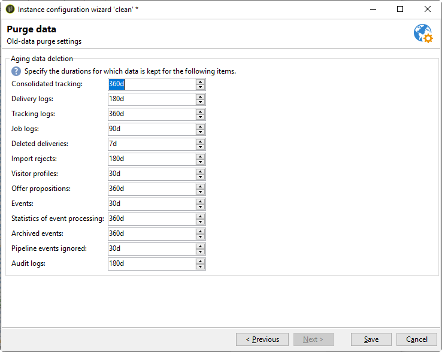

# データベースクリーンアップワークフロー{#database-cleanup-workflow}

## はじめに {#introduction}

**[!UICONTROL 管理／プロダクション／テクニカルワークフロー]**&#x200B;ノードからアクセスできる&#x200B;**[!UICONTROL データベースクリーンアップ]**&#x200B;ワークフローを使用すると、古いデータを削除して、データベースの急激な増加を回避できます。ワークフローは、ユーザーの操作なしで自動的にトリガーされます。


## 設定 {#configuration}

データベースのクリーンアップは次の2つのレベルで構成されます。」をクリックします。

### ワークフロースケジューラー{#the-scheduler}

>[!NOTE]
>
>スケジューラーについて詳しくは、[この節](../../workflow/using/scheduler.md)を参照してください。

デフォルトでは、**[!UICONTROL データベースクリーンアップ]**&#x200B;ワークフローは、毎日午前4時に開始するように構成されています。 スケジューラーを使用すると、ワークフローのトリガー頻度を変更できます。 次の頻度を使用できます。

* **[!UICONTROL 1 日に数回]**
* **[!UICONTROL 日次]**
* **[!UICONTROL 毎週]**
* **[!UICONTROL 1 回]**


>[!IMPORTANT]
>
>**[!UICONTROL データベースクリーンアップ]**&#x200B;ワークフローをスケジューラーで定義された日時に開始するには、ワークフローエンジン(wfserver)を起動する必要があります。 そうでない場合、データベースのクレンジングは、次回ワークフローエンジンが起動するまで行われません。

### デプロイメントウィザード {#deployment-wizard}

**[!UICONTROL 展開ウィザード]**&#x200B;は、**[!UICONTROL ツール/詳細]**&#x200B;メニューからアクセスし、保存するデータの保存期間を設定できます。 値は日単位で表します。 これらの値を変更しない場合、ワークフローではデフォルト値が使用されます。



**[!UICONTROL データのパージ]**&#x200B;ウィンドウのフィールドは、次のオプションと一致します。 これらは、**[!UICONTROL Database cleanup]**&#x200B;ワークフローによって実行されるタスクの一部で使用されます。

* 統合トラッキング：**NmsCleanup_TrackingStatPurgeDelay**([トラッキングログのクリーンアップ](#cleanup-of-tracking-logs)を参照)
* 配信ログ:**NmsCleanup_BroadLogPurgeDelay**([配信ログのクリーンアップ](#cleanup-of-delivery-logs)を参照)
* トラッキングログ:**NmsCleanup_TrackingLogPurgeDelay**([トラッキングログのクリーンアップ](#cleanup-of-tracking-logs)を参照)
* 削除された配信:**NmsCleanup_RecycledDeliveryPurgeDelay**([削除またはリサイクルする配信のクリーンアップ](#cleanup-of-deliveries-to-be-deleted-or-recycled)を参照)
* 拒否の読み込み：**NmsCleanup_RejectsPurgeDelay**（[インポートによって生成された拒否のクリーンアップ](#cleanup-of-rejects-generated-by-imports-)を参照）
* 訪問者プロファイル:**NmsCleanup_VisitorPurgeDelay**([訪問者のクリーンアップ](#cleanup-of-visitors)を参照)
* オファーの提案:**NmsCleanup_PropositionPurgeDelay**（[提案のクリーンアップ](#cleanup-of-propositions)を参照）

   >[!NOTE]
   >
   >**[!UICONTROL オファーの提案]**&#x200B;フィールドは、**対話**&#x200B;モジュールがインストールされている場合にのみ使用できます。

* イベント:**NmsCleanup_EventPurgeDelay**([クレンジングの有効期限切れイベント](#cleansing-expired-events)を参照)
* アーカイブされたイベント:**NmsCleanup_EventHistoPurgeDelay**([クレンジングの有効期限切れイベント](#cleansing-expired-events)を参照)

   >[!NOTE]
   >
   >**[!UICONTROL イベント]**&#x200B;と&#x200B;**[!UICONTROL アーカイブ済みイベント]**&#x200B;フィールドは、**Message Center**&#x200B;モジュールがインストールされている場合にのみ使用できます。

* 監査証跡：**XtkCleanup_AuditTrailPurgeDelay**（[監査証跡のクリーンアップ](#cleanup-of-audit-trail)を参照）

**[!UICONTROL Database cleanup]**&#x200B;ワークフローで実行されるすべてのタスクについて、次の節で説明します。

## Database cleanupワークフロー{#tasks-carried-out-by-the-database-cleanup-workflow}によって実行されるタスク

ワークフロースケジューラーで定義された日時([スケジューラー](#the-scheduler)を参照)に、ワークフローエンジンはデータベースのクリーンアップ処理を開始します。 データベースのクリーンアップは、データベースに接続し、以下に示すシーケンスのタスクを実行します。

>[!IMPORTANT]
>
>これらのタスクの1つが失敗した場合、次のエラーは実行されません。\
>**LIMIT**&#x200B;属性を持つSQLクエリは、すべての情報が処理されるまで繰り返し実行されます。

>[!NOTE]
>
>データベースのクリーンアップ・ワークフローで実行されるタスクについては、以下の節で説明します。データベース管理者またはSQL言語に詳しいユーザ向けに用意されています。

### クリーンアップを削除するリスト{#lists-to-delete-cleanup}

**[!UICONTROL Database cleanup]**&#x200B;ワークフローで最初に実行されたタスクは、**deleteStatus != 0**&#x200B;属性（**NmsGroup**&#x200B;から） これらのグループにリンクされ、他のテーブルに存在するレコードも削除されます。

1. 削除するリストは、次のSQLクエリを使用して回復します。

   ```
   SELECT iGroupId, sLabel, iType FROM NmsGroup WHERE iDeleteStatus <> 0 OR tsExpirationDate <= GetDate() 
   ```

1. 各リストには、他のテーブルへのリンクが複数あります。 これらのリンクはすべて、次のクエリを使用して一括で削除されます。

   ```
   DELETE FROM $(relatedTable) WHERE iGroupId=$(l) IN (SELECT iGroupId FROM $(relatedTable) WHERE iGroupId=$(l) LIMIT 5000) 
   ```

   ここで、**$(relatedTable)**&#x200B;は&#x200B;**NmsGroup**&#x200B;に関連するテーブルで、**$(l)**&#x200B;はリストの識別子です。

1. リストが「リスト」タイプのリストの場合、次のクエリを使用して関連付けられたテーブルが削除されます。

   ```
   DROP TABLE grp$(l)
   ```

1. **操作で回復した**&#x200B;タイプのリストをすべて選択すると、次のクエリが使用されて削除されます。

   ```
   DELETE FROM NmsGroup WHERE iGroupId=$(l) 
   ```

   ここで&#x200B;**$(l)**&#x200B;はリスト識別子です。

### 削除またはリサイクルする配信のクリーンアップ{#cleanup-of-deliveries-to-be-deleted-or-recycled}

このタスクは、削除またはリサイクルするすべての配信を削除します。

1. **[!UICONTROL Database cleanup]**&#x200B;ワークフローは、**deleteStatus**&#x200B;フィールドの値が&#x200B;**[!UICONTROL Yes]**&#x200B;または&#x200B;**[!UICONTROL Recycled]**&#x200B;で、削除日が&#x200B;**[!UICONTROL Deleted配信]** (&lt;a10/)より前の配信を選択します。>NmsCleanup_RecycledDeliveryPurgeDelay **)の展開ウィザードのフィールド。**&#x200B;詳しくは、[展開ウィザード](#deployment-wizard)を参照してください。 この期間は、現在のサーバーの日付に関連して計算されます。
1. タスクは、各ミッドソーシングサーバに対して、削除する配信のリストを選択する。
1. **[!UICONTROL Database cleanup]**&#x200B;ワークフローは、配信ログ、添付ファイル、ミラーページ情報、およびその他すべての関連データを削除します。
1. 適切な場合は、配信を削除する前に、次の表のリンク情報を削除します。

   * 配信の除外テーブル(**NmsDlvExclusion**)では、次のクエリが使用されます。

      ```
      DELETE FROM NmsDlvExclusion WHERE iDeliveryId=$(l)
      ```

      **$(l)**&#x200B;は配信の識別子です。

   * クーポンテーブル(**NmsCouponValue**)では、次のクエリが使用されます（大量削除を行う場合）。

      ```
      DELETE FROM NmsCouponValue WHERE iMessageId IN (SELECT iMessageId FROM NmsCouponValue WHERE EXISTS (SELECT B.iBroadLogId FROM $(BroadLogTableName) B WHERE B.iDeliveryId = $(l) AND B.iBroadLogId = iMessageId ) LIMIT 5000)
      ```

      **$(l)**&#x200B;は配信の識別子です。

   * 配信・ログ・テーブル(**NmsBroadlogXxx**)では、20,000件のレコードのバッチで大量削除が実行されます。
   * オファーの提案テーブル(**NmsPropositionXxx**)では、大量削除は20,000件のレコードのバッチで実行されます。
   * トラッキングログテーブル(**NmsTrackinglogXxx**)では、大量削除は20,000件のレコードのバッチで実行されます。
   * 配信フラグメントテーブル(**NmsDeliveryPart**)では、500,000件のレコードのバッチで大量削除が実行されます。 次の表に、配信される残りのメッセージに関するパーソナライゼーション情報を示します。
   * ミラーページデータフラグメントテーブル(**NmsMirrorPageInfo**)では、大量削除は、期限切れの配信部分と、完了またはキャンセルされた部分に対して、20,000件のレコードのバッチで実行されます。 次の表に、ミラーページの生成に使用されるすべてのメッセージのパーソナライゼーション情報を示します。
   * ミラーページ検索テーブル(**NmsMirrorPageSearch**)では、20,000件のレコードのバッチで大量削除が実行されます。 このテーブルは、**NmsMirrorPageInfo**&#x200B;テーブルに保存されたパーソナライゼーション情報へのアクセスを提供する検索インデックスです。
   * バッチ処理ログテーブル(**XtkJobLog**)では、20,000件のレコードのバッチで大量削除が実行されます。 次の表に、削除する配信のログを示します。
   * 配信URL追跡テーブル(**NmsTrackingUrl**)では、次のクエリが使用されます。

      ```
      DELETE FROM NmsTrackingUrl WHERE iDeliveryId=$(l)
      ```

      **$(l)**&#x200B;は配信の識別子です。

      次の表に、削除対象の配信ーで検出されたURLを示して、そのユーザーの追跡を有効にします。

1. 配信が配信テーブル(**NmsDelivery**)から削除されます。

   ```
   DELETE FROM NmsDelivery WHERE iDeliveryId = $(l)
   ```

   **$(l)**&#x200B;は配信の識別子です。

#### ミッドソーシング{#deliveries-using-mid-sourcing}を使用する配信

**[!UICONTROL Database cleanup]**&#x200B;ワークフローは、ミッドソーシングサーバー上の配信も削除します。

1. これを行うには、各配信が（そのステータスに基づいて）非アクティブであるかどうかを確認します。 配信がアクティブな場合は、削除前に停止されます。 チェックは、次のクエリを実行して実行されます。

   ```
   SELECT iState FROM NmsDelivery WHERE iDeliveryId = $(l) AND iState <> 100;
   ```

   **$(l)**&#x200B;は配信の識別子です。

1. ステータスの値が&#x200B;**[!UICONTROL 開始待ち]**、**[!UICONTROL 進行中]**、**[!UICONTROL 回復待ち]**、**[!UICONTROL 回復中]**、**[!UICONTROL 要求された]**、**[!UICONTROL 進行中]**&#x200B;の一時停止の場合または&#x200B;**[!UICONTROL 一時停止]**（値51、55、61、62、71、72、75）。配信は停止され、タスクはリンクされた情報を削除する。

### 期限切れの配信のクリーンアップ{#cleanup-of-expired-deliveries}

このタスクは、有効期間が切れた配信を停止します。

1. **[!UICONTROL Database cleanup]**&#x200B;ワークフローは、有効期限が切れた配信のリストを作成します。 このリストには、**[!UICONTROL 完了]**&#x200B;以外のステータスを持つ期限切れの配信がすべて含まれます。また、未処理のメッセージが10,000を超える最近停止した配信も含まれます。 次のクエリが使用されます。

   ```
   SELECT iDeliveryId, iState FROM NmsDelivery WHERE iDeleteStatus=0 AND iIsModel=0 AND iDeliveryMode=1 AND ( (iState >= 51 AND iState < 85 AND tsValidity IS NOT NULL AND tsValidity < $(currentDate) ) OR (iState = 85 AND DateMinusDays(15) < tsLastModified AND iToDeliver - iProcessed >= 10000 ))
   ```

   ここで、**配信モード1**&#x200B;は、**[!UICONTROL 質量配信]**&#x200B;モードに一致し、**状態51**&#x200B;は、**[!UICONTROL 開始保留]**&#x200B;状態に一致し、**状態85**&#x200B;は、**[!UICONTROL 停止]**&#x200B;状態に一致します。配信サーバ上で一括更新される配信ログの数が最も多いのは10,000です。

1. 次に、ミッドソーシングを使用する最近期限切れの配信のリストが含まれます。 ミッドソーシングサーバを介して配信ログがまだ回復されていない配信は除外されます。

   次のクエリが使用されます。

   ```
   SELECT iDeliveryId, tsValidity, iMidRemoteId, mData FROM NmsDelivery WHERE (iDeliveryMode = 4 AND (iState = 85 OR iState = 95) AND tsValidity IS NOT NULL AND (tsValidity < SubDays(GetDate() , 15) OR tsValidity < $(DateOfLastLogPullUp)) AND tsLastModified > SubDays(GetDate() , 15))
   ```

1. 次のクエリは、配信を日付でフィルタリングするために、外部アカウントがアクティブかどうかを検出するために使用します。

   ```
   SELECT iExtAccountId FROM NmsExtAccount WHERE iActive<>0 AND sName=$(providerName)
   ```

1. 期限切れの配信のリストでは、ステータスが&#x200B;**[!UICONTROL 保留]**&#x200B;の配信ログ、**[!UICONTROL 配信キャンセル]**&#x200B;に切り替え、このリスト内のすべての配信は&#x200B;**[!UICONTROL 完了]**&#x200B;に切り替えます。

   次のクエリが使用されます。

   ```
   UPDATE $(BroadLogTableName) SET tsLastModified=$(curdate), iStatus=7, iMsgId=$(bl) WHERE iDeliveryId=$(dl) AND iStatus=6
   ```

   **$(curdate)**&#x200B;は配信ログサーバーの現在の日付、**$(bl)**&#x200B;はデータベース配信の識別子、**$(dl)**&#x200B;はデータベースID、**配信ステータス6**&#x200B;は&#x200B;**[!UICONTROL 保留]**&#x200B;ステータスと一致します10/>配信ステータス7 **は、**[!UICONTROL &#x200B;配信キャンセル&#x200B;]**ステータスと一致します。**

   ```
   UPDATE NmsDelivery SET iState = 95, tsLastModified = $(curdate), tsBroadEnd = tsValidity WHERE iDeliveryId = $(dl)
   ```

   **配信状態95**&#x200B;は、**[!UICONTROL 完了]**&#x200B;ステータスと一致し、**$(dl)**&#x200B;は配信の識別子です。

1. 古い配信のすべてのフラグメント(**deliveryParts**)が削除され、進行中の通知配信の古いフラグメントがすべて削除されます。 これらの両方のタスクに対して、一括削除が使用されます。

   次のクエリが使用されます。

   ```
   DELETE FROM NmsDeliveryPart WHERE iDeliveryPartId IN (SELECT iDeliveryPartId FROM NmsDeliveryPart WHERE iDeliveryId IN (SELECT iDeliveryId FROM NmsDelivery WHERE iState=95 OR iState=85) LIMIT 5000)
   ```

   ```
   DELETE FROM NmsDeliveryPart WHERE iDeliveryPartId IN (SELECT iDeliveryPartId FROM NmsDeliveryPart WHERE tsValidity < $(curDate) LIMIT 500000)
   ```

   ここで、**配信状態95**&#x200B;は&#x200B;**[!UICONTROL 完了]**&#x200B;ステータス、**配信状態85**&#x200B;は&#x200B;**[!UICONTROL 停止]**&#x200B;ステータス、**$(cur9/>は現在のサーバー日付に一致します。**

### ミラーページのクリーンアップ{#cleanup-of-mirror-pages}

このタスクは、配信が使用するWebリソース(ミラーページ)を削除します。

1. まず、次のクエリを使用して、パージする配信のリストをリカバリします。

   ```
   SELECT iDeliveryId, iNeedMirrorPage FROM NmsDelivery WHERE iWebResPurged = 0 AND tsWebValidity IS NOT NULL AND tsWebValidity < $(curdate)"
   ```

   **$(curDate)**&#x200B;は、現在のサーバーの日付です。

1. **NmsMirrorPageInfo**&#x200B;テーブルは、必要に応じて、以前にリカバリした配信のIDを使用してパージされます。 一括削除は、次のクエリを生成するために使用します。

   ```
   DELETE FROM NmsMirrorPageInfo WHERE iMirrorPageInfoId IN (SELECT iMirrorPageInfoId FROM NmsMirrorPageInfo WHERE iDeliveryId = $(dl)) LIMIT 5000)
   ```

   ```
   DELETE FROM NmsMirrorPageSearch WHERE iMessageId IN (SELECT iMessageId FROM NmsMirrorPageSearch WHERE iDeliveryId = $(dl)) LIMIT 5000)
   ```

   **$(dl)**&#x200B;は配信の識別子です。

1. エントリが配信ログに追加されます。
1. 次に、削除された配信が識別され、後で再処理する必要がなくなります。 次のクエリが実行されます。

   ```
   UPDATE NmsDelivery SET iWebResPurged = 1 WHERE iDeliveryId IN ($(strIn))
   ```

   **$(strIn)**&#x200B;は、配信識別子のリストです。

### 作業テーブルのクリーンアップ{#cleanup-of-work-tables}

このタスクはデータベースから削除され、**[!UICONTROL 編集中]**、**[!UICONTROL 停止]**、または&#x200B;**[!UICONTROL 削除]**&#x200B;の配信に一致するすべての作業テーブルがデータベースから削除されます。

1. **wkDlv_**&#x200B;で始まる名前を持つテーブルのリストは、まず次のクエリ(postgresql)で回復されます。

   ```
   SELECT relname FROM pg_class WHERE relname LIKE Lower('wkDlv_') ESCAPE E'\\' AND relkind IN ('r','v') AND pg_get_userbyid(relowner)<>'postgres'
   ```

1. その後、進行中のワークフローが使用するテーブルは除外されます。 これを行うには、進行中の配信のリストを次のクエリを使用して回復します。

   ```
   SELECT iDeliveryId FROM NmsDelivery WHERE iDeliveryId<>0 AND iDeleteStatus=0 AND iState NOT IN (0,85,100);
   ```

   0は&#x200B;**[!UICONTROL 編集中]**&#x200B;の配信ステータスに一致する値、85は&#x200B;**[!UICONTROL 停止]**&#x200B;ステータス、100は&#x200B;**[!UICONTROL 削除]**&#x200B;ステータスに一致します。

1. 使用されなくなったテーブルは、次のクエリを使用して削除されます。

   ```
   DROP TABLE wkDlv_15487_1;
   ```

### インポートによって生成された拒否のクリーンアップ{#cleanup-of-rejects-generated-by-imports-}

この手順では、読み込み中にすべてのデータが処理されなかったレコードを削除できます。

1. **XtkReject**&#x200B;テーブルで、次のクエリを使って一括削除を行います。

   ```
   DELETE FROM XtkReject WHERE iRejectId IN (SELECT iRejectId FROM XtkReject WHERE tsLog < $(curDate)) LIMIT $(l))
   ```

   **$(curDate)**&#x200B;は、**NmsCleanup_RejectsPurgeDelay**&#x200B;オプション（[Deployment wizard](#deployment-wizard)を参照）に定義した期間を差し引いた現在のサーバーの日付で、**$(l)**&#x200B;は、レコードの最大数です削除されました。

1. その後、すべてのオーファンの拒否は次のクエリを使用して削除されます。

   ```
   DELETE FROM XtkReject WHERE iJobId NOT IN (SELECT iJobId FROM XtkJob)
   ```

### ワークフローインスタンスのクリーンアップ{#cleanup-of-workflow-instances}

このタスクは、識別子(**lWorkflowId**)と履歴(**lHistory**)を使用して各ワークフローインスタンスを削除します。 この操作により、作業テーブルのクリーンアップタスクを再度実行して、非アクティブなテーブルが削除されます。 また、削除されたワークフローの親なし作業テーブル（wkf%およびwkfhisto%）もすべて削除されます。

>[!NOTE]
>
>履歴の削除頻度は、「**History in days**」フィールド（デフォルト値は30 days）の各ワークフローに対して指定されます。 このフィールドは、ワークフロープロパティの「**実行**」タブにあります。 詳しくは、[こちらの節](../../workflow/using/workflow-properties.md#execution)を参照してください。

1. 削除するワークフローのリストを回復するには、次のクエリを使用します。

   ```
   SELECT iWorkflowId, iHistory FROM XtkWorkflow WHERE iWorkflowId<>0
   ```

1. このクエリは、次のクエリを使用して、すべてのリンクされたログ、完了したタスク、および完了したイベントを削除するために使用されるワークフローのリストを生成します。

   ```
   DELETE FROM XtkWorkflowLog WHERE iWorkflowId=$(lworkflow) AND tsLog < DateMinusDays($(lhistory))
   ```

   ```
   DELETE FROM XtkWorkflowTask WHERE iWorkflowId=$(lworkflow) AND iStatus<>0 AND tsCompletion < DateMinusDays($(lhistory)) 
   ```

   ```
   DELETE FROM XtkWorkflowEvent WHERE iWorkflowId=$(l) AND iStatus>2 AND tsProcessing < DateMinusDays($(lHistory))
   ```

   ここで、**$(workflow)**&#x200B;はワークフローの識別子、**$(lhistory)**&#x200B;は履歴の識別子です。

1. 未使用のテーブルはすべて削除されます。 この目的のために、すべてのテーブルは、次のクエリ(postgresql)を使って&#x200B;**wkf%**&#x200B;型のマスクを使って収集されます。

   ```
   SELECT relname FROM pg_class WHERE relname LIKE Lower('wkf%') ESCAPE E'\\' AND relkind IN ('r','v') AND pg_get_userbyid(relowner)<>'postgres'
   ```

1. 次に、保留中のワークフローインスタンスで使用されるすべてのテーブルが除外されます。 アクティブなワークフローのリストは、次のクエリを使用して回復します。

   ```
   SELECT iWorkflowId FROM XtkWorkflow WHERE iWorkflowId<>0 AND iState<>20
   ```

1. 次に、各ワークフロー識別子が復元され、進行中のワークフローが使用するテーブルの名前が見つかります。 これらの名前は、以前にリカバリされたテーブルのリストから除外されます。
1. 「インクリメンタルクエリ」タイプのアクティビティ履歴テーブルは、次のクエリを使用して除外されます。

   ```
   SELECT relname FROM pg_class WHERE relname LIKE Lower('wkfhisto%') ESCAPE E'\\' AND relkind IN ('r','v') AND pg_get_userbyid(relowner)<>'postgres'
   ```

   ```
   SELECT iWorkflowId FROM XtkWorkflow WHERE iWorkflowId IN ($(strCondition))
   ```

   **$(strcondition)**&#x200B;は、**wkfhisto%**&#x200B;マスクに一致するテーブルのリストです。

1. 残りのテーブルは次のクエリを使用して削除されます。

   ```
   DROP TABLE wkf15487_12;
   ```

### ワークフローログインのクリーンアップ{#cleanup-of-workflow-logins}

このタスクは次のクエリを使用してワークフローログインを削除します。

```
DELETE FROM XtkWorkflowLogin WHERE iWorkflowId NOT IN (SELECT iWorkflowId FROM XtkWorkflow)
```

### 単独作業テーブルのクリーンアップ{#cleanup-of-orphan-work-tables}

このタスクは、グループにリンクされた単独の作業テーブルを削除します。 **NmsGroup**&#x200B;テーブルには、クリーンアップするグループが格納されます（0とは異なる型）。 テーブル名のプレフィックスは&#x200B;**grp**&#x200B;です。 クリーンアップするグループを識別するには、次のクエリを使用します。

```
SELECT iGroupId FROM NmsGroup WHERE iType>0"
```

### 訪問者のクリーンアップ{#cleanup-of-visitors}

このタスクは、一括削除を使用して、古いレコードを訪問者テーブルから削除します。 古いレコードは、最後の変更が配置ウィザードで定義された保存期間より前のものです（[配置ウィザード](#deployment-wizard)を参照）。 次のクエリが使用されます。

```
DELETE FROM NmsVisitor WHERE iVisitorId IN (SELECT iVisitorId FROM NmsVisitor WHERE iRecipientId = 0 AND tsLastModified < AddDays(GetDate(), -30) AND iOrigin = 0 LIMIT 20000)
```

ここで&#x200B;**$(tsDate)**&#x200B;は現在のサーバーの日付で、**NmsCleanup_VisitorPurgeDelay**&#x200B;オプションに定義された期間を差し引きます。

### NPAIのクリーンアップ{#cleanup-of-npai}

このタスクを使用すると、**NmsAddress**&#x200B;テーブルから、有効なアドレスと一致するレコードを削除できます。 一括削除の実行には、次のクエリを使用します。

```
DELETE FROM NmsAddress WHERE iAddressId IN (SELECT iAddressId FROM NmsAddress WHERE iStatus=2 AND tsLastModified < $(tsDate1) AND tsLastModified >= $(tsDate2) LIMIT 5000)
```

ここで&#x200B;**status 2**&#x200B;は&#x200B;**[!UICONTROL 有効な]**&#x200B;ステータスと一致し、**$(tsDate1)**&#x200B;は現在のサーバー日付、**$(tsDate2)**&#x200B;は&#x200B;**NmsCleanup_LastCleanup**&#x200B;オプションと一致します。

### 購読のクリーンアップ{#cleanup-of-subscriptions-}

このタスクは、ユーザーが削除したすべての購読を&#x200B;**NmsSubscription**&#x200B;テーブルから一括削除を使用して削除します。 次のクエリが使用されます。

```
DELETE FROM NmsSubscription WHERE iDeleteStatus <>0
```

### トラッキングログのクリーンアップ{#cleanup-of-tracking-logs}

このタスクは、追跡およびWeb追跡ログテーブルから古いレコードを削除します。 古いレコードは、展開ウィザードで定義された保存期間より前のものです（[展開ウィザード](#deployment-wizard)を参照）。

1. 最初に、次のクエリを使用して、トラッキングログテーブルのリストが回復されます。

   ```
   SELECT distinct(sTrackingLogSchema) FROM NmsDeliveryMapping WHERE sTrackingLogSchema IS NOT NULL;
   ```

1. 一括削除は、以前にリカバリしたテーブルのリスト内のすべてのテーブルをパージするために使用します。 次のクエリが使用されます。

   ```
   DELETE FROM XtkTrackingLogRcp WHERE iTrackingLogId IN (SELECT iTrackingLogId FROM XtkTrackingLogRcp WHERE tsLog < $(tsDate) LIMIT 5000) 
   ```

   **$(tsDate)**&#x200B;は、**NmsCleanup_TrackingLogPurgeDelay**&#x200B;オプションに定義されている期間を差し引いた現在のサーバーの日付です。

1. 追跡統計テーブルは、一括削除を使用して削除されます。 次のクエリが使用されます。

   ```
   DELETE FROM NmsTrackingStats WHERE iTrackingStatsId IN (SELECT iTrackingStatsId FROM NmsTrackingStats WHERE tsStart < $(tsDate) LIMIT 5000) 
   ```

   **$(tsDate)**&#x200B;は、**NmsCleanup_TrackingStatPurgeDelay**&#x200B;オプションに定義されている期間を差し引いた現在のサーバーの日付です。

### 配信ログのクリーンアップ{#cleanup-of-delivery-logs}

このタスクを使用すると、様々なテーブルに保存されている配信ログを削除できます。

1. このため、配信ログスキーマのリストは、次のクエリを使用して回復されます。

   ```
   SELECT distinct(sBroadLogSchema) FROM NmsDeliveryMapping WHERE sBroadLogSchema IS NOT NULL UNION SELECT distinct(sBroadLogExclSchema) FROM NmsDeliveryMapping WHERE sBroadLogExclSchema IS NOT NULL
   ```

1. ミッドソーシングを使用する場合、**NmsBroadLogMid**&#x200B;テーブルは配信マッピングで参照されません。 **nms:broadLogMid**&#x200B;スキーマは、前のクエリでリカバリされたリストに追加されます。
1. 次に、**データベースクリーンアップ**&#x200B;ワークフローは、以前に回復したテーブルから古いデータを削除します。 次のクエリが使用されます。

   ```
   DELETE FROM $(tableName) WHERE iBroadLogId IN (SELECT iBroadLogId FROM $(tableName) WHERE tsLastModified < $(option) LIMIT 5000) 
   ```

   **$(tableName)**&#x200B;はスキーマリスト内の各テーブルの名前、**$(option)**&#x200B;は&#x200B;**NmsCleanup_BroadLogPurgeDelay**&#x200B;オプションの定義日付です（[Deployment wizard](#deployment-wizard)を参照）。

1. 最後に、ワークフローは&#x200B;**NmsProviderMsgId**&#x200B;テーブルが存在するかどうかを確認します。 古いデータが含まれている場合は、次のクエリを使用して古いデータがすべて削除されます。

   ```
   DELETE FROM NmsProviderMsgId WHERE iBroadLogId IN (SELECT iBroadLogId FROM NmsProviderMsgId WHERE tsCreated < $(option) LIMIT 5000)
   ```

   ここで、**$(option)**&#x200B;は、**NmsCleanup_BroadLogPurgeDelay**&#x200B;オプションに定義された日付と一致します（[展開ウィザード](#deployment-wizard)を参照）。

### NmsEmailErrorStatテーブル{#cleanup-of-the-nmsemailerrorstat-table-}のクリーンアップ

このタスクは、**NmsEmailErrorStat**&#x200B;テーブルをクリーンズします。 メインプログラム(**coalesceErrors**)は、次の2つの日付を定義します。

* **開始日**:次のプロセスの日付で、NmsLastErrorStatCoalesceoptionまたはテー **** ブル内の最新の日付と一致します。
* **終了日**:現在のサーバーの日付。

開始日が終了日以上の場合は、処理は行われません。 この場合、**coalesceUpToDate**&#x200B;メッセージが表示されます。

開始日が終了日より前の場合、**NmsEmailErrorStat**&#x200B;テーブルはクリーンアップされます。

**NmsEmailErrorStat**&#x200B;テーブル内の開始日から終了日までのエラーの合計数は、次のクエリを使用して回復されます。

```
"SELECT COUNT(*) FROM NmsEmailErrorStat WHERE tsDate>= $(start) AND tsDate< $(end)"
```

**$end**&#x200B;と&#x200B;**$開始**&#x200B;は、以前に定義した開始と終了日です。

合計が0より大きい場合：

1. 特定のしきい値（20に等しい）を超えるエラーのみを保持するために、次のクエリが実行されます。

   ```
   "SELECT iMXIP, iPublicId, SUM(iTotalConnections), SUM(iTotalErrors), SUM(iMessageErrors), SUM(iAbortedConnections), SUM(iFailedConnections), SUM(iRefusedConnections), SUM(iTimeoutConnections) FROM NmsEmailErrorStat WHERE tsDate>=$(start ) AND tsDate<$(end ) GROUP BY iMXIP, iPublicId HAVING SUM(iTotalErrors) >= 20"
   ```

1. **coalescingErrors**&#x200B;メッセージが表示されます。
1. 開始と終了日の間に発生したすべてのエラーを削除する新しい接続が作成されます。 次のクエリが使用されます。

   ```
   "DELETE FROM NmsEmailErrorStat WHERE tsDate>=$(start) AND tsDate<$(end)"
   ```

1. 各エラーは、次のクエリを使用して&#x200B;**NmsEmailErrorStat**&#x200B;テーブルに保存されます。

   ```
   "INSERT INTO NmsEmailErrorStat(iMXIP, iPublicId, tsDate, iTotalConnections, iTotalErrors, iTimeoutConnections, iRefusedConnections, iAbortedConnections, iFailedConnections, iMessageErrors) VALUES($(lmxip ), $(lpublicId ), $(tsstart ), $(lconnections ), $(lconnectionErrors ),$(ltimeoutConnections ), $(lrefusedConnections ), $(labortedConnections ), $(lfailedConnections ), $(lmessageErrors))"
   ```

   各変数は、前のクエリで復元された値と一致します。

1. **開始**&#x200B;変数が更新され、前のプロセスの値が使用されてループが終了します。

ループとタスクが停止します。

クリーンアップは、**NmsEmailError**&#x200B;テーブルと&#x200B;**cleanupNmsMxDomain**&#x200B;テーブルで実行されます。

### NmsEmailErrorテーブル{#cleanup-of-the-nmsemailerror-table-}のクリーンアップ

次のクエリが使用されます。

```
DELETE FROM NmsEmailError WHERE iMXIP NOT IN (SELECT DISTINCT iMXIP FROM NmsEmailErrorStat)
```

このクエリは、**NmsEmailError**&#x200B;テーブルから&#x200B;**NmsEmailErrorStat**&#x200B;内のリンクされたレコードがない行をすべて削除します。

### NmsMxDomainテーブル{#cleanup-of-the-nmsmxdomain-table-}のクリーンアップ

次のクエリが使用されます。

```
DELETE FROM NmsMxDomain WHERE iMXIP NOT IN (SELECT DISTINCT iMXIP FROM NmsEmailErrorStat)
```

このクエリは、**NmsMxDomain**&#x200B;テーブルから&#x200B;**NmsEmailErrorStat**&#x200B;テーブル内のリンクされたレコードのない行をすべて削除します。

### 提案のクリーンアップ{#cleanup-of-propositions}

**Interaction**&#x200B;モジュールがインストールされている場合、このタスクは&#x200B;**NmsPropositionXxx**&#x200B;テーブルを削除するために実行されます。

次のクエリを用いて、プロポジションテーブルのリストを回復し、各テーブルに対して一括削除を行う。

```
DELETE FROM NmsPropositionXxx WHERE iPropositionId IN (SELECT iPropositionId FROM NmsPropositionXxx WHERE tsLastModified < $(option) LIMIT 5000) 
```

**$(option)**&#x200B;は、**NmsCleanup_PropositionPurgeDelay**&#x200B;オプションに定義されている日付です（[展開ウィザード](#deployment-wizard)を参照）。

### シミュレーションテーブルのクリーンアップ{#cleanup-of-simulation-tables}

このタスクは、孤立したシミュレーションテーブル(オファーシミュレーションまたは配信シミュレーションにリンクされなくなったテーブル)を削除します。

1. クリーンアップが必要なシミュレーションのリストを回復するには、次のクエリを使用します。

   ```
   SELECT iSimulationId FROM NmsSimulation WHERE iSimulationId<>0
   ```

1. 削除するテーブルの名前は、**wkSimu_**&#x200B;プレフィックスの後にシミュレーションのIDが続く(例：**wkSimu_456831_aggr**):

   ```
   DROP TABLE wkSimu_456831_aggr
   ```

### 監査証跡のクリーンアップ{#cleanup-of-audit-trail}

次のクエリが使用されます。

```
DELETE FROM XtkAudit WHERE tsChanged < $(tsDate)
```

**$(tsDate)**&#x200B;は、**XtkCleanup_AuditTrailPurgeDelay**&#x200B;オプションに定義された期間が送信される現在のサーバーの日付です。

### Nmsaddress {#cleanup-of-nmsaddress}のクリーンアップ

次のクエリが使用されます。

```
DELETE FROM NmsAddress WHERE iAddressId IN (SELECT iAddressId FROM NmsAddress WHERE iStatus=STATUS_QUARANTINE AND tsLastModified < $(NmsCleanup_AppSubscriptionRcpPurgeDelay + 5d) AND iType IN (MESSAGETYPE_IOS, MESSAGETYPE_ANDROID ) LIMIT 5000)
```

このクエリは、iOSとAndroidに関連するすべてのエントリを削除します。

### 統計の更新とストレージの最適化{#statistics-update}

**XtkCleanup_NoStats**&#x200B;オプションを使用すると、クリーンアップワークフローのストレージ最適化手順の動作を制御できます。

**XtkCleanup_NoStats**&#x200B;オプションが存在しない場合、またはその値が0の場合は、PostgreSQL上で冗長モード(VACUM VERBOSE ANALYZE)でストレージの最適化を実行し、他のすべてのデータベースの統計を更新します。 このコマンドが実行されていることを確認するには、PostgreSQLログを調べます。 VACUUMは次の形式で行を出力します。`INFO: vacuuming "public.nmsactivecontact"`とANALYZEは次の形式で行を出力します。`INFO: analyzing "public.nmsactivecontact"`.

このオプションの値が1の場合、統計の更新はどのデータベースでも実行されません。 次のログ行がワークフローログに表示されます。`Option 'XtkCleanup_NoStats' is set to '1'`.

このオプションの値が2の場合、ストレージ分析はPostgreSQLで冗長モード(ANALYZE VERBOSE)で実行され、他のすべてのデータベースで統計が更新されます。 このコマンドが実行されていることを確認するには、PostgreSQLログを調べます。 ANALYZEは次の形式で行を出力します。`INFO: analyzing "public.nmsactivecontact"`.

### 購読クリーンアップ(NMAC) {#subscription-cleanup--nmac-}

このタスクは、削除したサービスまたはモバイルアプリケーションに関連する購読をすべて削除します。

ブロードローグスキーマのリストを回復するには、次のクエリを使用します。

```
SELECT distinct(sBroadLogSchema) FROM NmsDeliveryMapping WHERE sBroadLogSchema IS NOT NULL
```

次に、タスクは&#x200B;**appSubscription**&#x200B;リンクにリンクされているテーブルの名前を復元し、これらのテーブルを削除します。

また、このクリーンアップワークフローは、disabled = 1のエントリが&#x200B;**NmsCleanup_AppSubscriptionRcpPurgeDelay**&#x200B;オプションで設定された時刻以降に更新されていない場合も、すべて削除します。

### クレンジングセッション情報{#cleansing-session-information}

このタスクは、**sessionInfo**&#x200B;テーブルから情報を消去します。次のクエリが使用されます。

```
 DELETE FROM XtkSessionInfo WHERE tsexpiration < $(curdate) 
```

### クレンジング期限切れイベント{#cleansing-expired-events}

このタスクは、実行インスタンスに受け取って保存されたイベントと、コントロールインスタンスにアーカイブされたイベントを消去します。

### クレンジング反応{#cleansing-reactions}

このタスクは、仮説自体が削除されたリアクション（テーブル&#x200B;**NmsRemaMatchRcp**）をクリーンアップします。
