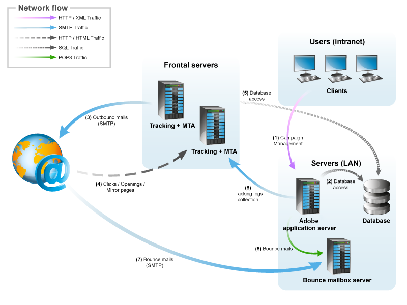

# 一般的なアーキテクチャ{#general-architecture}

## 最小限のアーキテクチャ {#minimum-architecture}

Adobe Campaignは、最小限の設定で次の機能を備えています。

* Adobe Campaignアプリケーションサーバーには，
* データベース：

  

次の図は、最小アーキテクチャのコンテキストに含まれるトラフィックのみが次であることを示しています。

1. ADOBE CAMPAIGNサーバーに接続するための，
1. インターネット経由でのAdobe Campaign サーバーとのSMTP プロトコルのトラフィック。

## 分散アーキテクチャ {#distributed-architecture}

Adobe Campaignは、複数のマシンに分割できる複数のモジュールで構成されています。 この動作モードにはいくつかの利点があります。

* ロードバランシング，
* モジュール冗長性の設定，
* 複数のサービスプロバイダーに分割されたアーキテクチャの構築（提供されるサービスのセグメンテーション）。

複数のマシン上のモジュールの分布は、使用の大きな柔軟性と適応性の向上を提供します。

>[!NOTE]
>
>様々なアーキテクチャについて詳しくは、[この節](../../installation/using/general-architecture.md)を参照してください。

## 開いているポートのリスト {#list-of-open-ports}

| ポート番号 | 関連するAdobe Campaign モジュールまたはアプリケーション | 設定可能 |
|---|---|---|
| 443/tcpまたは80/tcp | Web サーバー（Apache/IIS） | はい |
| 6666/udp （ローカル） | Adobe Campaign:Syslogd | はい |
| 8005/tcp （ローカル） | Adobe Campaign: web モジュール | はい |
| 8080/tcp | Adobe Campaign:web モジュール（tomcat） | はい |
| 7777 | 統計サーバー（統計サーバー） | はい |
