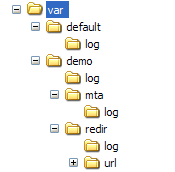

# ログファイル{#log-files}

ログファイルは次のように整理されています。

各&#x200B;**nlserver** モジュールは、次のディレクトリに保存されたログファイルを生成します：**`<installation directory>`/var/`<instance>`/log/`<module>`.log**。

**nlserver syslogd** モジュールは、ログをディスクに保存します。 このモジュールはUnix **syslog デーモン**&#x200B;と似ていますが、UnixとWindowsの互換性のために調整されています。 他のAdobe Campaign モジュールは、ログをディスクに保存しません。UDP パケットを送信して、このタスクを&#x200B;**syslogd** モジュールにデリゲートします。

デフォルトでは、Adobe Campaign プラットフォームには&#x200B;**syslogd** モジュールがインストールされていますが、別の&#x200B;**syslog デーモン**&#x200B;を使用することもできます。 このモジュールは、**log** ディレクトリにログファイルを作成します。

マルチインスタンス モジュールのログは、次のディレクトリに保存されます：**`<installation directory>`/var/default/log/**。 同じログファイルがすべてのインスタンス（例：**web.log**）で共有されます。

他のモジュールのログは、インスタンスにちなんで名前が付けられたサブフォルダーに保存されます。 各インスタンスには独自のログファイルがあります。

マルチインスタンスのログファイルを次の表に示します。

| ファイル | 説明 |
|---|---|
| web.log | Web モジュールログ（クライアントコンソール、レポート、SOAP APIなど） |
| webmdl.log | リダイレクトモジュールからのログ |
| watchdog.log | Adobe Campaign プロセスモニタリングモジュールからのログ |
| trackinglogd.log | トラッキングログ |

モノラルインスタンスのログファイルを次の表に示します。

| ファイル | 説明 |
|---|---|
| mta.log | mta モジュールログ |
| mtachild.log | メッセージ配信処理ログ |
| wfserver.log | ワークフローサーバーモジュールのログ |
| runwf.log | ワークフロー実行ログ |
| inMail.log | バウンスメールモジュールログ |
| logins.log | Adobe Campaignへのログイン試行をすべて記録します（成功かどうかに関係なく） |

>[!IMPORTANT]
>
>**redir** ディレクトリは、リダイレクト サーバーにのみ存在します。 **url** サブディレクトリには、リダイレクトするURLの一致が含まれ、サブディレクトリ **log**&#x200B;にはトラッキングログが含まれます。 トラッキングログを生成するには、**trackinglogd** モジュールを実行している必要があります。

パフォーマンスとストレージの最適化のために、logins.log ファイルは複数のファイルに分割され、1日ごとに1つ（logins.yy-mm-dd.log）に最大365個のファイルが保持されます。 serverConf.xmlのsyslogd （**maxNumberOfLoginsFiles** オプション）で日数を変更できます。 [ サーバー設定ファイル ](../../installation/using/the-server-configuration-file.md#syslogd)のドキュメントを参照してください。

デフォルトでは、ログはモジュールとインスタンスごとに2つの10 MB ファイルに制限されています。 2番目のファイルは&#x200B;**`<modulename>`_2.log**&#x200B;という名前です。 したがって、ログのサイズは、モジュールおよびインスタンスごとに2&#42;10MBに制限されます。

ただし、大きなファイルを保持することはできます。 これを有効にするには、**conf/serverConf.xml** ファイルの&#x200B;**syslogd** ノードの&#x200B;**maxFileSizeMb=&quot;10&quot;**&#x200B;設定の値を変更します。 この値は、ログファイルの最大サイズ（MB）を表します。

ログの詳細をさらに維持する場合は、**-verbose** パラメーターを使用してAdobe Campaign モジュールを開始できます。

**nlserver start `<MODULE>`@`<INSTANCE>` -verbose**
