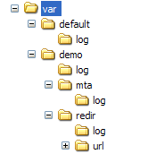

# ログファイル{#log-files}

ログファイルは、次のように整理されます。

各&#x200B;**nlserver**&#x200B;モジュールは、次のディレクトリに保存されたログファイルを生成します。**`<installation directory>`/var/`<instance>`/log/`<module>`.log**&#x200B;に置き換えます。

**nlserver syslogd**&#x200B;モジュールは、ログをディスクに保存します。 このモジュールは、Unixの&#x200B;**syslogデーモン**&#x200B;に似ていますが、UnixとWindowsの互換性を考慮して用意されています。 他のAdobe Campaignモジュールは、ログをディスクに保存しません。このタスクは、UDPパケットを送ることで&#x200B;**syslogd**&#x200B;モジュールに委任されます。

デフォルトでは、Adobe Campaignプラットフォームには&#x200B;**syslogd**&#x200B;モジュールがインストールされていますが、別の&#x200B;**syslogデーモン**&#x200B;を使用することもできます。 このモジュールは、**log**&#x200B;ディレクトリにログファイルを作成します。

マルチインスタンスモジュールのログは、次のディレクトリに保存されます。**`<installation directory>`/var/default/log/**. 同じログファイルがすべてのインスタンスで共有される(例：**web.log**)を参照してください。

他のモジュールのログは、インスタンスの名前を付けたサブフォルダーに保存されます。 各インスタンスには、独自のログファイルがあります。

マルチインスタンスのログファイルを次の表に示します。

| ファイル | 説明 |
|---|---|
| web.log | Webモジュールログ（クライアントコンソール、レポート、SOAP APIなど） |
| webmdl.log | リダイレクトモジュールからのログ |
| watchdog.log | Adobe Campaignプロセス監視モジュールからのログ |
| trackinglogd.log | トラッキングログ |

モノインスタンスログファイルを次の表に示します。

| ファイル | 説明 |
|---|---|
| mta.log | mtaモジュールログ |
| mtachild.log | メッセージ配信の処理ログ |
| wfserver.log | ワークフローサーバーモジュールのログ |
| runwf.log | ワークフローの実行ログ |
| inMail.log | バウンスメールモジュールログ |
| logins.log | Adobe Campaignに対するすべてのログイン試行をログに記録します（成功したかどうか） |

>[!IMPORTANT]
>
>**redir**&#x200B;ディレクトリは、リダイレクトサーバーにのみ存在します。 **url**&#x200B;サブディレクトリには、リダイレクトされるURLと一致するURLが含まれ、**log**&#x200B;サブトラッキングログにはディレクトリが含まれます。 トラッキングログを生成するには、**trackinglogd**&#x200B;モジュールが実行されている必要があります。

パフォーマンスとストレージの最適化のために、logins.logファイルは複数のファイルに分割され、毎日1つ(logins.yy-mm-dd.log)が保持されます。最大365個のファイルが保持されます。 日数は、serverConf.xmlのsyslogd（**maxNumberOfLoginsFiles**&#x200B;オプション）で変更できます。 [サーバー設定ファイル](../../installation/using/the-server-configuration-file.md#syslogd)のドキュメントを参照してください。

デフォルトでは、ログの10 MBのファイルはモジュールあたり2個、インスタンスあたり2個に制限されます。 2つ目のファイルは次のように呼び出されます。**`<modulename>`_2.log**。 したがって、ログのサイズは、モジュールあたり2*10 MBまたはインスタンスあたりに制限されます。

ただし、大きいファイルは保持できます。 これを有効にするには、**conf/serverConf.xml**&#x200B;ファイルの&#x200B;**syslogd**&#x200B;ノードの&#x200B;**maxFileSizeMb=&quot;10&quot;**&#x200B;設定の値を変更します。 この値は、ログファイルの最大サイズ（MB単位）を表します。

ログの詳細レベルをさらに高く維持したい場合は、**-verbose**&#x200B;パラメーターを使用してAdobe Campaignモジュールを開始できます。

**nlserver開始 `<MODULE>`@`<INSTANCE>` -verbose**
