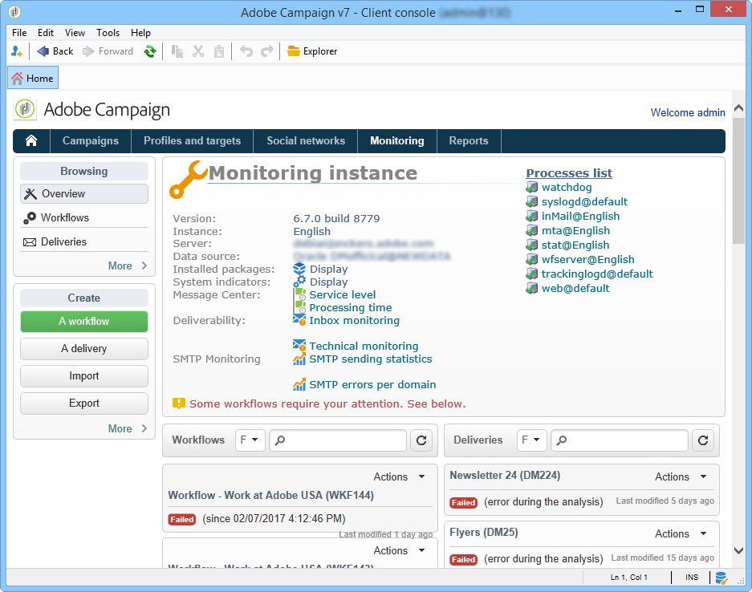

# 監視のガイドライン {#monitoring-guidelines}

## インスタンス監視ダッシュボード {#instance-monitoring-dashboard}

Campaign Classic ホームページからアクセスできる&#x200B;**[!UICONTROL 監視]** タブは、インスタンスの監視に役立つ主要な入口です。

インスタンスで何が発生しているかをダッシュボードで確認できます。ステータス（ビルドバージョン、インストール済みパッケージなど）、システムインジケーター、ログ、現在実行中のワークフロー、最終送信済み配信の状態など。

詳しくは、[こちら](../../production/using/monitoring-processes.md)を参照してください。

## Campaign Classic プロセスの監視 {#monitoring-campaign-classic-processes}

<table>
<tr><td>
<a href="#monitoring-instance">インスタンスの監視</a>
</td>
<td>
<a href="#monitoring-workflows">ワークフローの監視</a>
</td>
<td>
<a href="#monitoring-deliveries">配信の監視</a>
</td>
<td>
<a href="#monitoring-database">データベースの監視</a>
</td></tr>
</table>

様々なCampaign プロセスを監視する追加の方法を利用できます。 これらのツールは、システムが正常であることを確認するためにインスタンスを監視する複数の方法を提供し、ワークフローの設定や配信の送信時に発生する可能性のある問題を最終的にトラブルシューティングします。

### インスタンスの監視 {#monitoring-instance}

**自動監視ツール**

いくつかの自動方法を利用できます。 インスタンスを監視するのに役立つ機能です。 例えば、検出された異常値を含むメールレポートを設定したり、XML形式の指標のリストを取得したりできます。[詳細については、こちらをクリック ](../../production/using/monitoring-processes.md#automatic-monitoring)してください。

**監査記録**

監査証跡を使用すると、インスタンス内のオプション、ワークフロー、スキーマに関連する変更の完全な履歴を視覚化できます。 詳しくは、[ここをクリック](../../production/using/audit-trail.md)してください。

**コントロールパネル**

このCampaign コントロールパネルを使用すると、URL権限の管理、サーバーのビルドバージョンなどのインスタンスの詳細の確認など、インスタンスの複数の設定を管理できます。また、インスタンスに接続されているSFTP サーバーの空き容量を監視することもできます。 詳しくは、[ここをクリック](https://experienceleague.adobe.com/docs/control-panel/using/control-panel-home.html?lang=ja)してください。

>[!NOTE]
>
>コントロールパネルは、すべての管理者ユーザーがアクセスできます。 ユーザーに管理者アクセス権を付与する手順については、[このページ](https://experienceleague.adobe.com/docs/control-panel/using/discover-control-panel/managing-permissions.html?lang=ja#discover-control-panel)で詳しく説明しています。
>
>インスタンスは AWS でホストされ、[最新の GA ビルド](../../rn/using/rn-overview.md)でアップグレードされている必要があります。 バージョンを確認する方法については、[この節](../../platform/using/launching-adobe-campaign.md#getting-your-campaign-version)を参照してください。 インスタンスが AWS でホストされているかどうかを確認するには、[このページ](https://experienceleague.adobe.com/docs/control-panel/using/faq.html?lang=ja)で詳しく説明されている手順に従ってください。

### ワークフローの監視 {#monitoring-workflows}

**ワークフローヒートマップ**

ワークフローヒートマップでは、インスタンスで実行されているすべてのワークフローを視覚的に表現しました。 インスタンスの負荷を簡単に監視し、それに応じてワークフローを計画できます。 [Campaign v8 ドキュメント](https://experienceleague.adobe.com/docs/campaign/automation/workflows/monitoring-workflows/heatmap.html?lang=ja){target="_blank"}を参照してください。

**監査記録**

監査証跡を使用すると、ワークフローで行われたすべての変更と、現在の状態を視覚化できます。 [ここをクリック ](../../production/using/audit-trail.md)。

**ワークフローのトラブルシューティング**

ワークフロー実行で問題が発生した場合は、特定のアクションを実行できます。 詳細については、[ここをクリック ](../../production/using/workflow-execution.md)してください

**ワークフロー状態の監視**

ヒートマップに加えて、一連のワークフローのステータスを監視し、スーパーバイザーに定期的なメッセージを送信できるワークフローを作成できます。 [Campaign v8 ドキュメント](https://experienceleague.adobe.com/docs/campaign/automation/workflows/use-cases/monitoring/workflow-supervision.html?lang=ja){target="_blank"}を参照してください。

**一般ガイドライン**

ワークフローを使用する際に、ガイドラインとベストプラクティスに従うことで、パフォーマンスを向上させることができます。 詳しくは、次の節を参照してください。
* [ワークフローを使用する際のベストプラクティス](https://experienceleague.adobe.com/docs/campaign/automation/workflows/introduction/workflow-best-practices.html?lang=ja){target="_blank"}
* [ワークフローの実行の監視](https://experienceleague.adobe.com/docs/campaign/automation/workflows/monitoring-workflows/monitor-workflow-execution.html?lang=ja){target="_blank"}

### 配信の監視 {#monitoring-deliveries}

**SMTP レポート**

SMTP レポートには、配信の統計情報とドメイン別のSMTP エラーが表示されます。 [詳細情報](../../production/using/monitoring-processes.md)

**ベストプラクティス**

パフォーマンスを向上させるために、配信の送信と設計に関するベストプラクティスについて詳しくは、[Campaign v8 ドキュメント ](https://experienceleague.adobe.com/docs/campaign/campaign-v8/send/delivery-best-practices.html?lang=ja){target="_blank"}を参照してください。

**配信のトラブルシューティング**
配信に関する問題が発生した場合、特定のアクションを実行できます。
* [配信品質の問題](../../production/using/performance-and-throughput-issues.md#deliverability_issues)
* [画像の表示の問題](../../production/using/image-display-issues.md)
* [配信パフォーマンスの問題](../../delivery/using/delivery-performance-troubleshooting.md)
* [一時ファイルの問題](../../production/using/temporary-files.md) - *オンプレミスホスティングモデルのみ*

### データベースの監視 {#monitoring-database}

**データベースクリーンアップワークフロー**

データベースのクリーンアップワークフローを使用すると、古いデータをデータベースから削除できます。 データベースの急激な成長を避けることをお勧めします。 詳しくは、[ここをクリック](../../production/using/database-cleanup-workflow.md)してください。

**データベース パフォーマンスのトラブルシューティング**

データベースのパフォーマンスに問題が発生した場合は、特定のアクションを実行できます。 詳しくは、[ここをクリック](../../production/using/database-performances.md)してください。

**データベースのメンテナンス**

*オンプレミスおよびハイブリッドホスティングモデルのみ*

ディスク容量の過剰消費を避けて、データベースアクセスに影響を与えるように、データベースのメンテナンスを定期的に実行することをお勧めします。 詳しくは、[ここをクリック](../../production/using/recommendations.md)してください。

**バックアップと復元**

*オンプレミスおよびハイブリッドホスティングモデルのみ*

バックアップは、マシン上で（物理的またはシステム関連の）問題が発生した場合にデータが失われるのを防ぐために不可欠です。 詳しくは、[ここをクリック](../../production/using/backup.md)してください。 復元手順については、[この節](../../production/using/restoration.md)で説明します。

## Campaign Classicの技術原則 {#campaign-classic-technical-principles}

技術リソースについては、Campaign Classicのドキュメントを参照してください。 インスタンスに対して技術的な操作を実行する前に、これらのトピックについて詳しく知っておくことをお勧めします。

**モデルと機能のホスティング**

* [Campaign Classic ホスティングモデル](../../installation/using/hosting-models.md)
* [ホスティングモデル機能](../../installation/using/capability-matrix.md)

**サーバー設定**

*オンプレミスおよびハイブリッドホスティングモデルのみ*

* [サーバー設定](../../installation/using/configuring-campaign-server.md)
* [Serverconf.xml ファイル設定](../../installation/using/the-server-configuration-file.md)
* [配信品質のためのサーバー設定](../../installation/using/email-deliverability.md)
* [インスタンスを作成し、データベースを宣言するコマンドライン](../../installation/using/command-lines.md)

**一般原則**

* [Campaign Classic アーキテクチャ](../../production/using/general-architecture.md)
* [Campaign Classicモジュール](../../production/using/operating-principle.md)
* [Campaign Classicオプション](../../installation/using/configuring-campaign-options.md)
* [モジュールの自動起動の設定方法](../../production/using/administration.md)
* [キャンペーン設定の原則](../../production/using/configuration-principle.md)
* [トラブルシューティング手順](../../production/using/performance-and-throughput-issues.md)
