# プロセスの監視{#monitoring-processes}


アプリケーションサーバーとリダイレクトサーバー（**トラッキング**）は、手動または自動的に監視できます。

## 手動監視 {#manual-monitoring}

Adobe Campaign プロセス監視ページにアクセスするには、「**[!UICONTROL 監視]**」タブを参照し、**[!UICONTROL 概要]** リンクをクリックします。

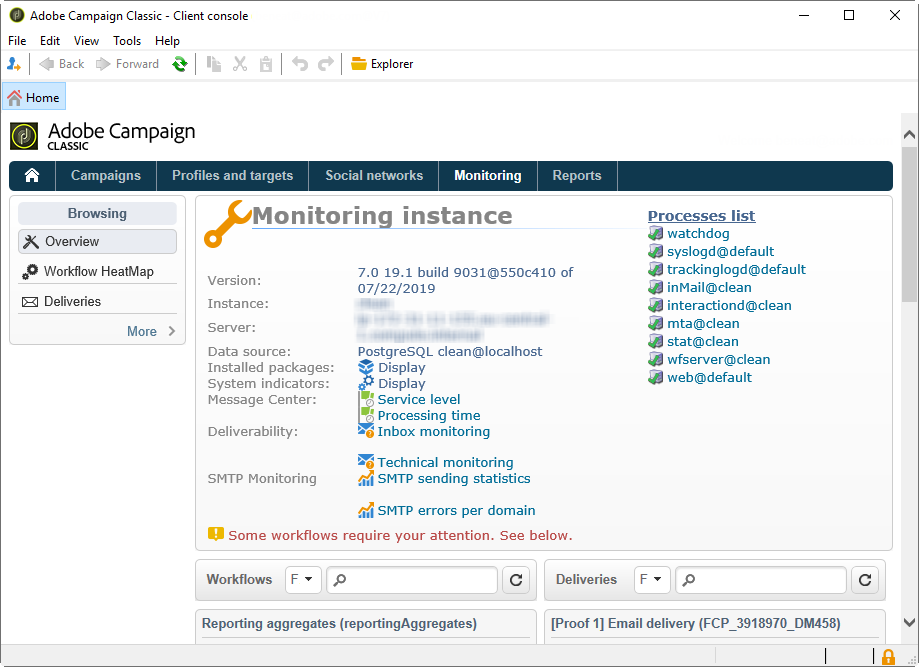

表示されるページでは、接続されたインスタンスの状態を表示できます。例：

* インスタンスに関する情報：バージョン、名前、データベースエンジン、インストール済みパッケージ、サーバーシステムインジケーター、
* 欠落しているプロセスと実行情報（開始日、PIDなど）のリスト。
* ワークフローと配信のビュー。

Campaign プロセスを監視する追加の方法については、[このページ ](../../production/using/monitoring-guidelines.md)で説明しています。

### ログ {#log-journal}

プロセスに関連するログジャーナルを表示するには、例えば&#x200B;**mta**&#x200B;というプロセスをクリックし、**[!UICONTROL ログジャーナルを開く]**&#x200B;を選択します。

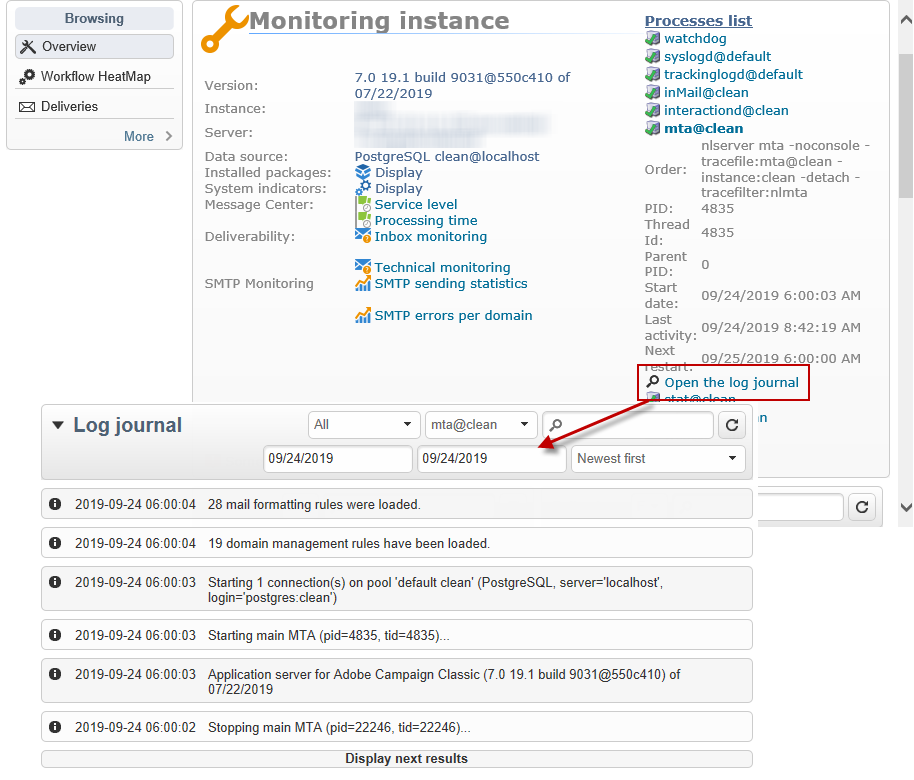

### システム指標 {#system-indicators}

システム インジケーターのリストを参照して、マシンに関する情報（物理メモリ、仮想メモリ、アクティブ プロセス、使用可能なディスク容量など）を表示します。 インジケーターは、LinuxおよびWindows オペレーティングシステムで異なります。 **[!UICONTROL インスタンス監視]** ページに移動し、**[!UICONTROL 表示]** リンクをクリックして、インジケーターのリストを開きます。

#### Windows {#in-windows}

* **[!UICONTROL 保留中のイベントがキューに入れられました]**: **Message Center**&#x200B;に固有のインジケーター。 [詳細情報](../../message-center/using/additional-configurations.md#monitoring-thresholds)

* **[!UICONTROL メモリ]**：物理メモリ （RAM）に関する情報。

  **[!UICONTROL 現在の値]**：現在のメモリ消費量。

  **[!UICONTROL 最大値]**: インストールされているメモリの合計量。

  **[!UICONTROL 使用可能]**：使用可能なメモリの量。

  **[!UICONTROL 警告]**: メモリ消費量が合計量の80%に達すると、このインジケーターが表示されます。

  **[!UICONTROL アラート]**: メモリ消費量が合計量の90%に達すると、このインジケーターが表示されます。

  **[!UICONTROL Warning]**&#x200B;および&#x200B;**[!UICONTROL Alert]** インジケーターが表示されたら、Adobe Campaign サーバーがインストールされているコンピューターにRAMを追加して問題を解決できます。 また、専用マシンにAdobe Campaign serverをインストールすることもできます。

* **[!UICONTROL スワップ メモリ]**: ページング ファイルに一致する仮想メモリに関連する情報：WindowsがRAMと同じように使用するハード ディスク上の領域。

  **[!UICONTROL 現在の値]**：実際のメモリ消費量。

  **[!UICONTROL 最大値]**: メモリの合計量。

  **[!UICONTROL 使用可能]**：使用可能なメモリの量。

  **[!UICONTROL 警告]**: メモリ消費量が合計量の80%に達すると、このインジケーターが表示されます。

  **[!UICONTROL アラート]**: メモリ消費量が合計量の90%に達すると、このインジケーターが表示されます。

  **[!UICONTROL 警告]**&#x200B;および&#x200B;**[!UICONTROL アラート]**&#x200B;指標が表示されたら、Windowsの詳細設定でExchange ファイルのサイズを大きくすることで、問題を解決できます。

* **[!UICONTROL ディスク XXX]**: マシンリーダーに関する情報。

  **[!UICONTROL 現在の値]**：実際に使用されているディスク容量。

  **[!UICONTROL 最大値]**：合計ディスク容量。

  **[!UICONTROL 使用可能]**：使用可能なディスク領域。

  **[!UICONTROL 使用済み]**：使用されているディスクの割合。

  **[!UICONTROL 警告]**：使用可能なディスク容量が合計容量の80%に達すると、このインジケーターが表示されます。

  **[!UICONTROL アラート]**：使用可能なディスク容量が合計容量の90%に達すると、このインジケーターが表示されます。

* **[!UICONTROL 古すぎるプロセスの数]**:1日以上有効になっているAdobe Campaign プロセスに関する情報。

  **[!UICONTROL 現在の値]**：現在アクティブなプロセス数。

  **[!UICONTROL 最大値]**：承認済みプロセスの最大数（1）。

  **[!UICONTROL アラート]**：このインジケーターは、プロセスの数が1に等しい場合に表示されます。

  **[!UICONTROL アラート]** インジケーターが表示されると、関係するプロセスがSQL データベース エンジンによってロックされているか、無限ループに停止している可能性があります。 Adobe Campaignが提供する&#x200B;**watchdog** プロセスは、すべてのプロセスを毎日自動的に再起動し、この問題を解決できるようにします。 ただし、関係するプロセスを自分で停止して、再起動を強制することもできます。

#### Linux {#in-linux}

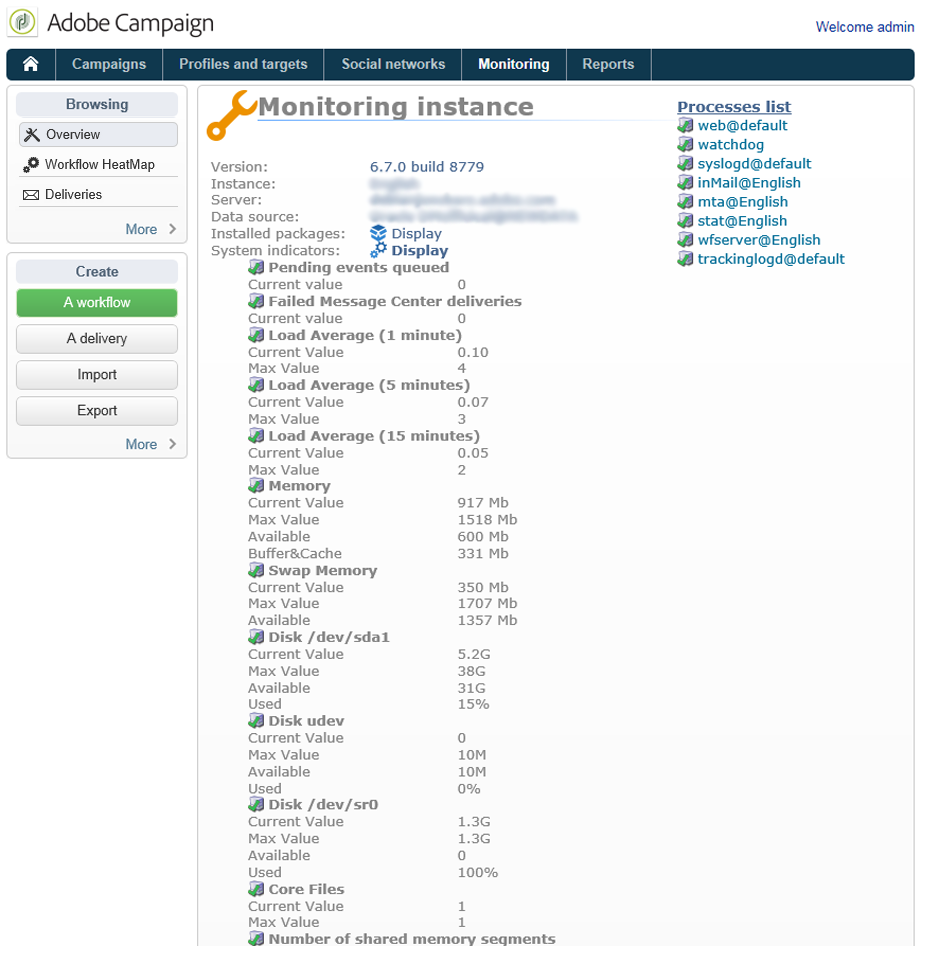

* **[!UICONTROL 保留中のイベントがキューに入れられました]**: **Message Center**&#x200B;に固有のインジケーター。 詳しくは、[この節](../../message-center/using/additional-configurations.md#monitoring-thresholds)を参照してください。

* **[!UICONTROL 負荷の平均（1/5/15分）]**：負荷に関する情報（最後の1分間、5分、または15分にわたってマシン上で実行されているプロセスによるプロセッサの使用率）

  **[!UICONTROL 現在の値]**: マシンの実際の負荷。

  **[!UICONTROL 最大値]**: マシン上のプロセスの最大使用負荷

  **[!UICONTROL 警告]**：このインジケーターは、最後の1分間、5分または15分にわたって負荷が最大承認値の80%に達したときに表示されます。

  **[!UICONTROL アラート]**：このインジケーターは、負荷が直前、5分、または15分の最大承認値の90%に達したときに表示されます。

* 物理メモリ （RAM）に関する情報&#x200B;**[!UICONTROL メモリ]**&#x200B;です。

  **[!UICONTROL 現在の値]**：実際のメモリ消費量。

  **[!UICONTROL 最大値]**: インストールされているメモリの合計量。

  **[!UICONTROL 使用可能]**：使用可能なメモリの量。

  **[!UICONTROL 警告]**: メモリ消費量が合計量の80%に達すると、このインジケーターが表示されます。

  **[!UICONTROL アラート]**: メモリ消費量が合計量の90%に達すると、このインジケーターが表示されます。

  **[!UICONTROL Warning]**&#x200B;および&#x200B;**[!UICONTROL Alert]** インジケーターが表示されたら、Adobe Campaign サーバーがインストールされているコンピューターにRAMを追加して問題を解決できます。 また、専用マシンにAdobe Campaign serverをインストールすることもできます。

* **[!UICONTROL スワップ メモリ]**: ページング ファイルに一致する仮想メモリに関連する情報：WindowsがRAMと同じように使用するハード ディスク上の領域。

  **[!UICONTROL 現在の値]**：実際のメモリ消費量。

  **[!UICONTROL 最大値]**: メモリの合計量。

  **[!UICONTROL 使用可能]**：使用可能なメモリの量。

  **[!UICONTROL 警告]**: メモリ消費量が合計量の80%に達すると、このインジケーターが表示されます。

  **[!UICONTROL アラート]**: メモリ消費量が合計量の90%に達すると、このインジケーターが表示されます。

  **[!UICONTROL 警告]**&#x200B;および&#x200B;**[!UICONTROL アラート]**&#x200B;指標が表示されたら、Exchange ファイルのサイズを大きくすることで問題を解決できます。

* **[!UICONTROL コアファイル]**: Adobe Campaign プロセスのクラッシュ後に生成されたファイルに関する情報。 これらのファイルを使用すると、クラッシュの原因を診断できます。

  **[!UICONTROL 現在の値]**：既存ファイルの数。

  **[!UICONTROL 最大値]**：許可されたファイルの最大数（1）。

  **[!UICONTROL 警告]**: ファイル数が1に近づくと、このインジケーターが表示されます。

  **[!UICONTROL アラート]**：このインジケーターは、ファイル数が1に等しい場合に表示されます。

  クラッシュによりプロセスが見つからない場合、プロセスのリストに赤で表示され、Adobe Campaignが提供する&#x200B;**watchdog** プロセスによって自動的に再開されます。

* **[!UICONTROL 共有メモリ セグメントの数]**：すべてのAdobe Campaign プロセスで共有されているメモリ セグメントに関する情報。

  **[!UICONTROL 現在の値]**：現在使用中のメモリーセグメントの数。

  **[!UICONTROL 最大値]**：許可されたメモリーセグメントの最大数（2）。

  **[!UICONTROL 警告]**：このインジケーターは、メモリセグメントの数が1に達したときに表示されます。

  **[!UICONTROL アラート]**：このインジケーターは、メモリセグメントの数が2に達したときに表示されます。

* **[!UICONTROL 古すぎるプロセスの数]**:1日以上有効なプロセスに関する情報。

  **[!UICONTROL 現在の値]**：現在アクティブなプロセス数。

  **[!UICONTROL 最大値]**：承認済みプロセスの最大数。

  **[!UICONTROL 警告]**：このインジケーターは、プロセス数が許可されたしきい値の80%に達したときに表示されます。

  **[!UICONTROL アラート]**：このインジケーターは、プロセス数が承認済みのしきい値の90%に達したときに表示されます。

* **[!UICONTROL ファイル ハンドル]**: ファイル記述子に関する情報（プロセスごとに開かれたファイルの数）。

  **[!UICONTROL 現在の値]**：現在のファイル記述子の数。

  **[!UICONTROL 最大値]**: オペレーティングシステムによって許可されるファイル記述子の最大数。

  **[!UICONTROL 警告]**：このインジケーターは、許可されたファイル記述子の数が80%のしきい値に達したときに表示されます。

  **[!UICONTROL アラート]**：このインジケーターは、許可されたファイル記述子の数が90%のしきい値に達したときに表示されます。

* **[!UICONTROL プロセス]**: マシン プロセスに関する情報。

  **[!UICONTROL 現在の値]**：現在アクティブなプロセス数。

  **[!UICONTROL 最大値]**：承認済みプロセスの最大数。

  **[!UICONTROL アクティブなプロセス]**：アクティブなプロセスの数。

  **[!UICONTROL 非アクティブなプロセス]**：非アクティブなプロセスの数。

  **[!UICONTROL 警告]**：このインジケーターは、承認されたプロセスの数が80%のしきい値に達したときに表示されます。

  **[!UICONTROL アラート]**：このインジケーターは、承認されたプロセスの数が90%のしきい値に達したときに表示されます。

* **[!UICONTROL ゾンビ プロセス]**：停止されたが、プロセス ID （PID）を持ち、プロセス テーブルに表示されたままのプロセスに関する情報。

  **[!UICONTROL 現在の値]**：現在アクティブなゾンビプロセスの数。

  **[!UICONTROL 最大値]**：承認ゾンビプロセスの最大数（2）。

  **[!UICONTROL 警告]**：このインジケーターは、ゾンビ プロセスの数が2に近づいたときに表示されます。

  **[!UICONTROL アラート]**：このインジケーターは、ゾンビプロセスの数が2に達したときに表示されます。

#### 指標のカスタマイズ {#customized-indicators}

Adobe Campaignでは、次の詳細に従って指標をカスタマイズできます。

1. **.sh** ファイルを作成し、**[!UICONTROL cust_indicators.sh]**&#x200B;という名前を付けます。
1. カスタマイズしたインジケーターをこのファイルに追加します。 例：

   ```
   #!/bin/bash 
   echo "<indicator name='Zombie Processes'>  
   <current label='Current Value' value='0' display=''/>  
   <warning value='2'/>  <alert value='2'/>  
   <max label='Max Value' value='2'/>
   </indicator>"
   ```

   または

   ```
   #!/bin/bash 
   echo "<indicator name='Availability'>  
   <current label='Last update of data' display='2012-09-03 10:00'/>  
   <current label='Availability last month' display='100.00%'/>  
   <current label='Availability this month' display='100.00%'/> 
   <current label='Recent downtime periods' display='2012-07-04 11:10:00 - 11:19:59'/>
   </indicator>"
   ```

1. ファイルを&#x200B;**[!UICONTROL usr/local/neolane/nl6]** フォルダーに保存します。

このファイルはAdobe Campaignによって呼び出されます。

## SMTP レポート {#smtp-reports}

SMTP配信モニタリングレポートは、Adobe Campaignプラットフォームに統合されます。 コンソールまたはWeb アクセスを使用してアクセスできます。

これらのレポートには、ドメイン別のSMTP配信統計とSMTP エラーが表示されます。 アクセスするには、オペレーターに&#x200B;**管理**&#x200B;権限が必要です。

これらは、**監視**/「SMTP監視」の下にグループ化されます。

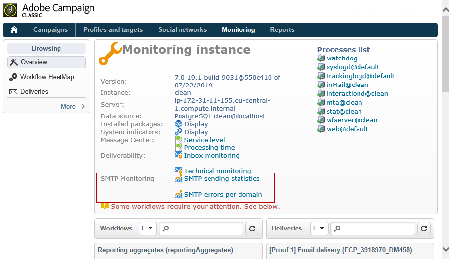

>[!IMPORTANT]
>
>* SMTP監視に関する情報は、メールチャネルがアクティブ化されている場合にのみ利用できます。
>* **[!UICONTROL SMTP送信統計]**&#x200B;は、統計サーバーがインスタンスで開始されている場合にのみ提供されます。
>

### SMTP 送信統計 {#smtp-sending-statistics}

**[!UICONTROL SMTP送信統計]** レポートでは、サーバーアクティビティを制御できます。 各マタチャイルドの合成が表示されます。

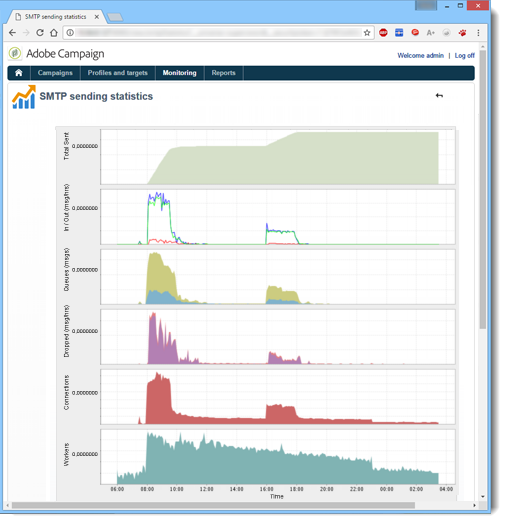

このレポートの指標のリストは、グラフの下に表示されます。

1. 送信されたメッセージの合計数。
1. イン/アウト メッセージを表します。

   * 青い線：Shaperに到着した送信準備ができたメッセージ、つまりSMTPを送信する前の最後の段階（受信データと一致する）。

   * 緑の線：メッセージが正常に送信されました（送信データと一致します）。

   * 赤線：Shaperによって放棄されたメッセージが&#x200B;**mta**&#x200B;に返されます（この回復時に拒否されたデータと一致します）。

   これらの値は、1時間あたりのメッセージ数で表されます。

1. Shaperの2つのキューを表します。

   * 青いカーブ：アクティブなメッセージのキュー。 これらのメッセージはできるだけ早く送信されます。

   * カキ曲線：「延期」キュー。 スロットリングのため、またはターゲットへの接続が利用できないため、これらのメッセージを一時的に返すことはできません。 再試行は、定義された&#x200B;**MaxAgeSec**&#x200B;時間の5秒、10秒、20秒、40秒、2分ごとに行われ、その後放棄されます。

1. このグラフは、放棄されたメッセージの詳細（2番目のグラフの赤いカーブ）を示します。再試行せずに放棄されたメッセージ（mauve）と、送信に失敗したメッセージ（赤）の割合を示します。 これにより、統計サーバーの制限（スロットリング）またはリモートサーバーの使用不能により、許可された期間内に処理されなかったメッセージの割合を表示できます。
1. SMTP 接続が既にオープンしているか、現在オープン中です。
1. **mtachild**&#x200B;の数の見積もり。

>[!NOTE]
>
>このレポートは、メールトラフィックシェーパーコンポーネントのステータスに関連しています。

### 各ドメインの SMTP エラー {#smtp-errors-per-domain}

このレポートでは、設定された期間における配信エラーをドメイン別に表示できます。

>[!NOTE]
>
>**serverConf.xml** ファイルの&#x200B;**minConnectionsToLog**、**minErrorsToLog**&#x200B;および&#x200B;**minMessagesToLog** オプションは、接続統計を考慮する上でのしきい値を定義します。

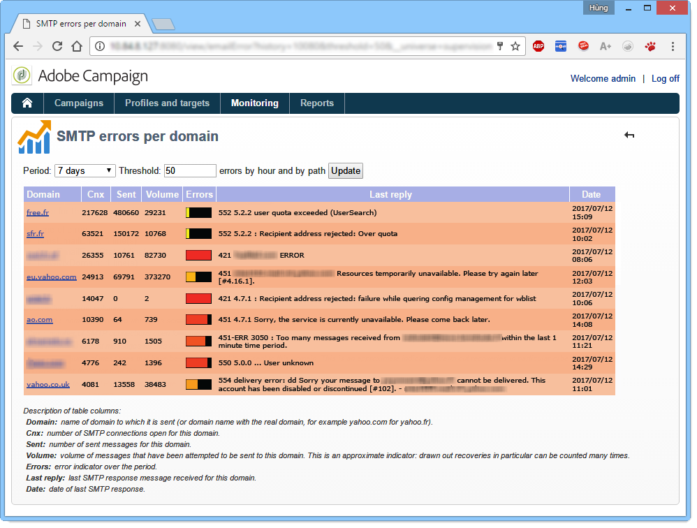

このレポートの指標のリストを表の下に示します。

* **ドメイン**&#x200B;列には、メッセージの送信先ドメインの名前（たとえば、yahoo.frの場合は実際のドメイン名yahoo.com）が含まれます。
* **Cnx**&#x200B;列には、このドメインに対して開かれているSMTP接続の数が表示されます。
* **送信済み**&#x200B;列は、このドメインに送信されたメッセージの数，
* **Volume**&#x200B;列には、このドメインに送信しようとしたメッセージの量（概算の値）が表示されます。
* **エラー**&#x200B;列には、期間中のこのドメインのエラーのボリュームインジケーターが表示されます。
* **最後の応答**&#x200B;列には、このドメインに対して受信した最後のSMTP応答メッセージが表示されます。
* **日付**&#x200B;列には、このドメインに対して受信した最後のSMTP応答の日付が表示されます。

>[!NOTE]
>
>**Cnx**、**送信済み**、**ボリューム**&#x200B;の各列に表示される値は、**[!UICONTROL 期間]** フィールドで選択した期間に対して計算されます。

ドメイン名をクリックして、そのエラーを表示します。

PublicIdで分類されます。このIDは、ルータの背後にある複数のAdobe Campaign mtaによって共有されるIP アドレスに対応します。 統計サーバーは、この識別子を使用して、この開始点とターゲットサーバー間の接続と配信の統計を記憶します。

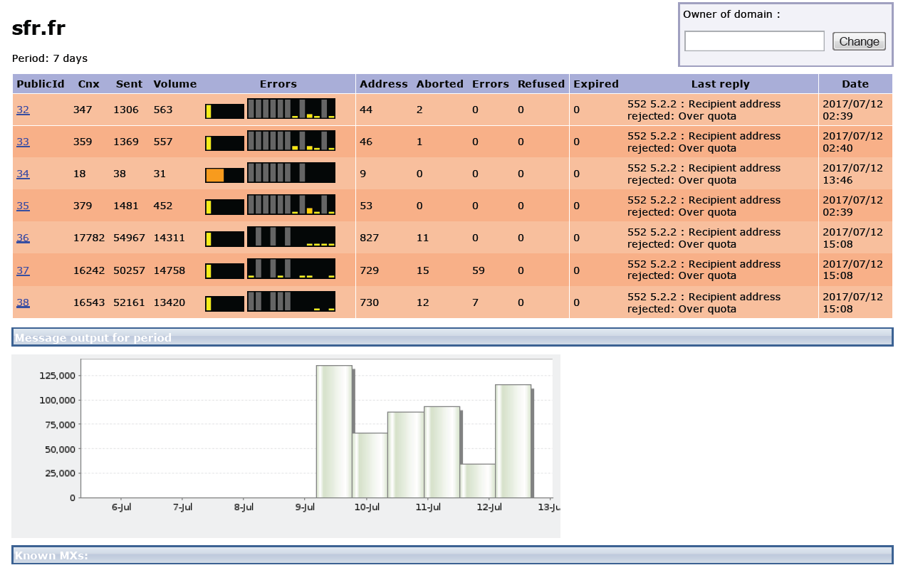

「**[!UICONTROL ドメインの所有者]**」フィールドを使用すると、同じラベルの下に様々なドメイン名をグループ化できます。 最初のレポートビューでは、すべてのMX ドメイン名がこの所有者に関連付けられます。

PublicId識別子をクリックすると詳細が表示されます。

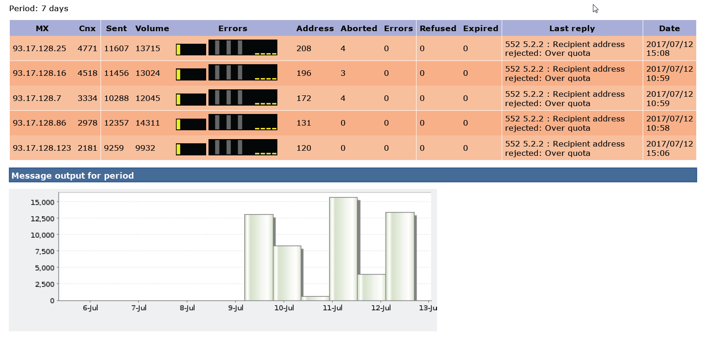

>[!NOTE]
>
>エラーの割合は2つのグラフで表されます。 1つ目は、黒い背景の水平なプログレスバーです。 2番目のグラフは時系列です。 選択した期間は12の時間間隔に分割され、それぞれ垂直方向の進行状況バーで表されます。 両方の表示で、エラーが検出されない場合、バーは黒になります。 バーの色は、発生したエラーの割合（黄色、次にオレンジ、最後に赤）によって異なります。 グレーの色は、大きなデータ量が見つからないことを意味します。 グラフにカーソルを置くと、エラーの正確な割合を表示できます。

>[!NOTE]
>
>SMTP エラーとAdobe CampaignでのSMTP エラーの管理について詳しくは、[この節](../../installation/using/email-deliverability.md)を参照してください。

## 請求レポート {#billing-report}

**[!UICONTROL 請求]** テクニカルワークフローは、システムアクティビティレポートをメールで「請求」オペレーターに送信します。 デフォルトでは、マーケティングインスタンスでは毎月25日にトリガーされます。

テクニカルワークフローは、次のノードのサブフォルダーにあります：**管理** > **実稼動** > **テクニカルワークフロー**。

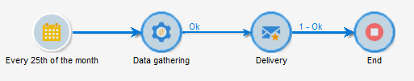

ワークフローが25日ごとに開始されると、請求担当者は次のレポートを受信トレイに届けます。

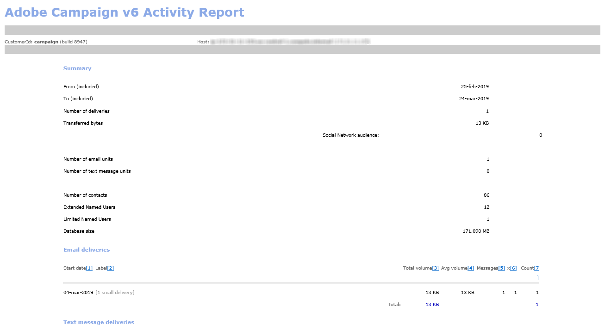

配信を追跡するには、次の指標を使用できます。

* **[!UICONTROL 開始日]**：配信の開始日。 レポートの「開始日」より前の日付にすることができます。
* **[!UICONTROL ラベル]**：配信のラベル。 送信するメッセージが100未満の配信は小さすぎると見なされ、開始日ごとに集計されます。この場合、ラベルには集計の数が表示されます（例：[3件の小さな配信の集計]）。
* **[!UICONTROL 合計ボリューム]**：配信のために転送されたバイトの合計量。
* **[!UICONTROL 平均ボリューム]**：転送されたバイト数の平均。 これは、次の式&#x200B;**（合計ボリューム / メッセージ）**&#x200B;の結果です。これは、**[!UICONTROL 乗数]**&#x200B;指標の計算基準です。
* **[!UICONTROL メッセージ]**：送信されたメッセージ数。 これには、正常に送信されたメッセージと再試行の両方が含まれます（連絡を取ったサーバーからバウンスメッセージを受信した後）。
* **[!UICONTROL 乗数（x）]**：乗数の値は、メッセージの平均音量から差し引かれます。
* **[!UICONTROL Count]**：メッセージと乗数の乗算の結果。

## 自動監視 {#automatic-monitoring}

Adobe Campaignでは、以下に示すいくつかの自動モニタリング手法を提供しています。

### コマンドライン {#command-line}

コマンド

**nlserver monitor**

Adobe Campaign モジュールとシステムに関する一連の指標を一覧表示できます。

簡単に処理できるXML形式で出力を生成します。

このコマンドは、**-missing** パラメーターでも実行できます。このパラメーターには、設定ファイルで実行する必要があると判断されたときに、このインスタンスに欠落しているプロセスが一覧表示されます。

```sql
nlserver monitor -missing
HH:MM:SS > Application server for Adobe Campaign Classic (7.X YY.R build XXX@SHA1) of DD/MM/YYYY
mta@prod
stat@prod
wfserver@prod
```

### サーバーによって公開された情報 {#information-published-by-the-server}

#### /r/test {#r-test}

**http （s）://`<application>`/r/test** ページは、リダイレクションサーバーのテストに使用されます。 トラッキングに使用するフロントタルサーバーをテストするには、この方法を使用することをお勧めします。 このページは、ロードディスパッチャーのテストにも使用できます。

次のような行がXML形式で表示されます。

```
<redir status='OK' date='YYYY-MM-DD HH:MM:SS.112Z' build='XXXX' host='<hostname>' localHost='<servername>'/>
```

**頻度**：このテストでは負荷が使用されないため、非常に頻繁に（例：毎秒1回）実行できます。

#### /nl/jsp/ping.jsp {#nl-jsp-ping-jsp}

この&#x200B;**http （s）://`<Application server url>`/nl/jsp/ping.jsp** ページは、ネットワークの対応者と同じように動作します。apache/tomcat/web モジュール/データベースを経由してクエリ全体をテストし、クライアントにアップロードします。 すべてが正常に動作している場合は、「OK」が返されます。 データベース（mtaやアンケートなど）にアクセスできるマシンでこのテストを実行することをお勧めします。

**使用状況**：リモートでログインするには、オペレーターのログインに関連付けられたセッショントークンを引数として渡す必要があります（[Adobe Campaign スクリプトによる自動モニタリング ](#automatic-monitoring-via-adobe-campaign-scripts)のヒントを参照）。

例：

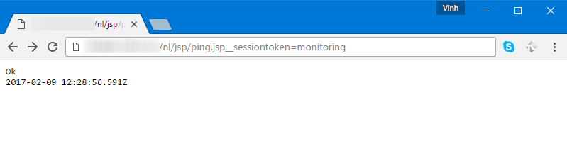

オペレーター名とログインは、事前にデータベース権限を持つAdobe Campaign クライアントコンソールで設定する必要があります。

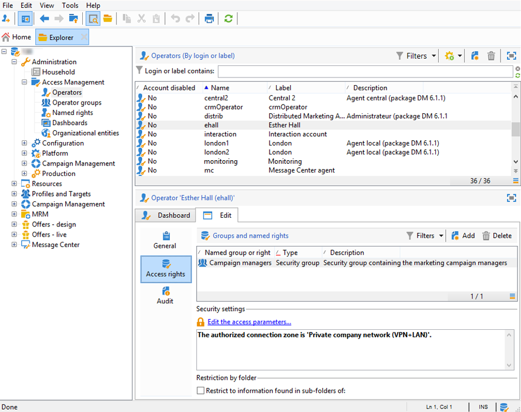

**頻度**：これは、帯域幅をほとんど使用しないテストです。 したがって、1分に1回以上ではありませんが、かなり頻繁に実行できます。

#### /nl/jsp/monitor.jsp {#nl-jsp-monitor-jsp}

これは、オペレーターがweb ページ経由でAdobe Campaign サーバーにアクセスできるかどうかを確認するためのテストです。クライアントコンソールメニュー経由でアクセスされるweb ページと同じweb ページです。 このページは、監視ツール（Tivoli、Nagiosなど）から呼び出すことができます。

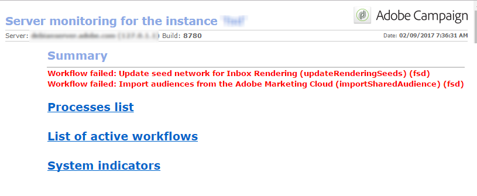

**使用状況**: インスタンスに接続できるオペレーターログインに関連付けられたセッショントークンを引数として使用する必要があります（[Adobe Campaign スクリプトによる自動モニタリング ](#automatic-monitoring-via-adobe-campaign-scripts)のヒントを参照）。

オペレーターとそのログインは、適切なデータベース権限と制限を使用して、以前にAdobe Campaign クライアントコンソールで設定する必要があります。

**頻度**：これは完全なサーバーテストであり、頻繁に実行する必要はありません（例えば、10分ごとに1回実行できます）。

#### /nl/jsp/soaprouter.jsp {#nl-jsp-soaprouter-jsp}

この&#x200B;**jsp**&#x200B;は、Adobe Campaign アプリケーション APIのエントリ ポイントを表します。 そのため、アプリケーションの詳細なモニタリングを行うことができます。 また、Adobe Campaign web サービスのモニタリングにも使用できます。 これは監視スクリプトで使用されますが、これはパワーユーザー専用であることに注意してください。

### デプロイメントタイプに基づく監視 {#monitoring-based-on-deployment-types}

Adobe Campaignでは、さまざまなデプロイメント設定を有効にします（詳しくは、[この節](../../installation/using/hosting-models.md)を参照してください）。 このセクションでは、インストールの種類に応じて適用される様々な自動監視技術について詳しく説明します。

<table> 
 <thead> 
  <tr> 
   <th> デプロイメントタイプ </th> 
   <th> 監視 </th> 
  </tr> 
 </thead> 
 <tbody> 
  <tr> 
   <td> スタンドアロン </td> 
   <td> 
    <ul> 
     <li><p> Adobe Campaign サーバーの<span class="uicontrol">/r/test</span>および<span class="uicontrol">/nl/jsp/monitor.jsp</span></p> </li> 
    </ul> </td> 
  </tr> 
  <tr> 
   <td> 標準 </td> 
   <td> 
    <ul> 
     <li><p> <span class="uicontrol">/r/test</span>および<span class="uicontrol">/nl/jsp/ping.jsp</span> （フロントタルサーバー上）</p> </li> 
     <li><p> アプリケーションサーバー上の<span class="uicontrol">/nl/jsp/monitor.jsp</span></p> </li> 
    </ul> </td> 
  </tr> 
  <tr> 
   <td> エンタープライズ </td> 
   <td> 
    <ul> 
     <li><p> <span class="uicontrol">/r/test</span>および<span class="uicontrol">/nl/jsp/ping.jsp</span> （フロントタルサーバー上）</p> </li> 
     <li><p> <span class="uicontrol">/r/test</span>および<span class="uicontrol">/nl/jsp/monitor.jsp</span> （アプリケーションサーバー上）</p> </li> 
    </ul> </td> 
  </tr> 
  <tr> 
   <td> ミッドソーシング </td> 
   <td> 
    <ul> 
     <li><p> アプリケーションサーバー上の<span class="uicontrol">/nl/jsp/monitor.jsp</span></p> </li> 
    </ul> </td> 
  </tr> 
 </tbody> 
</table>

## Adobe Campaignスクリプトによる自動監視 {#automatic-monitoring-via-adobe-campaign-scripts}

Adobe Campaignには、検出された異常値に関するレポートを電子メールで送信できるインスタンス監視ツール（netreport）が用意されています。

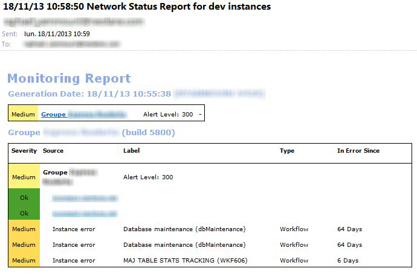

>[!IMPORTANT]
>
>このツールは、インスタンスのモニタリングに使用できますが、Adobe Campaignではサポートされていません。 詳細については、キャンペーン管理者にお問い合わせください。

### 必須エレメント {#required-elements}

自動モニタリングには、以下のインストール前の注意が必要です。

* **netreport.tgz** （Linux インストール）または&#x200B;**netreport.zip** （Windows インストール）ファイルが必要です。
* 監視するマシンに監視をインストールしないことを強くお勧めします。
* jreまたはJDKを持つマシンにインストールする必要があります，
* linuxでは、監視するコンピューターに&#x200B;**bc** パッケージが必要です。 詳しくは、[この節](../../installation/using/installing-packages-with-linux.md#distribution-based-on-rpm--packages)を参照してください。

### インストール手順 {#installation-procedure}

インストール手順は次のとおりです。

1. コンソールで、必要に応じて新しいオペレーターを作成します（監視ユーザーは既に存在します）。ただし、権限は割り当てません。
1. アーカイブ抽出を実行します。
1. **readme** ファイルを読み取ります。
1. **netconf.xml**&#x200B;設定ファイルを更新します。
1. **netreport.bat** （Windows）または&#x200B;**netreport.sh** （Linux）ファイルを更新します。

### netconf.xml ファイルの設定 {#configuring-the-netconf-xml-file}

XML設定ファイルには、次の要素が含まれています。

* [&#39;Properties&#39;要素](#properties--element)
* [&#39;Instance&#39;要素](#instance--element)
* [&#39;Host&#39;要素](#host--element)
* [サブエレメント](#sub-elements)

次に、設定の例を示します。

```
<?xml version="1.0" encoding="ISO-8859-1"?>
<netconf>
  <properties mailServer="mail.adobe.net" mailFrom="mail@adobe.com" recipientList="recipient@adobe.com">
    <nightMode start="00:00 am" end="07:00 am"/>
    <buildRange minimum="7829" maximum="8180"/>
    <buildRange minimum="8300" maximum="8400"/>
    <sla/>
  </properties>

  <instance name="dev" recipientList="mail@mail.com,mail2@mail.com">
                <host name="devrd.domain.com" alias="devrd" sessiontoken="monitoring" criticalLevel="1" filter="wkf;new">
                                <ncs instance="devrd" url="/nl/jsp/soaprouter.jsp" includeDead="false" isSecure="false"/>
                                <redir url="/r/test"/>
                                <http url="/nl/jsp/ping.jsp"/>
                </host>
                <host name="devtrk.domain.com" alias="devtrk" sessiontoken="monitoring" criticalLevel="0" filter="wkf;new">
                                <ncs instance="devrd" url="/nl/jsp/soaprouter.jsp" includeDead="true" isSecure="false"/>
                </host>
  </instance>
  <host name="dev-test" alias="dev-test" sessiontoken="monitoring" criticalLevel="2">
                <ncs instance="dev" url="/nl/jsp/soaprouter.jsp" includeDead="false"/>
  </host>
</netconf>
```

>[!NOTE]
>
>様々な設定を指定するには、**netconf.xml** ファイルにサフィックスを追加します（例：**netconf-dev.xml**、**netconf-prod.xml**&#x200B;など）。次に、**$JAVA_HOME/bin/java netreport dev**&#x200B;または&#x200B;**@%JAVA_HOME%binjava netreport prod**&#x200B;を追加して、**netreport.bat**&#x200B;または&#x200B;**netreport.sh** ファイルでnetreportを実行するために使用する設定を指定します。

>[!IMPORTANT]
>
>**監視** オペレーターが機能するには、netreportが実行されるコンピューターが&#x200B;**sessionTokenOnly** モードのセキュリティ ゾーンにある必要があります。 このオペレーターに信頼できるIP マスクが指定されていない場合、セキュリティゾーンも&#x200B;**allowEmptyPassword**&#x200B;および&#x200B;**allowUserPassword** モードである必要があります。

#### &#39;Properties&#39;要素 {#properties--element}

この要素は、メールの設定（つまり）を入力するために使用されます。

* **mailServer**: メールの送信に使用されるSMTP サーバー（例：smtp.domain.net）。
* **mailFrom**: レポート送信者の電子メールアドレス（例：monitoring@domain.net）。
* **recipientList**：監視受信者の電子メールアドレスのリスト。 アドレスはコンマで区切る必要があります（スペースは使用しません）。
* &#39;**night**&#39; モード （オプション）は、指定された時間間隔でメールを送信しないようにするために使用されます。 代わりに、データが統合され、夜間のアクティビティに関する電子メールが終了時刻の後に送信されます（デフォルトでは7:00）。
* **buildRange** サブ要素（オプション）を使用すると、最小および最大のビルド番号を指定できます。 ビルド番号がこの範囲に入らないすべてのマシンに対してエラーが生成されます

  ```
  <buildRange minimum="0000" maximum="9999"/>
  ```

* **properties**&#x200B;要素に&#x200B;**`<sla>`** （オプション）サブ要素を追加できます。 netreportが実行されるたびにログファイルが生成されます。 ファイル名には、設定名と日時（例：**dev_06_12_13_16_47_05.tmp**）が含まれます。 このファイルには、インスタンス名、マシン名、重大度レベル、（0～3、最小から最も重要）、日付（タイムスタンプ形式）、クエリと応答の間の経過時間（ミリ秒単位）、使用されるサービス（http、ncs、ncsex、redir）が含まれます。 この情報は、各サービスの最後に、表形式記号と改行で区切られます。

>[!NOTE]
>
>**`<property>`**&#x200B;要素に「true」の値を持つ&#x200B;**persistHtmlFile**&#x200B;属性を使用して、ファイル **netreport.md**&#x200B;に最新の監視ステータスを記録します。 このファイルはインストールディレクトリに保存されます。

#### &#39;Instance&#39;要素 {#instance--element}

この要素を使用すると、複数のマシン（ホスト）を同じインスタンスに再グループ化できます。 インスタンス名は、監視メールの最初の部分に表示されます。 インスタンスの名前をクリックすると、各マシンに関する詳細にアクセスできます。

```
instance name="instance-name" recipientList="mail@mail.com,mail2@mail.com">
                <host name="devcamp.domain.com" ...>
                       ...
                </host>
                <host name="devtrack.domain.com" ...>
                       ...
                </host>
</instance
```

* **name**：電子メールの最初の部分に表示されるインスタンス名。
* **recipientList** （オプション）：特定のインスタンスに関する監視レポートを電子メールで送信できます。

#### &#39;Host&#39;要素 {#host--element}

この要素は、ホスト上の特定のサーバーの監視を設定します（例：）。

* **name**：監視するコンピューターの名前。
* **エイリアス** （オプション）：レポートに表示される監視対象マシンの名前。
* **sessionToken**：承認済みセッショントークンを使用してログイン認証を提供します。

  セッショントークンを設定するには、Adobe Campaign コンソールで&#x200B;**monitoring** オペレーターを選択します。 「**アクセス権**」タブで、このインスタンスの監視を許可されたマシンのIP アドレスを指定します。 その後、**monitoring**&#x200B;識別子を使用して、パスワードを指定しなくても、これらのマシンから監視ページに接続できるようになります。

  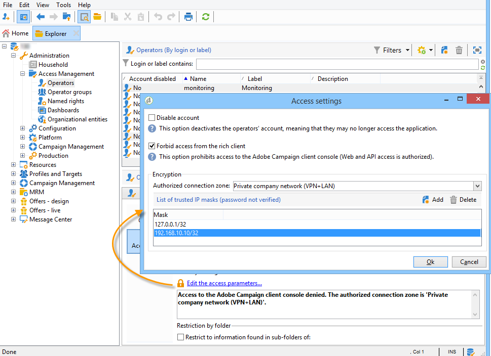

* **criticalLevel** （オプション）：重大度レベルで表示されるエラーを並べ替えることができます。 可能な値は、「0」（すべてのレベルが表示されます）、「1」（高いエラーと重大なエラーのみが表示されます）、「2」（重大なエラーのみが表示されます）です。 この属性が指定されていない場合は、すべてのエラーレベルが表示されます。
* **filter** （オプション）：特定のワークフローエラー（例：**filter=&quot;wkf;wkf1&quot;**）を除外できます。 ワークフローラベルは、セミコロンで区切る必要があります。

#### サブエレメント {#sub-elements}

* **tcp**: サーバーがアップまたはダウンしているかどうかを確認します。 ポート番号を入力してください。
* **http**: Web サーバーが存在することを確認します（アプリケーションサーバーが動作しています）。
* **ncs**: &#39;instance&#39;属性に入力されたインスタンスのプロセス （ワークフローエラー、メモリ使用率など）を確認します。 **included** （必須）属性を使用すると、停止しているプロセス （&#39;true&#39;または&#39;false&#39;の値）を表示するオプションが表示されます。
* **redir**：追跡を確認します。

ほとんどの場合、**ncs**&#x200B;および&#x200B;**redir**&#x200B;のサブ要素のみを保持できます。

いずれの場合でも、特定のノードをサブ要素でオーバーロードできます（例えば、ノード **port=75**&#x200B;を使用して、http、ncs、またはredir接続に使用されるポートをオーバーロードします）。

```
<ncs instance="clap40" url="/nl/jsp/soaprouter.jsp" includeDead="false" port="80"/>
```

**ncs**、**redir**、**http**&#x200B;のサブ要素では、**isSecure**&#x200B;属性（オプション）を追加して、https プロトコル（&#39;true&#39;または&#39;false&#39;の値）を使用するかどうかを選択できます。 この属性が指定されていない場合は、http プロトコルが使用されます。

### netreport.batまたはnetreport.sh ファイルの設定 {#configuring-the-netreport-bat-or-netreport-sh--file}

設定するには、このファイルを編集し、JREまたはJDKがインストールされているディレクトリを指定します。

### 監視の開始 {#launching-monitoring}

監視を開始するには、**netreport.bat**&#x200B;または&#x200B;**netreport.sh** ファイルをスクリプトを介して定期的に実行します。 レポートは、最初の実行後に送信され、その後、ステータスが変更された場合にのみ送信されます。

### テストの監視 {#testing-monitoring}

監視をテストするには、**netreport.bat**&#x200B;または&#x200B;**netreport.sh** ファイルを実行します。

**netconf.xml** ファイルの&#x200B;**recipientList**&#x200B;で指定された受信者に電子メールが送信されます。
