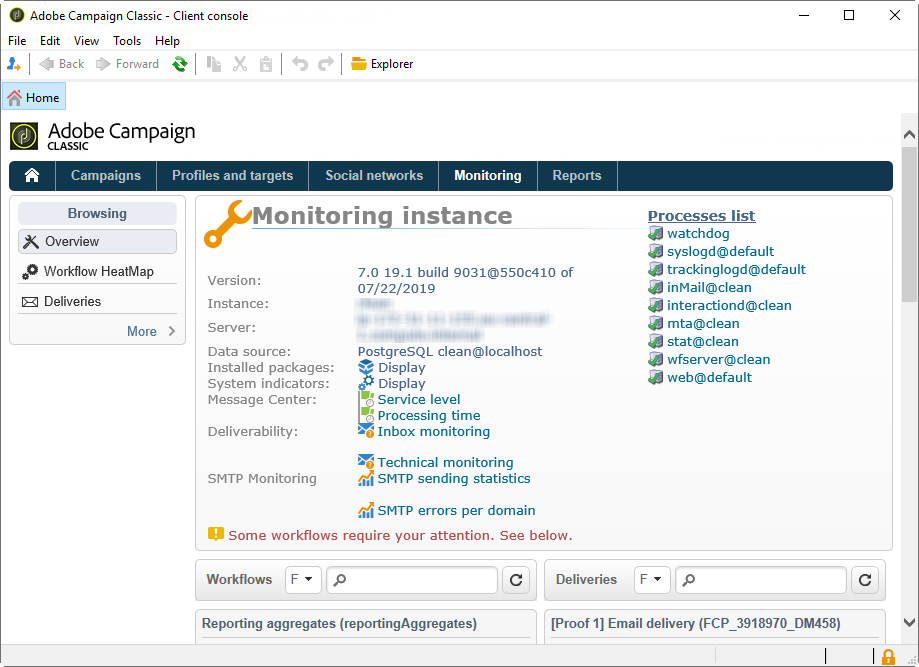

# プロセスの監視{#monitoring-processes}


アプリケーションサーバーとリダイレクションサーバー (**tracking**) は、手動または自動で監視できます。

## 手動監視 {#manual-monitoring}

に移動します。 **[!UICONTROL 監視]** をクリックし、 **[!UICONTROL 概要]** 「 Adobe Campaign Process Monitoring 」ページを表示するリンクです。



表示されるページで、接続されたインスタンスの状態を確認できます。例：

* インスタンスに関する情報：バージョン、名前、データベースエンジン、インストール済みパッケージ、サーバーシステムインジケーター、
* 見つからないプロセスと実行情報（開始日、PID など）のリスト
* ワークフローと配信のビュー。

様々なキャンペーンプロセスを監視するその他の方法については、[このページ](../../production/using/monitoring-guidelines.md)で説明しています。

### ログ {#log-journal}

プロセスに関連するログジャーナルを表示できます。 これをおこなうには、プロセスをクリックします。 **mta** 例えば、「 **[!UICONTROL ログジャーナルを開く]** .


### システム指標 {#system-indicators}

システムインジケータのリストを使用すると、物理メモリと仮想メモリ、アクティブなプロセス、使用可能なディスク領域など、マシンに関する情報を表示できます。 インジケータは、Linux と Windows のオペレーティングシステムで異なります。 次に移動： **[!UICONTROL インスタンスの監視]** ページで **[!UICONTROL 表示]** 指標のリストを開くためのリンク

#### Windows {#in-windows}

* **[!UICONTROL 保留中のイベントがキューに入れられました]** :特有の指標 **Message Center**. 詳しくは、[この節](../../message-center/using/additional-configurations.md#monitoring-thresholds)を参照してください。

* **[!UICONTROL メモリ]** :物理メモリ (RAM) に関する情報。

   **[!UICONTROL 現在の値]** :実際のメモリ消費量。

   **[!UICONTROL 最大値]** :インストールされたメモリの合計容量。

   **[!UICONTROL 利用可能]** :使用可能なメモリの量。

   **[!UICONTROL 警告]** :このインジケータは、メモリ消費量が合計量の 80%に達した場合に表示されます。

   **[!UICONTROL アラート]** :このインジケータは、メモリ消費量が合計量の 90%に達した場合に表示されます。

   次の場合に **[!UICONTROL 警告]** および **[!UICONTROL アラート]** インジケーターが表示され、Adobe Campaignサーバーがインストールされているマシンに RAM を追加することで、問題を解決できます。 また、専用マシンにAdobe Campaignサーバーをインストールすることもできます。

* **[!UICONTROL スワップメモリ]** :ページングファイルに一致する仮想メモリに関する情報：Windows が RAM のように使用するハードディスク上の領域。

   **[!UICONTROL 現在の値]** :実際のメモリ消費量。

   **[!UICONTROL 最大値]** :メモリの合計容量。

   **[!UICONTROL 利用可能]** :使用可能なメモリの量。

   **[!UICONTROL 警告]** :このインジケータは、メモリ消費量が合計量の 80%に達した場合に表示されます。

   **[!UICONTROL アラート]** :このインジケータは、メモリ消費量が合計量の 90%に達した場合に表示されます。

   次の場合に **[!UICONTROL 警告]** および **[!UICONTROL アラート]** インジケータが表示され、Windows の詳細設定で exchange ファイルのサイズを大きくすると、問題を解決できます。

* **[!UICONTROL ディスク XXX]** :マシンリーダーに関する情報。

   **[!UICONTROL 現在の値]** :実際に使用されたディスク容量。

   **[!UICONTROL 最大値]** :合計ディスク容量。

   **[!UICONTROL 利用可能]** :空きディスク容量

   **[!UICONTROL 使用済み]** :使用ディスクの割合。

   **[!UICONTROL 警告]** :このインジケータは、使用可能なディスク容量が合計容量の 80%に達した場合に表示されます。

   **[!UICONTROL アラート]** :このインジケータは、使用可能なディスク容量が合計容量の 90%に達した場合に表示されます。

* **[!UICONTROL 古すぎるプロセスの数]** :1 日以上アクティブになっているAdobe Campaignプロセスに関する情報です。

   **[!UICONTROL 現在の値]** :現在アクティブなプロセスの数。

   **[!UICONTROL 最大値]** :許可されているプロセスの最大数 (1)。

   **[!UICONTROL アラート]** :この指標は、プロセスの数が 1 に等しい場合に表示されます。

   次の場合に **[!UICONTROL アラート]** インジケータが表示される場合は、該当するプロセスが SQL データベースエンジンによってロックされているか、無限ループに陥っている可能性があります。 この **監視** Adobe Campaignが提供するプロセスは、毎日すべてのプロセスを自動的に再起動します。これにより、この問題を解決できます。 ただし、関係するプロセスを自分で停止して、強制的に再開することもできます。

#### Linux {#in-linux}


* **[!UICONTROL 保留中のイベントがキューに入れられました]** :特有の指標 **Message Center**. 詳しくは、[この節](../../message-center/using/additional-configurations.md#monitoring-thresholds)を参照してください。

* **[!UICONTROL 負荷平均 (1/5/15分 )]** :負荷に関する情報、すなわち、最後の 1 分、5 分、15 分間にわたってマシン上で実行されるプロセスによるプロセッサの使用率

   **[!UICONTROL 現在の値]** :装置の実際の負荷。

   **[!UICONTROL 最大値]** :マシン上のプロセスの最大使用負荷

   **[!UICONTROL 警告]** :この指標は、最後の 1 分、5 分または 15 分で、負荷が許可された最大値の 80%に達した場合に表示されます。

   **[!UICONTROL アラート]** :この指標は、負荷が最後の 1 分、5 分、15 分の最大許可値の 90%に達した場合に表示されます。

* **[!UICONTROL メモリ]** :物理メモリ (RAM) に関する情報。

   **[!UICONTROL 現在の値]** :実際のメモリ消費量。

   **[!UICONTROL 最大値]** :インストールされたメモリの合計容量。

   **[!UICONTROL 利用可能]** :使用可能なメモリの量。

   **[!UICONTROL 警告]** :このインジケータは、メモリ消費量が合計量の 80%に達した場合に表示されます。

   **[!UICONTROL アラート]** :このインジケータは、メモリ消費量が合計量の 90%に達した場合に表示されます。

   次の場合に **[!UICONTROL 警告]** および **[!UICONTROL アラート]** インジケーターが表示され、Adobe Campaignサーバーがインストールされているマシンに RAM を追加することで、問題を解決できます。 また、専用マシンにAdobe Campaignサーバーをインストールすることもできます。

* **[!UICONTROL スワップメモリ]** :ページングファイルに一致する仮想メモリに関する情報：Windows が RAM のように使用するハードディスク上の領域。

   **[!UICONTROL 現在の値]** :実際のメモリ消費量。

   **[!UICONTROL 最大値]** :メモリの合計容量。

   **[!UICONTROL 利用可能]** :使用可能なメモリの量。

   **[!UICONTROL 警告]** :このインジケータは、メモリ消費量が合計量の 80%に達した場合に表示されます。

   **[!UICONTROL アラート]** :このインジケータは、メモリ消費量が合計量の 90%に達した場合に表示されます。

   次の場合に **[!UICONTROL 警告]** および **[!UICONTROL アラート]** 指標が表示され、exchange ファイルのサイズを増やすことで問題を解決できます。

* **[!UICONTROL コアファイル]** :Adobe Campaignプロセスのクラッシュ後に生成されたファイルに関する情報です。 これらのファイルを使用すると、クラッシュの原因を診断できます。

   **[!UICONTROL 現在の値]** :既存のファイルの数。

   **[!UICONTROL 最大値]** :許可されたファイルの最大数 (1)。

   **[!UICONTROL 警告]** :この指標は、ファイル数が 1 に近いときに表示されます。

   **[!UICONTROL アラート]** :この指標は、ファイル数が 1 に等しい場合に表示されます。

   クラッシュが原因でプロセスが見つからない場合、プロセスのリストに赤で表示され、 **監視** Adobe Campaignが提供するプロセスです。

* **[!UICONTROL 共有メモリセグメントの数]** :すべてのAdobe Campaignプロセスで共有されるメモリセグメントに関する情報です。

   **[!UICONTROL 現在の値]** :現在使用中のメモリセグメントの数。

   **[!UICONTROL 最大値]** :許可されたメモリセグメントの最大数 (2)。

   **[!UICONTROL 警告]** :このインジケータは、メモリセグメントの数が 1 に達すると表示されます。

   **[!UICONTROL アラート]** :このインジケータは、メモリセグメントの数が 2 に達すると表示されます。

* **[!UICONTROL 古すぎるプロセスの数]** :1 日以上アクティブなプロセスに関する情報。

   **[!UICONTROL 現在の値]** :現在アクティブなプロセスの数。

   **[!UICONTROL 最大値]** :許可されているプロセスの最大数。

   **[!UICONTROL 警告]** :この指標は、プロセスの数が許可されたしきい値の 80%に達した場合に表示されます。

   **[!UICONTROL アラート]** :この指標は、プロセスの数が許可されたしきい値の 90%に達した場合に表示されます。

* **[!UICONTROL ファイルハンドル]** :ファイル記述子に関する情報（プロセスごとに開かれたファイルの数）。

   **[!UICONTROL 現在の値]** :ファイル記述子の現在の数。

   **[!UICONTROL 最大値]** :オペレーティングシステムによって許可されたファイル記述子の最大数。

   **[!UICONTROL 警告]** :このインジケータは、許可されたファイル記述子の数が 80%しきい値に達した場合に表示されます。

   **[!UICONTROL アラート]** :この指標は、許可されたファイル記述子の数が 90%しきい値に達した場合に表示されます。

* **[!UICONTROL プロセス]** :マシンプロセスに関する情報。

   **[!UICONTROL 現在の値]** :現在アクティブなプロセスの数。

   **[!UICONTROL 最大値]** :許可されているプロセスの最大数。

   **[!UICONTROL アクティブなプロセス]** :アクティブなプロセスの数。

   **[!UICONTROL 非アクティブなプロセス]** :非アクティブなプロセスの数。

   **[!UICONTROL 警告]** :この指標は、許可されたプロセスの数が 80%しきい値に達した場合に表示されます。

   **[!UICONTROL アラート]** :この指標は、許可されたプロセスの数が 90%しきい値に達した場合に表示されます。

* **[!UICONTROL ゾンビプロセス]** :停止しているが、プロセス識別子 (PID) がまだ存在し、プロセステーブルに表示されたままのプロセスに関する情報。

   **[!UICONTROL 現在の値]** :現在アクティブなゾンビプロセスの数。

   **[!UICONTROL 最大値]** :許可するゾンビプロセスの最大数 (2)

   **[!UICONTROL 警告]** :このインジケータは、ゾンビプロセスの数が 2 に近づくと表示されます。

   **[!UICONTROL アラート]** このインジケータは、ゾンビプロセスの数が 2 に達したときに表示されます。

#### カスタマイズされた指標 {#customized-indicators}

Adobe Campaignでは、指標をカスタマイズできます。 手順は次のとおりです。

1. の作成 **.sh** ファイルに名前を付けます。 **[!UICONTROL cust_indicators.sh]** .
1. カスタマイズした指標をこのファイルに追加します。 例：

   ```
   #!/bin/bash 
   echo "<indicator name='Zombie Processes'>  
   <current label='Current Value' value='0' display=''/>  
   <warning value='2'/>  <alert value='2'/>  
   <max label='Max Value' value='2'/>
   </indicator>"
   ```

   または

   ```
   #!/bin/bash 
   echo "<indicator name='Availability'>  
   <current label='Last update of data' display='2012-09-03 10:00'/>  
   <current label='Availability last month' display='100.00%'/>  
   <current label='Availability this month' display='100.00%'/> 
   <current label='Recent downtime periods' display='2012-07-04 11:10:00 - 11:19:59'/>
   </indicator>"
   ```

1. ファイルを **[!UICONTROL usr/local/neolane/nl6]** フォルダー。

このファイルはAdobe Campaignによって呼び出されます。

## SMTP レポート {#smtp-reports}

SMTP 配信の監視レポートは、Adobe Campaignプラットフォームに統合されます。 アクセス権には、コンソールまたは Web アクセスを使用してアクセスできます。

これらのレポートには、ドメインごとに SMTP 配信統計と SMTP エラーが表示されます。

これらのオペレーターにアクセスするには、オペレーターに管理権限が必要です。

これらは、以下の下にグループ化されます。 **監視** > 「SMTP 監視」。


>[!IMPORTANT]
>
>* SMTP 監視に関する情報は、E メールチャネルが有効化されている場合にのみ使用できます。
>* この **[!UICONTROL SMTP 送信統計]** は、統計サーバーがインスタンスで起動されている場合にのみ提供されます。

>


### SMTP 送信統計 {#smtp-sending-statistics}

この **[!UICONTROL SMTP 送信統計]** レポートを使用すると、サーバーのアクティビティを制御できます。 各 mtachilds の合成が表示されます。


このレポートの指標のリストがグラフの下に表示されます。

1. 送信されたメッセージの合計数。
1. 
   * 青い線：送信の準備が整い、Shaper に到着したメッセージ、つまり SMTP を送信する前の最後のステージに到着しました（受信データと一致）。

   * 緑の線：メッセージが正常に送信されました（送信データと一致）。

   * 赤い線：Shaper が破棄したメッセージは、 **mta** （この回復時に拒否されたデータと一致します）。

   これらの値は、1 時間あたりのメッセージ数で表されます。

1. Shaper の 2 つのキューを表します。

   * 青い曲線：アクティブなメッセージのキュー。 これらのメッセージは、できるだけ早く送信されます。

   * カキ曲線：「遅延」キュー。 スロットルが原因で、またはターゲットへの接続が利用できないため、現時点では、これらのメッセージを返すことができません。 再試行は、5 秒、10 秒、20 秒、40 秒、2 分ごとにおこなわれます。 ( 定義された **MaxAgeSec** 離脱するまでの時間。

1. このグラフは、放棄されたメッセージの詳細を示します（2 番目のグラフの赤い曲線）。この表は、送信が失敗したメッセージ（赤）に対する、再試行なしで破棄されたメッセージ（マウブ）の割合を示しています。 これにより、統計サーバーの制限（スロットル）またはリモートサーバーの使用不可により、付与された期間内に処理されなかったメッセージの割合を表示できます。
1. SMTP 接続が既にオープンしているか、現在オープン中です。
1. 数の推定 **mtachild**.

>[!NOTE]
>
>このレポートは、E メールトラフィックシェーパーコンポーネントのステータスに関連しています。

### 各ドメインの SMTP エラー {#smtp-errors-per-domain}

このレポートでは、設定された期間の配信エラーをドメイン別に分類して表示できます。

>[!NOTE]
>
>この **minConnectionsToLog**, **minErrorsToLog** および **minMessagesToLog** オプション **serverConf.xml** ファイルでは、接続統計を考慮するしきい値を定義します。


このレポートの指標のリストを表に示します。

* この **ドメイン** 列には、メッセージが送信されるドメインの名前 ( または実際のドメイン名（yahoo.fr などの場合は yahoo.com）が含まれます。
* この **Cnx** 「 」列には、このドメインで開かれている SMTP 接続の数が表示されます。
* この **送信済み** 列には、このドメインに送信されたメッセージの数が表示されます。
* この **音量** 「 」列には、このドメインへの送信が試行されたメッセージの量が表示されます（概算値）。
* この **エラー** 列には、期間中のこのドメインでのエラーのボリュームインジケーターが表示されます。
* この **最後の応答** 列には、このドメインで最後に受信した SMTP 応答メッセージが表示されます。
* この **日付** 「 」列には、このドメインで最後に受信した SMTP 応答の日付が表示されます。

>[!NOTE]
>
>表示される値 **Cnx**, **送信済み**、および **音量** 列は、 **[!UICONTROL 期間]** フィールドに入力します。

ドメイン名をクリックすると、エラーが表示されます。

これらは PublicId 別に分類されます。この識別子は、ルーターの背後にある複数のAdobe Campaign mta が共有する IP アドレスに対応します。 統計サーバは、この識別子を用いて、この開始点とターゲットサーバとの間の接続および配信の統計を記憶する。


この **[!UICONTROL ドメインの所有者]** 「 」フィールドでは、様々なドメイン名を同じラベルでグループ化できます。 最初のレポート表示では、すべての MX ドメイン名がこの所有者に関連付けられます。

詳細を表示するには、PublicId 識別子をクリックします。


>[!NOTE]
>
>エラーの割合は、2 つのグラフで表されます。 1 つ目は黒い背景の横のプログレスバーです。 2 番目のグラフは時系列です。 選択した期間は 12 個の時間間隔に分割され、それぞれが縦のプログレスバーで表されます。 両方の表現で、エラーが検出されなかった場合、バーは黒になります。 バーの色は、発生したエラーの割合（黄、オレンジ、最後に赤）によって異なります。 カラーグレーは、大量のデータが見つからなかったことを意味します。 エラーの正確な割合を表示するには、グラフにカーソルを置きます。

>[!NOTE]
>
>SMTP エラーとAdobe Campaignでの管理について詳しくは、 [この節](../../installation/using/email-deliverability.md).

## 請求レポート {#billing-report}

この **[!UICONTROL 請求]** テクニカルワークフローは、システムアクティビティレポートを「請求」オペレーターに e メールで送信します。 これは、マーケティングインスタンスで、デフォルトで、毎月 25 日にトリガーされます。

テクニカルワークフローは、次のノードのサブフォルダーにあります。 **管理** > **実稼動** > **テクニカルワークフロー**.


ワークフローが毎月 25 日に開始されると、請求オペレーターのインボックスに次のレポートが届きます。


次の指標を使用して配信をトラッキングできます。

* **[!UICONTROL 開始日]** :配信の開始日。 レポートの「開始日」より前に設定することができます。
* **[!UICONTROL ラベル]** :配信のラベル。 送信するメッセージが 100 件未満の配信は小さすぎると見なされ、開始日別に集計されます。この場合、ラベルには集計数が表示されます ( 例： [3 件の小規模な配信の集計].
* **[!UICONTROL 合計ボリューム]** :配信に転送された合計バイト数。
* **[!UICONTROL 平均ボリューム]** :転送された平均バイト数。 これは次の式の結果です **（合計ボリューム/メッセージ数）**&#x200B;は、 **[!UICONTROL 乗数]** 指標。
* **[!UICONTROL メッセージ]** :送信されたメッセージの数。 これには、正常に送信されたメッセージと、（連絡先サーバーからバウンスメッセージを受信した後の）再試行の両方が含まれます。
* **[!UICONTROL 乗数 (x)]** :乗数の値は、メッセージの平均ボリュームから推定されます。
* **[!UICONTROL カウント]** :メッセージと乗数を乗算した結果。

## 自動監視 {#automatic-monitoring}

Adobe Campaignでは、以下に示す自動監視方法がいくつか用意されています。

### コマンドライン {#command-line}

コマンド

**nlserver モニター**

Adobe Campaignモジュールおよびシステムに関する一連の指標をリストできます。

処理が容易な XML 形式で出力が生成されます。

このコマンドは、 **-missing** パラメーター。設定ファイルが実行する必要があると判断した場合に、このインスタンスに存在しないプロセスをリストします。

```
nlserver monitor -missing
HH:MM:SS > Application server for Adobe Campaign Classic (7.X YY.R build XXX@SHA1) of DD/MM/YYYY
mta@prod
stat@prod
wfserver@prod
```

### サーバーによって公開された情報 {#information-published-by-the-server}

#### /r/test {#r-test}

この **http(s)://`<application>`/r/test** ページは、リダイレクトサーバーのテストに使用されます。 この同じ方法を使用して、トラッキングに使用するフロントサーバーをテストすることをお勧めします。 このページは、読み込み Dispatcher のテストにも使用できます。

次のような行が XML フォーマットで表示されます。

```
<redir status='OK' date='YYYY-MM-DD HH:MM:SS.112Z' build='XXXX' host='<hostname>' localHost='<servername>'/>
```

**頻度**:このテストでは負荷を使用しないので、非常に頻繁に実行できます（例：1 秒に 1 回）。

#### /nl/jsp/ping.jsp {#nl-jsp-ping-jsp}

この **http(s)://`<Application server url>`/nl/jsp/ping.jsp**  ページは、対応するネットワークと同じように動作します。apache/tomcat/web module/database を通じて、クライアントにアップロードされる完全なクエリをテストします。 すべてが正しく動作している場合は、「OK」が返されます。 このテストは、データベース（mta や調査など）にアクセスできるマシンで実行することをお勧めします。

**使用状況**:オペレーターログインに関連付けられたセッショントークンを引数として渡し、リモートでログインする必要があります ( [Adobe Campaignスクリプトを使用した自動監視](#automatic-monitoring-via-adobe-campaign-scripts)) をクリックします。

例：


オペレーター名とログインは、Adobe Campaignクライアントコンソールで、データベース権限を持つように事前に設定しておく必要があります。


**頻度**:これは、帯域幅をほとんど使用しないテストです。 したがって、1 分に 1 回以上は実行されないにもかかわらず、かなり頻繁に実行されます。

#### /nl/jsp/monitor.jsp {#nl-jsp-monitor-jsp}

これは、オペレーターが Web ページを介してAdobe Campaignサーバーにアクセスできるかどうかを確認するためのテストです。クライアントコンソールのメニューからアクセスしたのと同じ web ページ このページは、監視ツール（Tivoli、Nagios など）から呼び出すことができます。


**使用状況**:オペレーターログインに関連付けられたセッショントークン。これを使用してインスタンスに接続できるようにするには、を引数として使用する必要があります ( [Adobe Campaignスクリプトを使用した自動監視](#automatic-monitoring-via-adobe-campaign-scripts)) をクリックします。

オペレーターとそのログイン情報は、事前にAdobe Campaignクライアントコンソールで設定しておく必要があります。また、適切なデータベース権限と制限も設定しておく必要があります。

**頻度**:これは完全なサーバーテストで、頻繁に実行する必要はありません（例えば、10 分に 1 回実行できます）。

#### /nl/jsp/soaprouter.jsp {#nl-jsp-soaprouter-jsp}

この **jsp** は、Adobe Campaignアプリケーション API のエントリポイントを表します。 したがって、アプリケーションの詳細な監視を提供できます。 また、Adobe Campaign Web サービスの監視にも使用できます。 監視スクリプトで使用されますが、電源ユーザー専用です。

### デプロイメントタイプに基づく監視 {#monitoring-based-on-deployment-types}

Adobe Campaignは様々なデプロイメント設定を有効にします ( 詳しくは、 [この節](../../installation/using/hosting-models.md)) をクリックします。 このセクションでは、インストールのタイプに応じて適用される様々な自動監視手法について詳しく説明します。

<table> 
 <thead> 
  <tr> 
   <th> デプロイメントタイプ </th> 
   <th> 監視 </th> 
  </tr> 
 </thead> 
 <tbody> 
  <tr> 
   <td> スタンドアロン </td> 
   <td> 
    <ul> 
     <li><p> <span class="uicontrol">/r/test</span> および <span class="uicontrol">/nl/jsp/monitor.jsp</span> Adobe Campaignサーバー上</p> </li> 
    </ul> </td> 
  </tr> 
  <tr> 
   <td> 標準 </td> 
   <td> 
    <ul> 
     <li><p> <span class="uicontrol">/r/test</span> および <span class="uicontrol">/nl/jsp/ping.jsp</span> フロントサーバーで</p> </li> 
     <li><p> <span class="uicontrol">/nl/jsp/monitor.jsp</span> アプリケーションサーバー上</p> </li> 
    </ul> </td> 
  </tr> 
  <tr> 
   <td> エンタープライズ </td> 
   <td> 
    <ul> 
     <li><p> <span class="uicontrol">/r/test</span> および <span class="uicontrol">/nl/jsp/ping.jsp</span> フロントサーバーで</p> </li> 
     <li><p> <span class="uicontrol">/r/test</span> および <span class="uicontrol">/nl/jsp/monitor.jsp</span> アプリケーションサーバー上</p> </li> 
    </ul> </td> 
  </tr> 
  <tr> 
   <td> ミッドソーシング </td> 
   <td> 
    <ul> 
     <li><p> <span class="uicontrol">/nl/jsp/monitor.jsp</span> アプリケーションサーバー上</p> </li> 
    </ul> </td> 
  </tr> 
 </tbody> 
</table>

## Adobe Campaignスクリプトを使用した自動監視 {#automatic-monitoring-via-adobe-campaign-scripts}

Adobe Campaignには、検出された異常に関するレポートを E メールで送信できるインスタンス監視ツール（インスタンス監視ツール）が用意されています。


>[!IMPORTANT]
>
>このツールは、インスタンスの監視に使用できますが、Adobe Campaignではサポートされていません。 詳しくは、Campaign 管理者にお問い合わせください。

### 必須要素 {#required-elements}

自動監視を行うには、次の事前インストールに関する注意が必要です。

* 次を持っている必要があります： **netreport.tgz** （Linux のインストール）または **netreport.zip** （Windows インストール）ファイル
* 監視対象のマシンに監視をインストールしないことを強くお勧めします。
* JRE または JDK を使用するマシンにインストールする必要があります。
* Linux では、監視対象のマシンに **bc** パッケージ。 詳しくは、[この節](../../installation/using/installing-packages-with-linux.md#distribution-based-on-rpm--packages)を参照してください。

### インストール手順 {#installation-procedure}

インストール手順は次のとおりです。

1. 必要に応じて、コンソールで新しいオペレーターを作成します（「監視」ユーザーが既に存在します）が、権限は割り当てません。
1. アーカイブ抽出を実行します。
1. 詳しくは、 **readme** ファイル。
1. を更新します。 **netconf.xml** 設定ファイル。
1. を更新します。 **netreport.bat** (Windows) または **netreport.sh** (Linux) ファイル。

### netconf.xml ファイルの設定 {#configuring-the-netconf-xml-file}

XML 設定ファイルには、次の要素が含まれています。

* [「プロパティ」要素](#properties--element)
* [「インスタンス」要素](#instance--element)
* [「ホスト」要素](#host--element)
* [サブ要素](#sub-elements)

次に設定例を示します。

```
<?xml version="1.0" encoding="ISO-8859-1"?>
<netconf>
  <properties mailServer="mail.adobe.net" mailFrom="mail@adobe.com" recipientList="recipient@adobe.com">
    <nightMode start="00:00 am" end="07:00 am"/>
    <buildRange minimum="7829" maximum="8180"/>
    <buildRange minimum="8300" maximum="8400"/>
    <sla/>
  </properties>

  <instance name="dev" recipientList="mail@mail.com,mail2@mail.com">
                <host name="devrd.domain.com" alias="devrd" sessiontoken="monitoring" criticalLevel="1" filter="wkf;new">
                                <ncs instance="devrd" url="/nl/jsp/soaprouter.jsp" includeDead="false" isSecure="false"/>
                                <redir url="/r/test"/>
                                <http url="/nl/jsp/ping.jsp"/>
                </host>
                <host name="devtrk.domain.com" alias="devtrk" sessiontoken="monitoring" criticalLevel="0" filter="wkf;new">
                                <ncs instance="devrd" url="/nl/jsp/soaprouter.jsp" includeDead="true" isSecure="false"/>
                </host>
  </instance>
  <host name="dev-test" alias="dev-test" sessiontoken="monitoring" criticalLevel="2">
                <ncs instance="dev" url="/nl/jsp/soaprouter.jsp" includeDead="false"/>
  </host>
</netconf>
```

>[!NOTE]
>
>サフィックスを **netconf.xml** ファイル。例： **netconf-dev.xml**, **netconf-prod.xml**&#x200B;など 次に、 **netreport.bat** または **netreport.sh** ファイルを追加 **$JAVA_HOME/bin/java netreport dev** または **@%JAVA_HOME%binjava netreport prod** 例：

>[!IMPORTANT]
>
>の **監視** オペレーターが機能するには、ネットポートを実行するマシンが、 **sessionTokenOnly** モード。 このオペレーターに信頼済み IP マスクが指定されていない場合は、セキュリティゾーンも **allowEmptyPassword** および **allowUserPassword** モード。

#### 「プロパティ」要素 {#properties--element}

この要素は、E メールの設定（例： ）を入力するために使用されます。

* **mailServer**:E メールの送信に使用する SMTP サーバー ( 例：smtp.domain.net など ) に関連付けられています。
* **mailFrom**:レポート送信者の電子メールアドレス ( 例：monitoring@domain.net) です。
* **recipientList**:受信者を監視するための e メールアドレスのリスト。 アドレスはコンマで区切る必要があります（スペースは使用できません）。
* &#39;**夜**「 」モード（オプション）は、指定された期間内に E メールが送信されるのを防ぐために使用します。 代わりに、データが統合され、夜のアクティビティに関する E メールが終了時刻（デフォルトでは 7:00）後に送信されます。
* この **buildRange** サブ要素（オプション）を使用すると、ビルドの最小数と最大数を指定できます。 ビルド番号がこの範囲に含まれないすべてのマシンに対してエラーが発生します

   ```
   <buildRange minimum="0000" maximum="9999"/>
   ```

* 次の項目を追加できます： **`<sla>`** （オプション） **プロパティ** 要素。 ネットレポートが実行されるたびに、ログファイルが生成されます。 ファイルの名前には、設定名と日時（例： ）が含まれます。 **dev_06_12_13_16_47_05.tmp**. ファイルには次の情報が含まれます。インスタンス名、マシン名、重大度レベル、（0 ～ 3、最も重要でないものから）、日付（タイムスタンプ形式）、クエリと応答の間の経過時間（ミリ秒）、使用されるサービス (http、ncs、ncsex、redir)。 この情報は、各サービスの最後に表示されるタブマークと改行で区切られます。

>[!NOTE]
>
>この **persistHtmlFile** 属性の値が **`<property>`** 要素は、ファイルに最新の監視ステータスを記録するために使用されます **netreport.md**. このファイルはインストールディレクトリに保存されます。

#### 「インスタンス」要素 {#instance--element}

この要素を使用すると、複数のマシン（ホスト）を同じインスタンスに再グループ化できます。 インスタンス名は、監視 E メールの最初の部分に表示されます。 インスタンスの名前をクリックすると、各マシンに関する詳細にアクセスできます。

```
instance name="instanceName" recipientList="mail@mail.com,mail2@mail.com">
                <host name="devcamp.domain.com" ...>
                       ...
                </host>
                <host name="devtrack.domain.com" ...>
                       ...
                </host>
</instance
```

* **名前**:電子メールの最初の部分に表示されるインスタンス名。
* **recipientList** （オプション）:では、特定のインスタンスに関する監視レポートを E メールで送信できます。

#### 「ホスト」要素 {#host--element}

この要素は、ホスト上の特定のサーバーの監視を設定します。

* **名前**:監視対象のマシンの名前。
* **エイリアス** （オプション）:レポートに表示される監視対象マシンの名前。
* **sessionToken**:は、認証済みセッショントークンを介したログイン認証を提供します。

   セッショントークンを設定するには、 **監視** 演算子を使用してAdobe Campaignコンソールに表示します。 内 **アクセス権** 「 」タブで、このインスタンスの監視を許可されたマシンの IP アドレスを指定します。 その後、 **監視** 識別子を使用し、パスワードを指定する必要はありません。

   

* **criticalLevel** （オプション）:重大度のレベル別に表示するエラーを並べ替えることができます。 指定可能な値は、「0」（表示されるすべてのレベル）、「1」（表示されるエラーは高く、重大なエラーのみ）、「2」（表示されるエラーは重大のみ）です。 この属性を指定しない場合は、すべてのエラーレベルが表示されます。
* **フィルター** （オプション）:例えば、特定のワークフローエラーを除外できます。 **filter=&quot;wkf;wkf1&quot;**. ワークフローラベルはセミコロンで区切る必要があります。

#### サブ要素 {#sub-elements}

* **tcp**:サーバーが起動または停止しているかどうかを確認します。 ポート番号を入力する必要があります。
* **http**:Web サーバーが存在することを確認します（アプリケーションサーバーが動作している）。
* **ncs**:「インスタンス」属性に入力されたインスタンスのプロセスを確認します（ワークフローエラー、メモリ使用量など）。 この **含む** （必須）属性は、無効なプロセス（「true」または「false」値）を表示するオプションを提供します。
* **redir**:トラッキングを確認します。

ほとんどの場合、 **ncs** および **redir** サブ要素は保持できます。

どのような場合でも、特定のノードがサブ要素（ノードなど）でオーバーロードされる可能性があります **port=75** http、ncs、redir の接続に使用するポートをオーバーロードする場合は、次の手順に従います )。

```
<ncs instance="clap40" url="/nl/jsp/soaprouter.jsp" includeDead="false" port="80"/>
```

内 **ncs**, **redir** および **http** サブ要素の場合は、 **isSecure** attribute （オプション）https プロトコルを使用するかどうかを選択します（「true」または「false」値）。 この属性を指定しない場合は、http プロトコルが使用されます。

### netreport.bat または netreport.sh ファイルの設定 {#configuring-the-netreport-bat-or-netreport-sh--file}

設定するには、このファイルを編集し、JRE または JDK がインストールされているディレクトリを指定します。

### 監視の開始 {#launching-monitoring}

監視を開始するには、 **netreport.bat** または **netreport.sh** ファイルを指定します。 レポートは、最初の実行の後、ステータスが変更された場合にのみ送信されます。

### 監視のテスト {#testing-monitoring}

監視をテストするには、 **netreport.bat** または **netreport.sh** ファイル。

E メールが **recipientList** の **netconf.xml** ファイル。
