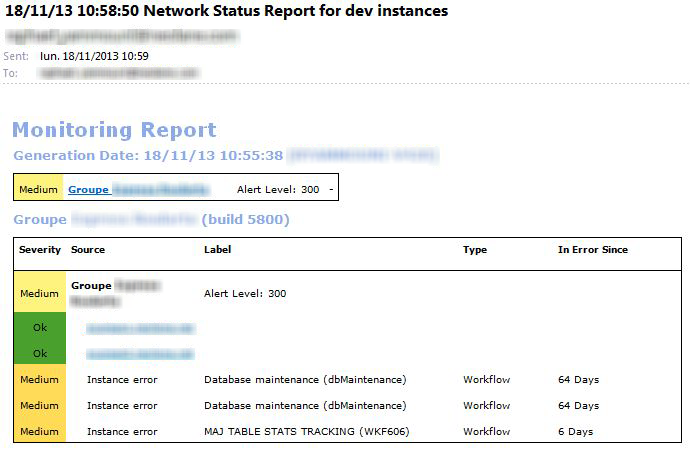

# プロセスの監視{#monitoring-processes}


アプリケーションサーバーとリダイレクトサーバー（**トラッキング**）は手動または自動で監視できます。

## 手動での監視 {#manual-monitoring}

Adobe Campaign プロセスのモニタリングページにアクセスするには、 **[!UICONTROL 監視]** タブをクリックし、 **[!UICONTROL 概要]** リンク。


表示されるページでは、接続されたインスタンスの状態を確認できます。例：

* インスタンスの情報（バージョン、名前、データベースエンジン、インストール済みパッケージ、サーバーシステムのインジケーター、
* 不足しているプロセスと実行情報（開始日、PID など）のリスト、
* ワークフローと配信のビュー。

キャンペーンプロセスを監視するその他の方法については、以下を参照してください [このページ](../../production/using/monitoring-guidelines.md).

### ログ {#log-journal}

プロセスに関連するログジャーナルを表示するには、プロセスをクリックします。 **mta** 例えば、を選択します。 **[!UICONTROL ログジャーナルを開く]** .


### システム指標 {#system-indicators}

システム インジケータの一覧を参照して、物理メモリと仮想メモリ、アクティブなプロセス、使用可能なディスク領域など、マシンに関する情報を表示します。 指標は、Linux と Windows のオペレーティングシステムで異なります。 に移動します **[!UICONTROL インスタンスの監視]** をクリックします。 **[!UICONTROL 表示]** リンクして、指標のリストを開きます。

#### Windows {#in-windows}

* **[!UICONTROL 保留中のイベントがキューに入りました]**：に固有の指標 **Message Center**. [詳細情報](../../message-center/using/additional-configurations.md#monitoring-thresholds)

* **[!UICONTROL メモリ]**：物理メモリ（RAM）に関する情報。

  **[!UICONTROL 現在の値]**：現在のメモリ消費量。

  **[!UICONTROL 最大値]**：インストールされているメモリの総量。

  **[!UICONTROL 利用可能]**：使用可能なメモリの量。

  **[!UICONTROL 警告]**：このインジケーターは、メモリ消費量が合計金額の 80% に達した場合に表示されます。

  **[!UICONTROL アラート]**：このインジケーターは、メモリ消費量が合計金額の 90% に達した場合に表示されます。

  いつ **[!UICONTROL 警告]** および **[!UICONTROL アラート]** 指標が表示されます。Adobe Campaign サーバーがインストールされているマシンに RAM を増設すると、問題を解決できます。 また、Adobe Campaign サーバーを専用のマシンにインストールすることもできます。

* **[!UICONTROL スワップメモリ]**：ページングファイルに一致する仮想メモリに関連する情報で、Windows が RAM であるかのように使用するハードディスク上の領域です。

  **[!UICONTROL 現在の値]**：実際のメモリ消費量。

  **[!UICONTROL 最大値]**：メモリの総量。

  **[!UICONTROL 利用可能]**：使用可能なメモリの量。

  **[!UICONTROL 警告]**：このインジケーターは、メモリ消費量が合計金額の 80% に達した場合に表示されます。

  **[!UICONTROL アラート]**：このインジケーターは、メモリ消費量が合計金額の 90% に達した場合に表示されます。

  いつ **[!UICONTROL 警告]** および **[!UICONTROL アラート]** インジケータが表示され、Windows の詳細設定で交換ファイルのサイズを増やすことで問題を解決できます。

* **[!UICONTROL ディスク XXX]**：マシンリーダーに関する情報。

  **[!UICONTROL 現在の値]**：実際に使用されているディスク容量。

  **[!UICONTROL 最大値]**：合計ディスク容量。

  **[!UICONTROL 利用可能]**：使用可能なディスク容量。

  **[!UICONTROL 使用済み]**：ディスクが使用されている割合。

  **[!UICONTROL 警告]**：このインジケーターは、使用可能なディスク容量が合計容量の 80% に達した場合に表示されます。

  **[!UICONTROL アラート]**：このインジケーターは、使用可能なディスク容量が合計容量の 90% に達した場合に表示されます。

* **[!UICONTROL 古すぎるプロセスの数]**:1 日以上アクティブなAdobe Campaign プロセスに関する情報。

  **[!UICONTROL 現在の値]**：現在アクティブなプロセスの数。

  **[!UICONTROL 最大値]**：許可されているプロセスの最大数（1）。

  **[!UICONTROL アラート]**：このインジケーターは、プロセス数が 1 に等しい場合に表示されます。

  いつ **[!UICONTROL アラート]** インジケータが表示されます。SQL データベース・エンジンによって関連プロセスがロックされているか、無限ループに陥っている可能性があります。 この **ウォッチドッグ** Adobe Campaignが提供するプロセスは、毎日、すべてのプロセスを自動的に再起動し、この問題を解決できるようにします。 ただし、関係するプロセスを自分で停止して、強制的に再起動することもできます。

#### Linux {#in-linux}


* **[!UICONTROL 保留中のイベントがキューに入りました]**：に固有の指標 **Message Center**. 詳しくは、[この節](../../message-center/using/additional-configurations.md#monitoring-thresholds)を参照してください。

* **[!UICONTROL 負荷平均（1/5/15 分）]**：負荷に関する情報（直前の 1 分、5 分、15 分の間にマシン上で実行されたプロセスによるプロセッサーの使用率など）。

  **[!UICONTROL 現在の値]**：マシンの実際の負荷。

  **[!UICONTROL 最大値]**：マシン上のプロセスの最大使用負荷

  **[!UICONTROL 警告]**：このインジケーターは、直前の 1 分、5 分または 15 分で、負荷が最大許容値の 80% に達した場合に表示されます。

  **[!UICONTROL アラート]**：このインジケーターは、負荷が最後の 1 分、5 分、15 分の最大許容値の 90% に達した場合に表示されます。

* **[!UICONTROL メモリ]**  物理メモリ （RAM）に関する情報です。

  **[!UICONTROL 現在の値]**：実際のメモリ消費量。

  **[!UICONTROL 最大値]**：インストールされているメモリの総量。

  **[!UICONTROL 利用可能]**：使用可能なメモリの量。

  **[!UICONTROL 警告]**：このインジケーターは、メモリ消費量が合計金額の 80% に達した場合に表示されます。

  **[!UICONTROL アラート]**：このインジケーターは、メモリ消費量が合計金額の 90% に達した場合に表示されます。

  いつ **[!UICONTROL 警告]** および **[!UICONTROL アラート]** 指標が表示されます。Adobe Campaign サーバーがインストールされているマシンに RAM を増設すると、問題を解決できます。 また、Adobe Campaign サーバーを専用のマシンにインストールすることもできます。

* **[!UICONTROL スワップメモリ]**：ページングファイルに一致する仮想メモリに関連する情報で、Windows が RAM であるかのように使用するハードディスク上の領域です。

  **[!UICONTROL 現在の値]**：実際のメモリ消費量。

  **[!UICONTROL 最大値]**：メモリの総量。

  **[!UICONTROL 利用可能]**：使用可能なメモリの量。

  **[!UICONTROL 警告]**：このインジケーターは、メモリ消費量が合計金額の 80% に達した場合に表示されます。

  **[!UICONTROL アラート]**：このインジケーターは、メモリ消費量が合計金額の 90% に達した場合に表示されます。

  いつ **[!UICONTROL 警告]** および **[!UICONTROL アラート]** インジケータが表示されます。交換ファイルのサイズを大きくすると、問題を解決できます。

* **[!UICONTROL コアファイル]**:Adobe Campaign プロセスのクラッシュ後に生成されるファイルに関する情報。 これらのファイルを使用すると、クラッシュの原因を診断できます。

  **[!UICONTROL 現在の値]**：既存のファイルの数。

  **[!UICONTROL 最大値]**：許可されるファイルの最大数（1）。

  **[!UICONTROL 警告]**：このインジケーターは、ファイル数が 1 に近づいた場合に表示されます。

  **[!UICONTROL アラート]**：このインジケーターは、ファイル数が 1 の場合に表示されます。

  クラッシュが原因でプロセスが見つからない場合、プロセスのリストに赤で表示され、によって自動的に再起動されます **ウォッチドッグ** Adobe Campaignが提供するプロセス。

* **[!UICONTROL 共有メモリセグメント数]**：すべてのAdobe Campaign プロセスで共有されるメモリセグメントに関する情報。

  **[!UICONTROL 現在の値]**：現在使用されているメモリセグメントの数。

  **[!UICONTROL 最大値]**：許可されるメモリセグメントの最大数（2）。

  **[!UICONTROL 警告]**：このインジケーターは、メモリセグメントの数が 1 に達した場合に表示されます。

  **[!UICONTROL アラート]**：このインジケーターは、メモリセグメントの数が 2 に達した場合に表示されます。

* **[!UICONTROL 古すぎるプロセスの数]**:1 日以上アクティブなプロセスに関する情報。

  **[!UICONTROL 現在の値]**：現在アクティブなプロセスの数。

  **[!UICONTROL 最大値]**：許可されているプロセスの最大数。

  **[!UICONTROL 警告]**：このインジケーターは、プロセス数が許可されたしきい値の 80% に達した場合に表示されます。

  **[!UICONTROL アラート]**：このインジケーターは、プロセス数が許可されたしきい値の 90% に達した場合に表示されます。

* **[!UICONTROL ファイルハンドル]**：ファイル記述子に関する情報（プロセスごとに開かれたファイルの数など）。

  **[!UICONTROL 現在の値]**：現在のファイル記述子の数。

  **[!UICONTROL 最大値]**：オペレーティングシステムによって許可されているファイル記述子の最大数。

  **[!UICONTROL 警告]**：このインジケーターは、許可されたファイル記述子の数が 80% しきい値に達した場合に表示されます。

  **[!UICONTROL アラート]**：このインジケーターは、許可されたファイル記述子の数が 90% しきい値に達した場合に表示されます。

* **[!UICONTROL プロセス]**：マシンプロセスに関する情報。

  **[!UICONTROL 現在の値]**：現在アクティブなプロセスの数。

  **[!UICONTROL 最大値]**：許可されているプロセスの最大数。

  **[!UICONTROL アクティブなプロセス]**：アクティブなプロセスの数。

  **[!UICONTROL 非アクティブなプロセス]**：非アクティブなプロセスの数。

  **[!UICONTROL 警告]**：このインジケーターは、許可されたプロセスの数が 80% しきい値に達した場合に表示されます。

  **[!UICONTROL アラート]**：このインジケーターは、許可されたプロセスの数が 90% しきい値に達した場合に表示されます。

* **[!UICONTROL ゾンビプロセス]**：停止されたけれどプロセス識別子（PID）がまだ残っているプロセスに関する情報で、プロセステーブルに表示されます。

  **[!UICONTROL 現在の値]**：現在アクティブなゾンビプロセスの数。

  **[!UICONTROL 最大値]**：ゾンビプロセスを承認する最大数（2）。

  **[!UICONTROL 警告]**：このインジケーターは、ゾンビプロセス数が 2 に近づいた場合に表示されます。

  **[!UICONTROL アラート]**：このインジケーターは、ゾンビプロセスの数が 2 に達した場合に表示されます。

#### 指標のカスタマイズ {#customized-indicators}

Adobe Campaignでは、以下のように指標をカスタマイズできます。

1. を作成 **.sh** ファイルと名前 **[!UICONTROL cust_indicators.sh]** .
1. カスタマイズした指標をこのファイルに追加します。 例：

   ```
   #!/bin/bash 
   echo "<indicator name='Zombie Processes'>  
   <current label='Current Value' value='0' display=''/>  
   <warning value='2'/>  <alert value='2'/>  
   <max label='Max Value' value='2'/>
   </indicator>"
   ```

   または

   ```
   #!/bin/bash 
   echo "<indicator name='Availability'>  
   <current label='Last update of data' display='2012-09-03 10:00'/>  
   <current label='Availability last month' display='100.00%'/>  
   <current label='Availability this month' display='100.00%'/> 
   <current label='Recent downtime periods' display='2012-07-04 11:10:00 - 11:19:59'/>
   </indicator>"
   ```

1. ファイルをに保存します。 **[!UICONTROL usr/local/neolane/nl6]** フォルダー。

このファイルはAdobe Campaignによって呼び出されます。

## SMTP レポート {#smtp-reports}

SMTP 配信監視レポートは、Adobe Campaign プラットフォームに統合されています。 コンソールから、または web アクセスを使用してアクセスできます。

これらのレポートには、SMTP 配信統計と SMTP エラーがドメイン別に表示されます。 これらにアクセスするには、オペレーターが以下を持つ必要があります **管理** 権限。

以下にグループ化されます **監視** > &#39;SMTP 監視&#39;。


>[!IMPORTANT]
>
>* SMTP モニタリングに関する情報は、メールチャネルがアクティブ化されている場合にのみ使用できます。
>* この **[!UICONTROL SMTP 送信統計]** は、統計サーバーがインスタンスで起動した場合にのみ提供されます。
>

### SMTP 送信統計 {#smtp-sending-statistics}

この **[!UICONTROL SMTP 送信統計]** レポートを使用すると、サーバーアクティビティを制御できます。 各 mtachilds の合成が表示されます。


このレポートの指標のリストは、グラフの下に表示されます。

1. 送信されたメッセージの合計数。
1. インメッセージまたはアウトメッセージを表します。

   * 青い線：シェイパーに到着した送信準備が完了したメッセージ（SMTP を送信する前の最後のステージ）です（受信データと一致します）。

   * 緑の線：メッセージは正常に送信されました（送信データと一致します）。

   * 赤い線：シェイパーによって破棄されたメッセージ。に返されます **mta** （このリカバリで拒否されたデータと一致します）。

   これらの値は、1 時間あたりのメッセージ数で表されます。

1. シェーパの 2 つのキューを表します。

   * 青い曲線：アクティブなメッセージのキュー。 これらのメッセージは、できるだけ早く送信されます。

   * カキ カーブ：「遅延」キュー。 スロットルのため、またはターゲットへの接続が利用できないため、これらのメッセージをしばらく返すことはできません。 再試行は、5 秒、10 秒、20 秒、40 秒、2 分などごとに行われます。 定義済みのは **最大経過時間（秒）** 破棄されるまでの時間。

1. このグラフは、放棄されたメッセージの詳細を示します（2 番目のグラフの赤い曲線）。送信に失敗したメッセージ（赤）と比較した、再試行なしで放棄されたメッセージ（mauve）の割合を示します。 これにより、統計サーバーによる制限（スロットル）またはリモートサーバーが使用できないことが原因で、許可された期間内に処理されなかったメッセージの割合を表示できます。
1. SMTP 接続が既にオープンしているか、現在オープン中です。
1. ～の数の見積もり **mtachild**.

>[!NOTE]
>
>このレポートは、メールトラフィックシェーパーコンポーネントのステータスに関連しています。

### 各ドメインの SMTP エラー {#smtp-errors-per-domain}

このレポートでは、設定した期間の配信エラーをドメイン別に分類して表示できます。

>[!NOTE]
>
>この **minConnectionsToLog**, **minErrorsToLog** および **minMessagesToLog** のオプション **serverConf.xml** ファイルは、接続統計を考慮するしきい値を定義します。


このレポートの指標のリストを表に示します。

* この **ドメイン** 列には、メッセージが送信されるドメインの名前（例：yahoo.fr の場合はyahoo.com）が含まれます。
* この **Cnx** 列には、このドメインで開かれている SMTP 接続の数が表示されます。
* この **送信済み** 列は、このドメインに送信されたメッセージの数に対応しています。
* この **ボリューム** 列には、このドメインに送信しようとしたメッセージの量（概算値）が表示されます。
* この **エラー** 列には、期間にわたるこのドメインのエラーのボリューム・インディケータが表示されます。
* この **前回の応答** 列には、このドメインで最後に受信した SMTP 応答メッセージが表示されます。
* この **日付** 列には、このドメインで最後に受信した SMTP 応答の日付が表示されます。

>[!NOTE]
>
>に表示される値 **Cnx**, **送信済み**、および **ボリューム** 列は、 **[!UICONTROL 期間]** フィールド。

ドメイン名をクリックすると、そのエラーが表示されます。

それらは PublicId によって分類されます。この ID は、ルータの背後にある複数のAdobe Campaign MTA によって共有される IP アドレスに対応します。 統計サーバーは、この識別子を使用して、この開始点とターゲットサーバーの間の接続および配信統計を記憶します。


この **[!UICONTROL ドメインの所有者]** フィールドを使用すると、同じラベルの下で様々なドメイン名をグループ化できます。 最初のレポート表示では、すべての MX ドメイン名がこの所有者に関連付けられます。

PublicId 識別子をクリックすると、詳細が表示されます。


>[!NOTE]
>
>エラーの割合は、2 つのグラフで表されます。 1 つ目は、黒い背景の上に水平のプログレスバーがあります。 2 つ目のグラフは時系列です。 選択した期間は 12 の時間間隔に分割され、各時間間隔は垂直方向の進捗バーで表されます。 どちらの表示でも、エラーが検出されなかった場合、バーは黒になります。 バーの色は、発生したエラーの割合（黄色、オレンジ、最後に赤）によって異なります。 グレーの色は、重要なデータ量が見つからなかったことを意味します。 グラフにカーソルを置くと、エラーの正確な割合を表示できます。

>[!NOTE]
>
>SMTP エラーとそのAdobe Campaignでの管理について詳しくは、を参照してください。 [この節](../../installation/using/email-deliverability.md).

## 請求レポート {#billing-report}

この **[!UICONTROL 請求]** テクニカルワークフローは、システムアクティビティレポートをメールで「請求」オペレーターに送信します。 デフォルトでは、マーケティングインスタンスで毎月 25 日にトリガーされます。

テクニカルワークフローは、次のノードのサブフォルダーにあります。 **管理** > **実稼動** > **テクニカルワークフロー**.


ワークフローが月に 25 日ごとに開始されると、請求オペレーターはインボックスで次のレポートを受信します。


配信をトラッキングするには、次の指標を使用できます。

* **[!UICONTROL 開始日]** ：配信の開始日。 この日付は、レポートの「開始日」よりも前になる可能性があることに注意してください。
* **[!UICONTROL ラベル]** ：配信のラベル。 送信するメッセージが 100 件未満の配信は小さすぎるとみなされ、開始日ごとに集計されます。この場合、ラベルには集計数が表示されます（例：）。 [3 つの小さな配信の集計].
* **[!UICONTROL 合計量]** ：配信のために転送されたバイトの合計数。
* **[!UICONTROL 平均ボリューム]** ：転送された平均バイト数。 これは、次の数式の結果です **（合計量/メッセージ）**。これは、の計算基礎です。 **[!UICONTROL 乗数]** 指標。
* **[!UICONTROL メッセージ]** ：送信されたメッセージの数。 これには、正常に送信されたメッセージと、（接続されたサーバーからのバウンスメッセージの受信後に）再試行されたメッセージの両方が含まれます。
* **[!UICONTROL 乗数（x）]** ：乗数の値は、メッセージの平均量から推定されます。
* **[!UICONTROL カウント]** ：メッセージと乗数を乗算した結果。

## 自動監視 {#automatic-monitoring}

Adobe Campaignでは、以下に示すいくつかの自動監視方法を提供しています。

### コマンドライン {#command-line}

コマンド

**nlserver モニター**

Adobe Campaign モジュールとシステムに関する一連のインジケーターを一覧表示できます。

処理の容易な XML 形式で出力を生成します。

このコマンドは、 **– 不明** パラメーター。設定ファイルに実行する必要があると示されている場合に、このインスタンスに見つからないプロセスをリストします。

```sql
nlserver monitor -missing
HH:MM:SS > Application server for Adobe Campaign Classic (7.X YY.R build XXX@SHA1) of DD/MM/YYYY
mta@prod
stat@prod
wfserver@prod
```

### サーバーによって公開された情報 {#information-published-by-the-server}

#### /r/test {#r-test}

この **http （s）://`<application>`/r/test** ページを使用して、リダイレクトサーバーをテストします。 トラッキングに使用するフロントサーバーをテストする場合も、同じ方法を使用することをお勧めします。 このページを使用して、ロードディスパッチャーをテストすることもできます。

XML 形式で次のような行が表示されます。

```
<redir status='OK' date='YYYY-MM-DD HH:MM:SS.112Z' build='XXXX' host='<hostname>' localHost='<servername>'/>
```

**頻度**：このテストでは負荷を一切使用しないので、非常に頻繁に（例：1 秒ごとに 1 回）実行できます。

#### /nl/jsp/ping.jsp {#nl-jsp-ping-jsp}

この **http （s）://`<Application server url>`/nl/jsp/ping.jsp**  ページはネットワークと同じように動作し、apache/tomcat/web モジュール/データベースを介してクエリをテストし、クライアントにアップロードします。 すべてが正常に動作している場合は、「OK」を返します。 このテストは、データベース（mta や調査など）にアクセスできるマシンで実行することをお勧めします。

**使用方法**：リモートでログインするには、オペレーターログインに関連付けられたセッショントークンを引数として渡す必要があります（「」のヒントを参照） [Adobe Campaign スクリプトを使用した自動監視](#automatic-monitoring-via-adobe-campaign-scripts)）に設定します。

例：


オペレーター名とログインは、事前にAdobe Campaign クライアントコンソールでデータベース権限を設定しておく必要があります。


**頻度**：これは、使用する帯域幅がほとんどないテストです。 したがって、1 分に 1 回以上ではないにもかかわらず、かなり頻繁に実行できます。

#### /nl/jsp/monitor.jsp {#nl-jsp-monitor-jsp}

これは、オペレーターが web ページ（クライアントコンソールメニューからアクセスする web ページと同じ web ページ）を介してAdobe Campaign サーバーにアクセスできることを確認するためのテストです。 このページは、監視ツール（Tivoli、Nagios など）から呼び出すことができます。


**使用方法**：インスタンスに接続できる、オペレーターログインに関連付けられたセッショントークンは、引数として使用する必要があります（のヒントを参照） [Adobe Campaign スクリプトを使用した自動監視](#automatic-monitoring-via-adobe-campaign-scripts)）に設定します。

オペレーターとそのログインは、事前にAdobe Campaign クライアントコンソールで適切なデータベース権限と制限事項を設定しておく必要があります。

**頻度**：これは完全なサーバーテストで、頻繁に実行する必要はありません（例えば、10 分ごとに 1 回実行できます）。

#### /nl/jsp/soaprouter.jsp {#nl-jsp-soaprouter-jsp}

この **jsp** Adobe Campaign アプリケーション API のエントリポイントを表します。 したがって、アプリケーションの詳細な監視を提供できます。 また、Adobe Campaign web サービスの監視にも使用できます。 これは監視スクリプトで使用しますが、パワーユーザー専用であることに注意してください。

### デプロイメントタイプに基づく監視 {#monitoring-based-on-deployment-types}

Adobe Campaignでは様々なデプロイメント設定を使用できます（詳しくは、以下を参照） [この節](../../installation/using/hosting-models.md)）に設定します。 この節では、インストールのタイプに応じて適用する様々な自動監視手法について説明します。

<table> 
 <thead> 
  <tr> 
   <th> デプロイメントタイプ </th> 
   <th> 監視 </th> 
  </tr> 
 </thead> 
 <tbody> 
  <tr> 
   <td> スタンドアロン </td> 
   <td> 
    <ul> 
     <li><p> <span class="uicontrol">/r/test</span> および <span class="uicontrol">/nl/jsp/monitor.jsp</span> Adobe Campaign サーバー上</p> </li> 
    </ul> </td> 
  </tr> 
  <tr> 
   <td> 標準 </td> 
   <td> 
    <ul> 
     <li><p> <span class="uicontrol">/r/test</span> および <span class="uicontrol">/nl/jsp/ping.jsp</span> フロントサーバー上</p> </li> 
     <li><p> <span class="uicontrol">/nl/jsp/monitor.jsp</span> アプリケーションサーバー上</p> </li> 
    </ul> </td> 
  </tr> 
  <tr> 
   <td> エンタープライズ </td> 
   <td> 
    <ul> 
     <li><p> <span class="uicontrol">/r/test</span> および <span class="uicontrol">/nl/jsp/ping.jsp</span> フロントサーバー上</p> </li> 
     <li><p> <span class="uicontrol">/r/test</span> および <span class="uicontrol">/nl/jsp/monitor.jsp</span> アプリケーションサーバー上</p> </li> 
    </ul> </td> 
  </tr> 
  <tr> 
   <td> ミッドソーシング </td> 
   <td> 
    <ul> 
     <li><p> <span class="uicontrol">/nl/jsp/monitor.jsp</span> アプリケーションサーバー上</p> </li> 
    </ul> </td> 
  </tr> 
 </tbody> 
</table>

## Adobe Campaign スクリプトを使用した自動監視 {#automatic-monitoring-via-adobe-campaign-scripts}

Adobe Campaignでは、検出された異常値に関するレポートをメールで送信できるインスタンス監視ツール（netreport）を提供できます。



>[!IMPORTANT]
>
>このツールはインスタンスの監視に使用できますが、Adobe Campaignではサポートされていません。 詳しくは、Campaign 管理者にお問い合わせください。

### 必要な要素 {#required-elements}

自動監視を行うには、次のインストール前の予防措置が必要です。

* 以下が必要です。 **netreport.tgz** （Linux インストール）または **netreport.zip** （Windows インストール）ファイル、
* 監視対象のマシンに監視をインストールしないことを強くお勧めします。
* jre または JDK を使用するマシンにインストールする必要があります。
* linux の場合、監視するマシンには以下が必要です。 **bc** パッケージ。 詳しくは、[この節](../../installation/using/installing-packages-with-linux.md#distribution-based-on-rpm--packages)を参照してください。

### インストール手順 {#installation-procedure}

インストール手順は次のとおりです。

1. 必要に応じてコンソールで新しいオペレーターを作成しますが（「モニタリング」ユーザーは既に存在します）、権限は割り当てません。
1. アーカイブ抽出を実行します。
1. を読み取る **readme** ファイル。
1. を更新 **netconf.xml** 設定ファイル。
1. を更新 **netreport.bat** （Windows）または **netreport.sh** （Linux）ファイル。

### netconf.xml ファイルの設定 {#configuring-the-netconf-xml-file}

XML 設定ファイルには、次の要素が含まれます。

* [「プロパティ」要素](#properties--element)
* [「インスタンス」要素](#instance--element)
* [「ホスト」要素](#host--element)
* [サブ要素](#sub-elements)

設定例を次に示します。

```
<?xml version="1.0" encoding="ISO-8859-1"?>
<netconf>
  <properties mailServer="mail.adobe.net" mailFrom="mail@adobe.com" recipientList="recipient@adobe.com">
    <nightMode start="00:00 am" end="07:00 am"/>
    <buildRange minimum="7829" maximum="8180"/>
    <buildRange minimum="8300" maximum="8400"/>
    <sla/>
  </properties>

  <instance name="dev" recipientList="mail@mail.com,mail2@mail.com">
                <host name="devrd.domain.com" alias="devrd" sessiontoken="monitoring" criticalLevel="1" filter="wkf;new">
                                <ncs instance="devrd" url="/nl/jsp/soaprouter.jsp" includeDead="false" isSecure="false"/>
                                <redir url="/r/test"/>
                                <http url="/nl/jsp/ping.jsp"/>
                </host>
                <host name="devtrk.domain.com" alias="devtrk" sessiontoken="monitoring" criticalLevel="0" filter="wkf;new">
                                <ncs instance="devrd" url="/nl/jsp/soaprouter.jsp" includeDead="true" isSecure="false"/>
                </host>
  </instance>
  <host name="dev-test" alias="dev-test" sessiontoken="monitoring" criticalLevel="2">
                <ncs instance="dev" url="/nl/jsp/soaprouter.jsp" includeDead="false"/>
  </host>
</netconf>
```

>[!NOTE]
>
>にサフィックスを追加することで、様々な設定を指定できます **netconf.xml** ファイル（例：） **netconf-dev.xml**, **netconf-prod.xml**&#x200B;等。 次に、の netreport の実行に使用する設定を指定します。 **netreport.bat** または **netreport.sh** 追加によるファイル **$JAVA_HOME/bin/java netreport dev** または **@%JAVA_HOME%binjava netreport prod** 例：

>[!IMPORTANT]
>
>の場合 **監視** オペレーターが作業するには、レポートを実行するマシンが次の場所にあるセキュリティゾーンに属している必要があります。 **sessionTokenOnly** モード。 このオペレーターに信頼済み IP マスクが指定されていない場合は、セキュリティゾーンも **allowEmptyPassword** および **allowUserPassword** モード。

#### 「プロパティ」要素 {#properties--element}

この要素は、メールの設定を入力するために使用されます。

* **mailServer**：メールの送信に使用する SMTP サーバー（例：smtp.domain.net）。
* **mailFrom**：レポート送信者のメールアドレス（例：monitoring@domain.net）。
* **recipientList**：モニタリング受信者のメールアドレスのリスト。 アドレスはコンマで区切る必要があります（スペースは使用できません）。
* &#39;**ナイト**「モード （オプション）」は、指定した期間の間にメールを送信しないようにするために使用されます。 代わりに、データが統合され、終了時刻（デフォルトでは 7:00）以降に夜間のアクティビティに関するメールが送信されます。
* この **buildRange** サブ要素（オプション）を使用すると、最小および最大のビルド番号を指定できます。 ビルド番号がこの範囲に該当しないすべてのコンピューターに対してエラーが生成されます

  ```
  <buildRange minimum="0000" maximum="9999"/>
  ```

* 以下を追加できます **`<sla>`** （オプション）のサブ要素 **プロパティ** 要素。 netreport が実行されるたびにログファイルが生成されます。 ファイル名には、設定名と日時が含まれます。例： **dev_06_12_13_16_47_05.tmp**. ファイルには、インスタンス名、マシン名、重大度レベル、（0 から 3、重要度が低いものから最も高いもの）、日付（タイムスタンプ形式）、クエリと応答の間の経過時間（ミリ秒単位）、使用されるサービス （http、ncs、ncsex、redir）などの情報が含まれます。 この情報は、各サービスの終了時にタブ記号と改行で区切られます。

>[!NOTE]
>
>この **persistHtmlFile** の値が「true」の属性 **`<property>`** 要素は、ファイルに最新の監視ステータスを記録するために使用されます **netreport.md**. このファイルは、インストールディレクトリに保存されます。

#### 「インスタンス」要素 {#instance--element}

この要素を使用すると、複数のマシン（ホスト）を同じインスタンスに再グループ化できます。 インスタンス名は、監視メールの最初の部分に表示されます。 インスタンスの名前をクリックすると、各マシンに関する詳細にアクセスできます。

```
instance name="instance-name" recipientList="mail@mail.com,mail2@mail.com">
                <host name="devcamp.domain.com" ...>
                       ...
                </host>
                <host name="devtrack.domain.com" ...>
                       ...
                </host>
</instance
```

* **名前**：メールの最初の部分に表示されるインスタンス名。
* **recipientList** （任意）：特定のインスタンスに関する監視レポートをメールで送信できます。

#### 「ホスト」要素 {#host--element}

この要素は、ホスト上の特定のサーバーの監視を設定します。

* **名前**：監視するマシンの名前。
* **エイリアス** （任意）：レポートに表示される監視対象マシンの名前。
* **sessionToken**：承認済みセッショントークンによるログイン認証を提供します。

  セッショントークンを設定するには、 **監視** Adobe Campaign コンソールのオペレーター。 が含まれる **アクセス権** タブで、このインスタンスの監視を許可されているマシンの IP アドレスを指定します。 その後、 **監視** 識別子。パスワードを指定する必要はありません。

  

* **criticalLevel** （オプション）：表示するエラーを重大度レベルで並べ替えることができます。 取り得る値は「0」（すべてのレベルが表示される）、「1」（高いエラーと重大なエラーのみが表示される）、「2」（重大なエラーのみが表示される）である。 この属性が指定されていない場合は、すべてのエラーレベルが表示されます。
* **フィルター** （任意）：特定のワークフローエラーを除外できます。例 **filter=&quot;wkf;wkf1&quot;**. ワークフローラベルはセミコロンで区切る必要があります。

#### サブ要素 {#sub-elements}

* **tcp**：サーバーが起動しているか停止しているかを確認します。 ポート番号を入力してください。
* **http**:Web サーバーが存在することを確認します（アプリケーションサーバーが操作可能）。
* **ncs**:「インスタンス」属性に入力されたインスタンスのプロセスを確認します（ワークフローエラー、メモリ使用量など）。 この **included** （必須）属性では、無効なプロセス（「true」または「false」の値）を表示するオプションが提供されます。
* **redir**：トラッキングを確認します。

ほとんどの場合、のみ **ncs** および **redir** サブ要素は保持できます。

どちらの場合も、サブ要素内の特定のノード（ノードなど）をオーバーロードできます **ポート=75** http、ncs、または redir 接続に使用されるポートをオーバーロードするには：

```
<ncs instance="clap40" url="/nl/jsp/soaprouter.jsp" includeDead="false" port="80"/>
```

が含まれる **ncs**, **redir** および **http** サブ要素、を追加できます **isSecure** 属性（オプション） :https プロトコル （「true」または「false」値）を使用するかどうかを選択します。 この属性が指定されていない場合は、http プロトコルが使用されます。

### netreport.bat または netreport.sh ファイルの設定 {#configuring-the-netreport-bat-or-netreport-sh--file}

設定するには、このファイルを編集して、JRE または JDK がインストールされているディレクトリを指定します。

### 監視の開始 {#launching-monitoring}

監視を開始するには、を実行します **netreport.bat** または **netreport.sh** スクリプトを使用して一定の間隔でファイルに書き込みます。 レポートは、最初の実行後、ステータスが変更された場合にのみ送信されます。

### 監視のテスト {#testing-monitoring}

監視をテストするには、を実行します **netreport.bat** または **netreport.sh** ファイル。

で指定された受信者にメールが送信されます。 **recipientList** の **netconf.xml** ファイル。
