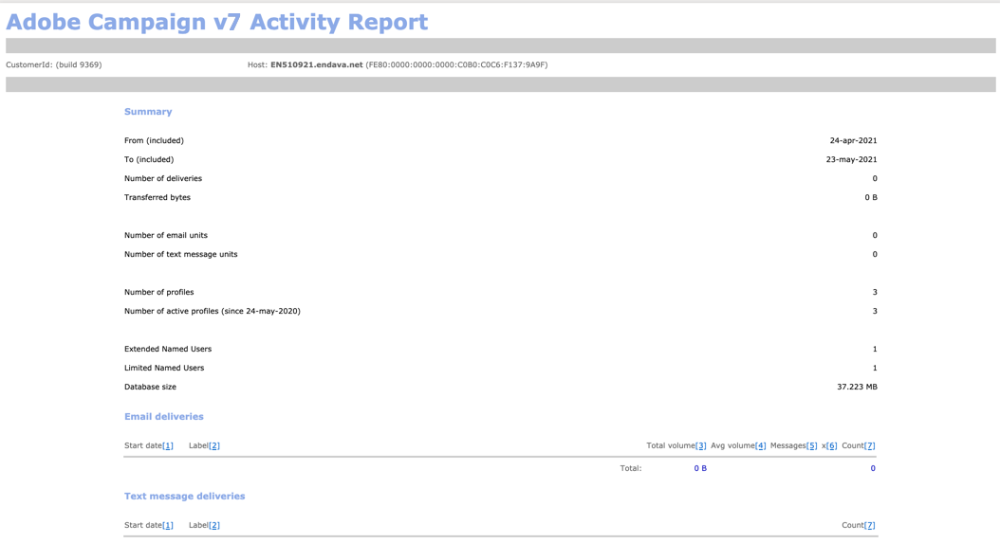

# プロセスの監視{#monitoring-processes}

アプリケーションサーバーとリダイレクションサーバー（**トラッキング**）は、手動または自動で監視できます。

## 手動監視{#manual-monitoring}

**[!UICONTROL 監視]**&#x200B;に移動し、「**[!UICONTROL 概要]**」リンクをクリックして、Adobe Campaignプロセス監視ページを表示します。


表示されるページでは、接続されたインスタンスの状態を確認できます。例：

* インスタンスの情報：バージョン，名前，データベースエンジン，インストール済みパッケージ，サーバーシステムインジケータ，
* 見つからないプロセスと実行情報（開始日、PIDなど）のリスト
* ワークフローと配信のビュー。

様々なキャンペーンプロセスを監視するその他の方法については、[このページ](../../production/using/monitoring-guidelines.md)で説明しています。

### ログ {#log-journal}

プロセスに関連するログジャーナルを表示できます。 これをおこなうには、例えば&#x200B;**mta**&#x200B;というプロセスをクリックし、「**[!UICONTROL ログジャーナル]**&#x200B;を開く」をクリックします。


### システム指標 {#system-indicators}

システムインジケータのリストを使用すると、物理メモリや仮想メモリ、アクティブなプロセス、使用可能なディスク領域など、マシンに関する情報を表示できます。 指標は、LinuxオペレーティングシステムとWindowsオペレーティングシステムで異なります。 **[!UICONTROL インスタンスの監視]**&#x200B;ページに移動し、**[!UICONTROL 表示]**&#x200B;リンクをクリックして指標のリストを開きます

#### Windows {#in-windows}

* **[!UICONTROL 保留中のイベントがキューに入れられました]** :インジケーターは、 **Message Centerに固有です**。詳しくは、[この節](../../message-center/using/monitoring-thresholds.md)を参照してください。
* **[!UICONTROL メモリ]** :物理メモリ(RAM)に関する情報。

   **[!UICONTROL 現在の値]** :実際のメモリ消費量。

   **[!UICONTROL 最大値]** :インストールされたメモリの合計容量。

   **[!UICONTROL 利用可能]** :使用可能なメモリの量。

   **[!UICONTROL 警告]** :このインジケータは、メモリ消費が総量の80%に達した場合に表示されます。

   **[!UICONTROL アラート]** :このインジケータは、メモリ消費が全量の90%に達した場合に表示されます。

   **[!UICONTROL 警告]**&#x200B;と&#x200B;**[!UICONTROL アラート]**&#x200B;のインジケーターが表示されたら、Adobe CampaignサーバーがインストールされているマシンにRAMを追加することで、問題を解決できます。 また、専用マシンにAdobe Campaignサーバーをインストールすることもできます。

* **[!UICONTROL スワップメモリ]** :ページングファイルに一致する仮想メモリに関する情報：WindowsがRAMのように使用するハードディスク上の領域。

   **[!UICONTROL 現在の値]** :実際のメモリ消費量。

   **[!UICONTROL 最大値]** :メモリの合計容量。

   **[!UICONTROL 利用可能]** :使用可能なメモリの量。

   **[!UICONTROL 警告]** :このインジケータは、メモリ消費が総量の80%に達した場合に表示されます。

   **[!UICONTROL アラート]** :このインジケータは、メモリ消費が全量の90%に達した場合に表示されます。

   **[!UICONTROL 警告]**&#x200B;および&#x200B;**[!UICONTROL アラート]**&#x200B;インジケーターが表示されたら、Windowsの詳細設定でexchangeファイルのサイズを大きくすることで、この問題を解決できます。

* **[!UICONTROL ディスクXXX]** :マシンリーダーに関する情報。

   **[!UICONTROL 現在の値]** :実際に使用されるディスク容量。

   **[!UICONTROL 最大値]** :合計ディスク容量。

   **[!UICONTROL 利用可能]** :空きディスク容量

   **[!UICONTROL 使用]** :使用ディスクの割合。

   **[!UICONTROL 警告]** :このインジケータは、使用可能なディスク領域が総容量の80%に達した場合に表示されます。

   **[!UICONTROL アラート]** :このインジケータは、使用可能なディスク領域が総容量の90%に達した場合に表示されます。

* **[!UICONTROL 古すぎるプロセスの数]** :1日以上アクティブになっているAdobe Campaignプロセスに関する情報です。

   **[!UICONTROL 現在の値]** :現在アクティブなプロセスの数。

   **[!UICONTROL 最大値]** :許可されるプロセスの最大数(1)。

   **[!UICONTROL アラート]** :このインジケーターは、プロセスの数が1の場合に表示されます。

   **[!UICONTROL アラート]**&#x200B;インジケータが表示された場合は、該当するプロセスがSQLデータベースエンジンによってロックされているか、無限ループに陥っている可能性があります。 Adobe Campaignが提供する&#x200B;**ウォッチドッグ**&#x200B;プロセスは、毎日すべてのプロセスを自動的に再起動し、この問題を解決できます。 ただし、関連するプロセスを自分で停止し、再起動を強制することもできます。

#### Linux {#in-linux}


* **[!UICONTROL 保留中のイベントがキューに入れられました]** :インジケーターは、 **Message Centerに固有です**。詳しくは、[この節](../../message-center/using/monitoring-thresholds.md)を参照してください。
* **[!UICONTROL 負荷平均(1/5/15分)]** :負荷に関する情報、つまり、最後の1分、5分、15分間にマシン上で実行されたプロセスによるプロセッサの使用率

   **[!UICONTROL 現在の値]** :装置の実際の負荷。

   **[!UICONTROL 最大値]** :マシン上のプロセスの最大使用負荷

   **[!UICONTROL 警告]** :この指標は、最後の1分、5分または15分で、負荷が最大許可値の80%に達した場合に表示されます。

   **[!UICONTROL アラート]** :この指標は、負荷が最後の1分、5分または15分の最大許可値の90%に達した場合に表示されます。

* **[!UICONTROL メモリ]** :物理メモリ(RAM)に関する情報。

   **[!UICONTROL 現在の値]** :実際のメモリ消費量。

   **[!UICONTROL 最大値]** :インストールされたメモリの合計容量。

   **[!UICONTROL 利用可能]** :使用可能なメモリの量。

   **[!UICONTROL 警告]** :このインジケータは、メモリ消費が総量の80%に達した場合に表示されます。

   **[!UICONTROL アラート]** :このインジケータは、メモリ消費が全量の90%に達した場合に表示されます。

   **[!UICONTROL 警告]**&#x200B;と&#x200B;**[!UICONTROL アラート]**&#x200B;のインジケーターが表示されたら、Adobe CampaignサーバーがインストールされているマシンにRAMを追加することで、問題を解決できます。 また、専用マシンにAdobe Campaignサーバーをインストールすることもできます。

* **[!UICONTROL スワップメモリ]** :ページングファイルに一致する仮想メモリに関する情報：WindowsがRAMのように使用するハードディスク上の領域。

   **[!UICONTROL 現在の値]** :実際のメモリ消費量。

   **[!UICONTROL 最大値]** :メモリの合計容量。

   **[!UICONTROL 利用可能]** :使用可能なメモリの量。

   **[!UICONTROL 警告]** :このインジケータは、メモリ消費が総量の80%に達した場合に表示されます。

   **[!UICONTROL アラート]** :このインジケータは、メモリ消費が全量の90%に達した場合に表示されます。

   **[!UICONTROL 警告]**&#x200B;と&#x200B;**[!UICONTROL アラート]**&#x200B;のインジケーターが表示されたら、交換ファイルのサイズを増やすことで問題を解決できます。

* **[!UICONTROL コアファイル]** :Adobe Campaignプロセスのクラッシュ後に生成されたファイルに関する情報。これらのファイルを使用して、クラッシュの原因を診断できます。

   **[!UICONTROL 現在の値]** :既存のファイルの数。

   **[!UICONTROL 最大値]** :許可されたファイルの最大数(1)。

   **[!UICONTROL 警告]** :このインジケータは、ファイル数が1に近づくと表示されます。

   **[!UICONTROL アラート]** :このインジケータは、ファイル数が1の場合に表示されます。

   クラッシュが原因でプロセスが見つからない場合は、プロセスのリストに赤で表示され、Adobe Campaignが提供する&#x200B;**ウォッチドッグ**&#x200B;プロセスによって自動的に再起動されます。

* **[!UICONTROL 共有メモリセグメントの数]** :すべてのAdobe Campaignプロセスで共有されるメモリセグメントに関する情報。

   **[!UICONTROL 現在の値]** :現在使用中のメモリセグメントの数。

   **[!UICONTROL 最大値]** :許可されるメモリセグメントの最大数(2)。

   **[!UICONTROL 警告]** :このインジケータは、メモリセグメントの数が1に達したときに表示されます。

   **[!UICONTROL アラート]** :このインジケータは、メモリセグメントの数が2に達したときに表示されます。

* **[!UICONTROL 古すぎるプロセスの数]** :1日以上アクティブになっているプロセスに関する情報。

   **[!UICONTROL 現在の値]** :現在アクティブなプロセスの数。

   **[!UICONTROL 最大値]** :許可されているプロセスの最大数。

   **[!UICONTROL 警告]** :このインジケーターは、プロセス数が許可されたしきい値の80%に達した場合に表示されます。

   **[!UICONTROL アラート]** :このインジケーターは、プロセス数が許可されたしきい値の90%に達した場合に表示されます。

* **[!UICONTROL ファイルハンドル]** :ファイル記述子に関する情報（プロセスごとに開かれたファイルの数）。

   **[!UICONTROL 現在の値]** :ファイル記述子の現在の数。

   **[!UICONTROL 最大値]** :オペレーティングシステムによって許可されるファイル記述子の最大数。

   **[!UICONTROL 警告]** :このインジケータは、許可されたファイル記述子の数が80%のしきい値に達した場合に表示されます。

   **[!UICONTROL アラート]** :このインジケータは、許可されたファイル記述子の数が90%しきい値に達した場合に表示されます。

* **[!UICONTROL プロセス]** :マシンプロセスに関する情報。

   **[!UICONTROL 現在の値]** :現在アクティブなプロセスの数。

   **[!UICONTROL 最大値]** :許可されているプロセスの最大数。

   **[!UICONTROL アクティブなプロセス]** :アクティブなプロセスの数。

   **[!UICONTROL 非アクティブなプロセス]** :非アクティブなプロセスの数。

   **[!UICONTROL 警告]** :このインジケーターは、許可されたプロセスの数が80%のしきい値に達した場合に表示されます。

   **[!UICONTROL アラート]** :このインジケーターは、許可されたプロセスの数が90%しきい値に達した場合に表示されます。

* **[!UICONTROL ゾンビプロセス]** :停止したが、まだプロセス識別子(PID)を持ち、プロセステーブルに表示されたままのプロセスに関する情報。

   **[!UICONTROL 現在の値]** :現在アクティブなゾンビプロセスの数。

   **[!UICONTROL 最大値]** :ゾンビプロセスの許可の最大数(2)

   **[!UICONTROL 警告]** :このインジケータは、ゾンビプロセスの数が2に近づくと表示されます。

   **** このインジケータは、ゾンビプロセスの数が2に達したときに表示されます。

#### カスタマイズされた指標{#customized-indicators}

Adobe Campaignでは、指標をカスタマイズできます。 手順は次のとおりです。

1. **.sh**&#x200B;ファイルを作成し、 **[!UICONTROL cust_indicators.sh]**&#x200B;という名前を付けます。
1. カスタマイズした指標をこのファイルに追加します。 例：

   ```
   #!/bin/bash 
   echo "<indicator name='Zombie Processes'>  
   <current label='Current Value' value='0' display=''/>  
   <warning value='2'/>  <alert value='2'/>  
   <max label='Max Value' value='2'/>
   </indicator>"
   ```

   または

   ```
   #!/bin/bash 
   echo "<indicator name='Availability'>  
   <current label='Last update of data' display='2012-09-03 10:00'/>  
   <current label='Availability last month' display='100.00%'/>  
   <current label='Availability this month' display='100.00%'/> 
   <current label='Recent downtime periods' display='2012-07-04 11:10:00 - 11:19:59'/>
   </indicator>"
   ```

1. ファイルを&#x200B;**[!UICONTROL usr/local/neolane/nl6]**&#x200B;フォルダーに配置します。

このファイルは、Adobe Campaignによって呼び出されます。

## SMTPレポート{#smtp-reports}

SMTP配信監視レポートは、Adobe Campaignプラットフォームに統合されています。 ユーザーは、コンソール経由またはWebアクセスを使用してアクセスできます。

これらのレポートには、ドメインごとにSMTP配信統計とSMTPエラーが表示されます。

これらのオペレーターにアクセスするには、オペレーターが管理権限を持っている必要があります。

これらは&#x200B;**Monitoring** > &#39;SMTP Monitoring&#39;の下にグループ化されています。


>[!IMPORTANT]
>
>* SMTP監視に関する情報は、Eメールチャネルが有効になっている場合にのみ使用できます。
>* **[!UICONTROL SMTP送信統計]**&#x200B;は、統計サーバーがインスタンス上で起動されている場合にのみ提供されます。

>


### SMTP 送信統計 {#smtp-sending-statistics}

**[!UICONTROL SMTP送信統計]**&#x200B;レポートを使用して、サーバーのアクティビティを制御できます。 各mtachildsの合成が表示されます。


このレポートの指標のリストがグラフの下に表示されます。

1. 送信されたメッセージの合計数。
1. 
   * 青い線：メッセージの送信準備が整い、Shaperに到着したメッセージ、つまりSMTPを送信する前の最後のステージ（受信データと一致）。

   * 緑の線：メッセージは正常に送信されました（送信データと一致）。

   * 赤い線：Shaperが破棄したメッセージが&#x200B;**mta**&#x200B;に返されます（この回復で拒否されたデータと一致します）。

   これらの値は、1時間あたりのメッセージ数で表されます。

1. Shaperの2つのキューを表します。

   * 青い曲線：アクティブなメッセージのキュー。 これらのメッセージは、できるだけ早く送信されます。

   * カキ曲線：「遅延」キュー。 ジョブ数の制限や、ターゲットへの接続が利用できないため、現時点ではこれらのメッセージは返されません。 再試行は、5秒、10秒、20秒、40秒、2分ごとにおこなわれます。 を返します。****

1. このグラフは、放棄されたメッセージの詳細を示します（2番目のグラフの赤い曲線）。再試行なしで破棄されたメッセージ(mave)と、送信に失敗したメッセージ（赤）の割合が表示されます。 これにより、統計サーバの制限（スロットリング）やリモート・サーバの使用不可により、付与された期間内に処理されなかったメッセージの割合を表示できます。
1. SMTP 接続が既にオープンしているか、現在オープン中です。
1. **mtachild**&#x200B;の数の推定値。

>[!NOTE]
>
>このレポートは、Eメールトラフィックシェイパーコンポーネントのステータスに関連しています。

### 各ドメインの SMTP エラー {#smtp-errors-per-domain}

このレポートでは、一定期間の配信エラーをドメイン別に分類して表示できます。

>[!NOTE]
>
>**serverConf.xml**&#x200B;ファイルの&#x200B;**minConnectionsToLog**、**minErrorsToLog**&#x200B;および&#x200B;**minMessagesToLog**&#x200B;オプションは、接続統計を考慮する上記のしきい値を定義します。


このレポートの指標のリストを次の表に示します。

* **Domain**&#x200B;列には、メッセージが送信されるドメインの名前（例えば、yahoo.frの場合はyahoo.com）が含まれます。
* **Cnx**&#x200B;列には、このドメインで開いているSMTP接続の数が表示されます。
* 「**送信済み**」列は、このドメインに送信されたメッセージの数を表します。
* **Volume**&#x200B;列には、このドメインに送信しようとしたメッセージの量（概算値）が表示されます。
* **エラー**&#x200B;列には、このドメインで発生したエラーのボリュームインジケーターが期間中に表示されます。
* **最後の応答**&#x200B;列には、このドメインに対して最後に受信したSMTP応答メッセージが表示されます。
* **Date**&#x200B;列には、このドメインに対して最後に受信したSMTP応答の日付が表示されます。

>[!NOTE]
>
>**Cnx**、**送信済み**、**ボリューム**&#x200B;の各列に表示される値は、**[!UICONTROL 期間]**&#x200B;フィールドで選択した期間に対して計算されます。

ドメイン名をクリックすると、エラーが表示されます。

公開ID別に分類されます。この識別子は、ルーターの背後にある複数のAdobe Campaign mtaが共有するIPアドレスに対応します。 統計サーバは、この識別子を用いて、この開始点とターゲットサーバとの間の接続および配信統計を記憶する。


「**[!UICONTROL ドメインの所有者]**」フィールドを使用すると、様々なドメイン名を同じラベルでグループ化できます。 最初のレポート表示では、すべてのMXドメイン名がこの所有者に関連付けられます。

詳細を表示するには、PublicId識別子をクリックします。


>[!NOTE]
>
>エラーの割合は、2つのグラフで表されます。 1つ目は、黒い背景の横方向のプログレスバーです。 2つ目のグラフは時系列です。 選択した期間は12個の時間間隔に分割され、それぞれが垂直方向の進行状況バーで表されます。 両方の表現で、エラーが検出されなかった場合、バーは黒になります。 バーの色は、発生したエラーの割合（黄色、オレンジ、最後に赤）によって異なります。 カラーグレーは、大量のデータが見つからないことを意味します。 グラフにカーソルを置くと、エラーの正確な割合を表示できます。

>[!NOTE]
>
>SMTPエラーとAdobe CampaignでのSMTPエラーの管理について詳しくは、[この節](../../installation/using/email-deliverability.md)を参照してください。

## 請求レポート {#billing-report}

**[!UICONTROL 請求]**&#x200B;テクニカルワークフローは、システムアクティビティレポートを「請求」オペレーターに電子メールで送信します。 これは、マーケティングインスタンス上でデフォルトで、毎月25日にトリガーされます。

テクニカルワークフローは、次のノードのサブフォルダーにあります。**管理** > **プロダクション** > **テクニカルワークフロー**


ワークフローが毎月25日に開始されると、請求オペレーターのインボックスに次のレポートが表示されます。



次の指標を使用して配信をトラッキングできます。

* **[!UICONTROL 開始日]** :配信の開始日。レポートの「開始日」より前にすることができます。
* **[!UICONTROL ラベル]** :配信のラベル。送信するメッセージが100件未満の配信は小さすぎると見なされ、開始日別に集計されます。この場合、ラベルには集計数が表示されます(例：[3つの小さな配信の集計]。
* **[!UICONTROL 合計ボリューム]** :配信用に転送された合計バイト数。
* **[!UICONTROL 平均ボリューム]** :転送されたバイトの平均ボリューム。これは、**[!UICONTROL 乗数]**&#x200B;指標の計算基準である式&#x200B;**（合計ボリューム/メッセージ数）**&#x200B;の結果です。
* **[!UICONTROL メッセージ]** :送信されたメッセージの数。これには、正常に送信されたメッセージと、（接続されたサーバーからバウンスメッセージを受信した後の）再試行の両方が含まれます。
* **[!UICONTROL 乗数(x)]** :乗数の値は、メッセージの平均ボリュームから推定されます。
* **[!UICONTROL カウント]** :メッセージと乗数の乗算の結果。

## 自動監視{#automatic-monitoring}

Adobe Campaignでは、以下に示す自動監視方法がいくつか用意されています。

### コマンドライン {#command-line}

コマンド

**nlserverモニター**

Adobe Campaignモジュールとシステムに関する一連の指標をリストできます。

処理が容易なXML形式で出力が生成されます。

このコマンドは、**-missing**&#x200B;パラメーターと共に実行することもできます。このパラメーターは、設定ファイルが実行する必要があると言ったときに、このインスタンスから失われたプロセスをリストします。

```
nlserver monitor -missing
HH:MM:SS > Application server for Adobe Campaign Classic (7.X YY.R build XXX@SHA1) of DD/MM/YYYY
mta@prod
stat@prod
wfserver@prod
```

### サーバー{#information-published-by-the-server}によって公開された情報

#### /r/test {#r-test}

**http(s)://`<application>`/r/test**&#x200B;ページを使用して、リダイレクションサーバーをテストします。 追跡に使用するフロントサーバーをテストする場合も、同じ方法を使用することをお勧めします。 このページは、読み込みディスパッチャーをテストする場合にも使用できます。

次のような行がXML形式で表示されます。

```
<redir status='OK' date='YYYY-MM-DD HH:MM:SS.112Z' build='XXXX' host='<hostname>' localHost='<servername>'/>
```

**頻度**:このテストは負荷を使用しないので、非常に頻繁に実行できます（例：1秒に1回）。

#### /nl/jsp/ping.jsp {#nl-jsp-ping-jsp}

この&#x200B;**http(s)://`<Application server url>`/nl/jsp/ping.jsp**&#x200B;ページは、対応するネットワークと同じように動作します。apache/tomcat/web module/databaseを経由し、クライアントにアップロードする完全なクエリをテストします。 すべてが正しく動作している場合は、「OK」が返されます。 このテストは、データベース（mtaや調査など）にアクセスできるマシンで実行することをお勧めします。

**使用方法**:オペレーターログインに関連付けられたセッショントークンを引数として渡して、リモートでログインする必要があります(  [Adobe Campaignスクリプトを使用した自動監視のヒント](#automatic-monitoring-via-adobe-campaign-scripts)を参照)。

例：


オペレーター名とログインは、Adobe Campaignクライアントコンソールで、データベース権限を持つように事前に設定しておく必要があります。


**頻度**:これは、帯域幅をほとんど使用しないテストです。したがって、1分に1回以上実行することはできませんが、かなり頻繁に実行できます。

#### /nl/jsp/monitor.jsp {#nl-jsp-monitor-jsp}

これは、オペレーターがWebページを介してAdobe Campaignサーバーにアクセスできるかどうかを確認するテストです。クライアントコンソールのメニューからアクセスしたのと同じwebページ。 このページは、監視ツール（Tivoli、Nagiosなど）から呼び出すことができます。


**使用方法**:インスタンスに接続できるオペレーターログインに関連付けられたセッショントークンは、引数として使用する必要があります(  [Adobe Campaignスクリプトを使用した自動監視のヒント](#automatic-monitoring-via-adobe-campaign-scripts)を参照)。

オペレーターとそのログインは、Adobe Campaignクライアントコンソールで事前に設定しておく必要があります。また、適切なデータベース権限と制限が設定されている必要があります。

**頻度**:これは完全なサーバーテストで、頻繁に実行する必要はありません（例えば、10分に1回実行できます）。

#### /nl/jsp/soaprouter.jsp {#nl-jsp-soaprouter-jsp}

この&#x200B;**jsp**&#x200B;は、Adobe CampaignアプリケーションAPIのエントリポイントを表します。 したがって、アプリケーションの詳細な監視を提供できます。 また、Adobe Campaign Webサービスの監視にも使用できます。 監視スクリプトで使用されますが、電源ユーザー専用です。

### デプロイメントタイプ{#monitoring-based-on-deployment-types}に基づく監視

Adobe Campaignは、様々なデプロイメント設定を有効にします（詳しくは、[この節](../../installation/using/hosting-models.md)を参照）。 この節では、インストールのタイプに応じて適用する様々な自動監視手法について説明します。

<table> 
 <thead> 
  <tr> 
   <th> デプロイメントタイプ </th> 
   <th> 監視 </th> 
  </tr> 
 </thead> 
 <tbody> 
  <tr> 
   <td> スタンドアロン </td> 
   <td> 
    <ul> 
     <li><p> <span class="uicontrol">Adobe Campaignサーバ</span> ー <span class="uicontrol">の/r/testand /nl/jsp/monitor.</span> jspon</p> </li> 
    </ul> </td> 
  </tr> 
  <tr> 
   <td> 標準 </td> 
   <td> 
    <ul> 
     <li><p> <span class="uicontrol">/r/</span> testand  <span class="uicontrol">/nl/jsp/ping.</span> jspon frontal servers</p> </li> 
     <li><p> <span class="uicontrol">/nl/jsp/monitor.jsponアプリケーシ</span> ョンサーバー</p> </li> 
    </ul> </td> 
  </tr> 
  <tr> 
   <td> エンタープライズ </td> 
   <td> 
    <ul> 
     <li><p> <span class="uicontrol">/r/</span> testand  <span class="uicontrol">/nl/jsp/ping.</span> jspon frontal servers</p> </li> 
     <li><p> <span class="uicontrol">/r/</span> testand  <span class="uicontrol">/nl/jsp/monitor.</span> jsponアプリケーションサーバー</p> </li> 
    </ul> </td> 
  </tr> 
  <tr> 
   <td> ミッドソーシング </td> 
   <td> 
    <ul> 
     <li><p> <span class="uicontrol">/nl/jsp/monitor.jsponアプリケーシ</span> ョンサーバー</p> </li> 
    </ul> </td> 
  </tr> 
 </tbody> 
</table>

## Adobe Campaignスクリプト{#automatic-monitoring-via-adobe-campaign-scripts}を介した自動監視

Adobe Campaignでは、検出された異常値に関するレポートを電子メールで送信できるインスタンス監視ツール（インストレポート）を提供できます。


>[!IMPORTANT]
>
>このツールは、インスタンスの監視に使用できますが、Adobe Campaignではサポートされていません。 詳しくは、Campaign管理者にお問い合わせください。

### 必須要素{#required-elements}

自動監視を行うには、次のプリインストールに関する注意事項が必要です。

* **netreport.tgz** （Linuxインストール）または&#x200B;**netreport.zip** （Windowsインストール）ファイルが必要です。
* 監視対象のマシンに監視をインストールしないことを強くお勧めします。
* JREまたはJDKを使用しているマシンにインストールする必要があります。
* Linuxでは、監視対象のマシンに&#x200B;**bc**&#x200B;パッケージが必要です。 詳しくは、[この節](../../installation/using/installing-packages-with-linux.md#distribution-based-on-rpm--packages)を参照してください。

### インストール手順{#installation-procedure}

インストール手順は次のとおりです。

1. コンソールで、必要に応じて新しいオペレーターを作成します（「監視」ユーザーは既に存在します）が、権限は割り当てません。
1. アーカイブ抽出を実行します。
1. **readme**&#x200B;ファイルを読みます。
1. **netconf.xml**&#x200B;設定ファイルを更新します。
1. **netreport.bat**(Windows)または&#x200B;**netreport.sh**(Linux)ファイルを更新します。

### netconf.xmlファイル{#configuring-the-netconf-xml-file}の設定

XML設定ファイルには、次の要素が含まれています。

* [「Properties」要素](#properties--element)
* [「インスタンス」要素](#instance--element)
* [「ホスト」要素](#host--element)
* [サブ要素](#sub-elements)

次に設定例を示します。

```
<?xml version="1.0" encoding="ISO-8859-1"?>
<netconf>
  <properties mailServer="mail.adobe.net" mailFrom="mail@adobe.com" recipientList="recipient@adobe.com">
    <nightMode start="00:00 am" end="07:00 am"/>
    <buildRange minimum="7829" maximum="8180"/>
    <buildRange minimum="8300" maximum="8400"/>
    <sla/>
  </properties>

  <instance name="dev" recipientList="mail@mail.com,mail2@mail.com">
                <host name="devrd.domain.com" alias="devrd" sessiontoken="monitoring" criticalLevel="1" filter="wkf;new">
                                <ncs instance="devrd" url="/nl/jsp/soaprouter.jsp" includeDead="false" isSecure="false"/>
                                <redir url="/r/test"/>
                                <http url="/nl/jsp/ping.jsp"/>
                </host>
                <host name="devtrk.domain.com" alias="devtrk" sessiontoken="monitoring" criticalLevel="0" filter="wkf;new">
                                <ncs instance="devrd" url="/nl/jsp/soaprouter.jsp" includeDead="true" isSecure="false"/>
                </host>
  </instance>
  <host name="dev-test" alias="dev-test" sessiontoken="monitoring" criticalLevel="2">
                <ncs instance="dev" url="/nl/jsp/soaprouter.jsp" includeDead="false"/>
  </host>
</netconf>
```

>[!NOTE]
>
>**netconf.xml**&#x200B;ファイルにサフィックスを追加することで、様々な設定を指定できます。例えば、**netconf-dev.xml**、**netconf-prod.xml**&#x200B;などです。 次に、**$JAVA_HOME/bin/java netreport dev**&#x200B;または&#x200B;**@%JAVA_HOME%binnetreport&lt;a7を追加して、** netreport.bat **または** netreport.sh **ファイルでnetreportの実行に使用する設定を指定します。/>例：**

>[!IMPORTANT]
>
>**監視**&#x200B;オペレーターが動作するようにするには、ネットポートを実行するマシンが&#x200B;**sessionTokenOnly**&#x200B;モードのセキュリティゾーンに属している必要があります。 このオペレーターに対して信頼できるIPマスクが指定されていない場合は、セキュリティゾーンも&#x200B;**allowEmptyPassword**&#x200B;モードと&#x200B;**allowUserPassword**&#x200B;モードにする必要があります。

#### &#39;Properties&#39;要素{#properties--element}

この要素は、Eメールの設定(

* **mailServer**:Eメールの送信に使用するSMTPサーバー(例：smtp.domain.netなど)に書き込みます。
* **mailFrom**:レポート送信者の電子メールアドレス(例：monitoring@domain.net)です。
* **recipientList**:受信者を監視する電子メールアドレスのリスト。アドレスはコンマで区切る必要があります（スペースは使用できません）。
* 「**night**」モード（オプション）は、指定された期間の間にEメールが送信されるのを防ぐために使用します。 代わりに、データが統合され、夜間のアクティビティに関するEメールが終了時間（デフォルトでは7:00）の後に送信されます。
* **buildRange**&#x200B;サブ要素（オプション）を使用して、最小と最大のビルド番号を指定できます。 ビルド番号がこの範囲に含まれないすべてのマシンに対してエラーが発生します

   ```
   <buildRange minimum="0000" maximum="9999"/>
   ```

* **`<sla>`**（オプション）サブ要素を&#x200B;**properties**&#x200B;要素に追加できます。 インポートが実行されるたびに、ログファイルが生成されます。 ファイルの名前には、設定名と日時(例：**dev_06_12_13_16_47_05.tmp**)が含まれます。 このファイルには、次の情報が含まれます。インスタンス名、マシン名、重大度レベル、（0 ～ 3、最も重要でないものから順に）、日付（タイムスタンプ形式）、クエリと応答の間の経過時間（ミリ秒）、使用されるサービス(http、ncs、ncsex、redir)。 この情報は、各サービスの終わりに、タブマークと改行で区切られます。

>[!NOTE]
>
>**`<property>`**&#x200B;要素の値が「true」の&#x200B;**persistHtmlFile**&#x200B;属性を使用して、最新の監視ステータスをファイル&#x200B;**netreport.md**&#x200B;に記録します。 このファイルはインストールディレクトリに保存されます。

#### 「インスタンス」要素{#instance--element}

この要素を使用すると、複数のマシン（ホスト）を同じインスタンスに再グループ化できます。 インスタンス名は、監視Eメールの最初の部分に表示されます。 インスタンスの名前をクリックして、各マシンに関する詳細を表示できます。

```
instance name="instanceName" recipientList="mail@mail.com,mail2@mail.com">
                <host name="devcamp.domain.com" ...>
                       ...
                </host>
                <host name="devtrack.domain.com" ...>
                       ...
                </host>
</instance
```

* **名前**:電子メールの最初の部分に表示されるインスタンス名。
* **recipientList** （オプション）:では、特定のインスタンスに関する監視レポートを電子メールで送信できます。

#### 「ホスト」要素{#host--element}

この要素は、ホスト上の特定のサーバーの監視を設定します。

* **名前**:監視対象のマシンの名前。
* **エイリアス** （オプション）:レポートに表示される監視対象マシンの名前。
* **sessionToken**:は、認証済みセッショントークンを介したログイン認証を提供します。

   セッショントークンを設定するには、Adobe Campaignコンソールで&#x200B;**monitoring**&#x200B;演算子を選択します。 「**アクセス権**」タブで、このインスタンスを監視する権限を持つマシンのIPアドレスを指定します。 その後、**monitoring**&#x200B;識別子を使用して、パスワードを指定する必要なく、これらのマシンから監視ページに接続できます。

   

* **criticalLevel** （オプション）:を使用すると、エラーを重大度レベルで並べ替えることができます。有効な値は、「0」（表示されるすべてのレベル）、「1」（高いエラーと重大なエラーのみ）、「2」（重大なエラーのみ表示される）です。 この属性を指定しない場合、すべてのエラーレベルが表示されます。
* **filter** （オプション）:を使用すると、 **filter=&quot;wkf;wkf1&quot;**&#x200B;など、特定のワークフローエラーを除外できます。ワークフローラベルはセミコロンで区切る必要があります。

#### サブ要素{#sub-elements}

* **tcp**:サーバーが起動しているか、停止しているかを確認します。ポート番号を入力する必要があります。
* **http**:Webサーバーが存在するかどうかを確認します（アプリケーションサーバーが動作している）。
* **ncs**:「インスタンス」属性に入力されたインスタンスのプロセス（ワークフローエラー、メモリ使用量など）を確認します。**included** （必須）属性は、デッドプロセス（&#39;true&#39;または&#39;false&#39;値）を表示するオプションを提供します。
* **redir**:トラッキングをチェックします。

ほとんどの場合、**ncs**&#x200B;と&#x200B;**redir**&#x200B;サブ要素のみを保持できます。

いずれの場合も、サブ要素で特定のノードがオーバーロードできます（例えば、ノード&#x200B;**port=75**&#x200B;は、http、ncsまたはredir接続に使用するポートをオーバーロードします）。

```
<ncs instance="clap40" url="/nl/jsp/soaprouter.jsp" includeDead="false" port="80"/>
```

**ncs**、**redir**&#x200B;および&#x200B;**http**&#x200B;サブ要素で、**isSecure**&#x200B;属性（オプション）を追加して、httpsプロトコルを使用するかどうか（「true」または「false」値）を選択できます。 この属性を指定しない場合は、httpプロトコルが使用されます。

### netreport.batまたはnetreport.shファイルの設定{#configuring-the-netreport-bat-or-netreport-sh--file}

設定するには、このファイルを編集し、JREまたはJDKがインストールされているディレクトリを指定します。

### 監視の開始{#launching-monitoring}

監視を開始するには、スクリプトを使用して、**netreport.bat**&#x200B;または&#x200B;**netreport.sh**&#x200B;ファイルを一定の間隔で実行します。 レポートは、最初の実行後、ステータスが変更された場合にのみ送信されます。

### 監視のテスト{#testing-monitoring}

監視をテストするには、**netreport.bat**&#x200B;または&#x200B;**netreport.sh**&#x200B;ファイルを実行します。

**netconf.xml**&#x200B;ファイルの&#x200B;**recipientList**&#x200B;で指定された受信者に電子メールが送信されます。
