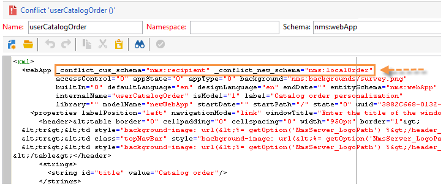
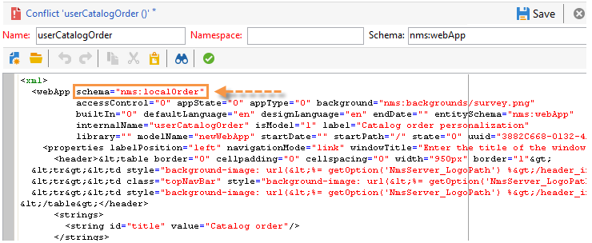

# 新しいビルド（オンプレミス）へのアップグレード{#upgrading}

アップグレード プロセスを開始する前に、アップグレードするAdobe Campaignのバージョンを確認し、[&#x200B; リリースノート &#x200B;](../../rn/using/latest-release.md)を参照してください。

>[!IMPORTANT]
>
>* Adobeでは、更新する前に各インスタンスでデータベースのバックアップを作成することを強くお勧めします。 詳しくは、[この節](../../production/using/backup.md)を参照してください。
>* アップグレードを実行するには、インスタンスとログにアクセスする機能と権限があることを確認します。
>* 開始する前に、[このセクション &#x200B;](../../installation/using/general-architecture.md)と[&#x200B; ビルド アップグレード &#x200B;](https://helpx.adobe.com/jp/campaign/kb/acc-build-upgrade.html)の章をお読みください。
>

## Windows {#in-windows}

Windows環境で、次の手順に従ってAdobe Campaignを新しいビルドに更新します。

* [&#x200B; サービスを停止](#shut-down-services),
* [&#x200B; アプリケーションサーバー](#upgrade-the-adobe-campaign-server-application)をアップグレードします。
* [&#x200B; リソースの同期](#synchronize-resources),
* [&#x200B; サービスを再起動](#restart-services)。

クライアントコンソールの更新方法については、[この節](../../installation/using/client-console-availability-for-windows.md)を参照してください。

### サービスのシャットダウン {#shut-down-services}

すべてのファイルを新しいバージョンに置き換えるには、nlserver サービスのすべてのインスタンスをシャットダウンする必要があります。

1. 以下のサービスをシャットダウンします。

   * Web サービス（IIS）：

     **iisreset /stop**

   * Adobe Campaign サービス：**net stop nlserver6**

   >[!IMPORTANT]
   >
   >また、IISで使用されている&#x200B;**nlsrvmod.dll** ファイルを新しいバージョンに置き換えられるように、リダイレクトサーバー（webmdl）を停止する必要もあります。

1. **nlserver pdump** コマンドを実行して、アクティブなタスクがないことを確認します。 次の項目を確認します。

   ```sql
   C:<installation path>Adobe Campaign v7bin>nlserver pdump
   HH:MM:SS > Application Server for Adobe Campaign Classic (7.X YY.R build XXX@SHA1) of DD/MM/YYYY
   No tasks
   ```

   Windows タスク マネージャーを使用して、すべてのプロセスが停止していることを確認できます。

### Adobe Campaign サーバーアプリケーションのアップグレード {#upgrade-the-adobe-campaign-server-application}

アップグレードファイルを実行するには、次の手順を実行します。

1. **setup.exe**&#x200B;を実行します。

   このファイルをダウンロードするには、ユーザーの資格情報を使用して[&#x200B; ソフトウェア配布ポータル &#x200B;](https://experience.adobe.com/#/downloads/content/software-distribution/jp/campaign.html)に接続します。 ソフトウェア配布の詳細については、[このページ &#x200B;](https://experienceleague.adobe.com/docs/experience-cloud/software-distribution/home.html?lang=ja)を参照してください。

1. インストールモードを選択：**[!UICONTROL 更新または修復]**&#x200B;を選択します
1. 「**[!UICONTROL 次へ]**」をクリックします。
1. 「**[!UICONTROL 完了]**」をクリックします。

   次に、インストールプログラムが新しいファイルをコピーします。

1. 操作が完了したら、「**[!UICONTROL 完了]**」をクリックします。

### リソースの同期 {#synchronize-resources}

次のコマンドラインを使用します。

**nlserver config -postupgrade -allinstances**

これにより、次の操作を実行できるようになります。

* リソースの同期
* スキーマの更新
* データベースの更新

>[!NOTE]
>
>この操作は一度だけ実行し、（**nlserver web**）アプリケーションサーバーでのみ実行する必要があります。

次に、同期でエラーや警告が発生したかどうかを確認します。 詳しくは、[&#x200B; アップグレードの競合の解決](#resolving-upgrade-conflicts)を参照してください。

### サービスの再起動 {#restart-services}

再起動するサービスは次のとおりです。

* Web サービス（IIS）：

  **iisreset /start**

* Adobe Campaign サービス：**net start nlserver6**

## Linux {#in-linux}

Linux環境で、次の手順に従ってAdobe Campaignを新しいビルドに更新します。

* [更新されたパッケージをダウンロード &#x200B;](#obtain-updated-packages),
* [更新を実行](#perform-an-update),
* [Web サーバーを再起動します](#reboot-the-web-server)。

[&#x200B; クライアントコンソールの可用性について詳しく見る](../../installation/using/client-console-availability-for-windows.md)。

### 更新されたパッケージのインストール {#obtain-updated-packages}

最初に、更新されたAdobe Campaignの両方のパッケージを復元します。ユーザーの資格情報を使用して[&#x200B; ソフトウェア配布ポータル &#x200B;](https://experience.adobe.com/#/downloads/content/software-distribution/jp/campaign.html)に接続します。 ソフトウェア配布の詳細については、[このページ &#x200B;](https://experienceleague.adobe.com/docs/experience-cloud/software-distribution/home.html?lang=ja)を参照してください。

ファイルは&#x200B;**nlserver6-v7-XXX.rpm**&#x200B;です

>[!AVAILABILITY]
>
>v7.4.1 以降、RPM Linux パッケージ用の XML ライブラリは Campaign に含まれなくなりました。 これらのライブラリをインストールしてください。
> 

次に、以下の詳細に従って、必要なパッケージをインストールできます。

* RPM ベースの配布（RedHat、SuSe）

  `epel-release` パッケージがインストールされていない場合は、インストールします。 これを行うには、rootとして次のコマンドを入力します。

  ```
  yum install epel-release
  ```

  Campaign パッケージをインストールするには、rootで実行します。

  ```
  yum update ./nlserver6-v7-XXXX.rpm
  ```

  アップデートを確認する前に、出力が次のようになっていることを確認します。

  ```
  ==================================================================================================== 
  Package                         Architecture  Version                    Repository           Size 
  ==================================================================================================== 
  Upgrading: 
  nlserver6-v7                    x86_64        XXXX.0.0-1                 @commandline         63 M
  ```

  >[!IMPORTANT]
  >
  >`Upgrading:`ではなく`Removing:`を読む場合は、コマンドをキャンセルします。 削除を説明するエラー（上記のエラー）がいくつかあります。 このような場合は、リストされている欠落している依存関係を更新またはインストールして、これらのエラーを修正してから、コマンドを再度実行してみてください。

  rpm ファイルは、CentOS/Red Hat ディストリビューションで見つけることができるパッケージに依存しています。 これらの依存関係のいくつかを使用したくない場合は、rpmの「nodeps」オプションを使用する必要があります。

  ```
  rpm --nodeps -Uvh nlserver6-v7-XXXX-0.x86_64.rpm
  ```

  依存関係のほとんどは必須であり、インストールされていない場合は`nlserver`を開始できません。 唯一の例外はopenjdkです。必要に応じて別のJDKをインストールできます。

* DEB ベースの配布（Debian）

  それらをインストールするには、rootで実行します。

  ```
  apt install ./nlserver6-v7-XXXX-amd64_debX.deb
  ```

>[!NOTE]
>
>完全なインストール手順について詳しくは、[この節](../../installation/using/installing-packages-with-linux.md)を参照してください。 リソースは自動的に同期されますが、エラーが発生していないことを確認する必要があります。 詳しくは、[&#x200B; アップグレードの競合を解決](#resolving-upgrade-conflicts)を参照してください。
>

### Web サーバーを再起動します {#reboot-the-web-server}

新しいライブラリを適用するには、Apacheをシャットダウンする必要があります。

これを行うには、次のコマンドを実行します。

```
/etc/init.d/apache stop
```

>[!IMPORTANT]
>
>* スクリプトは、**apache**&#x200B;ではなく&#x200B;**httpd**&#x200B;と呼ばれる場合があります。
>* 次の応答が得られるまで、このコマンドを実行する必要があります。
>
>   `This operation is required in order for Apache to apply the new library.`

次に、Apacheを再起動します。

```
/etc/init.d/apache start
```

## アップグレードの競合を解決 {#resolving-upgrade-conflicts}

リソースの同期中、**postupgrade** コマンドを使用すると、同期でエラーや警告が発生したかどうかを検出できます。

### 同期結果の表示 {#view-the-synchronization-result}

同期結果を表示するには、次の2つの方法があります。

* コマンドラインインターフェイスでは、エラーは3つの山形&#x200B;**>>>**&#x200B;によって具現化され、同期は自動的に停止されます。 警告はダブル シェブロン **>>**&#x200B;によって実体化され、同期が完了したら解決する必要があります。 アップグレード後の最後に、コマンド プロンプトに概要が表示されます。 以下はその一例です。

  ```
  AAAA-MM-DD HH:MM:SS.749Z 00002E7A 1 info log =========Summary of the update==========
  AAAA-MM-DD HH:MM:SS.749Z 00002E7A 1 info log <instance name> instance, 6 warning(s) and 0 error(s) during the update.
  AAAA-MM-DD HH:MM:SS.749Z 00002E7A 1 warning log The document with identifier 'mobileAppDeliveryFeedback' and type 'xtk:report' is in conflict with the new version.
  AAAA-MM-DD HH:MM:SS.749Z 00002E7A 1 warning log The document with identifier 'opensByUserAgent' and type 'xtk:report' is in conflict with the new version.
  AAAA-MM-DD HH:MM:SS.750Z 00002E7A 1 warning log The document with identifier 'deliveryValidation' and type 'nms:webApp' is in conflict with the new version.
  AAAA-MM-DD HH:MM:SS.750Z 00002E7A 1 warning log Document of identifier 'nms:includeView' and type 'xtk:srcSchema' updated in the database and found in the file system. You will have to merge the two versions manually.
  ```

  警告がリソースの競合に関係する場合、それを解決するにはユーザーの注意が必要です。

* **postupgrade_`<server version number>_<time of postupgrade>`.log** ログファイルに同期結果が含まれています。 既定では、次のディレクトリで利用できます：**`<installation directory>/var/<instance/postupgrade`**。 エラーと警告はそれぞれエラーと警告の属性で明示されます。

### 競合の解決 {#resolving-conflicts}

競合を解決するには、次の手順に従います。

1. Adobe Campaign ツリーで、**[!UICONTROL 管理/設定/パッケージ管理/競合を編集]**&#x200B;に移動します。
1. リストから解決する競合を選択します。

対立を解決するには、次の3つの方法があります。

* **[!UICONTROL 解決済みとして宣言]**：事前にユーザーの操作が必要です。
* **[!UICONTROL 新しいバージョンを受け入れる]** :Adobe Campaignで提供されたリソースがユーザーによって変更されていない場合にお勧めします。
* **[!UICONTROL 現在のバージョンを保持]**：更新が拒否されたことを意味します。

  >[!IMPORTANT]
  >
  >この解像度モードを選択した場合、新しいバージョンで修正のメリットが得られない可能性があります。

競合を手動で解決することを選択した場合は、次の手順に従います。

1. ウィンドウの下部セクションで、**_conflict_**&#x200B;文字列を検索して、競合のあるエンティティを見つけます。 新しいバージョンでインストールされたエンティティには&#x200B;**new**&#x200B;引数が含まれ、以前のバージョンと一致するエンティティには&#x200B;**cus**&#x200B;引数が含まれます。

   

1. 保持しないバージョンを削除します。 保持しているエンティティの&#x200B;**_conflict_argument_**&#x200B;文字列を削除します。

   

1. 解決した競合に移動します。 「**[!UICONTROL アクション]**」アイコンをクリックし、「**[!UICONTROL 解決済みとして宣言]**」を選択します。
1. 変更を保存します。これにより競合が解決します。

### ベストプラクティス {#best-practices}

更新エラーは、データベース設定にリンクされている可能性があります。 技術管理者とデータベース管理者が実行する設定が互換性があることを確認してください。

例えば、Unicode データベースは、LATIN1 データなどの保存を許可するだけであってはなりません。

## 使用可能な更新をクライアントコンソールに警告します {#warn-the-client-consoles-of-the-available-update}

### Windows {#in-windows-1}

Adobe Campaign アプリケーションサーバーがインストールされているコンピューター（**nlserver web**）で、アプリケーション &rbrack;/datakit/nl/eng/jsp **の**&lbrack; パスに&#x200B;**setup-client-6.XXXX.exe** ファイルをダウンロードしてコピーします。

次回のクライアントコンソールの接続時には、ウィンドウが更新プログラムの可用性をユーザーに通知し、ダウンロードとインストールの可能性をユーザーに提供します。

>[!NOTE]
>
>IIS_XPG ユーザーがこのインストールファイルに対して適切な読み取り権限を持っていることを確認し、詳しくは[&#x200B; インストールガイド &#x200B;](../../installation/using/general-architecture.md)を参照してください。

### Linux {#in-linux-1}

Adobe Campaign アプリケーションサーバー（**nlserver web**）がインストールされているコンピューターで、**setup-client-6.XXXX.exe** パッケージを取得してコピーし、**/usr/local/neolane/nl6/datakit/nl/eng/jsp**&#x200B;として保存します。

```
cp setup-client-6.XXXX.exe /usr/local/neolane/nl6/datakit/nl/eng/jsp
```

次回のクライアントコンソールの接続時には、ウィンドウが更新プログラムの可用性をユーザーに通知し、ダウンロードとインストールの可能性をユーザーに提供します。

>[!NOTE]
>
>Apache ユーザーがこのインストールファイルに対して適切な読み取り権限を持っていることを確認し、詳しくは[&#x200B; インストールガイド &#x200B;](../../installation/using/general-architecture.md)を参照してください。
