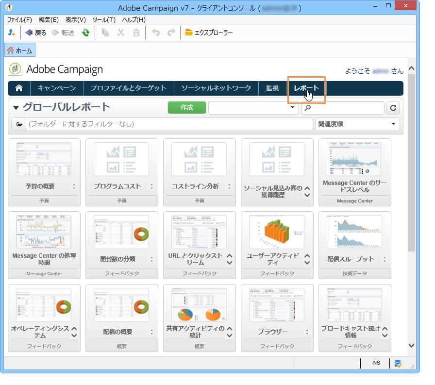
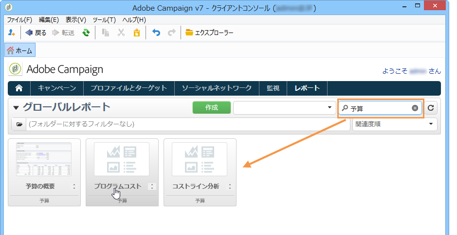
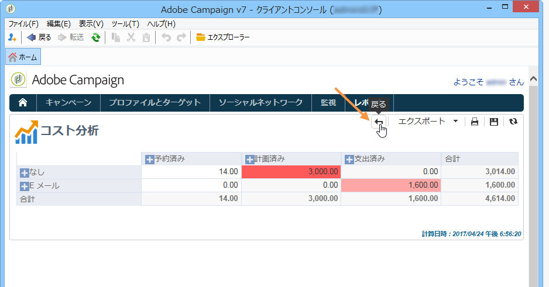
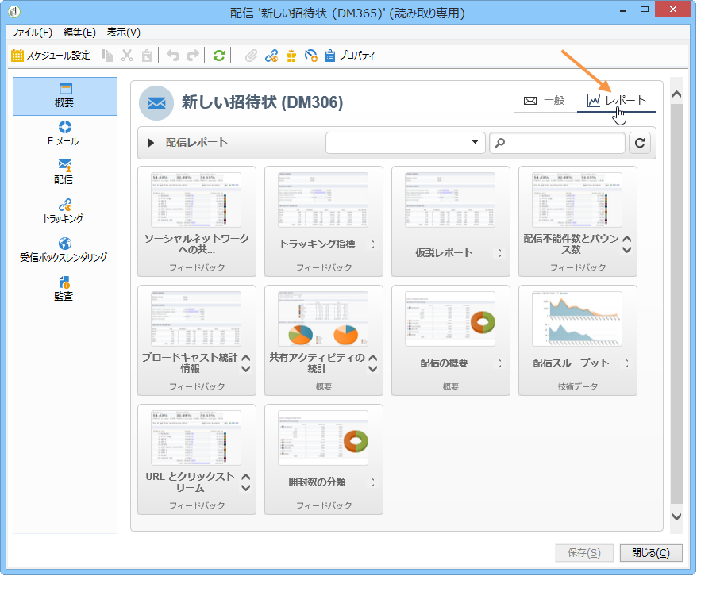
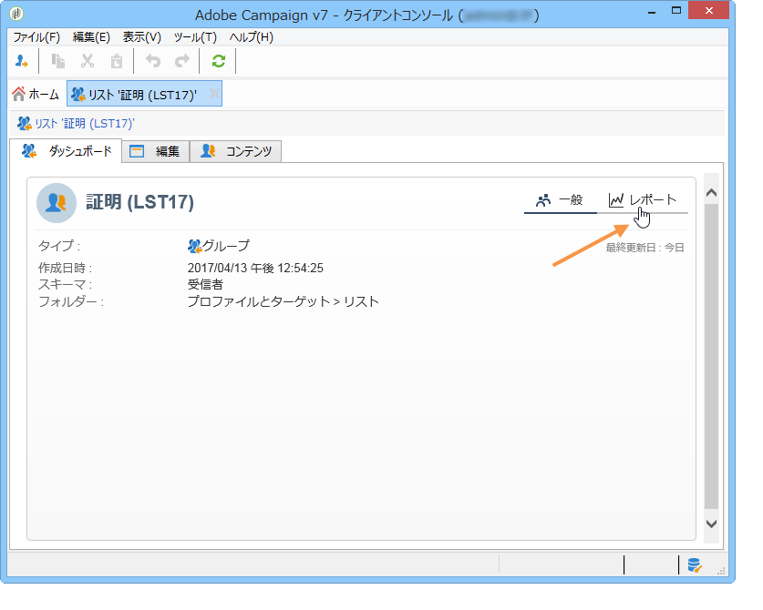

# Campaign の組み込みレポートについて{#about-campaign-built-in-reports}

この章では、Adobe Campaign の組み込みレポートとそれらの内容およびコンテキストの一覧を示します。この情報があれば、プラットフォームで既に使用できるレポートを作成しないで済みます。

>[!NOTE]
>
>また、タブに独自のレポートを追加する方法も学びま **[!UICONTROL Reports]** す。 詳しくは、この[ページ](../../reporting/using/configuring-access-to-the-report.md#defining-the-filtering-options)を参照してください。

これらのレポートとその内容について詳しくは、それらに含まれる機能に関するドキュメントを参照してください。

Adobe Campaign は、お客様のコンソールまたはインターネットブラウザー経由でアクセス可能な、いくつかのタイプのレポートを提供しています。

使用可能なレポートのタイプは次のとおりです。

* Reports on the entire platform, see [Global reports](../../reporting/using/global-reports.md).
* 配信レポートを参照して [ください](../../reporting/using/delivery-reports.md)。
* 累積レポートを参照し [てください](../../reporting/using/cumulative-reports.md)。

レポートには、クライアントコンソールのホームページ、レポートダッシュボードまたは配信リストからアクセスできます。レポートの表示モードはそのコンテキストに依存します。メインレポートのリストはホームページで使用でき、配信データにすばやくアクセスできます。このリストは、ニーズに合わせて変更可能です。詳しくは、[この節](../../reporting/using/about-reports-creation-in-campaign.md)を参照してください。

Campaignの組み込みレポートにアクセスするには：

1. Adobe Campaignインター **[!UICONTROL Reports]** フェイスのタブを選択します。

   

1. 検索フィールドを使用して、表示されるレポートをフィルターします。

1. 次に、表示するレポートをクリックします。

   

1. Click the **[!UICONTROL Back]** link at the top of the screen takes you back to the list of reports.

   

編集中のレポートで実行できるその他のアクションについて詳しくは、[このページ](../../reporting/using/actions-on-reports.md)を参照してください。

キャンペーンや配信に特有のレポートには、それぞれのダッシュボードからアクセスできます。

次に示すように、リスト、サービス、オファーなどについて、原則は同じです。

