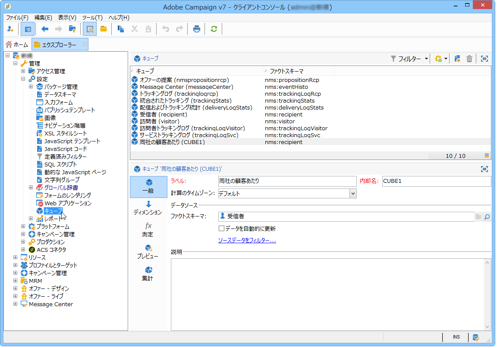
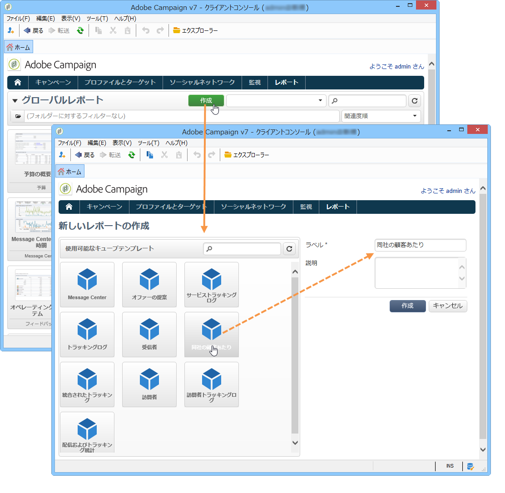
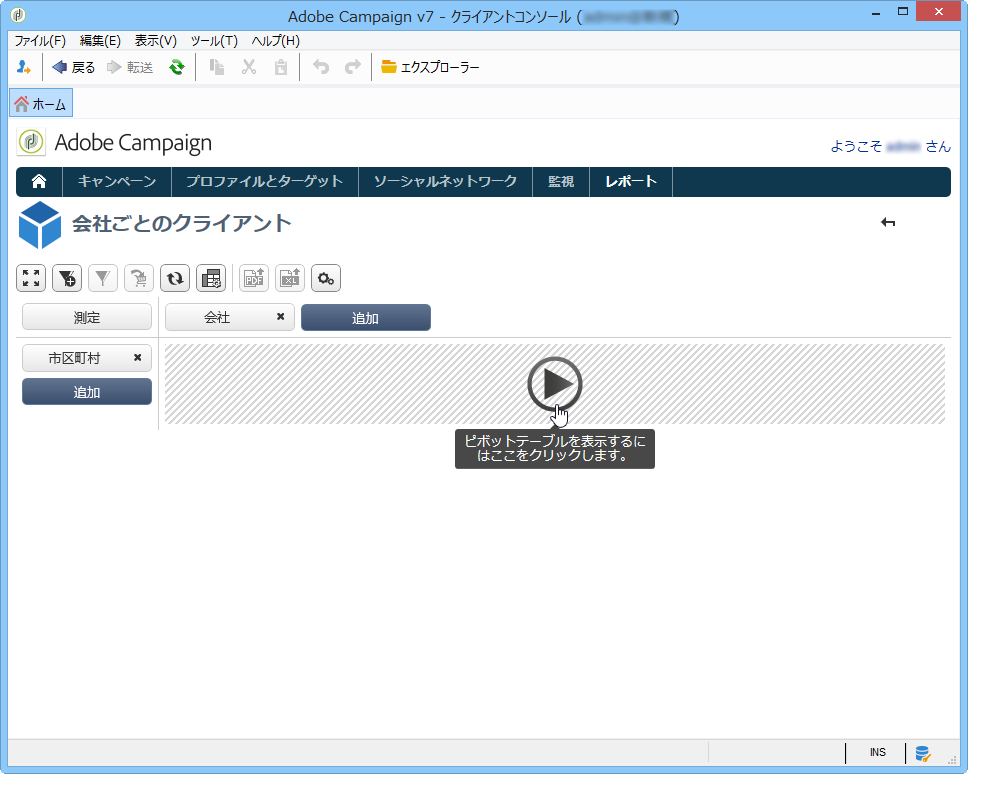
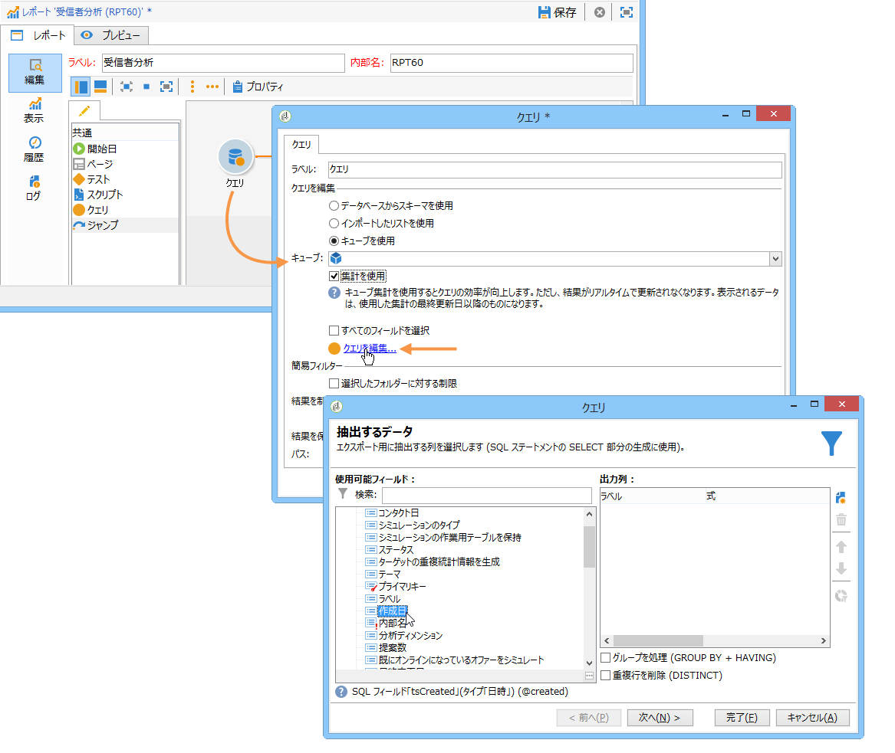
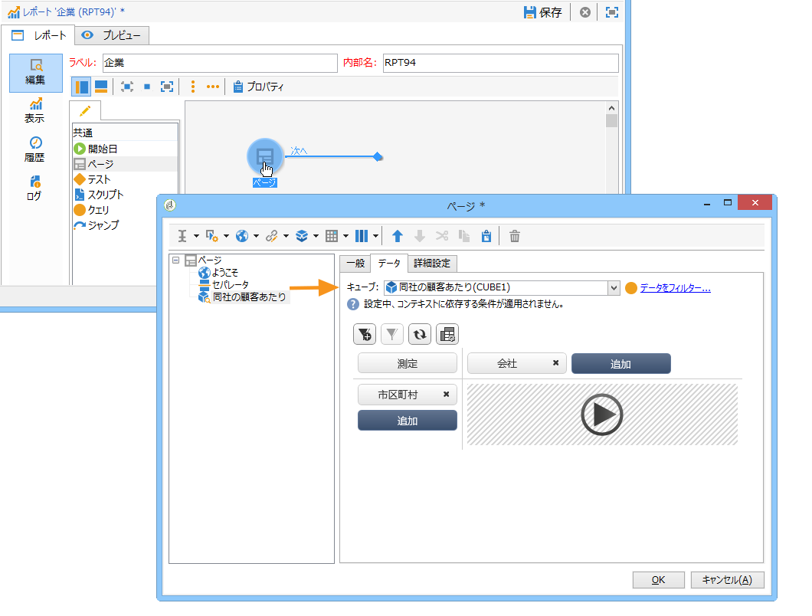

# キューブの基本を学ぶ{#about-cubes}

## 用語 {#terminology}

キューブを扱う際の具体的な用語を以下に示します。

* **キューブ** - キューブは多次元情報の表現であり、インタラクティブなデータ分析用に設計された構造をエンドユーザーに提供します。

* **ファクトテーブル／スキーマ** - ファクトテーブル（またはファクトスキーマ）には、分析の基になる生データまたは基本データが含まれています。 主に大容量のテーブル（場合によってリンクされたテーブルを含む）で、長い計算が必要になる可能性があります。 例えば、broadLog テーブルや購入テーブルなどがファクトテーブルになります。

* **ディメンション** - ディメンションを使用すると、データをグループにセグメント化できます。作成したディメンションは、分析軸として機能します。 ほとんどの場合、指定されたディメンションに対して、複数のレベルが定義されます。 例えば、時間ディメンションの場合は、月、日、時間、分などのレベルがあります。この一連のレベルはディメンション階層を表し、様々なレベルのデータ分析を可能にします。

* **ビニング** - 一部のフィールドについては、ビニングを定義して値をグループ化し、情報を読み取りやすくすることができます。 ビニングは、レベルに適用されます。 多数の異なる値を扱う可能性がある場合は、ビニングを定義することをお勧めします。

* **測定値** - 最もよく使用される測定値は、合計、平均、最大、最小、標準偏差などです。測定値は計算できます。例えば、オファーの受け入れ率は、オファーの提供回数と承認回数の比率です。

## キューブワークスペース {#cube-workspace}

キューブは&#x200B;**[!UICONTROL 管理／設定／キューブ]**&#x200B;ノードに格納されます。

キューブを使用する主なコンテキストは次のとおりです。

* データのエクスポートは、Adobe Campaign プラットフォームの「**[!UICONTROL レポート]**」タブで設計されたレポートで直接実行できます。

  それには、新しいレポートを作成し、使用するキューブを選択します。

  

  キューブは、作成するレポートの基になるテンプレートのように表示されます。 テンプレートを選択したら、「**[!UICONTROL 作成]**」をクリックして、対応するレポートを設定および表示します。

  測定の適合化、表示モードの変更またはテーブルの設定をおこなってから、メインボタンを使用してレポートを表示できます。

  

* レポートの「**[!UICONTROL クエリ]**」ボックスでキューブを参照して、その指標を使用することもできます（下図参照）。

  

* キューブに基づいたピボットテーブルをレポートの任意のページに挿入することもできます。 それには、該当するページにあるピボットテーブルの「**[!UICONTROL データ]**」タブで、使用するキューブを参照します。

  

  詳しくは、[レポートのデータを調べる](../../reporting/using/using-cubes-to-explore-data.md#exploring-the-data-in-a-report)を参照してください。
