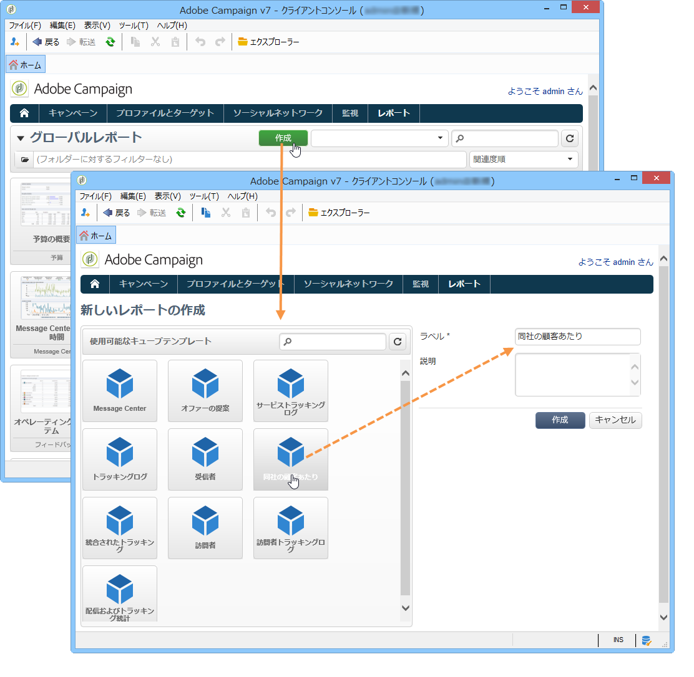

# キューブの基本を学ぶ{#about-cubes}

データベースに格納されているデータの調査は、**マーケティング分析**&#x200B;モジュールを通じて提供されます。これにより、データの分析と測定、統計の計算、レポートの作成と計算のシンプル化および最適化が可能になります。それに加え、マーケティング分析では、レポートの作成とターゲット母集団の定義も可能です。ターゲット母集団は、一旦特定されると、Adobe Campaign で使用できるリスト（ターゲティングやセグメント化など）に格納されます。

キューブは、配信レポート（配信トラッキング、クリック、開封など）を始めとする、特定の組み込みレポートの生成に使用されます。キューブに基づいたレポートは、500 万ファクト行未満のデータ量に対する標準としてのみ使用できます。

データベースの調査および分析機能を拡張できると同時に、最終ユーザーがレポートやテーブルを設定しやすくなります。計算、測定および統計を処理するレポートやテーブルを作成する際に、既存の（完全に設定された）キューブを選択するだけです。

キューブが作成および設定されると、レポートのクエリボックスや Web アプリケーションで使用されます。キューブをピボットテーブル内で使用して操作できます。

>[!CAUTION]
>
>**マーケティング分析**&#x200B;は Adobe Campaign のモジュールです。後述の機能を使用するには、このモジュールをインスタンスにインストールする必要があります。

Campaign Marketing Analytics モジュールを使用して、次のことができます。

1. キューブの作成

   * データを集計して作業用テーブルに保存し、ユーザーのニーズに基づいて指標を事前に計算する
   * レポートやクエリに使用する様々な計算に関係するデータの量を減らし、指標の計算時間を大幅に最適化する。
   * データへのアクセスを簡素化し、様々なディメンションに応じて（事前に集計されているかどうかに関係なく）データを操作できます。

   詳しくは、 [指標の作成](../../reporting/using/creating-indicators.md).

1. ピボットテーブルの作成

   * 計算済みのデータ、設定済みの測定を参照します。
   * 表示するデータとその表示モードを選択します。
   * 使用する測定と指標をパーソナライズする
   * 技術的なバックグラウンドを持たないユーザーに対して、インタラクティブな分析ツールを提供します。

   詳しくは、 [キューブを使用したデータ調査](../../reporting/using/using-cubes-to-explore-data.md).

1. キューブで計算および集計したデータを使用したクエリの作成
1. 母集団の特定とリストでの参照

## 用語 {#terminology}

キューブを扱う際の具体的な用語を以下に示します。

* **キューブ**  — キューブは、多次元情報を表します。エンドユーザーは、インタラクティブなデータ分析用に設計された構造を利用できます。

* **ファクトテーブル/スキーマ**  — ファクトテーブル（またはファクトスキーマ）には、分析の基になる生データまたは基本データが含まれます。 主に大規模なテーブル（場合によって、リンクされたテーブルを伴う）で、長い計算が必要になる可能性があります。例えば、broadLog テーブルや購入テーブルなどがファクトテーブルになります。

* **Dimension** :Dimensionを使用すると、データをグループに分割できます。ディメンションは、一旦作成されると、分析軸として機能します。 ほとんどの場合、指定されたディメンションに対して、複数のレベルが定義されます。例えば、時間ディメンションの場合は、月、日、時間、分などのレベルがあります。この一連のレベルはディメンション階層を表し、様々なレベルのデータ分析を可能にします。

* **ビニング**  — 一部のフィールドに対して、ビニングを定義して値をグループ化し、情報を読み取りやすくすることができます。 ビニングは、レベルに適用されます。 多数の異なる値を扱う可能性がある場合は、ビニングを定義することをお勧めします。

* **測定**  — 最も頻繁に発生する測定は、合計、平均、最大、最小、標準偏差などです。 測定は計算できます。例えば、オファーの許可率は、オファーの提供回数と承認回数の比率です。

## キューブワークスペース {#cube-workspace}

キューブは&#x200B;**[!UICONTROL 管理／設定／キューブ]**&#x200B;ノードに格納されます。

キューブを使用する主なコンテキストは次のとおりです。

* データのエクスポートは、Adobe Campaign プラットフォームの「**[!UICONTROL レポート]**」タブで設計されたレポートで直接実行できます。

   それには、新しいレポートを作成し、使用するキューブを選択します。

   

   キューブは、作成するレポートの基になるテンプレートのように表示されます。テンプレートを選択したら、「**[!UICONTROL 作成]**」をクリックして、対応するレポートを設定および表示します。

   測定の適合化、表示モードの変更またはテーブルの設定をおこなってから、メインボタンを使用してレポートを表示できます。

   

* レポートの「**[!UICONTROL クエリ]**」ボックスでキューブを参照して、その指標を使用することもできます（下図参照）。

   

* キューブに基づいたピボットテーブルをレポートの任意のページに挿入することもできます。それには、該当するページにあるピボットテーブルの「**[!UICONTROL データ]**」タブで、使用するキューブを参照します。

   

   詳しくは、 [レポート内のデータの調査](../../reporting/using/using-cubes-to-explore-data.md#exploring-the-data-in-a-report).
