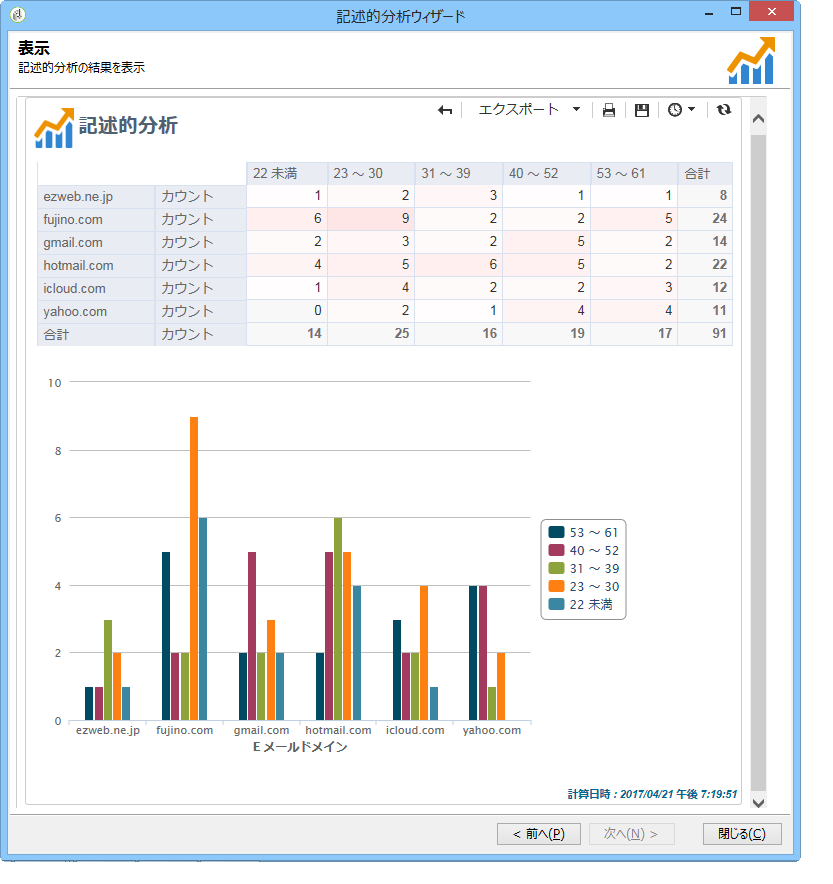
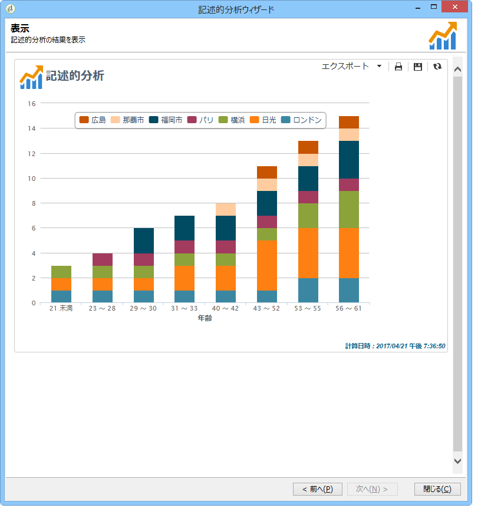
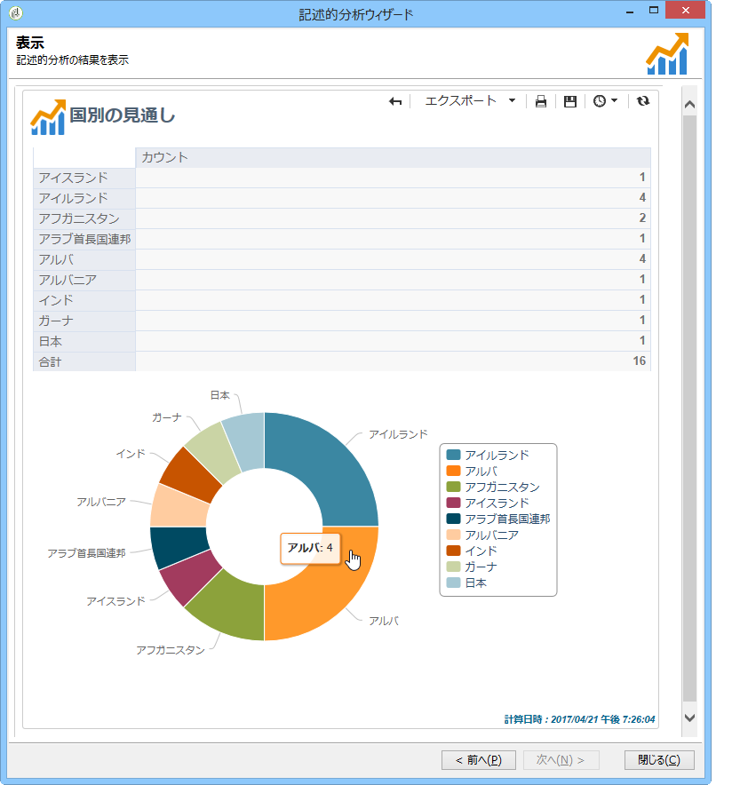
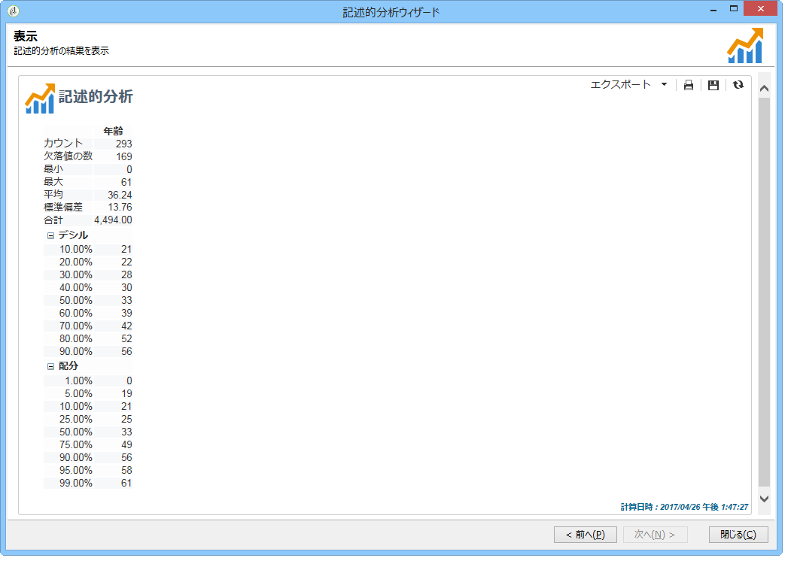

# 記述的分析について{#about-descriptive-analysis}

データベース内のデータに関する統計を生成するために、専用ウィザードを使用して記述的分析レポートを作成し、その内容や表示方法を必要に応じて調整します。

これらのレポートは母集団に関係するものであり、少量のデータの分析にのみ使用してください。

定量分析または定性分析レポートを生成できます。定性分析レポートでは、次のような方法でデータを表示できます

* テーブルとヒストグラム

   

* 累積値（テーブルなし）

   

* 事業部門別の分類

   

定量分析では、次に示すように、選択した項目の数値データに関する全体的な統計を提供します。

これらのレポートは、記述的分析ウィザードを通じて作成します。このウィザードでは、作成するレポートのタイプ、データおよびレイアウトを様々な手順で選択できます。レポートは最後の手順で表示されます。必要に応じて、レポートのパブリッシュ、他のオペレーターとの共有、印刷および Excel、PDF、OpenDocument のいずれかのフォーマットでのエクスポートをおこなえます。

記述的分析ウィザードは、Adobe Campaign レポートほど強力ではありませんが、これを使用すると、データベース内容や選択した一部のデータの概要をすばやく把握できます。

>[!CAUTION]
>
>記述的分析では、大量データの調査はおこなえません。

