# レポートに対するアクション{#actions-on-reports}

レポートを表示している際に、ツールバーを使用すると、一定数のアクションを実行できます。次に、それらについて説明します。

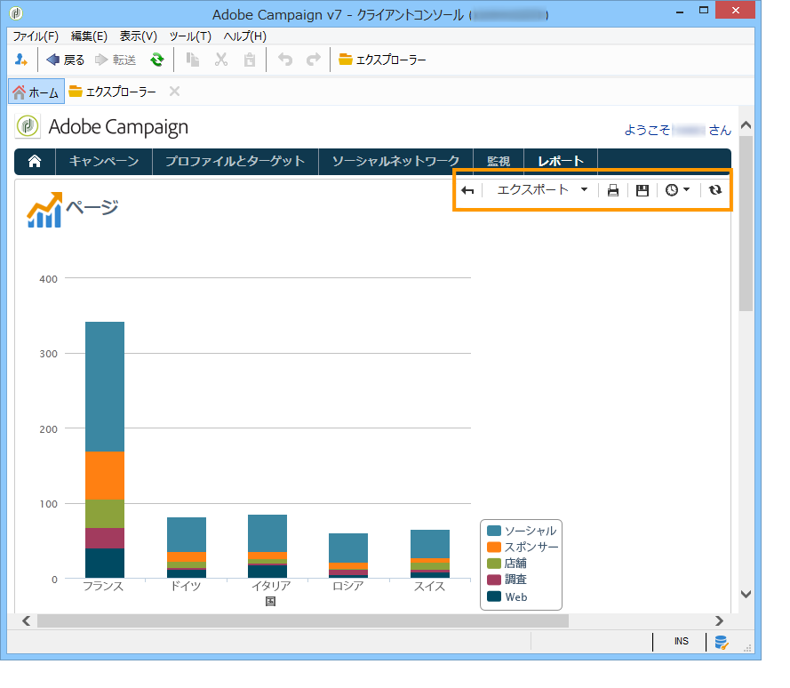

ツールバーでは、レポートのエクスポート、印刷、アーカイブ、Web ブラウザーでの表示などをおこなうことができます。

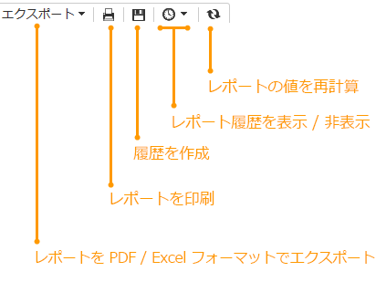

## レポートのエクスポート {#exporting-a-report}

レポートのエクスポートフォーマットをドロップダウンリストから選択します。.xls、.pdf、.ods のいずれかです。

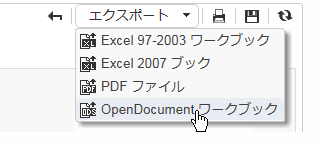

レポートが複数のページで構成されている場合は、ページごとに操作を繰り返す必要があります。

レポートを PDF、Excel、OpenOffice のいずれかのフォーマットにエクスポートすることを考慮して、レポートを設定できます。Adobe Campaign エクスプローラーを開き、該当するレポートを選択します。

レポートの&#x200B;**[!UICONTROL ページ]**&#x200B;アクティビティを介して、「**[!UICONTROL 詳細設定]**」タブでエクスポートオプションにアクセスします。

**[!UICONTROL 用紙]**&#x200B;と&#x200B;**[!UICONTROL 余白]**&#x200B;の設定を、必要に応じて変更します。PDF フォーマットでのページのエクスポートのみ許可することもできます。それには、「**[!UICONTROL OpenOffice/Microsoft Excel エクスポートを有効化]**」オプションのチェックを外します。

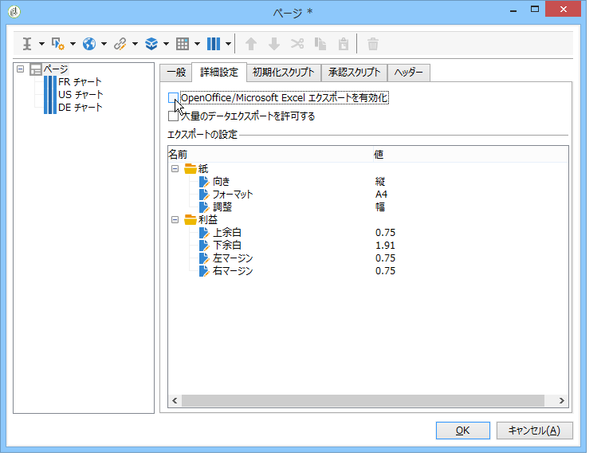

### Microsoft Excel へのエクスポート {#exporting-into-microsoft-excel}

Excel にエクスポートするように設計された&#x200B;**[!UICONTROL グループ化されたリスト]**&#x200B;タイプのレポートの場合は、次の推奨事項と制限事項が当てはまります。

* これらのレポートには空行を含めないでください。

   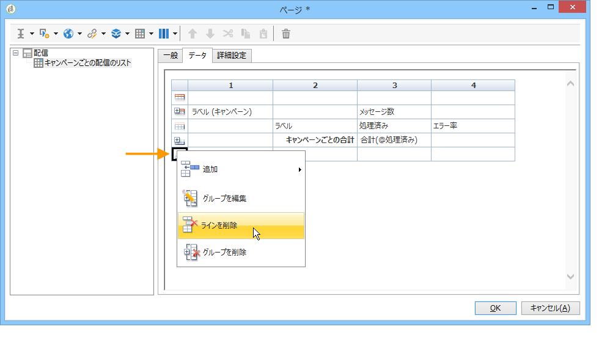

* リストの凡例は非表示にしてください。

   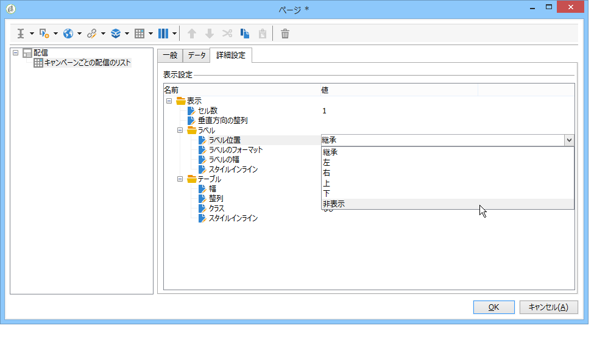

* レポートでは、セルレベルで定義した特定の書式設定を使用する必要はありません。**[!UICONTROL フォームのレンダリング]**&#x200B;を使用してテーブルのセルのフォーマットを定義するとよいでしょう。**[!UICONTROL フォームのレンダリング]**&#x200B;には、**[!UICONTROL 管理／設定／フォームのレンダリング]**&#x200B;でアクセスできます。
* HTML コンテンツの挿入はお勧めしません。
* レポートに、テーブルやグラフなどのタイプの要素が複数含まれている場合、それらは 1 つずつ順にエクスポートされます。
* セル内で強制的に復帰改行させることができます。この設定は Excel でも保たれます。詳しくは、この[セルのフォーマットの定義](../../reporting/using/creating-a-table.md#defining-cell-format)を参照してください。

### エクスポートの先送り {#postpone-the-export}

レポートのエクスポートを先送りして、例えば、非同期呼び出しを待つことができます。それには、ページの初期化スクリプトに次のように入力します。

```
document.nl_waitBeforeRender = true;
```

エクスポートを有効にし、PDF への変換を開始するには、パラメーターのない **document.nl_renderToPdf()** 関数を使用します。

### メモリ割り当て {#memory-allocation}

ある種の大規模なレポートをエクスポートする際には、メモリ割り当てエラーが発生する可能性があります。

あるインスタンスでは、設定ファイル **serverConf.xml** で指定されている JavaScript の **maxMB**（ホストされたインスタンスの場合は **SKMS**）のデフォルト値は 64 MB に設定されています。レポートのエクスポート中にメモリ不足エラーが発生した場合は、次のように、この数値を 512 MB に増やしてみることをお勧めします。

```
<javaScript maxMB="512" stackSizeKB="8"/>
```

変更内容を設定に適用するには、**nlserver** サービスを再起動する必要があります。

**serverConf.xml** ファイルについて詳しくは、[この節](../../production/using/configuration-principle.md)を参照してください。

**nlserver** サービスについて詳しくは、[この節](../../production/using/administration.md)を参照してください。

## レポートの印刷 {#printing-a-report}

レポートを印刷できます。それには、プリンターアイコンをクリックします。すると、ダイアログボックスが開きます。

印刷結果の見映えをよくするには、Internet Explorer の印刷オプションを編集し、「**[!UICONTROL 背景の色とイメージを印刷する]**」を選択します。

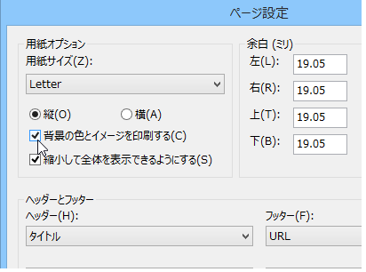

## レポートアーカイブの作成 {#creating-report-archives}

レポートをアーカイブすることで、様々な期間でレポートの表示を作成して、例えば、一定期間にわたる統計を表示できます。

アーカイブを作成するには、該当するレポートを開き、適切なアイコンをクリックします。

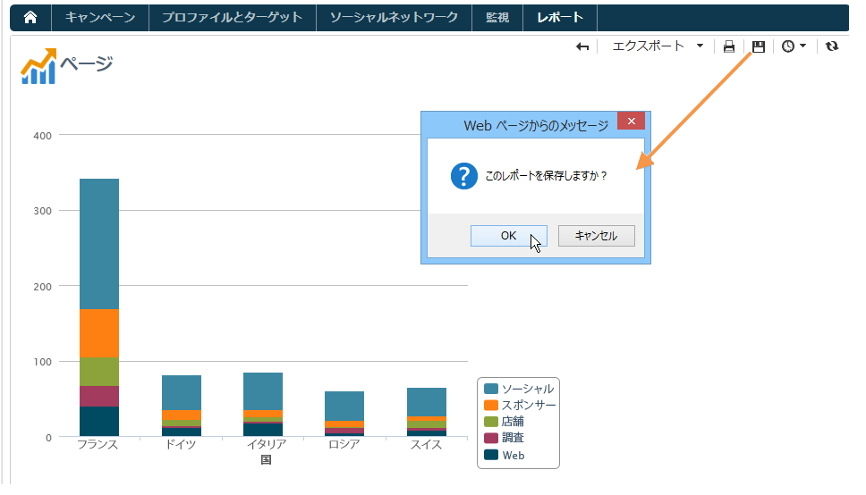

既存のアーカイブを表示または非表示にするには、表示／非表示アイコンをクリックします。

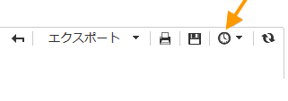

アーカイブの日付が表示／非表示アイコンの下に表示されます。目的のアーカイブをクリックすると、それが表示されます。

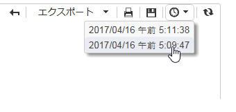

レポートアーカイブを削除できます。それには、レポートが格納されている Adobe Campaign ノードに移動します。「**[!UICONTROL 履歴]**」タブをクリックし、削除するアーカイブを選択して、「**[!UICONTROL 削除]**」をクリックします。

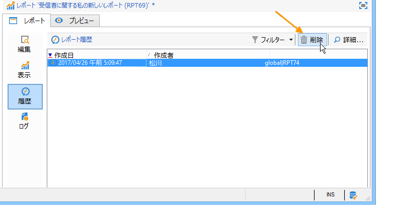

