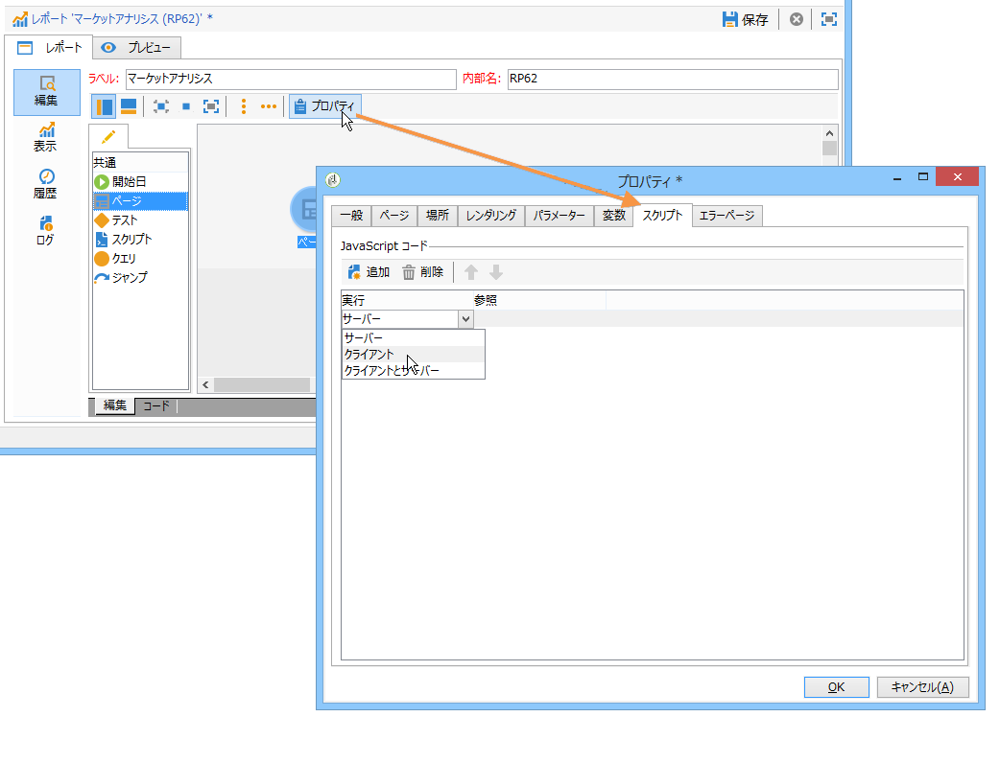

# 高度な機能{#advanced-functionalities}

## スクリプトの追加 {#adding-a-script}

### スクリプトアクティビティ {#script-activity}

このアクティビティでは、データを処理し、SQL 言語を使用しない複雑なクエリを容易に作成できます。

スクリプトウィンドウにクエリを入力するだけです。

The **[!UICONTROL Texts]** tab enables you to define text strings. They may then be used with the following syntax: **$(Identifier)**. テキストの使用方法の詳細については、「ヘッダーとフ [ッターの追加」を参照してください](../../reporting/using/element-layout.md#adding-a-header-and-a-footer)。

>[!CAUTION]
>
>JavaScript コードを使用して集計を作成することはお勧めしません。

レポートの履歴を作成するには、アーカイブしたデータを保存するために、JavaScript クエリに次の行を追加します。

```
if( ctx.@_historyId.toString().length == 0 )
```

そうしないと、現在のデータが表示されます。

### 外部スクリプト {#external-script}

サーバー側やクライアント側で実行される外部スクリプトを使用することもできます。手順は次のとおりです。

1. Edit the report properties and click the **[!UICONTROL Scripts]**.
1. Click **[!UICONTROL Add]** and select the script to be referenced.
1. 次に、実行モードを選択します。

   複数のスクリプトを追加する場合は、ツールバーの矢印を使用して、実行順序を定義します。

   

## 別のレポートの呼び出し {#calling-up-another-report}

### ジャンプアクティビティ {#jump-activity}

ジャンプは、矢印のないトランジションのようなものです。これを使用すると、アクティビティ間を移動したり、別のレポートにアクセスしたりできます。
