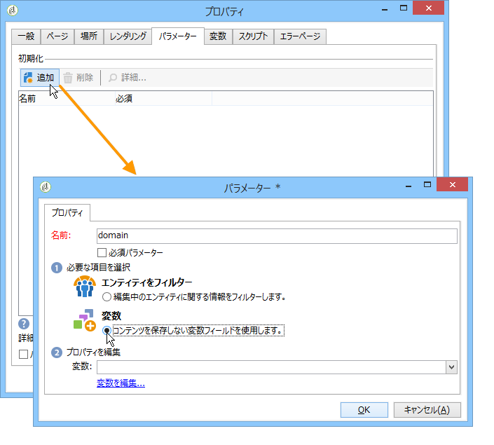

# 高度な機能{#advanced-functionalities}

技術的ユーザーは、[一般的なプロパティ](../../reporting/using/properties-of-the-report.md)に加えて、次のような高度な機能を利用してレポートを設定できます。

* 複雑なクエリを作成して、 **スクリプト**&#x200B;アクティビティのデータを処理します。[詳細情報](#script-activity)

* サーバーサイドまたはクライアントサイドで実行する外部スクリプトを追加します。[詳細情報](#external-script)

* **ジャンプ**&#x200B;アクティビティでレポートを呼び出します。[詳細情報](#calling-up-another-report)

* URL パラメーターをレポートに追加してアクセスしやすくします。[詳細情報](#calling-up-another-report)

* レポートのコンテキストで使用される変数を追加します。[詳細情報](#adding-variables)

## スクリプトの操作 {#adding-a-script}

### 外部参照スクリプト{#external-script}

レポートページの呼び出し時にクライアントサイドやサーバーサイドで実行される JavaScript コードを参照できます。

手順は次のとおりです。

1. [レポートのプロパティ](../../reporting/using/properties-of-the-report.md)を編集し、「**[!UICONTROL スクリプト]**」をクリックします。
1. 「**[!UICONTROL 追加]**」をクリックし、参照するスクリプトを選択します。
1. 次に、実行モードを選択します。

   複数のスクリプトを追加する場合は、ツールバーの矢印を使用して、実行順序を定義します。

   

クライアントサイドでの通常の実行の場合、参照されるスクリプトは JavaScript で記述されている必要があり、一般的なブラウザーとの互換性も必要です。詳しくは、[この節](../../web/using/web-forms-answers.md)を参照してください。

### スクリプトアクティビティの追加{#script-activity}

[レポートをデザイン](../../reporting/using/creating-a-new-report.md#modelizing-the-chart)する際に、**[!UICONTROL スクリプト]**&#x200B;アクティビティを使用してデータを処理し、SQL 言語を有効にしない複雑なクエリを簡単に作成できます。スクリプトウィンドウでクエリを直接入力できます。

「**[!UICONTROL テキスト]**」タブでは、テキスト文字列を定義できます。それらを使用するときの構文は、**$(Identifier)** のようになります。テキストの使用について詳しくは、[ヘッダーやフッターの追加](../../reporting/using/element-layout.md#adding-a-header-and-a-footer)を参照してください。

>[!CAUTION]
>
>JavaScript コードを使用して集計を作成することはお勧めしません。

レポートの履歴を作成するには、アーカイブしたデータを保存するために、JavaScript クエリに次の行を追加します。

```
if( ctx.@_historyId.toString().length == 0 )
```

そうしないと、現在のデータのみが表示されます。

## URL パラメーターの追加 {#defining-additional-settings}

[レポート](../../reporting/using/properties-of-the-report.md)プロパティの「**[!UICONTROL パラメーター]**」タブでは、レポートの追加設定を作成できます。これらの設定は、レポートの呼び出し時に URL 内に渡されます。

>[!CAUTION]
>
>セキュリティ上の理由から、これらのパラメーターは慎重に使用する必要があります。

新しい設定を作成するには

1. 「**[!UICONTROL 追加]**」ボタンをクリックし、設定の名前を入力します。

   

1. 必要に応じて、設定が必須かどうかを指定します。

1. 作成する設定の種類を選択します。選択できるのは、**[!UICONTROL フィルター]**&#x200B;または&#x200B;**[!UICONTROL 変数]**&#x200B;です。

   「**[!UICONTROL エンティティをフィルター]**」オプションでは、データベースのフィールドをパラメーターとして使用できます。

   

   データの復元は、エンティティレベル **ctx/recipient/@account** で直接おこなわれます。

   「**[!UICONTROL 変数]**」オプションでは、変数を作成または選択できます。変数は、URL のパラメーターとして渡されるほか、フィルターで使用することもできます。

**[!UICONTROL 応答 HTTP ヘッダー]**&#x200B;を使用すると、iframe を使用してレポートのページを HTML ページに含める際のクリックジャックを防ぐことができます。クリックジャックを避けるために、**[!UICONTROL X-Frame-options ヘッダー]**&#x200B;の動作を選択できます。

* **[!UICONTROL なし]**：レポートには **[!UICONTROL X-Frame-options ヘッダー]**&#x200B;は含まれません。
* **[!UICONTROL 同じ生成源]**：新しいレポートおよび再パブリッシュされたレポートに対してデフォルトで設定されます。ホスト名は、レポートの URL と同じになります。
* **[!UICONTROL 拒否]**：iframe を使用して HTML ページにレポートを含めることはできません。


## 変数の追加 {#adding-variables}

「**[!UICONTROL 変数]**」タブには、レポートに設定されている変数のリストが表示されます。これらの変数は、レポートのコンテキストで公開されており、計算で使用できます。

「**[!UICONTROL 追加]**」ボタンをクリックして、新しい変数を作成します。

変数の定義を表示するには、変数を選択し、「**[!UICONTROL 詳細]**」ボタンをクリックします。


## 使用例：レポート内での変数とパラメーターの使用

次のビデオの例では、「_type」パラメーターを追加して、この属性の値に基づいてレポートの異なる表示を作成する方法を学びます。

 [ビデオでこの機能を確認する](https://helpx.adobe.com/campaign/classic/how-to/add-url-parameter-in-acv6.html?playlist=/ccx/v1/collection/product/campaign/classic/segment/business-practitioners/explevel/intermediate/applaunch/how-to-4/collection.ccx.js&amp;ref=helpx.adobe.com)


## 別のレポートの呼び出し {#calling-up-another-report}

**ジャンプ**&#x200B;アクティビティは、矢印のないトランジションのようなものです。これを使用すると、アクティビティ間を移動したり、別のレポートにアクセスしたりできます。
