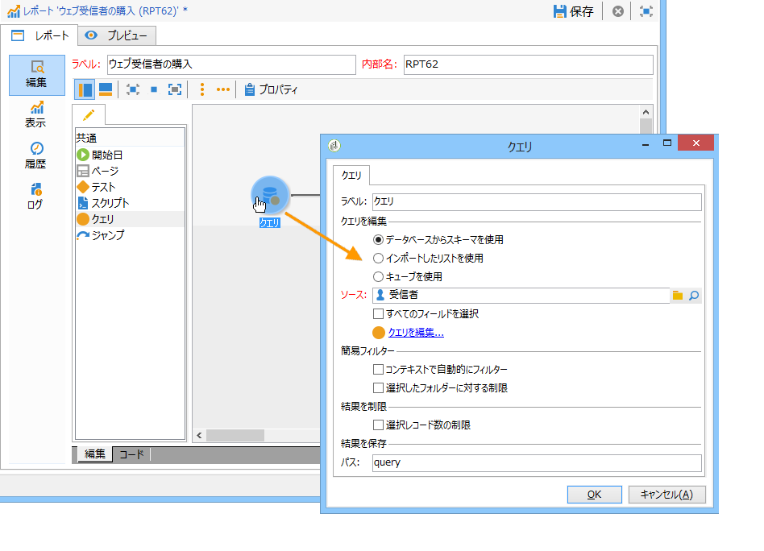
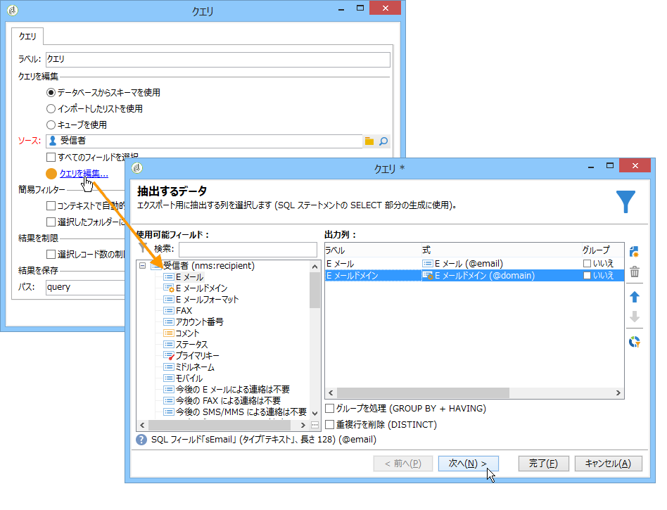
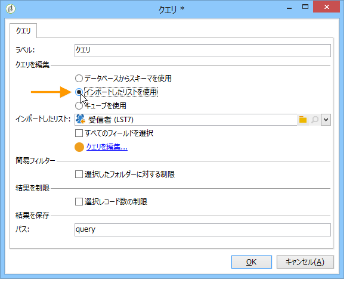
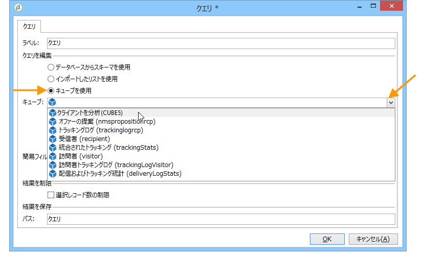
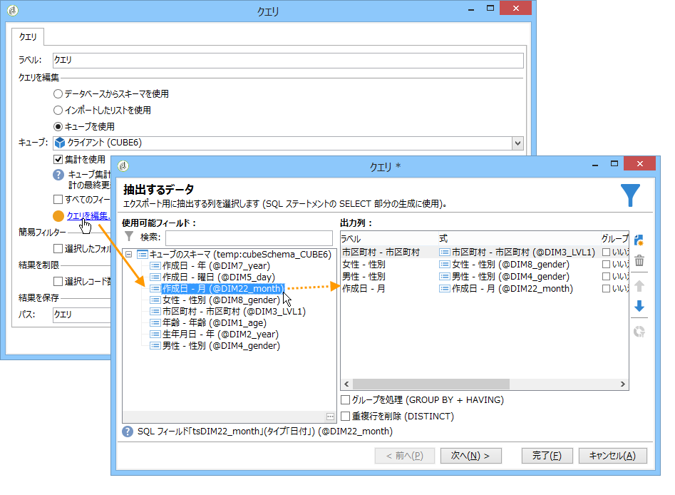

# 分析するデータの収集{#collecting-data-to-analyze}

レポートの作成に使用するデータは、レポートページで直接選択することも（詳しくは、[コンテキストの使用](../../reporting/using/using-the-context.md)を参照）、1 つまたは複数のクエリで収集することもできます。

このアクティビティは、3 つの異なる方法を提供します。

1. データベースのデータを使用してクエリを作成する。
1. リストに含まれているデータを処理する。
1. 既存のキューブに格納されているデータを使用する。

このうちのどの方法を選択するかは、計算のタイプ、データ量、データの永続性などによって決まります。これらの要因をすべて慎重に検討して、Adobe Campaign データベースに過大な負荷をかけないようにすると共に、レポートの生成と操作を最適化する必要があります。詳しくは、[このページ](../../reporting/using/best-practices.md#optimizing-report-creation)を参照してください。

どの場合でも、データは&#x200B;**[!UICONTROL クエリ]**&#x200B;タイプのアクティビティで収集されます。

このデータ選択モードが関係してくるのは、データベースのデータを使用してレポートのデータを収集または作成する必要がある場合です。場合によっては、レポートで使用されている要素から直接データを選択することもできます。例えば、グラフを挿入した場合、そのソースデータを直接選択できます。詳しくは、[コンテキストの使用](../../reporting/using/using-the-context.md)を参照してください。

## スキーマからのデータの使用 {#using-the-data-from-a-schema}

データベーススキーマにリンクしているデータを使用するには、クエリエディターで適切なオプションを選択し、適用するクエリを設定します。

次の例では、データベース内のプロファイルの中から各国の受信者の数を収集できます。次に、それらを表形式でレポートに表示できます。

## インポートしたリストの使用 {#using-an-imported-list}

レポートを作成するために、インポートしたデータのリストからデータを使用できます。

それには、クエリボックスで「**[!UICONTROL インポートしたリストを使用]**」オプションを選択し、該当するリストを選択します。

「**[!UICONTROL クエリを編集]**」リンクをクリックして、このリスト内の要素の中からレポート作成用に収集するデータを定義します。

## キューブの使用 {#using-a-cube}

クエリを定義するためにキューブを選択できます。

キューブを使用すると、データベースの調査および分析機能を拡張できると同時に、レポートやテーブルの設定がエンドユーザーにとってより簡単になります。完全に設定された既存のキューブを選択して、そのキューブの計算、測定および統計を使用するだけです。キューブの作成について詳しくは、[この節](../../reporting/using/about-cubes.md)を参照してください。

「**[!UICONTROL クエリを編集]**」リンクをクリックして、レポートで表示または使用する指標を選択します。

## クエリでのフィルターオプション {#filtering-options-in-the-queries}

データベース全体に対するクエリを実行しないようにするために、データをフィルターする必要があります。

### 簡易フィルター {#simplified-filter}

「**[!UICONTROL コンテキストで自動的にフィルター]**」オプションを選択すると、ツリーの特定のノード（リスト、受信者、配信など）からレポートにアクセスできるようになります。

「**[!UICONTROL 選択したフォルダーに限定]**」オプションを選択すると、フォルダーを指定し、その中身だけを考慮に入れることができます。これによって、次に示すように、レポートのデータをフィルターして、ツリー内のいずれかのフォルダーに含まれるデータのみを表示できます。

### 収集されるデータの量の制限 {#limiting-the-amount-of-data-collected}

クエリで抽出するレコードの数を次の結果制限オプションで設定できます。

* 「**[!UICONTROL 最初のレコードに制限]**」を使用すると、1 レコードのみ抽出されます。
* 「**[!UICONTROL サイズ]**」を使用すると、設定した数のレコードが抽出されます。

