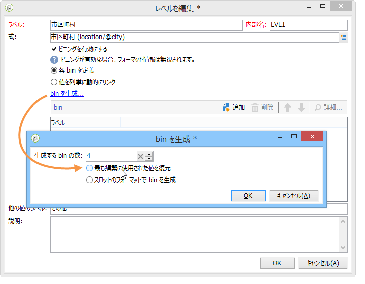

# キューブのベストプラクティス{#concepts-and-methodology}

## データビニング {#data-binning}

ビニングを使用すると、条件に従って値がグループ化されるので、データの表示をシンプル化できます。使用できる情報に応じて、年齢グループの定義、E メールドメインのグループ化、値の列挙への制限、表示するデータの明示的な制限、専用の行や列への他のすべてのデータのグループ化などをおこなえます。

概して、使用可能なビニングは、次の 3 タイプです。

1. 定義された値範囲を手動で使用する。例えば、年齢、平均的なショッピングカート、開封された配信の数などです。詳しくは、各ビンの定義を参照 [してください](#defining-each-bin)。
1. 列挙の値に応じて動的に管理する。列挙に含まれている値のみ表示し、その他のすべての値は「その他」にまとめられます。詳しくは、ビンの動的な管理を参 [照してください](#dynamically-managing-bins)。
1. 値の範囲を使用し、その他はすべて 1 つにグループ化する。例えば、18～25 歳、26～59 歳、その他などです。For more on this, refer to [Creating value ranges](#creating-value-ranges).

ビニングを有効にするには、ディメンションの作成時に適切なボックスにチェックを入れます。

bin を手動で作成することも、既存の列挙にリンクすることもできます。

Adobe Campaign には自動ビニングのアシスタントも用意されています。値は、N 個のグループに分類することも、データベース内の最も頻度の高い値に従ってグループ化することもできます。

### 各 bin の定義 {#defining-each-bin}

To create each bin individually, select the **[!UICONTROL Define each bin]** option and use the table to create the various bins.

Click the **[!UICONTROL Add]** button to create a new bin and list the values which will be grouped into the bin.

次の例では、言語が3つのカテゴリにグループ化されています。英語/ドイツ語/オランダ語、フランス語/イタリア語/スペイン語、その他。

SQL マスクを使用して、複数の値を組み合わせてフィルターにすることができます。これを行うには、列を **[!UICONTROL Yes]** チェックイ **[!UICONTROL Use an SQL mask]** ンし、列に適用するSQLフィルタを入力し **[!UICONTROL Value or expression]** ます。

下図の例では、**yahoo** で始まる E メールドメイン（yahoo.fr、yahoo.com、yahoo.be など）や、**ymail** で始まる E メールドメイン（ymail.com、ymail.eu など）および **rocketmail.com** ドメインのアドレスはすべて、**YAHOO!** というラベルでグループ化されます。

### bin の動的管理 {#dynamically-managing-bins}

値は、列挙を通じて動的に管理できます。これは、その列挙に含まれている値のみ表示されることを意味します。列挙の値が変わったら、キューブの内容は、それに合わせて自動的に変更されます。

このタイプの値ビニング例を作成するには、次の手順に従います。

1. 新しいディメンションを作成し、ビニングを有効にします。
1. オプションを **[!UICONTROL Dynamically link the values to an enumeration]** 選択し、一致する列挙を選択します。

   

   列挙の値が更新されるたびに、対応する bin がそれに合わせて自動的に変更されます。

### 値の範囲の作成 {#creating-value-ranges}

所定の区間に基づいて、値を範囲にグループ化できます。

範囲を手動で定義するには、ボタンをクリ **[!UICONTROL Add]** ックし、次を選択しま **[!UICONTROL Define a range]** す。

次に、上限と下限を指定し、「**[!UICONTROL Ok]**」をクリックして確定します。

### bin の自動生成 {#generating-bins-automatically}

bin を自動的に生成することもできます。これを行うには、リンクをクリック **[!UICONTROL Generate bins...]** します。

次のいずれかが可能です。

* 最も頻繁に使用されている値を復元

   次の例では、最も頻繁に使用されている 4 つの値が表示される一方、それ以外は「その他」カテゴリにカウントされ、グループ化されます。

* スロットの形式で bin を生成

   次の例では、同じサイズの 4 つの値スロットが Adobe Campaign によって自動的に作成され、そこにデータベース内の値が表示されます。

この場合、ファクトスキーマで選択されたフィルターは無視されます。

### 列挙 {#enumerations}

レポートの関連度と読みやすさを向上させるために、Adobe Campaign では、特定の列挙を作成して、異なる値を同じ bin にグループ化し直すことができます。これらの列挙はビニング用に確保されており、キューブで参照され、したがってレポートに表示されます。

また、Adobe Campaign には、ドメインに関する列挙も用意されており、それを使用すると、次の例に示すように、データベースに格納されているすべての連絡先の E メールドメインのリストを、ISP でグループ化し直して表示できます。

これは次のテンプレートを使用して作成されます。

To create a report using this enumeration, create a Cube using the **[!UICONTROL Email domain]** dimension. 次に、このオプション **[!UICONTROL Enable binning]** を選択しま **[!UICONTROL Dynamically link the values to an enumeration]**&#x200B;す。 次に、先ほど示した&#x200B;**ドメイン**&#x200B;列挙を選択します。エイリアスが指定されていない値はすべて、**その他**&#x200B;というラベルでグループ化し直されます。

次に、このキューブに基づくレポートを作成して、これらの値を表示します。

関係するレポートを更新するには、列挙を変更するだけです。例えば、**Adobe** という値を作成し、**adobe.com** というエイリアスを追加すると、列挙レベルの Adobe 値でレポートが自動的に更新されます。

The **[!UICONTROL Domains]** enumeration is used to generate built-in reports that display the list of domains. これらのレポートの内容を調整するには、このリストを編集します。

ビニング用に確保される他の列挙を作成し、それらを他のキューブで使用できます。最初の列挙タブで指定された bin に、すべてのエイリアス値がグループ化し直されます。

## 集計の計算と使用 {#calculating-and-using-aggregates}

最大のデータ量を集計で計算できます。

集計は、大量のデータを操作するときに役に立ちます。専用のワークフローボックスで定義した設定に基づいて集計が自動的に更新され、最近収集したデータが指標に統合されます。

集計は各キューブの関連タブで定義されます。

>[!NOTE]
>
>集計の計算を更新するためのワークフローを集計そのものに設定できます。または、関連するキューブにリンクされた外部ワークフローを通じて集計を更新することもできます。

新しい集計を作成するには、次の手順に従います。

1. Click the **[!UICONTROL Aggregates]** tab of the cube, then click the **[!UICONTROL Add]** button.

   

1. 集約のラベルを入力してから、計算するディメンションを追加します。

   

1. ディメンションとレベルを選択します。ディメンションおよびレベルごとに、この手順を繰り返します。
1. Click the **[!UICONTROL Workflow]** tab to create the aggregation workflow.

   

   * The **[!UICONTROL Scheduler]** activity lets you define the frequency of calculation updates. スケジューラーについて詳しくは、[この節](../../workflow/using/scheduler.md)を参照してください。
   * The **[!UICONTROL Aggregate update]** activity lets you select the update mode which you want to apply: full or partial.

      デフォルトでは、各計算時に完全更新が実行されます。部分的更新を有効にするには、該当するオプションを選択し、更新の条件を定義します。

      

## 測定の定義 {#defining-measures}

The types of measures are defined in the **[!UICONTROL Measures]** tab of the cube. 合計、平均、偏差などを計算できます。

測定を必要な数だけ作成できます。その後、テーブルに表示または非表示にする測定を選択します。詳しくは、[測定の表示](#displaying-measures)を参照してください。

新しい測定を定義するには、次の手順に従います。

1. Click the **[!UICONTROL Add]** button above the list of measures and select the type of measure and the formula to be calculated.

   

1. 必要に応じて、および演算子によっては、演算に関係する式を選択します。

   The **[!UICONTROL Advanced selection]** button lets you create complex calculation formulas. 詳しくは、[この節](../../platform/using/about-queries-in-campaign.md)を参照してください。

   

1. The **[!UICONTROL Filter the measure data...]** link lets you restrict the calculation field and only apply it to specific data in the database.

   

1. Enter the label of the measure and add a description, then click **[!UICONTROL Finish]** to create it.

## 測定の表示 {#displaying-measures}

必要に応じて、テーブルでの測定の表示を設定できます。

* the display sequence of measures (refer to [Display sequence](#display-sequence)),
* the information to show/hide in the report (refer to [Configuring the display](#configuring-the-display))
* 表示する指標割合、合計、小数点以下の桁数など (表示され [る測定のタイプの変更を参照](#changing-the-type-of-measure-displayed))。

### 表示順序 {#display-sequence}

The measures calculated in the cube are configured via the **[!UICONTROL Measures]** button.

行を前後に移動して、表示順序を変更します。次の例では、フランス語のデータをリストの末尾に移動しています。つまり、最後の列に表示されるようになります。

### 表示の設定 {#configuring-the-display}

測定、行および列の設定は、測定ごとに個別に実行することも、全部まとめて実行することもできます。特定のアイコンをクリックすると、表示モード選択ウィンドウにアクセスできます。

* アイコンをクリ **[!UICONTROL Edit the configuration of the pivot table]** ックして、設定ウィンドウにアクセスします。

   測定のラベルを表示するかどうかを選択できるほか、ラベルのレイアウト（行または列）を設定できます。

配色オプションでは、重要な値を強調表示して読みやすくすることができます。

### 表示する測定のタイプの変更 {#changing-the-type-of-measure-displayed}

各測定内で、適用する単位とフォーマット設定を定義できます。

## レポートの共有 {#sharing-a-report}

レポートを設定したら、それを保存して他のオペレーターと共有できます。

To do this, click the **[!UICONTROL Show the report properties]** icon and enable the **[!UICONTROL Share this report]** option.

レポートのカテゴリと関連度を指定します。詳しくは、[このページ](../../reporting/using/configuring-access-to-the-report.md#report-display-context)の&#x200B;**表示順序**&#x200B;と&#x200B;**フィルターオプションの定義**&#x200B;に関する節を参照してください。

これらの変更を確定するには、レポートを保存する必要があります。

## フィルターの作成 {#creating-filters}

データの一部分を表示するためのフィルターを作成できます。

手順は次のとおりです。

1. アイコンをクリッ **[!UICONTROL Add a filter]** クします。

   

1. フィルターに関係するディメンションを選択します。

   

1. フィルターのタイプと精度を選択します。

   

1. 作成したフィルターは、レポートの上に表示されます。

   

   フィルターをクリックすると、編集できます。

   「×」アイコンをクリックすると、フィルターを削除できます。

   フィルターを必要な数だけ組み合わせることができます。それらはすべて、このエリアに表示されます。

   

フィルターを変更（追加、削除、編集）するたびに、レポートを再計算する必要があります。

選択した項目に基づいてフィルターを作成することもできます。To do this, select your source cells, lines and columns, then click the **[!UICONTROL Add a filter]** icon.

行、列またはセルを選択するには、それを左クリックします。選択を解除するには、もう一度クリックします。

フィルターが自動的に適用され、レポートの上のフィルターゾーンに追加されます。

