# レポートへのアクセスの設定{#configuring-access-to-the-report}

## レポートの表示コンテキスト {#report-display-context}

「**[!UICONTROL 表示]**」タブを使用して、Adobe Campaign プラットフォームにおけるレポートの表示コンテキストを定義します。レポートへのアクセスは、レポートの選択タイプ、表示条件、アクセス認証によって決まります。

### 選択タイプ {#selection-type}

レポートへのアクセスを、特定のコンテキストまたはオファースペース（例えば、配信、受信者、選ばれた一連の受信者など）に制限できます。このようなアクセスは、「**[!UICONTROL 表示]**」タブの「**[!UICONTROL 選択タイプ]**」セクションで設定します。

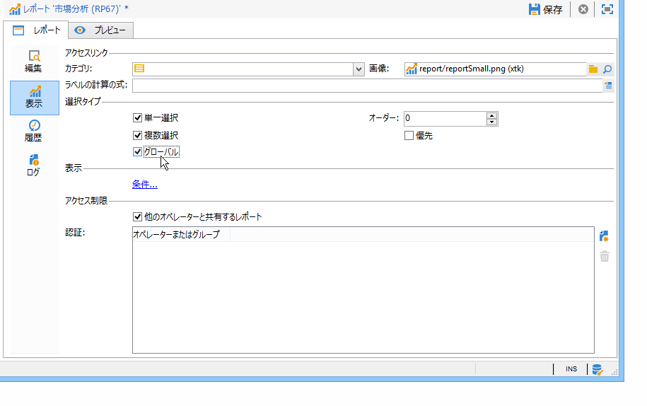

* 「**[!UICONTROL 単一選択]**」：レポートは、特定のエンティティが選択されたときにのみアクセス可能です。
* 「**[!UICONTROL 複数選択]**」：レポートは、複数のエンティティが選択されたときにアクセスされます。
* 「**[!UICONTROL グローバル]**」：レポートは、使用可能なレポートのリスト（レポートウィンドウ内）を通じてアクセスされます。

### 表示順序 {#display-sequence}

「**[!UICONTROL 順序]**」フィールドでは、リストにおけるレポートの表示順序を指定する数値を入力できます。

デフォルトでは、レポートは関連度の順に表示されます。このフィールドに入力された値によって、関連度が最も高いもの（最大の入力値）から最も低いもの（最小の入力値）へとレポートを並べ替えることができます。

1 から 10 まで、0 から 100 まで、-10 から 10 までなど、必要に応じて、使用するスケールを選択できます。

### 表示条件 {#display-conditions}

クエリによって、レポートの表示に条件を付けることもできます。

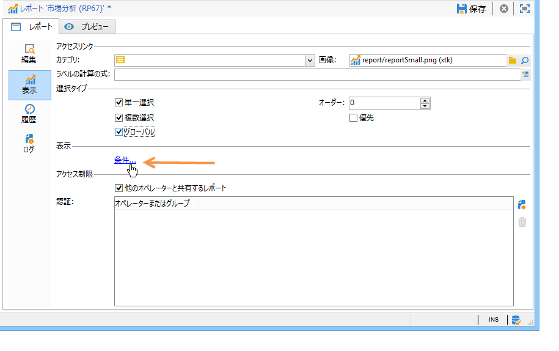

次の例では、キャンペーンのメインチャネルが E メールの場合に、レポートが表示されます。

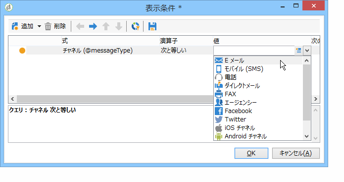

つまり、キャンペーンのメインチャネルがダイレクトメールの場合、キャンペーンレポートではこのレポートは参照できません。

### アクセス認証 {#access-authorization}

レポートは、他のオペレーターと共有できます。

レポートにアクセスできるようにするには、「**[!UICONTROL 他のオペレーターと共有するレポート]**」オプションを選択します。このオプションが選択されていない場合は、このレポートを作成したオペレーターのみ、このレポートにアクセスできます。

認証ウィンドウを通じて追加した特定のオペレーターやオペレーターグループと、レポートを共有することもできます。

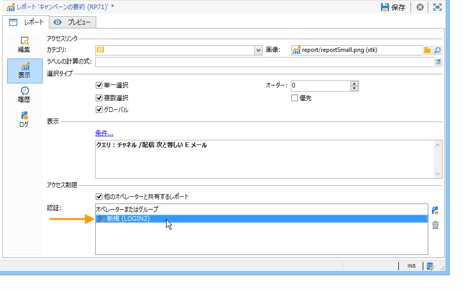

### フィルターオプションの定義 {#defining-the-filtering-options}

**[!UICONTROL レポート]**&#x200B;ウィンドウには、プラットフォームで使用可能なすべてのレポートが表示され、接続したオペレーターには、それらのレポートに対するアクセス権があります。

デフォルトでは、レポートは関連度の順に並べ替えられますが、他のタイプのフィルター（アルファベット順、年齢順など）を適用することもできます。

レポートカテゴリに基づいて表示をフィルターすることもできます。

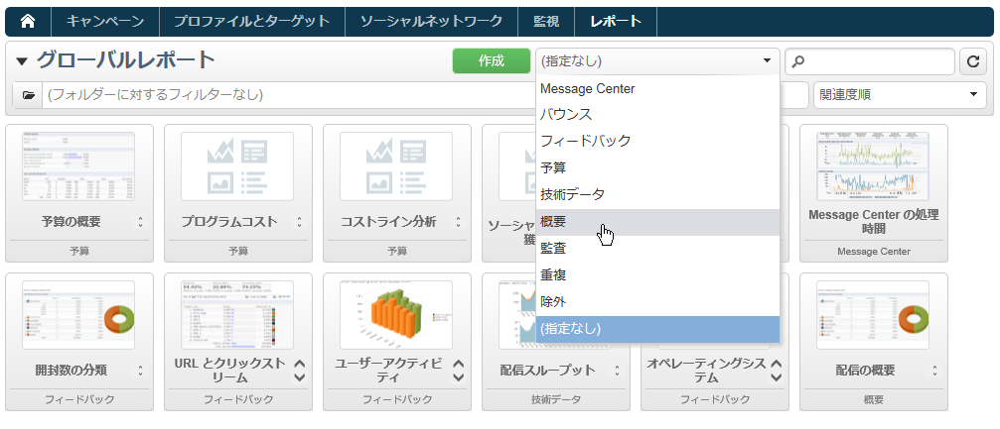

レポートのカテゴリを定義するには、次に示すように、「**[!UICONTROL 表示]**」タブで、該当するカテゴリを選択します。

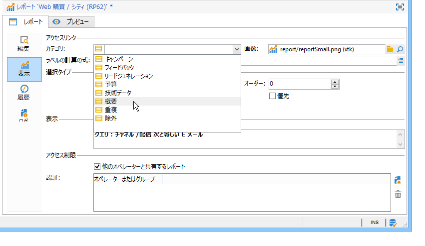

ここで新しいカテゴリを入力して、使用可能なカテゴリのリストに追加できます。一致する列挙は自動的に更新されます。

## レポートへのリンクの作成 {#creating-a-link-to-a-report-}

ツリーの特定のノード（リスト、受信者、配信など）を通じてレポートにアクセスできるようにすることが可能です。それには、該当するレポートへのリンクを作成し、そのリンクを使用できるエンティティを指定するだけです。

一例として、レポートへのリンクを作成して、受信者リストを使用してそれにアクセスできるようにします。

1. 「**[!UICONTROL 新しいレポート]**」をクリックし、レポート作成ウィザードで「**[!UICONTROL 既存のレポートにリンクを作成]**」を選択します。

   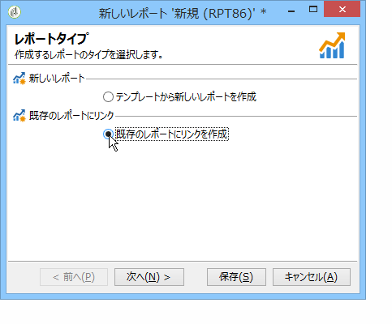

1. リンク先のレポートをドロップダウンリストから選択します。この例では、**国別分類**&#x200B;レポートを選択します。

   

1. ラベルを入力し、スキーマを選択します。この例では、受信者リストテーブルを選択します。

   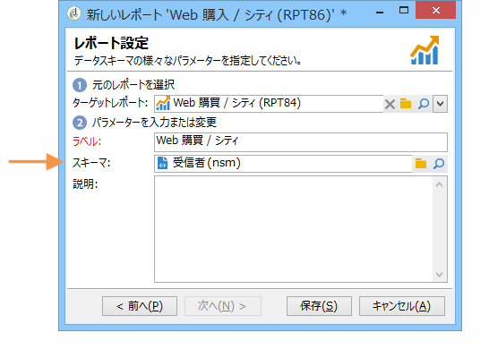

   つまり、レポートには、任意の受信者リストを通じてアクセスできるようになり、また、表示される統計は、選択したリストに含まれている受信者に関するものになります。

1. レポートを保存し表示します。
1. リンクキーを入力します。この例では、「フォルダー」リンクの外部キーになります。

   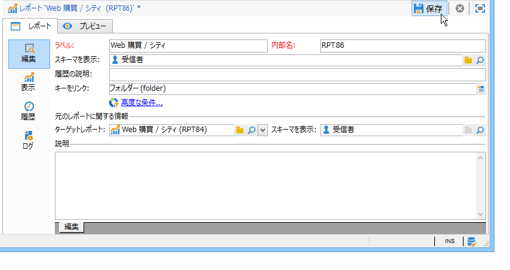

1. レポートをパブリッシュします。
1. 受信者リストの 1 つにアクセスし、「**[!UICONTROL レポート]**」リンクをクリックします。先ほど作成したレポートがアクセス可能です。

   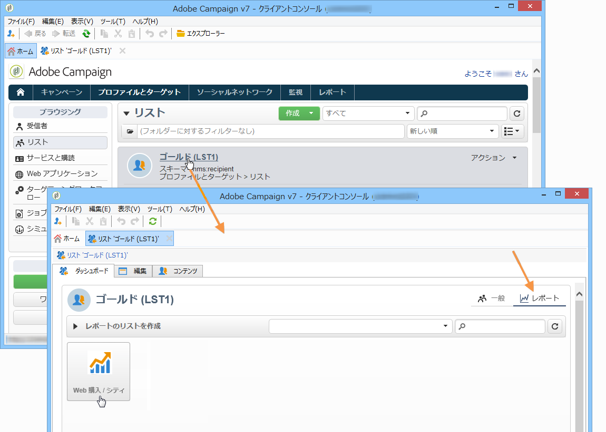

## レポートのプレビュー {#preview-of-the-report}

レポートをパブリッシュする前に、正しく表示されるかどうかを「**[!UICONTROL プレビュー]**」タブで確認します。

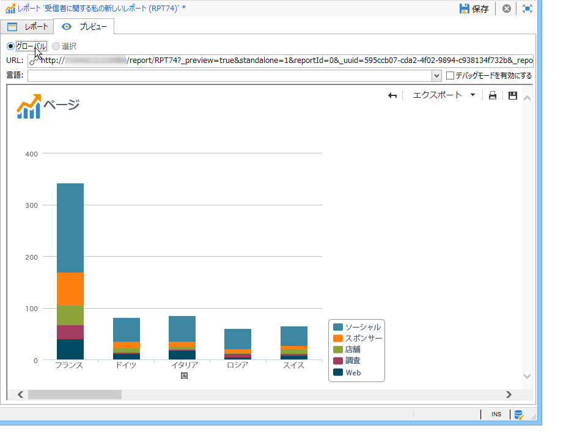

レポートのプレビューを表示するには、「**[!UICONTROL グローバル]**」オプションか「**[!UICONTROL 選択]**」オプションを選択します。

これら 2 つのオプションのどちらかを、レポートの表示設定に基づいて選択します。表示設定が「**[!UICONTROL グローバル]**」の場合は、プレビューオプションとして「**[!UICONTROL グローバル]**」を選択する必要があります。表示設定が「**[!UICONTROL 単一選択]**」か「**[!UICONTROL 複数選択]**」の場合は、「**[!UICONTROL 選択]**」をプレビューオプションとして選択してくだい。

詳しくは、[レポートの表示コンテキスト](#report-display-context)を参照してください。

特定の設定では、エラーを制御できます。レポートの URL には **_uuid** 設定が含まれています。それに **&amp;_preview** 設定や **&amp;_debug** 設定を追加できます。

これらの設定について詳しくは、[Web フォーム](../../web/using/about-web-forms.md)の章の「**Web フォームプロパティの定義**」の節を参照してください。

## レポートのパブリッシュ {#publishing-the-report}

レポートを他のオペレーターと共有したり、利用可能なレポートのリストにレポートを表示するには、レポートをパブリッシュする必要があります（[レポートの表示コンテキスト](#report-display-context)も参照してください）。レポートを変更するたびに、この操作を再度実行する必要があります。

1. ツールバーで「**[!UICONTROL パブリッシュ]**」をクリックして、パブリッシュウィザードを開きます。

   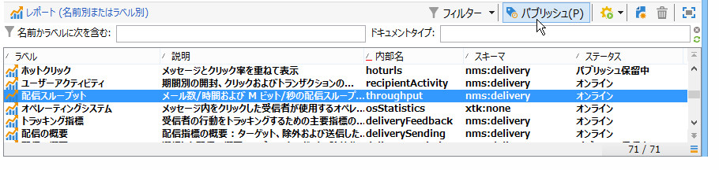

1. 「**[!UICONTROL 開始]**」をクリックして、パブリッシュします。

   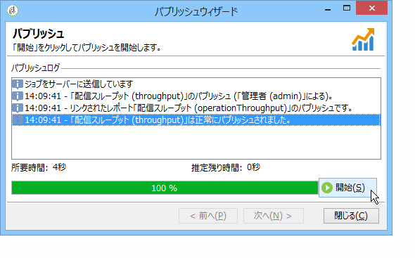

1. **[!UICONTROL 拡大]**&#x200B;アイコンをクリックすると、レポートが Web ブラウザーで開かれます。

