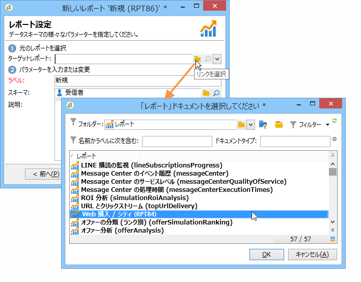

# レポートへのアクセスの設定{#configuring-access-to-the-report}

## レポートの表示コンテキスト {#report-display-context}

Define the display context of the report in the Adobe Campaign platform using the **[!UICONTROL Display]** tab. レポートへのアクセスは、レポートの選択タイプ、表示条件、アクセス認証によって決まります。

### 選択タイプ {#selection-type}

レポートへのアクセスは、配信、受信者、選択した受信者など、特定のコンテキストまたはオファースペースに制限できます。 このアクセスは、タブのセクシ **[!UICONTROL Selection type]** ョンで設定し **[!UICONTROL Display]** ます。

* **[!UICONTROL Single selection]** :レポートにアクセスできるのは、特定のエンティティが選択されている場合のみです。
* **[!UICONTROL Multiple selection]** :複数のエンティティが選択されると、レポートにアクセスします。
* **[!UICONTROL Global]** :レポートには、「レポート」領域で使用可能なレポートのリストを通じてアクセスします。

### 表示順序 {#display-sequence}

The **[!UICONTROL Sequence]** field lets you enter a numeric value that specifies the display sequence of the report in the list.

デフォルトでは、レポートは関連度の順に表示されます。このフィールドに入力された値によって、関連度が最も高いもの（最大の入力値）から最も低いもの（最小の入力値）へとレポートを並べ替えることができます。

必要に応じて、使用するスケールを選択できます。1 ～ 10、0 ～ 100、-10 ～ 10など

### 表示条件 {#display-conditions}

クエリによって、レポートの表示に条件を付けることもできます。

次の例では、キャンペーンのメインチャネルが E メールの場合に、レポートが表示されます。

つまり、キャンペーンのメインチャネルがダイレクトメールの場合、キャンペーンレポートではこのレポートは参照できません。

### アクセス認証 {#access-authorization}

レポートは、他のオペレーターと共有できます。

レポートをアクセシブルにするには、このオプションを選 **[!UICONTROL Report shared with other operators]** 択します。 このオプションが選択されていない場合は、このレポートを作成したオペレーターのみ、このレポートにアクセスできます。

認証ウィンドウを通じて追加した特定のオペレーターやオペレーターグループと、レポートを共有することもできます。

### フィルターオプションの定義 {#defining-the-filtering-options}

The **[!UICONTROL Reports]** universe displays all available reports in the platform and for which the connected operator has an access right.

デフォルトでは、レポートは関連度の順に並べ替えられますが、他のタイプのフィルター（アルファベット順、年齢順など）を適用することもできます。

レポートカテゴリに基づいて表示をフィルターすることもできます。

To define the category of a report, select it via the **[!UICONTROL Display]** tab, as shown below:

ここで新しいカテゴリを入力して、使用可能なカテゴリのリストに追加できます。一致する列挙は自動的に更新されます。

## レポートへのリンクの作成 {#creating-a-link-to-a-report-}

ツリーの特定のノード（リスト、受信者、配信など）を通じてレポートにアクセスできるようにすることが可能です。それには、該当するレポートへのリンクを作成し、そのリンクを使用できるエンティティを指定するだけです。

一例として、レポートへのリンクを作成して、受信者リストを使用してそれにアクセスできるようにします。

1. をクリ **[!UICONTROL New]** ックし、レポ **[!UICONTROL Create a link to an existing report]** ート作成ウィザードでを選択します。

   

1. リンク先のレポートをドロップダウンリストから選択します。この例では、**国別分類**&#x200B;レポートを選択します。

   

1. ラベルを入力し、スキーマを選択します。この例では、受信者リストテーブルを選択します。

   

   つまり、レポートには、任意の受信者リストを通じてアクセスできるようになり、また、表示される統計は、選択したリストに含まれている受信者に関するものになります。

1. レポートを保存し表示します。
1. リンクキーを入力します。この例では、「フォルダー」リンクの外部キーになります。

   

1. レポートをパブリッシュします。
1. Go to one of your recipient lists and click the **[!UICONTROL Reports]** link: the report you have just created is accessible.

   

## レポートのプレビュー {#preview-of-the-report}

Before publishing your report, make sure it is displayed correctly in the **[!UICONTROL Preview]** tab.

To display the preview of the report, select the **[!UICONTROL Global]** or the **[!UICONTROL Selection]** option.

これら 2 つのオプションのどちらかを、レポートの表示設定に基づいて選択します。If the display setting is **[!UICONTROL Global]**, you need to select the **[!UICONTROL Global]** preview option. 表示設定がまたはの場合は、プレ **[!UICONTROL Single selection]** ビューオ **[!UICONTROL Multiple selection]**&#x200B;プション **[!UICONTROL Selection]** を選択する必要があります。

詳しくは、「レポート表示コンテキスト」 [を参照してください](#report-display-context)。

特定の設定では、エラーを制御できます。レポートの URL には **_uuid** 設定が含まれています。それに **&amp;_preview** 設定や **&amp;_debug** 設定を追加できます。

これらの設定について詳しくは、[Web フォーム](../../web/using/about-web-forms.md)の章の「**Web フォームプロパティの定義**」の節を参照してください。

## レポートのパブリッシュ {#publishing-the-report}

Publishing the report is mandatory in order to share them with other operators and display them in the list of available reports (also refer to [Report display context](#report-display-context)). レポートを変更するたびに、この操作を再度実行する必要があります。

1. Open the publishing wizard by clicking **[!UICONTROL Publish]** in the toolbar.

   

1. をクリッ **[!UICONTROL Start]** クして公開します。

   

1. Click the **[!UICONTROL Enlarge]** icon to open the report in a web browser.

