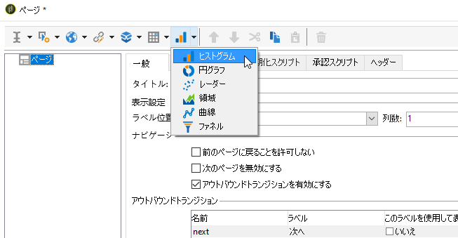
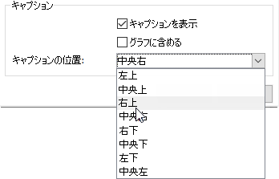

# グラフの作成{#creating-a-chart}

データベース内のデータを収集してグラフに表示することもできます。Adobe Campaign では、様々なグラフ表示が可能です。次に、それらの設定について説明します。

グラフは、右クリックメニューまたはツールバーでレポートページに直接挿入します。

## 作成ステップ {#creation-steps}

レポートにグラフを作成するには、次の手順に従います。

1. グラフを表示するページを編集し、ツールバーでグラフタイプを選択します。

   

1. 名前とキャプションを入力します。必要に応じて、ドロップダウンリストを使用してキャプションの位置を変更できます。

   

1. 「**[!UICONTROL データ]**」タブをクリックして、データソースと計算対象となる系列を定義します。

   グラフに表示する統計は、クエリまたはコンテキストデータに基づいて計算できます。コンテキストデータとは、現在のページのインバウンドトランジションで提供されるデータのことです（詳しくは、[コンテキストデータの使用](../../reporting/using/using-the-context.md#using-context-data)を参照）。

   * 「**[!UICONTROL データをフィルター]**」リンクをクリックして、データベースに格納されているデータのフィルター条件を定義します。

      

   * コンテキストデータを使用するには、「**[!UICONTROL ソース]**」ドロップダウンから「**[!UICONTROL コンテキストデータ]**」を選択し、「**[!UICONTROL 詳細設定...]**」リンクをクリックします。次に、統計に関係するデータを選択します。

      

      コンテキストデータにアクセスして、グラフに表示する値を定義できるようになります。

      

## グラフのタイプとバリエーション {#chart-types-and-variants}

Adobe Campaign では、様々なタイプのグラフ表示が可能です。次に、それらについて説明します。

グラフタイプは、グラフをページに挿入する際に選択します。

また、グラフの「**[!UICONTROL 一般]**」タブの「**[!UICONTROL グラフタイプ]**」セクションでタイプを変更することもできます。

バリエーションは、選択したグラフタイプによって異なります。バリエーションは「**[!UICONTROL バリエーション]**」リンクを介して選択します。

### 内訳：円グラフ {#breakdown--pie-charts}

このタイプのグラフでは、測定された要素の概要を表示できます。

円グラフでは、1 つの変数のみ分析できます。

「**[!UICONTROL バリエーション]**」リンクをたどって、グラフの全体的なレンダリングをパーソナライズできます。

円グラフでは、該当するフィールドに内側の半径の値を入力できます。

次に例を示します。

0.00 の場合は、完全な円。

0.40 の場合は、内側の半径が全体の 40% になる円。

1.00 の場合は、円の外周のみ。

### 変化：折れ線グラフと面グラフ {#evolution--curves-and-areas}

このタイプのグラフィック表現では、1 つまたは複数の測定値の時間的変化を把握できます。

### 比較：ヒストグラム {#comparison--histograms}

ヒストグラムでは、1 つまたは複数の変数の値を比較できます。

このタイプのグラフの場合は、次に示すオプションが&#x200B;**[!UICONTROL グラフのバリエーション]**&#x200B;ウィンドウに用意されています。

グラフにキャプションを表示するために「**[!UICONTROL キャプションを表示]**」オプションにチェックを入れ、その位置を選択します。

該当する場合は、複数の値を積み重ねることができます。

必要に応じて、値の表示順を逆にできます。それには、「**[!UICONTROL 表示順を逆転]**」オプションを選択します。

### コンバージョン：ファネル {#conversion--funnel}

このタイプのグラフでは、測定された要素のコンバージョン率を追跡できます。

## グラフとのインタラクション {#interaction-with-the-chart}

ユーザーがグラフをクリックしたときのアクションを定義できます。**[!UICONTROL インタラクションイベント]**&#x200B;ウィンドウを開き、実行するアクションを選択します。

選択可能なインタラクションタイプとそれらの設定について詳しくは、[この節](../../web/using/static-elements-in-a-web-form.md#inserting-html-content)を参照してください。

## 統計を計算 {#calculating-statistics}

グラフでは、収集したデータに関する統計を表示できます。

これらの統計は、「**[!UICONTROL データ]**」タブの「**[!UICONTROL 系列パラメーター]**」セクションを使用して定義します。

新しい統計を作成するには、「**[!UICONTROL 追加]**」アイコンをクリックし、該当するウィンドウを設定します。次に、使用可能な計算タイプについて説明します。

詳しくは、[この節](../../reporting/using/using-the-descriptive-analysis-wizard.md#statistics-calculation)を参照してください。
