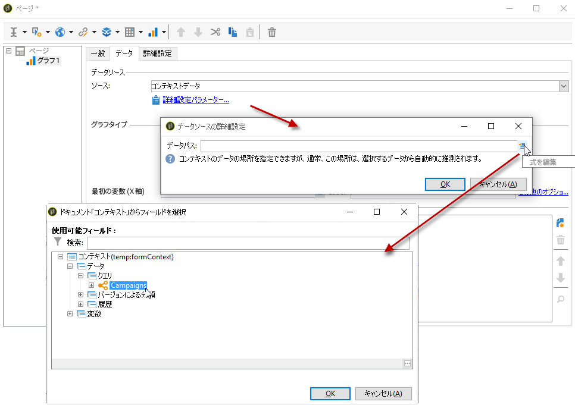

# グラフの作成{#creating-a-chart}

データベース内のデータを収集してグラフに表示することもできます。Adobe Campaign では、様々なグラフ表示が可能です。次に、それらの設定について説明します。

グラフは、右クリックメニューまたはツールバーでレポートページに直接挿入します。

## 作成ステップ {#creation-steps}

レポートにグラフを作成するには、次の手順に従います。

1. グラフを表示するページを編集し、ツールバーでグラフタイプを選択します。

   

1. 名前とキャプションを入力します。必要に応じて、ドロップダウンリストを使用してキャプションの位置を変更できます。

   

1. Click the **[!UICONTROL Data]** tab to define the data source and the series to be calculated.

   The statistics to be displayed in the chart can be calculated based on a query or on the context data, i.e. the data provided by the inbound transition of the current page (for more on this, refer to [Using context data](../../reporting/using/using-the-context.md#using-context-data)).

   * Click the **[!UICONTROL Filter data...]** link to define filtering criteria for the data in the database.

      

   * To used contextual data, select this option and click the **[!UICONTROL Advanced settings...]** link. 次に、統計に関係するデータを選択します。

      

      コンテキストデータにアクセスして、グラフに表示する値を定義できるようになります。

      

## グラフのタイプとバリエーション {#chart-types-and-variants}

Adobe Campaign では、様々なタイプのグラフ表示が可能です。次に、それらについて説明します。

グラフタイプは、グラフをページに挿入する際に選択します。

It can also be altered via the **[!UICONTROL Chart type]** section of the **[!UICONTROL General]** tab in the chart.

バリエーションは、選択したグラフタイプによって異なります。They are selected via the **[!UICONTROL Variants...]** link.

### 分類：円グラフ {#breakdown--pie-charts}

このタイプのグラフでは、測定された要素の概要を表示できます。

円グラフでは、1 つの変数のみ分析できます。

The **[!UICONTROL Variants]** link lets you personalize the overall rendering of the chart.

円グラフでは、該当するフィールドに内側の半径の値を入力できます。

次に例を示します。

0.00 の場合は、完全な円。

0.40 の場合は、内側の半径が全体の 40% になる円。

1.00 の場合は、円の外周のみ。

### 変化：折れ線グラフと面グラフ {#evolution--curves-and-areas}

このタイプのグラフでは、1 つまたは複数の測定値の時間的変化を把握できます。

### 比較：ヒストグラム {#comparison--histograms}

ヒストグラムでは、1 つまたは複数の変数の値を比較できます。

For these types of charts, the following options are offered in the **[!UICONTROL Variants]** window:

Check the **[!UICONTROL Display caption]** option to show the caption with the chart and choose its position:

該当する場合は、複数の値を積み重ねることができます。

必要に応じて、値の表示順を逆にできます。To do this, select the **[!UICONTROL Reverse stacking]** option.

### コンバージョン：ファネル {#conversion--funnel}

このタイプのグラフでは、測定された要素のコンバージョン率を追跡できます。

### 進捗状況：ゲージ {#progress--gauge}

このタイプのグラフでは、定義された目標値と比較した値の進捗状況を表示できます。次の例では、目標とする 100 件の配信のうち、正常に送信された配信の数（76）が黒い目盛り盤に表示されています。このゲージは、特定の状況に対応する 3 つの範囲に分かれています。

グラフの設定時に次の要素を定義します。

* The **[!UICONTROL Value]** field is represented by a black dial in the chart. 進捗状況の計算対象となる要素を表します。表す値は既に保存されている必要があります。
* The **[!UICONTROL Goal]** field represents the maximum value to achieve.
* Using the **[!UICONTROL Other mark]** field you can add a second indicator to the chart.
* The **[!UICONTROL Display range]** fields let you specify the values between which the report is calculated.
* The **[!UICONTROL Value ranges]** field lets you attribute statuses (None, Bad, Acceptable, Good) to a set of values to better illustrate the progress.

In the **[!UICONTROL Display settings]** section, the **[!UICONTROL Change appearance...]** lets you configure the way the chart is displayed.

このオ **[!UICONTROL Display the value below the gauge]** プションを使用すると、値の進行状況をグラフの下に表示できます。

The **[!UICONTROL Aperture ratio]** field, which must be between 0 and 1, lets you edit the report&#39;s aperture in a more or less complete circle. 上図の例の場合、値 0.50 は半円に対応します。

The **[!UICONTROL Width]** field lets you edit the chart size.

## グラフとのインタラクション {#interaction-with-the-chart}

ユーザーがグラフをクリックしたときのアクションを定義できます。Open the **[!UICONTROL Interaction events]** window and select the action you want to perform.

選択可能なインタラクションタイプとそれらの設定について詳しくは、[この節](../../web/using/static-elements-in-a-web-form.md#inserting-html-content)を参照してください。

## 統計の計算 {#calculating-statistics}

グラフでは、収集したデータに関する統計を表示できます。

These statistics are defined via the **[!UICONTROL Series parameters]** section of the **[!UICONTROL Data]** tab.

To create a new statistic, click the **[!UICONTROL Add]** icon and configure the appropriate window. 次に、使用可能な計算タイプについて説明します。

詳しくは、[この節](../../reporting/using/using-the-descriptive-analysis-wizard.md#statistics-calculation)を参照してください。
