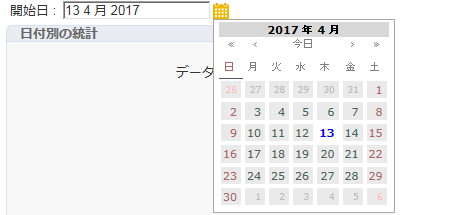

# 新しいレポートの作成{#creating-a-new-report}

レポートを作成するには、次の手順に従います。

1. Open the Adobe Campaign Explorer and from the **[!UICONTROL Administration > Configuration]** node, then select the **[!UICONTROL Reports]** folder.
1. Click the **[!UICONTROL New]** button above the list of reports.
1. を選択し、 **[!UICONTROL Create a new report from a template]** をクリックしま **[!UICONTROL Next]**&#x200B;す。

   

1. ドロップダウンリストからレポートテンプレートを選択します。

   * The **[!UICONTROL Extended report]** lets you create a report configured using a chart.
   * The **[!UICONTROL Qualitative distribution]** report lets you create statistics based on all types of data (company name, email domain, etc.).
   * The **[!UICONTROL Quantitative distribution]** report lets you create statistics on data that can be measured or counted (invoice amount, recipient age, etc.).
   これらのレポートテンプレートについて詳しくは、[この節](../../reporting/using/about-descriptive-analysis.md)を参照してください。

1. レポートの名前と説明をそれぞれ該当するフィールドに入力します。Specify the **[!UICONTROL schema]** on which the report will be applied.

   

1. このレポートを保存します。

## チャートのモデル化 {#modelizing-the-chart}

レポートを保存すると、次の画面が表示されます。ここでレポートのチャートを作成できます。

レポートを作成するためのチャートは、一連のアクティビティで構成されます。

アクティビティは、矢印で表されるトランジションを使用してリンクします。

レポートを作成するには、レポートの特性とコンテキストに応じて有用な要素を特定し、それらの論理的な順序をモデル化する必要があります。

1. 「開始」アクティビティを使用して、レポートを作成するために最初に実行するプロセスを具体化します。このアクティビティは、レポートごとに 1 つのみ使用できます。

   チャートにループが含まれる場合は必須です。

1. 「クエリ」アクティビティを 1 つまたは複数追加して、レポートの作成に役立つデータを収集します。データの収集は、データベースのスキーマに対するクエリによって直接おこなうことも、インポートしたリストまたは既存のキューブを使用しておこなうこともできます。

   詳しくは、[分析するデータの収集](../../reporting/using/collecting-data-to-analyze.md)を参照してください。

   このデータは、ページの設定に応じて、レポートに表示されることも表示されないこともあります。

1. 「ページ」アクティビティを 1 つまたは複数配置して、収集したデータのグラフィカルな表現を定義します。表、グラフ、入力フィールドなどを挿入し、1 つまたは複数のページまたはページの要素の表示条件を設定できます。表示される内容は完全に設定可能です。

   詳しくは、[静的要素](#static-elements)を参照してください。

1. 「テスト」アクティビティを使用して、データの表示またはアクセスの条件を定義します。

   詳しくは、[ページ表示の条件付け](../../reporting/using/defining-a-conditional-content.md#conditioning-page-display)を参照してください。

1. 必要に応じて、パーソナライズされたスクリプトを「スクリプト」アクティビティを使用して追加し、例えば、レポート名の生成、特定のコンテキストに基づく結果表示のフィルターなどをおこないます。

   詳しくは、[スクリプトアクティビティ](../../reporting/using/advanced-functionalities.md#script-activity)を参照してください。

1. 最後に、複雑なレポートを読みやすくするために、「ジャンプ」タイプのアクティビティを 1 つまたは複数挿入できます。これによって、レポートにトランジションを実体化せずにアクティビティ間を移動できます。「ジャンプ」は別のレポートの表示にも使用できます。

   詳しくは、[ジャンプアクティビティ](../../reporting/using/advanced-functionalities.md#jump-activity)を参照してください。

複数の分岐を同時に実行することはできません。つまり、そのように作成されたレポートは機能しません。

ただし、複数の分岐を配置することはできます。そのうちの 1 つだけが実行されます。

## ページの作成 {#creating-a-page}

レポートの内容は、フローチャートに配置したアクティビティによって設定されます。詳しくは、[チャートのモデル化](#modelizing-the-chart)を参照してください。

アクティビティを設定するには、そのアイコンをダブルクリックします。

表示される内容は、**ページ**&#x200B;タイプのアクティビティに定義します。

レポートには、1 つまたは複数のページを含めることができます。ページは専用のエディターで作成します。このエディターでは、入力フィールド、選択フィールド、静的要素、グラフ、テーブルなどをツリー構造で挿入できます。コンテナはレイアウトの定義に役に立ちます。詳しくは、[要素のレイアウト](../../reporting/using/element-layout.md)を参照してください。

ページにコンポーネントを追加するには、ツールバーの左上側にあるアイコンを使用します。

また、コンポーネントを追加するノードを右クリックし、リストからそのコンポーネントを選択することもできます。

>[!CAUTION]
>
>レポートが Excel 形式でエクスポートするように設計されている場合は、複雑な HTML 書式設定を使用しないことをお勧めします。詳しくは、[レポートのエクスポート](../../reporting/using/actions-on-reports.md#exporting-a-report)を参照してください。

A **[!UICONTROL Page]** can include the following elements:

* Bar, pie, curve type **[!UICONTROL charts]**, etc.
* Pivot; List with group, or Breakdown **[!UICONTROL tables]**.
* テキストまたは数値の種 **[!UICONTROL Input controls]**&#x200B;類。
* Drop-down list, checkbox, radio button, multiple choice, date, or Matrix type **[!UICONTROL Selection controls]**.
* Link editor, Constant, Folder selection type **[!UICONTROL Advanced controls]**.
* 値、リンク、HTML、画像など **[!UICONTROL Static elements]**.
* **[!UICONTROL Containers]** コンポーネントのレイアウトを制御できる

ページおよびページコンポーネントの設定モードについて詳しくは、[この節](../../web/using/about-web-forms.md)で説明しています。

ツールバーを使用すると、コントロールの追加や削除をおこなえるほか、レポートページでのコントロールの順序を構成できます。

### 静的要素 {#static-elements}

静的要素を使用すると、グラフィカル要素やスクリプトなどの、ユーザーとの間でインタラクションが発生しない情報をレポートに表示できます。詳しくは、[この節](../../web/using/static-elements-in-a-web-form.md#inserting-html-content)を参照してください。

### レポートの情報のフィルタリング {#filtering-information-in-a-report}

入力コントロールや選択コントロールを使用すると、レポートに表示する情報をフィルターできます。この種のフィルターの実装について詳しくは、[クエリでのフィルターオプション](../../reporting/using/collecting-data-to-analyze.md#filtering-options-in-the-queries)を参照してください。

入力フィールドや選択フィールドの作成と設定について詳しくは、[この節](../../web/using/about-web-forms.md)を参照してください。

レポートに 1 つまたは複数の入力コントロールを組み込むことができます。このタイプのコントロールを使用すると、表示される情報を、入力値に従ってフィルターできます。

レポートに 1 つまたは複数の選択コントロールを組み込むこともできます。このタイプのコントロールを使用すると、レポートに記載される情報を、次のいずれかを使用して選択された値に基づいてフィルターできます。

* ラジオボタンまたはチェックボックス

   

* ドロップダウンリスト

   

* カレンダー

   

また、レポートに 1 つまたは複数の高度なコントロールを組み込むことができます。このタイプのコントロールを使用すると、リンクや定数を挿入したり、フォルダーを選択したりできます。

ここでは、レポートのデータをフィルターして、ツリーのいずれかのフォルダーに含まれている情報だけを表示できます。

