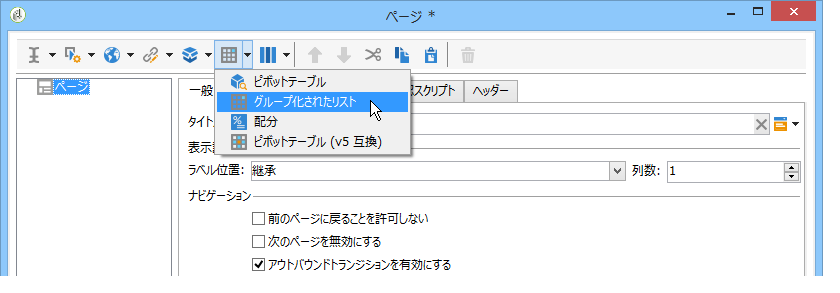
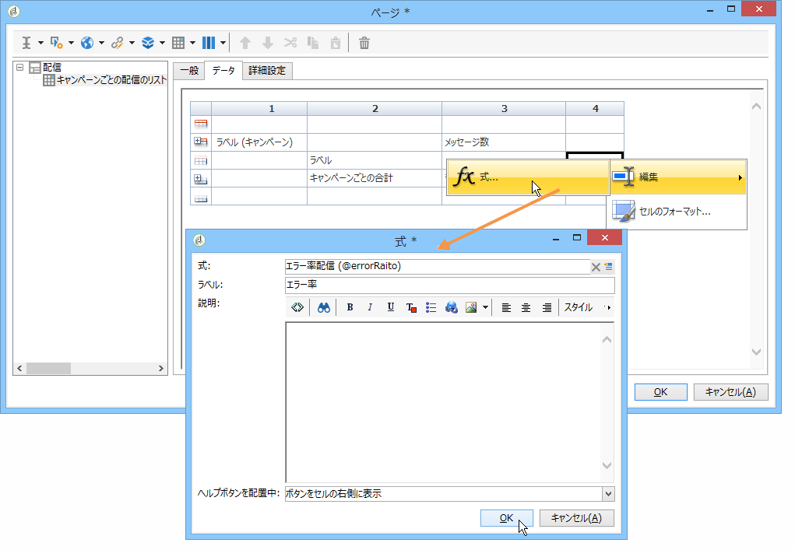

# テーブルの作成{#creating-a-table}

レポートにテーブルを追加して、データを表示できます。追加できるテーブルには、キューブの測定に基づいて作成されたピボットテーブル、グループ化されたリスト、値の分類を含むテーブルがあります。


## グループ化されたリストの作成 {#creating-a-list-with-group}

A **[!UICONTROL List with group]** type table lets you group data in the table and produce statistics on it. 例えば、データの合計と小計を作成できます。グループごとに、専用のヘッダー行、詳細行、フッター行があります。

>[!CAUTION]
>
>The **[!UICONTROL Page]** activity containing the table must be preceded by a **[!UICONTROL Query]** or **[!UICONTROL Script]** activity to collect the data to be analyzed in the report. これらのアクティビティについて詳しくは、「分析およびスクリプ [トするデータの収集](../../reporting/using/collecting-data-to-analyze.md) 」アクティビティ [を参照してくださ](../../reporting/using/advanced-functionalities.md#script-activity)い。

### 動作の仕組み {#operating-principle}

複数のデータカテゴリを一度に分析しなければならないことがあります。グループ化されたリストでは、データを組み合わせて、同じテーブル内のデータの様々なグループに関する統計を作成できます。それには、テーブルにグループを作成します。

次の例では、グループは、データベース内のすべてのキャンペーン、配信、および配信ごと／キャンペーンごとに送信されたメッセージ数を表示します。

It lets you list the campaigns (**[!UICONTROL Label (Campaign)]**, the list of deliveries (**[!UICONTROL Label]** ) linked to the campaign, and lets you count the number of messages sent per delivery (**[!UICONTROL Processed)]**, before adding them up for each campaign (**[!UICONTROL Sum(@processed)]** ).


### 実装の手順 {#implementation-steps}

完全な実装例を次に示します。使 [用例：グループリストを使用してレポートを作成します](#use-case--create-a-report-with-a-group-list)。

「グループ化されたリスト」タイプのテーブルを作成するには、次の手順に従ってください。

1. Go to the report chart and place a **[!UICONTROL Query]** activity. 「分析するデ [ータの収集」を参照](../../reporting/using/collecting-data-to-analyze.md)。
1. ソーステーブルを入力し、そのテーブルのフィールドのうち、統計に関係するものを選択します。
1. Place a **[!UICONTROL Page]** activity in the chart. 詳しくは、[静的要素](../../reporting/using/creating-a-new-report.md#static-elements)を参照してください。
1. ページにテ **[!UICONTROL List with group]** ーブルを挿入します。
1. データパス、またはクエリでデータソースとして選択されたテーブルを指定します。

   後でソーステーブルのフィールドを復元し、それらをテーブルのセルに挿入する場合、この手順は必須です。

1. テーブルとその内容を作成します。
1. Display the finalized report in the **[!UICONTROL Preview]** tab. その後は、レポートをパブリッシュしたり、必要に応じてレポートを別のフォーマットにエクスポートしたりできます。詳しくは、[レポートのエクスポート](../../reporting/using/actions-on-reports.md#exporting-a-report)を参照してください。

### 行や列の追加 {#adding-lines-and-columns}

By default, a **[!UICONTROL List with group]** type table includes a header, a detail line, and a footer line.

グループ自体に、ヘッダー行、詳細行、フッター行が含まれています。

* **ヘッダー行**：この行にはテーブルの列のタイトルを入力できます。

   

* **詳細行**：この行には統計値が含まれます。

   

* **フッター行**：この行には合計値を表示できます。

   

必要に応じて、行や列を追加できます。

グループは、テーブルの任意の行に配置でき、独自のヘッダー行、詳細行、フッター行を含みます。


**行や列**：行や列を追加または削除するには、既存の行や列に移動し、右クリックメニューを使用します。


追加する行の特性は、カーソルの位置によって決まります。For example, to add a header line, place your cursors on a header, then click **[!UICONTROL Add > A line above/below]**.


The width of the columns can be modified via the **[!UICONTROL Column format]** item.

**グループ**：グループを追加するには、対象となる行に移動し、ドロップダウンメニューから該当する項目を選択します。


### セルの内容の定義 {#defining-cell-content}

テーブルのセルを編集してセルの内容とフォーマットを定義するには、対象となるセルに移動し、右クリックメニューを使用します。

Use the **[!UICONTROL Expression]** menu entry to select the values to display.


* 分析する値をテーブルに直接挿入する場合は、使用可能なフィールドの中から該当するものを選択します。

   使用可能なフィールドのリストは、レポート作成チャートでテーブル作成の前に定義するクエリの内容に一致します。

   

* セル（例えばヘッダーセル）のラベルを入力します。

   それには、データベースにフィールドを挿入する場合と同様の手順に従いますが、式は選択しません。Enter the label in the **[!UICONTROL Label]** field. それがそのまま表示されます。

* 集計（平均や合計など）を計算し、それをセルに表示します。

   To do this, use the **[!UICONTROL Aggregates]** menu entry and select the desired campaign.

   

### セルのフォーマットの定義 {#defining-cell-format}


To define the cell format, the **[!UICONTROL Cell format...]** menu lets you access all formatting options available for the selected cell.

これらのオプションを使用すると、レポートの最終的なレンダリングをパーソナライズし、情報を読み取りやすくすることができます。

Use the **[!UICONTROL Carriage return]** field when exporting data to Excel: select the **[!UICONTROL Yes]** value to force the carriage return. この値はエクスポート時に保持されます。詳しくは、[レポートのエクスポート](../../reporting/using/actions-on-reports.md#exporting-a-report)を参照してください。

The **[!UICONTROL Cell format]** window lets you access the following tab:

* タ **[!UICONTROL Value]** ブ
* タ **[!UICONTROL Borders]** ブ
* タ **[!UICONTROL Click]** ブ
* タ **[!UICONTROL Extra]** ブ

The **[!UICONTROL Value]** tab lets you change the font and the various value attributes or to define a format based on their nature.


The format changes data display: for example, the **[!UICONTROL Number]**, **[!UICONTROL Monetary]** and **[!UICONTROL Percentage]** formats allow you to align the figures on the right and display decimal points.

通貨フォーマットの設定方法の例：値の表示に使用される通貨を指定し、3 桁区切り記号を使用するかどうかを選択し、負の値を赤で表示できます。通貨記号の位置は、オペレーターのプロファイルに定義されている言語に依存します。


日付の設定例：時刻を表示するかどうかを選択できます。


「**境界線**」タブでは、テーブルの行や列に境界線を追加できます。セルに境界線を追加すると、サイズの大きいレポートを Excel にエクスポートする際に、パフォーマンス上の問題が発生する可能性があります。


必要に応じて、テーブルテンプレート(**[!UICONTROL Administration > Configuration > Form rendering]** )で境界線を定義できます。

その場合、使用する構文は次のようになります。

「Web」タブで使用する構文

```
 .tabular td {
 border: solid 1px #000000;
 }
```

「Excel」タブで使用する構文

```
 <style name="odd" fillColor="#fdfdfd">
  <border>
   <borderTop value="solid 0.05pt #000000" />
   <borderBottom value="solid 0.05pt #000000" />
   <borderLeft value="solid 0.05pt #000000" />
   <borderRight value="solid 0.05pt #000000" />
  </border>
 </style> 
 
 <style name="even" fillColor="#f7f8fa">
  <border>
   <borderTop value="solid 0.05pt #000000" />
   <borderBottom value="solid 0.05pt #000000" />
   <borderLeft value="solid 0.05pt #000000" />
   <borderRight value="solid 0.05pt #000000" />
  </border>
 </style> 
```

The **[!UICONTROL Click]** tab lets you define an action when the user clicks the content of a cell or of the table.

次の例では、セルの値をクリックするとレポートの 2 番目のページが表示されるようになります。配信時の情報がセルに格納されます。


「**追加**」タブでは、色付きマークや棒グラフなどのビジュアルをデータにリンクできます。色付きのマークは、テーブルが凡例としてグラフに表示される場合に使用されます。この詳細については、実装例を参照してください。手 [順5 - 2ページ目を作成する](#step-5---create-the-second-page)


## Use case: Create a report with a group list {#use-case--create-a-report-with-a-group-list}

この例では、2 ページから成るレポートを作成します。最初のページには、キャンペーンのリストとキャンペーンごとの合計配信数のほか、送信されたメッセージの数が表示されます。配信名はクリック可能なリンクになっており、それをクリックすると、レポートの 2 番目のページに移動し、テーブルやグラフで選択した配信の E メールドメインごとの配信の分類が表示されます。2 番目のページでは、テーブルはグラフの凡例になります。


### 手順 1 - レポートの作成 {#step-1---create-a-report}

Create a new report that concerns the campaign schema, **[!UICONTROL Campaigns (nms)]**.


Click **[!UICONTROL Save]** to create the report.

チャートに移動し、レポートのコンテンツを設計するための最初のコンポーネント、つまり、最初のクエリと最初のページを追加します。


### 手順 2 - 最初のクエリの作成 {#step-2---create-the-first-query}

最初のクエリでは、各キャンペーンにリンクされている配信を収集します。目標は、Adobe Campaign データベースの様々な配信のうち、各キャンペーンにリンクされている配信に関するレポートを表示することです。

最初のクエリをダブルクリックして編集してから、次の手順に従ってクエリを設定します。

1. Start by changing the schema on which the query&#39;s source is applied: select the **[!UICONTROL Deliveries (nms)]** schema.
1. Click the **[!UICONTROL Edit query]** link and display the advanced fields.

   

1. 次のフィールドを選択します。

   * 配信ラベル
   * 配信のプライマリキー
   * キャンペーンラベル
   * 処理された配信の指標
   * 「キャンペーン」リンクの外部キー
   * エラー率指標
   

   各フィールドにエイリアスをリンクします。これにより、レポートの最初のページに追加されるテーブルからデータを選択しやすくなるので、お勧めします。

   この例の場合は、次のエイリアスを使用します。

   * Label: **@label**
   * 主キー： **@deliveryId**
   * ラベル（キャンペーン）: **@label1**
   * Processed: **@processed**
   * Foreign key of the &#39;Campaign&#39; (&#39;id&#39; field) link: **@operationId**
   * エラー率： **@errorRatio**


1. ボタンを2 **[!UICONTROL Next]** 回クリックして、手順に進み **[!UICONTROL Data filtering]** ます。

   キャンペーンにリンクされた配信のみを収集するためのフィルター条件を追加します。

   このフィルターの構文は次のとおりです。&quot;0より大きい&quot;キャンペーン&quot;リンクの外部キー&quot;。

   

1. Click **[!UICONTROL Finish]** to save these conditions, then click **[!UICONTROL Ok]** to close the query editor.

### Step 3: Create the first page {#step-3--create-the-first-page}

この手順では、レポートの最初のページを設定します。設定するには、次の手順に従います。

1. Open the **[!UICONTROL Page]** activity and enter its title, for instance **Deliveries** in this case.

   

1. ツールバーからグループ付きリストを挿入し、そのラベルを入力します。例：キャンペーンごとの配信のリスト。

   

1. リンクをク **[!UICONTROL Table data XPath...]** リックし、配信リンク( `[query/delivery]`.

   

1. Click the **[!UICONTROL Data]** tab and change layout of the table: add three columns on the right.

   

1. グループを追加します。

   

   このグループによって、キャンペーンとそのキャンペーンにリンクされている配信をグループ化できるようになります。

1. グループウィンドウで&#x200B;**「キャンペーン」リンク (「id」フィールド) の外部キー**&#x200B;を参照し、ウィンドウを閉じます。

   

1. Edit the first cell of the group header and insert the **[!UICONTROL Label]** field of the campaigns as an expression.

   

1. Edit the second cell of the details line and select the deliveries **[!UICONTROL Label]**.

   

1. Edit the format of this cell and open the **[!UICONTROL Click]** tab. ユーザーが配信の名前をクリックしたときにその配信が同じウィンドウに開くように、適切なオプションを設定します。

   

   これを行うには、タイプアクション **[!UICONTROL Next page]** を選択し、「開く」オプ **[!UICONTROL In the same window]** ションとして選択します。

   

1. In the lower section of the window, click **[!UICONTROL Add]** and specify the **`/vars/selectedDelivery`** path and the **[!UICONTROL @deliveryId]** expression that matches the alias of the primary key of the delivery, as defined in the query created previously. この式を使用すると、選択した配信にアクセスできます。

   

1. グループのフッター行の 2 番目のセルを編集し、ラベルとして &quot;**[!UICONTROL Total per campaign]**&quot; を入力します。

   

1. Edit the third cell of the header line of the group and enter **[!UICONTROL Number of messages sent]** as a label.

   

   この情報は列タイトルと一致します。

1. 詳細行の 3 番目のセルを編集し、処理されたメッセージの指標を式として選択します。

   

1. Edit the third cell of the footer line of the group, select the processed delivery indicator and apply the **[!UICONTROL Sum]** aggregate to it.

   

1. 詳細行の 4 番目のセルを編集し、式として「**配信のエラー率 (@errorRatio)**」を選択します。

   

1. このセルを選択して、配信のエラー率を表す棒グラフを表示するように設定します。

   To do this, access the cell format, then go to the **[!UICONTROL More]** tab. ドロップダ **[!UICONTROL Value bar]** ウンリストでエントリを選択し、オプションを選択 **[!UICONTROL Hide the cell value]** します。

   

   これでレポートのレンダリングを表示できます。Click the **[!UICONTROL Preview]** tab and select the **[!UICONTROL Global]** option: this shows the list of all deliveries in the Adobe Campaign database that are linked to a campaign.

   

   We recommend using the **[!UICONTROL Preview]** tab to make sure the data in your table is properly selected and configured. それが済めば、テーブルの書式設定に進むことができます。

1. Apply the **[!UICONTROL Bold]** style to the cells that show the total per campaign and the total number of messages processed.

   

1. Click the 1st cell of the group header line, the one that displays the campaign name, and select **[!UICONTROL Edit > Merge to right]**.

   

   グループのヘッダー行の最初の 2 つのセルを結合すると、キャンペーンのタイトルと、キャンペーンにリンクされている配信のリストが整列し直されます。

   

   >[!CAUTION]
   >
   >セルを結合するのはレポートが作成されてからにすることをお勧めします。結合は元に戻せないからです。

### 手順 4 - 2 番目のクエリの作成 {#step-4---create-the-second-query}

レポートのユーザーが配信をクリックしたきにその配信の詳細が表示されるように、2 番目のクエリと 2 番目のページを追加します。クエリを追加する前に、作成したページを編集し、クエリにリンクできるように出力トランジションを有効にします。

1. Add a new query after the **[!UICONTROL Page]** activity and edit its schema: select the **[!UICONTROL Recipient delivery logs]** schema.

   

1. クエリを編集し、出力列を定義します。E メールドメインごとの配信数を表示するには、次の作業が必要です。

   * プライマリキーの合計を計算して、配信ログの数をカウントします。

      

   * collect recipient email domains and group information on this field: to do this, select the **[!UICONTROL Group]** option in the domain name column.
   

   フィールドに次のエイリアスをリンクします。

   * count（プライマリキー）: **@count**
   * 電子メールドメイン（受信者）: **@domain**

      


1. Click the **[!UICONTROL Next]** button twice: this takes you to the **[!UICONTROL Data filtering]** step.

   選択した配信にリンクされている情報のみを収集するフィルター条件を追加します。

   構文は次のとおりです。「配信」リンクの外部キーが設定の値と等しい `$([vars/selectedDelivery])`

   

1. クエリ設定ウィンドウを閉じ、チャートに（2 番目のクエリの直後に）ページアクティビティを追加します。

### 手順 5 - 2 番目のページの作成 {#step-5---create-the-second-page}

1. Edit the page and enter its label: **Email domains**.
1. Uncheck the **[!UICONTROL Enable output transitions]** option: this is the last page of the report and will not be followed by another activity.

   

1. 右クリックメニューを使用して、グループ化されたリストを新しく追加し、名前を &quot;**Email domain per recipient**&quot; とします。
1. をクリックし **[!UICONTROL Table data XPath...]** 、リンクを選択 **[!UICONTROL Recipient delivery logs]** します。

   

1. In the **[!UICONTROL Data]** tab, adapt the table as follows:

   * 右側に 2 列を追加します。
   * 詳細行の最初のセルに、行数をカウントする式 **[!UICONTROL rowNum()-1]** を追加します。Then alter the format of the cell: in the **[!UICONTROL Extra]** tab, select **[!UICONTROL Color tab]** and click **[!UICONTROL Ok]**.

      

      この設定によって、テーブルをグラフのキャプションとして使用できるようになります。

   * In the second cell of the detail line, add the **[!UICONTROL Email domain(Recipient)]** expression.
   * In the third cell of the detail line, add the **[!UICONTROL count(primary key)]** expression.
   

1. 右クリックメニューを使用してページに円グラフを追加し、そのラベルを &quot;**Email domains**&quot; にします。For more information, refer to [Chart types and variants](../../reporting/using/creating-a-chart.md#chart-types-and-variants).
1. リンクをクリ **[!UICONTROL Variants]** ックし、とオプション **[!UICONTROL Display label]** の選択を解除 **[!UICONTROL Display caption]** します。
1. 値の並べ替えが設定されていないことを確認します。詳しくは、[この節](../../reporting/using/processing-a-report.md#configuring-the-layout-of-a-descriptive-analysis-report)を参照してください。

   

1. In the **[!UICONTROL Data]** tab, change the data source: select **[!UICONTROL Context data]** from the drop-down list.

   

1. Then click **[!UICONTROL Advanced settings]** and select the link to the recipient delivery logs.

   

1. セクション **[!UICONTROL Chart type]** で、変数を選択し **[!UICONTROL Email domain]** ます。
1. 次に、実行する計算を追加します。合計を演算子として選択します。

   

1. Click the **[!UICONTROL Detail]** button to select the field which the count will concern, then close the configuration window.

   

1. レポートを保存します。

   これで、ページが設定されました。

### 手順 6 - レポートの表示 {#step-6---viewing-the-report}

To view the result of this configuration, click the **[!UICONTROL Preview]** tab and select the **[!UICONTROL Global]** option.

レポートの最初のページに、データベースに含まれるすべての配信のリストが詳しく表示されます。


これらの配信のいずれかを選択し、そのリンクをクリックすると、その配信の E メールドメインの分類を示すグラフが表示されます。それがレポートの 2 番目のページで、適切なボタンをクリックすることで前のページに戻ることができます。


## 分類またはピボットテーブルの作成 {#creating-a-breakdown-or-pivot-table}

このタイプのテーブルでは、データベース内のデータに関して計算した統計を表示できます。

これらのタイプのレポートの設定は、記述的分析ウィザードの場合と似ています。詳しくは、[このページ](../../reporting/using/using-the-descriptive-analysis-wizard.md#configuring-the-quantitative-distribution-template)を参照してください。

ピボットテーブルの作成について詳しくは、[この節](../../reporting/using/using-cubes-to-explore-data.md)を参照してください。
