# 指標の作成{#creating-indicators}

キューブを機能させるには、関係のあるディメンションと測定を特定し、キューブにそれらを作成する必要があります。

キューブを作成するには、次の手順に従います。

1. 作業用テーブルを選択します。詳しくは、作 [業テーブルの選択を参照してください](#selecting-the-work-table)。
1. ディメンションを定義します。詳しくは、ディメンシ [ョンの定義を参照](#defining-dimensions)。
1. 測定を定義します。詳しくは、「インジケータ [の作成」を参照してくださ](#building-indicators)い。
1. 集計を作成します（オプション）。集計の計算 [と使用を参照してください](../../reporting/using/concepts-and-methodology.md#calculating-and-using-aggregates)。

この例では、レポートにシンプルなキューブをすばやく作成して、そのキューブの測定をエクスポートする方法を示します。

次に、実装手順を示します。すべてのオプションとその説明については、この章の他の節を参照してください。

## 作業用テーブルの選択 {#selecting-the-work-table}

To create a cube, click the **[!UICONTROL New]** button above the list of cubes.

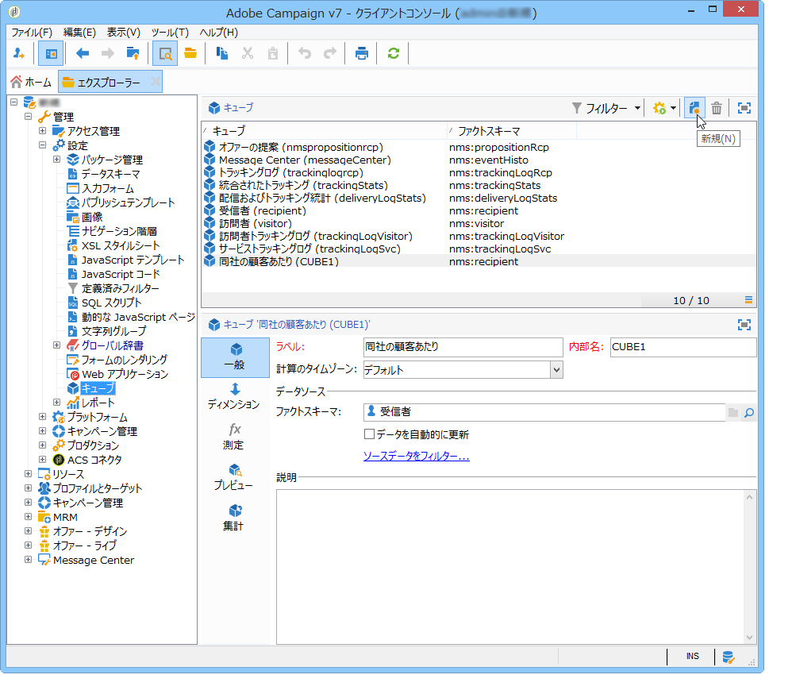

ファクトスキーマ（調査の対象となる要素が含まれているスキーマ）を選択します。この例では、**受信者**&#x200B;テーブルを選択します。

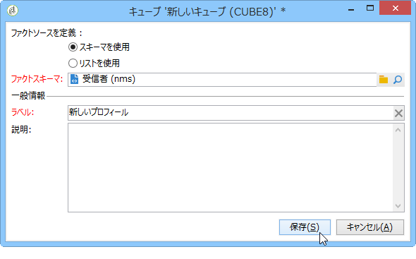

Click **[!UICONTROL Save]** to create the Cube: it will appear on the list of Cubes and may then be configured using the appropriate tabs.

Click the **[!UICONTROL Filter the source data...]** link to apply the calculations of this Cube to a select of data in the database.

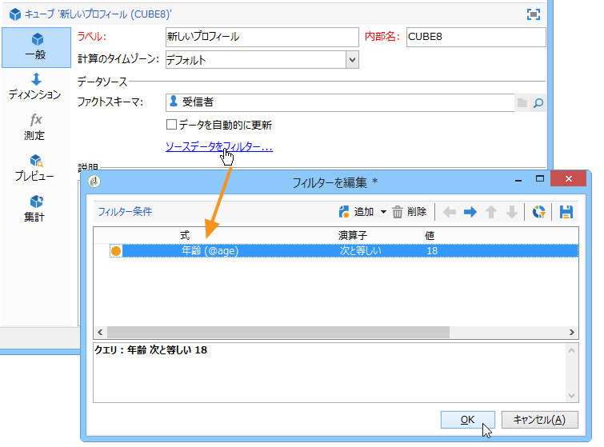

## ディメンションの定義 {#defining-dimensions}

ディメンションは、関連するファクトスキーマに基づいたキューブごとに定義された分析軸と一致します。これらが、分析で調査されるディメンションです。例えば、時間（年、月、日など）、製品や契約の分類（ファミリー、参照など）、母集団のセグメント（市区町村別、年齢別、グループ別、ステータス別など）といったものです。

These analysis axes are defined in the **[!UICONTROL Dimension]** tab of the Cube.

Click the **[!UICONTROL Add]** button to create a new dimension, then in the **[!UICONTROL Expression field]**, click the **[!UICONTROL Edit expression]** icon to select the field that contains the concerned data.

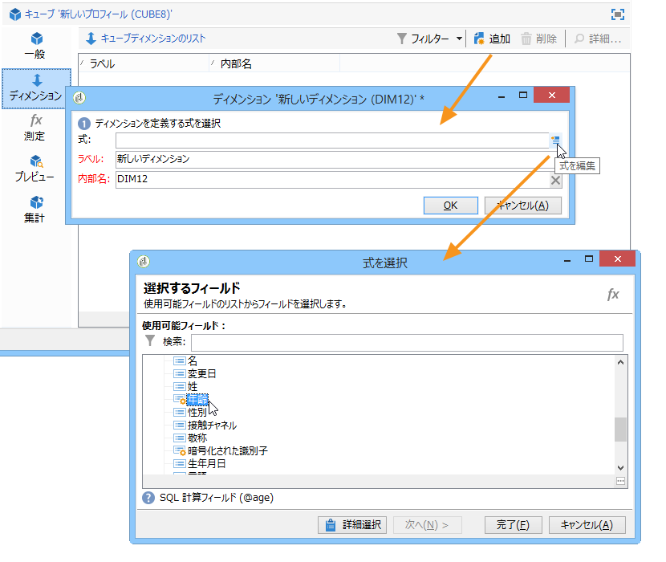

* まず最初に、受信者の&#x200B;**年齢**&#x200B;を選択します。このフィールドに対して、ビニングを定義して年齢をグループ化し、情報を読み取りやすくすることができます。いくつかの独立した値を扱う可能性がある場合は、ビニングを使用することをお勧めします。

   これを行うには、オプションをオンに **[!UICONTROL Enable binning]** します。 ビニングモードは、データビニングで [詳しく説明しま](../../reporting/using/concepts-and-methodology.md#data-binning)す。

   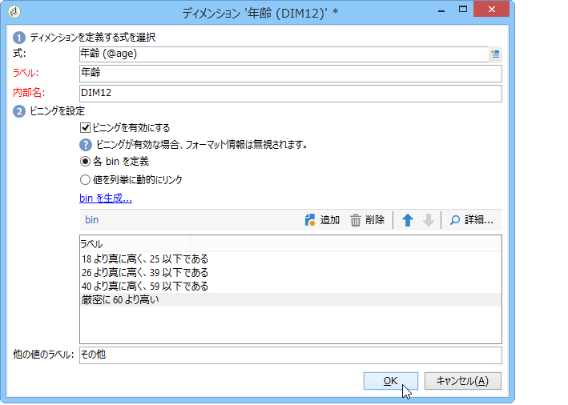

* **日付**&#x200B;タイプのディメンションを追加します。ここでは、受信者プロファイルの作成日を表示します。

   To do this, click **[!UICONTROL Add]** and select the **[!UICONTROL Creation date]** field in the recipient table.

   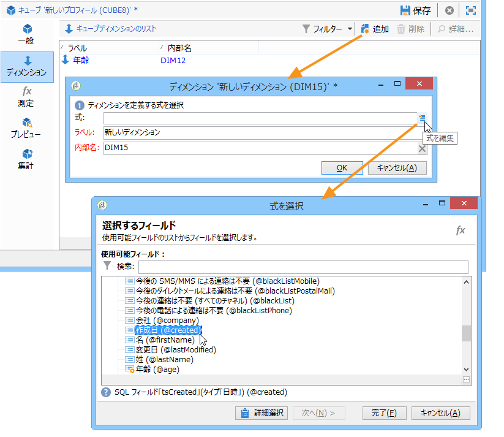

   日付表示モードを選択できます。それには、使用する階層と生成するレベルを選択します。

   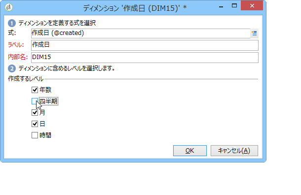

   この例では、年、月および日のみを表示します。これは、週と学期／月を同時に扱うことができないためです。これらのレベルの間には互換性がありません。

* 別のディメンションを作成して、受信者の市区町村に関連するデータを分析します。

   To do this, add a new dimension and select the city in the **[!UICONTROL Location]** node of the recipient schema.

   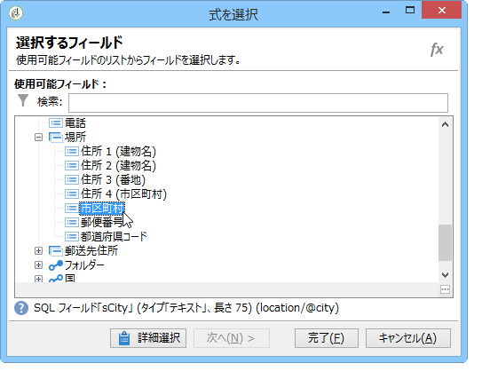

   ビニングを有効にして情報を読み取りやすくし、値を列挙にリンクします。

   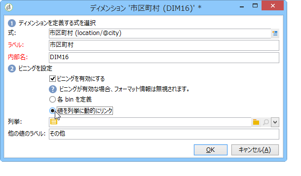

   ドロップダウンリストから列挙を選択します。

   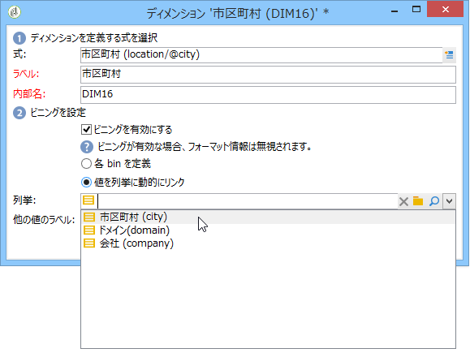

   その列挙の値のみ表示されます。その他のものは、フィールドに定義されたラベルの下にグループ化さ **[!UICONTROL Label of the other values]** れます。

   詳しくは、ビンの動的な管理を参 [照してください](../../reporting/using/concepts-and-methodology.md#dynamically-managing-bins)。

## 指標の構築 {#building-indicators}

ディメンションを定義したら、セルに表示する値の計算モードを指定する必要があります。To do this, create the matching indicators in the **[!UICONTROL Measures]** tab: create as many measures as there are columns to display in the report which will use the cube.

それには、次の手順に従います。

1. ボタンをクリッ **[!UICONTROL Add]** クします。
1. 測定のタイプと適用する式を選択します。ここでは、女性の受信者の数をカウントします。

   Our measure is based on the fact schema and uses the **[!UICONTROL Count]** operator.

   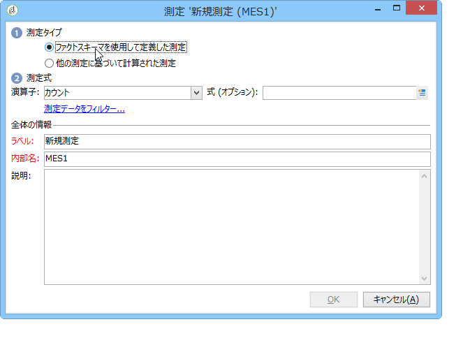

   このリン **[!UICONTROL Filter the measure data...]** クでは、女性のみを選択できます。 For more on defining measures and the available options, refer to [Defining measures](../../reporting/using/concepts-and-methodology.md#defining-measures).

   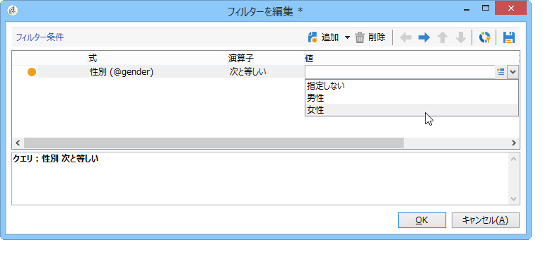

1. 測定のラベルを入力し、測定を保存します。

   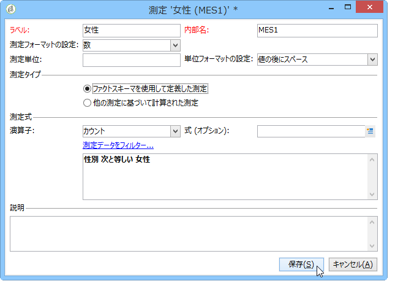

1. キューブを保存します。

## キューブに基づくレポートの作成 {#creating-a-report-based-on-a-cube}

キューブを設定したら、新しいレポートを作成するためのテンプレートとして使用できます。

手順は次のとおりです。

1. Click the **[!UICONTROL Create]** button of the **[!UICONTROL Reports]** universe and select the cube you have just created.

   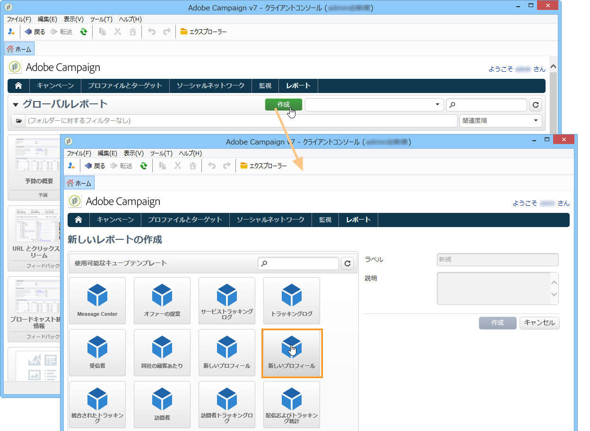

1. Click the **[!UICONTROL Create]** button to confirm: this will take you to the report configuration and viewing page.

   デフォルトでは、使用可能な最初の 2 つのディメンションは行と列で提供されますが、値はテーブルには表示されません。テーブルを生成するには、メインアイコンをクリックします。

   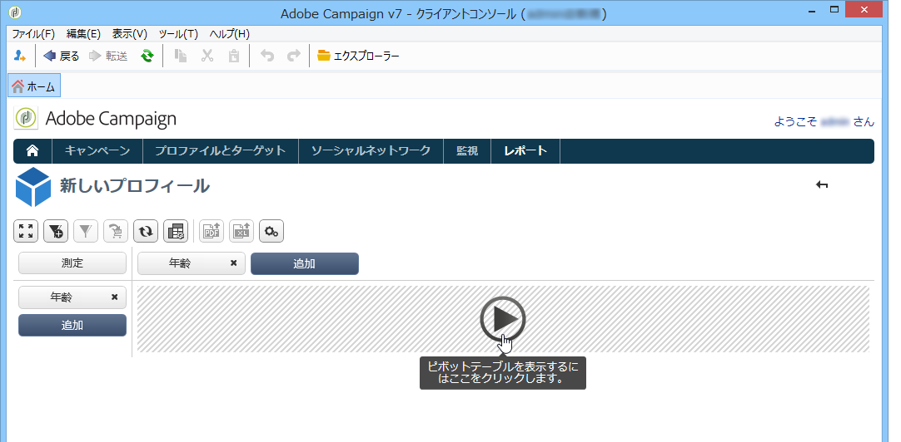

1. ディメンションの軸を切り替えたり、軸を削除したり、新しい測定を追加したりできます。可能な操作の詳細は次のとおりです。キュー [ブを使用したデータの調査](../../reporting/using/using-cubes-to-explore-data.md)。

   それには、該当するアイコンを使用します。

   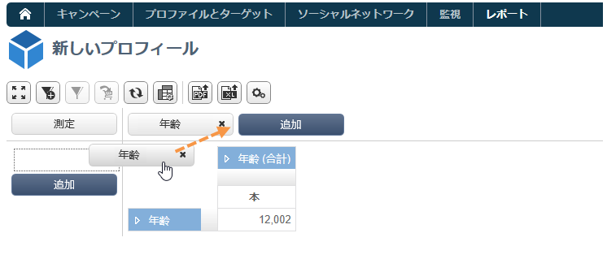

