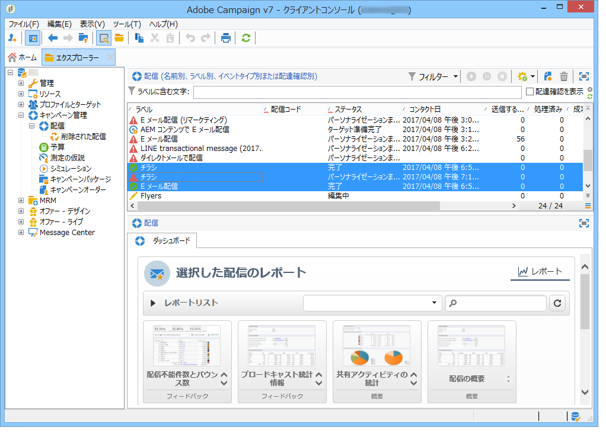
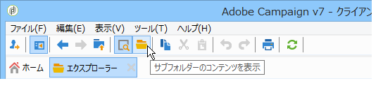

# 累積レポート {#cumulative-reports}

配信に関する累積レポートを表示できます。そのためには、比較する配信を選択してこれらの配信のレポートのリストを取得します。

リストから連続しない配信を選択するには、Ctrl キーを押したまま選択をおこないます。

To select deliveries saved in a different folder click **[!UICONTROL Display sub-levels]** (accessible via the toolbar). これで同じリストに表示されるようになります。

