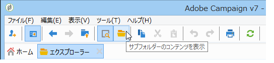

# 累積レポート {#cumulative-reports}

配信に関する累積レポートを表示できます。そのためには、比較する配信を選択してこれらの配信のレポートのリストを取得します。

リストから連続しない配信を選択するには、Ctrl キーを押したまま選択をおこないます。

異なるフォルダーに保存された配信を選択するには、「**[!UICONTROL サブレベルを表示]**」（ツールバーからアクセス可能）をクリックします。これで同じリストに表示されるようになります。

