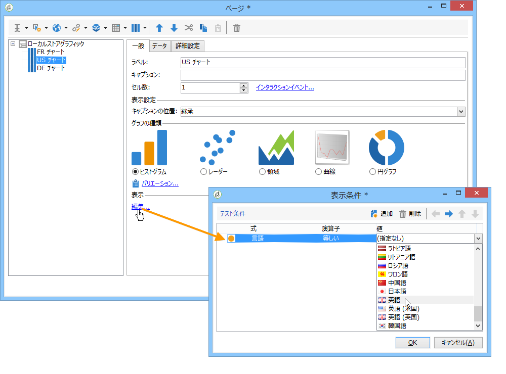
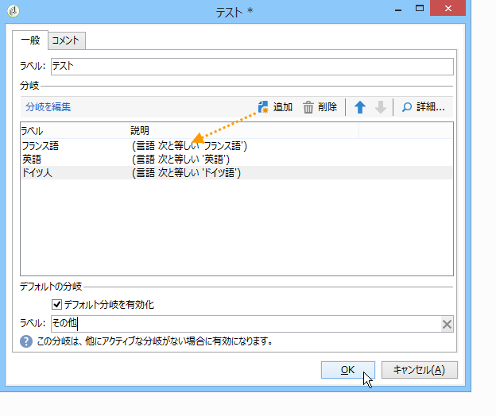
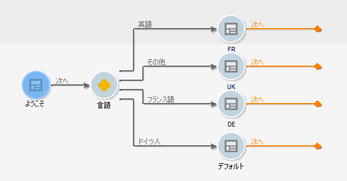

# 条件付きコンテンツの定義{#defining-a-conditional-content}

レポートの特定の項目やページの表示に条件を付けることができます。

特定の項目を条件付きにするには、それらの項目の表示設定を調整します。詳しくは、[項目表示の条件付け](#conditioning-item-display)を参照してください。

1 つまたは複数のページの表示を条件付きにするには、**[!UICONTROL テスト]**&#x200B;タイプのアクティビティを使用します。詳しくは、[ページ表示の条件付け](#conditioning-page-display)を参照してください。

## 項目表示の条件付け {#conditioning-item-display}

レポートの一部分の表示を条件付きにするには、その項目の表示条件を定義する必要があります。それらの条件が満たされない場合、その項目は表示されません。

表示条件は、オペレーターの状況や、レポートページで選択または入力された項目によって異なる場合があります。

ページ上の項目の条件付き表示を示す例については、[この節](../../web/using/form-rendering.md#defining-fields-conditional-display)を参照してください。

次の例では、表示条件は言語に依存します。

## ページ表示の条件付け {#conditioning-page-display}

レポートのチャートで、**[!UICONTROL テスト]**&#x200B;アクティビティを使用すると、1 つまたは複数の条件に応じて、ページの順序を変更できます。

このアクティビティの動作の仕組みは次のとおりです。

1. チャートに&#x200B;**[!UICONTROL テスト]**&#x200B;アクティビティを追加し、それを編集します。
1. 「**[!UICONTROL 追加]**」ボタンをクリックして、考えられる様々なケースを作成します。

   

   これらのケースごとに、出力トランジションが&#x200B;**[!UICONTROL テスト]**&#x200B;アクティビティに追加されます。

   

1. 「**[!UICONTROL デフォルト分岐を有効化]**」オプションを選択すると、設定した条件のどれも満たされない場合のトランジションを追加できます。

   詳しくは、[この節](../../web/using/defining-web-forms-page-sequencing.md#conditional-page-display)を参照してください。

チャートの先頭に&#x200B;**[!UICONTROL テスト]**&#x200B;アクティビティを配置して、例えばコンテキストやオペレータープロファイルによって表示を条件付けることができます。
