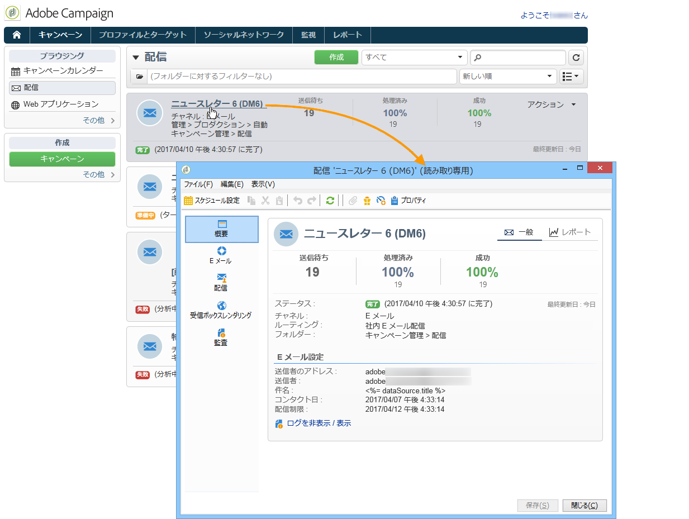
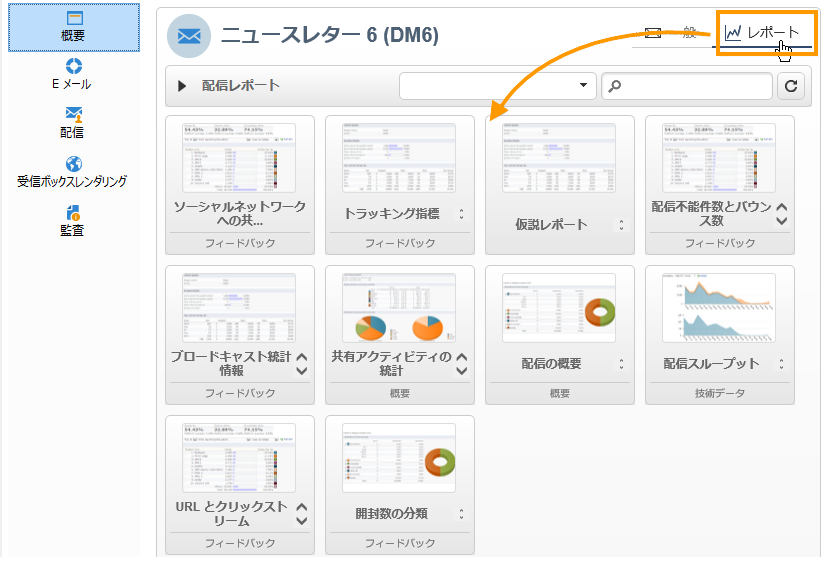
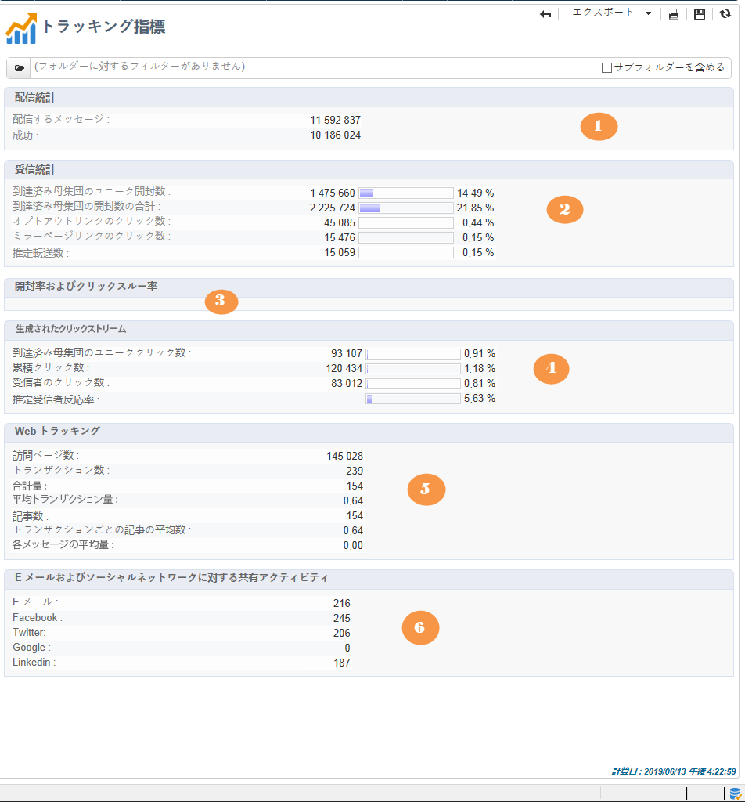
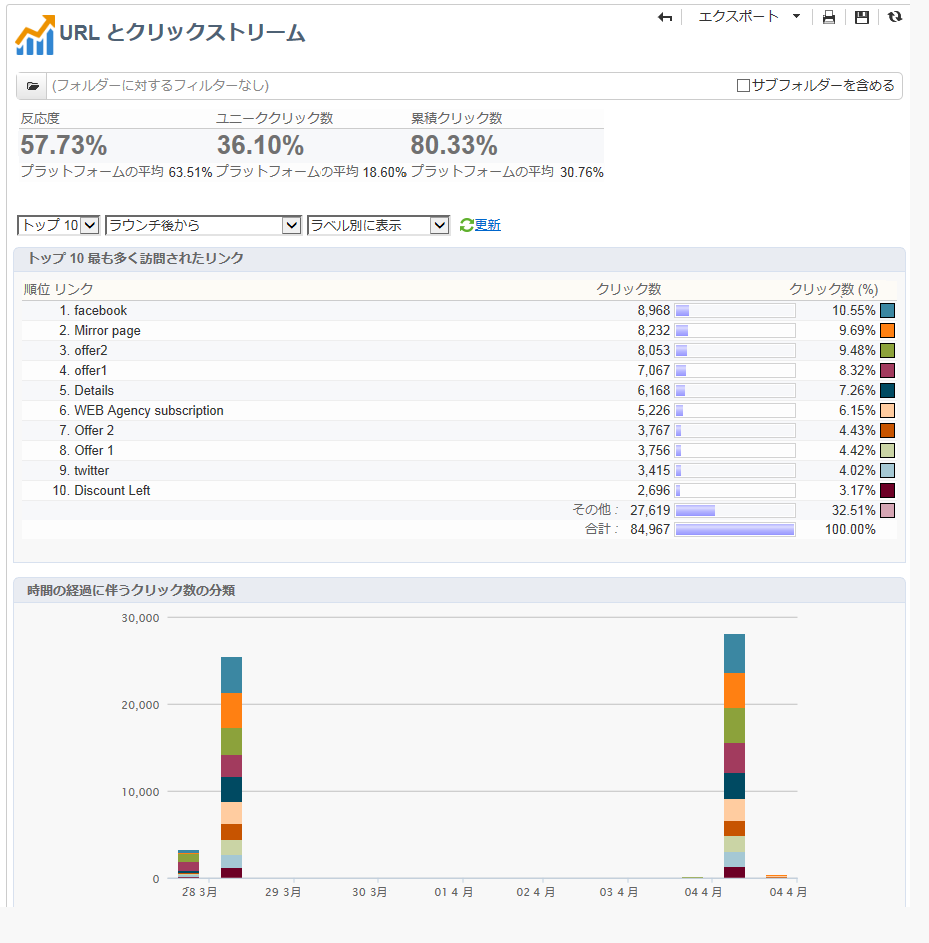
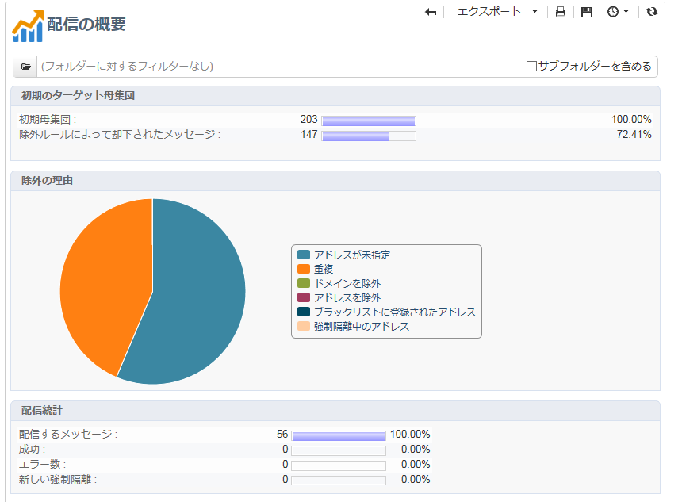
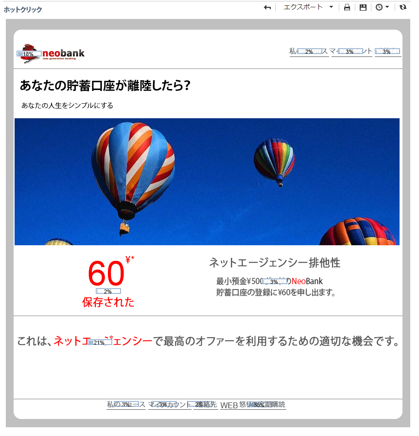
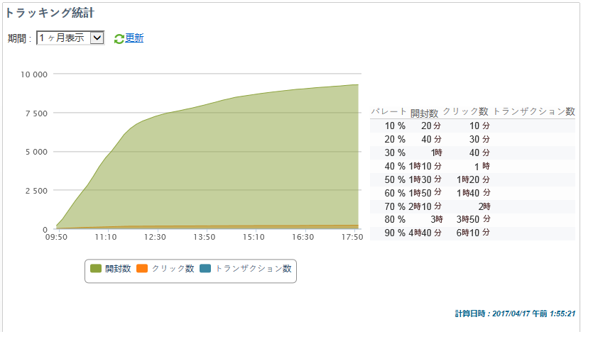

# 配信レポート {#delivery-reports}

配信の概要からアクセス可能な様々なレポート経由で、配信の実行をトラッキングできます。レポートを表示するには、次の手順に従います。

1. Go to the **[!UICONTROL Campaigns]** universe and click the **[!UICONTROL Delivery]** link to display the list of deliveries.
1. 表示する配信の名前をクリックして詳細を確認します。

   

1. Select the **[!UICONTROL Summary]** tab and click the **[!UICONTROL Reports]** link to access the reports specific to the delivery.

   

   デフォルトでは、次のレポートが使用可能です。

   * **[!UICONTROL Delivery throughput]** :「配信スループ [ット」を参照](../../reporting/using/global-reports.md#delivery-throughput)。
   * **[!UICONTROL Sharing to social networks]** :ソーシャルネッ [トワークへの共有を参照してください](../../reporting/using/global-reports.md#sharing-to-social-networks)。
   * **[!UICONTROL Statistics on sharing activities]** :共有アクティビティ [に関する統計情報を参照してください](../../reporting/using/global-reports.md#statistics-on-sharing-activities)。
   * **[!UICONTROL Hot clicks]** :「ホットクリ [ック数](#hot-clicks)」を参照。
   * **[!UICONTROL Tracking statistics]** :トラッキング統 [計を参照](#tracking-statistics)
   * **[!UICONTROL URLs and click streams]** :URLを参照し、 [ストリームをクリックします](#urls-and-click-streams)。
   * **[!UICONTROL Tracking indicators]** :トラッキングインジケ [ーターを参照してくださ](#tracking-indicators)い。
   * **[!UICONTROL Non-deliverables and bounces]** :配信不能件 [数とバウンスを参照](../../reporting/using/global-reports.md#non-deliverables-and-bounces)。
   * **[!UICONTROL User activities]** :詳しくは、ユーザーア [クティビティを参照し](../../reporting/using/global-reports.md#user-activities)。
   * **[!UICONTROL Delivery summary]** :「配信の概 [要」を参照](#delivery-summary)。
   * **[!UICONTROL Subscription tracking]** :購読の追跡を [参照してください](../../reporting/using/global-reports.md#subscription-tracking)。
   * **[!UICONTROL Delivery statistics]** :詳しくは、配信統計 [情報を参照してください](../../reporting/using/global-reports.md#delivery-statistics)。
   * **[!UICONTROL Breakdown of opens]** :詳しくは、「開 [く内訳」を参照してください](../../reporting/using/global-reports.md#breakdown-of-opens)。

## トラッキング指標 {#tracking-indicators}

このレポートは、配信を受信したときの受信者の行動をトラッキングするための主要な指標を組み合わせています。配信統計と受信統計、開封率とクリックスルー率、生成されたクリックストリーム、Web トラッキングだけでなく、ソーシャルネットワークへの共有アクティビティにもアクセスできます。

>[!NOTE]
>
>メッセージの開封数に基づいて計算される値は、テキスト形式の E メールに関する誤差があるので、常に推定値です。インジケータ **[!UICONTROL Distinct opens/Sum of opens for the population reached]** ーは、この誤差の余白を考慮に入れます。 For more information on tracking opens, refer to [Tracking opens](../../reporting/using/indicator-calculation.md#tracking-opens-).

**[!UICONTROL 1. Delivery statistics]**

* **[!UICONTROL Messages to deliver]** :配信分析後に配信されるメッセージの合計数です。
* **[!UICONTROL Success]** : 正常に処理されたメッセージ数.

**[!UICONTROL 2. Reception statistics]**

>[!NOTE]
>
>関連する割合は、正常に転送されたメッセージの数に基づいて計算されます。

* **[!UICONTROL Distinct opens for the population reached]** :メッセージを少なくとも1回オープンしたターゲット受信者の数の推定。 購読解除のリンクおよびミラーページでのクリック数が考慮されます。
* **[!UICONTROL Sum of opens for the population reached]** :ターゲットの受信者による開封総数の見積もり。
* **[!UICONTROL Clicks on opt-out link]** :購読解除リンクのクリック数。
* **[!UICONTROL Clicks on the mirror page link]** :ミラーページへのリンクのクリック数。 考慮されるようにするには、リンクは配信ウィザード（トラッキングされる URL）と同じように定義する必要があります。この[ページ](../../delivery/using/monitoring-a-delivery.md)を参照してください。
* **[!UICONTROL Estimation of forwards]** :ターゲットの受信者が転送した電子メールの数の推定。 この値は、ユニークユーザーの数と E メールをクリックしたユニーク受信者の数を引くことによって計算されます。

   >[!NOTE]
   >
   >For more information on the difference between distinct people and targeted recipients, refer to [Targeted persons / recipients](../../reporting/using/indicator-calculation.md#targeted-persons---recipients).

**[!UICONTROL 3. Open and click-through rate]**

この値のテーブルは、インターネットドメインごとの配信、開封数、クリック数および反応率（生データ）を示しています。次の指標が使用されています。

* **[!UICONTROL Sent]** :このドメインで送信されたメッセージの合計数です。
* **[!UICONTROL Complaints]** :受信者から望ましくないと報告された、このドメインのメッセージの数です。 この率は、このドメインでの送信メッセージの合計数に基づいて計算されます。
* **[!UICONTROL Opens]** :少なくとも1回メッセージを開いた、このドメインの対象となる別の受信者の数です。 この率は、このドメインでの送信メッセージの合計数に基づいて計算されます。
* **[!UICONTROL Clicks]** :同じ配信を少なくとも1回クリックした、ターゲットとする別の受信者の数。 この率は、このドメインでの送信メッセージの合計数に基づいて計算されます。
* **[!UICONTROL Raw reactivity]** :配信を少なくとも1回クリックした受信者の数と、配信を少なくとも1回開いた受信者の数との割合。

>[!NOTE]
>
>このレポートに表示されるドメイン名は、キューブレベルで使用される定義済みリストで定義されます。To change, add or remove default domains, edit the **[!UICONTROL Domains]** itemized list and modify values and aliases. 詳しくは、[この節](../../platform/using/managing-enumerations.md)を参照してください。The **[!UICONTROL Others]** category includes domain names that don&#39;t belong to any value of the itemized list.

**[!UICONTROL 4. Generated click streams]**

>[!NOTE]
>
>関連する割合は、正常に転送されたメッセージの数に基づいて計算されます。

* **[!UICONTROL Distinct clicks for the population reached]** :少なくとも1回、配信をクリックした個別ユーザーの数です。
* **[!UICONTROL Cumulated clicks]** :ターゲットの受信者が、購読解除リンクとミラーページを除いたクリック数の合計です。
* **[!UICONTROL Recipient clicks]** :同じ配信を少なくとも1回クリックした、ターゲットとする別の受信者の数。
* **[!UICONTROL Estimated recipient reactivity]** :配信を少なくとも1回クリックした受信者数と、少なくとも1回開いた受信者推定数との比率。 オプトアウトリンクおよびミラーページリンクでのクリック数は考慮されません。

**[!UICONTROL 5. Web tracking]**

* **[!UICONTROL Visited pages]** :メッセージ受信後に訪問されたWebページの数。
* **[!UICONTROL Transactions]** :メッセージ受信後の購入回数。
* **[!UICONTROL Total amount]** :メッセージの受信後の購入総額。
* **[!UICONTROL Average transaction amount]** :別の配信受信者による平均購入。
* **[!UICONTROL Articles]** :配信の受信者が購入した記事の数。
* **[!UICONTROL Average count of articles per transaction]** :個別の受信者が行った購入あたりの平均品目数。
* **[!UICONTROL Average amount per message]** :メッセージごとに生成された平均購入数。

   >[!NOTE]
   >
   >訪問されたページ、トランザクション、金額または品目が考慮されるようにするには、Web トラッキングタグを対応する Web ページに挿入する必要があります。Web トラッキングの設定は、[この節](../../configuration/using/about-web-tracking.md)で説明しています。

**[!UICONTROL 6. Sharing activities to email and social networks]**

このセクションには、それぞれのソーシャルネットワークで共有されたメッセージの合計数が表示されます。詳しくは、ソーシャルネットワークへの [共有を参照してください](../../reporting/using/global-reports.md#sharing-to-social-networks)。

## URL とクリックストリーム {#urls-and-click-streams}

このレポートは、配信後に訪問されたページのリストを表示します。

このレポートの内容は、表示するスコアグラフ、時間フィルター（アクション開始以降、開始後の最初の 6 時間など）およびデータの表示モード（ラベル別、URL 別）を選択することによって設定できます。詳しくは、[このページ](../../delivery/using/monitoring-a-delivery.md)を参照してください。Click **[!UICONTROL Refresh]** to confirm your selection.

次の率は、レポートの上部に表示されます。

* **[!UICONTROL Reactivity]** :配信を開いたターゲット受信者の推定数に対する、配信をクリックしたターゲット受信者の数の比率。 オプトアウトリンクおよびミラーページでのクリック数は考慮されません。

   >[!NOTE]
   >
   >For more information on tracking opens, refer to [Tracking opens](../../reporting/using/indicator-calculation.md#tracking-opens-).

* **[!UICONTROL Distinct clicks]** :配信で少なくとも1回（購読解除リンクとミラーページを除く）クリックした個別ユーザーの数。 表示される率は、正常に配信されたメッセージの数に基づいて計算されます。
* **[!UICONTROL Cumulated clicks]** :ターゲットの受信者（購読解除リンクとミラーページを除く）によるクリック数の合計です。 表示される率は、正常に転送されたメッセージの数に基づいて計算されます。

**[!UICONTROL Platform average]** :この平均率は、各レート（反応度、個別クリック数および累積クリック数）で表示され、過去6か月間に送信された配信に対して計算されます。 同じタイポロジを持つ、同じチャネルでの配信のみが考慮されます。配達確認は除外されます。

中央のテーブルは、次の情報を示しています。

* **[!UICONTROL Clicks]** :リンクあたりの累積クリック数。
* **[!UICONTROL Clicks (in %)]** :累積クリック数の合計に対する、リンクあたりのクリック数の分類。

**[!UICONTROL Breakdown of clicks in time]**

このグラフは、1 日あたりの累積クリック数の分類を表示します。

## 配信の概要 {#delivery-summary}

このレポートは、配信に関するすべての主要な情報を表示します。

**[!UICONTROL Target population]**

このセクションには、2 つの指標があります。

* **[!UICONTROL Initial population]** :配信のターゲット設定を受けた受信者の合計数。
* **[!UICONTROL Messages rejected by the rule]** :タイポロジルールを適用する際に分析中に無視されたアドレスの数：住所の欠落、隔離、ブラックリストなど。タイポロジルールの詳細は、このページを参照してく [ださい](../../delivery/using/steps-validating-the-delivery.md#validation-process-with-typologies)。

**[!UICONTROL Causes of exclusion]**

中央のグラフは、分析中に却下されたメッセージのルールごとの分類を示しています。

**[!UICONTROL Delivery statistics]**

このセクションには、次の指標が含まれます。

* **[!UICONTROL Messages to be delivered]** :配信分析後に配信されるメッセージの合計数です。
* **[!UICONTROL Success]** :正常に処理されたメッセージの数です。 付随している率は、配信されるメッセージ数の割合です。
* **[!UICONTROL Errors]** :配信中および自動リバウンド処理中に発生したエラーの合計数。 付随している率は、配信されるメッセージ数の割合です。
* **[!UICONTROL New quarantines]** :配信失敗後に検疫されたアドレスの数（ユーザーが不明、無効なドメイン）。 付随している率は、配信されるメッセージ数の割合です。

## ホットクリック {#hot-clicks}

このレポートは、各リンクでのメッセージのコンテンツ（HTML および／またはテキスト）を、リンクでのクリック率と共に表示します。パーソナライゼーションブロックの購読解除リンク、ミラーページリンクおよびオファーリンクは、累積クリック数の合計では考慮されますが、レポートには表示されません。

>[!NOTE]
>
>配信にオファー（インタラクション）が含まれる場合は、オファーでのクリック率を表示するレポートの上の部分にボックスが表示されます。

## トラッキング統計 {#tracking-statistics}

このレポートは、開封数、クリック数およびトランザクションの統計を表示します。

これにより、配信の市場への影響をトラッキングできます。期間（1 時間、3 時間または 24 時間表示など）を変更することで、値の表示方法を設定できます。Click **[!UICONTROL Refresh]** to confirm your selection.

このレポートは、値のテーブルと、配信が最大効率に到達するのに必要な時間を表示するパレート図を表示します。次の指標が使用されています。

* **[!UICONTROL Opens]** :開かれたメッセージの合計数の割合に達するのに必要な時間の予測。 テキスト形式の E メールは考慮されません。For more information on tracking opens, refer to [Tracking opens](../../reporting/using/indicator-calculation.md#tracking-opens-).
* **[!UICONTROL Clicks]** :記録されたクリック数の合計に対する割合に達するのに必要な時間の予測。 オプトアウトリンクおよびミラーページでのクリック数は考慮されません。
* **[!UICONTROL Transactions]** :メッセージ受信後のトランザクションの総数に対する割合を達成するのに必要な時間。 トランザクションが考慮されるようにするには、トランザクションのタイプの Web トラッキングタグを対応する Web ページに挿入する必要があります。Web トラッキングの設定は、[この節](../../configuration/using/about-web-tracking.md)で説明しています。
