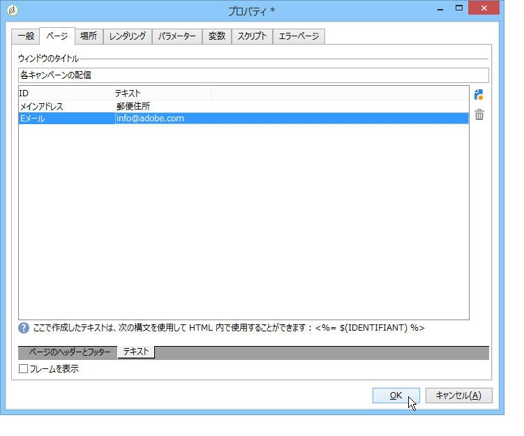

# 要素のレイアウト{#element-layout}

以下に示す様々なグラフに加えて、グラフ [のタイプとバリアントは](../../reporting/using/creating-a-chart.md#chart-types-and-variants)、表示を適応させたり、レポートページに要素を追加したりできます。

コンテナを使用すると、ページの複数の要素をリンクし、それらのレイアウトを列やセルで設定できます。それらの使用方法について詳しくは、[この節](../../web/using/defining-web-forms-layout.md#creating-containers)を参照してください。

ツリーのルートでレポートのレイアウトを設定し、コンテナごとにそれをオーバーロードできます。ページは列に並べ替えられます。コンテナも列に並べ替えられます。静的要素およびグラフィカル要素のみ、セルに並べ替えられます。

## 各ページのオプションの定義 {#defining-the-options-for-each-page}

レポートの各ページでオプションを使用できます。

The **[!UICONTROL General]** tab lets you change the title of the page, as well as configure legend positions and browsing between the report pages.

The **[!UICONTROL Title]** field lets you personalize the label in the header of the report page. The title of the window can be configured via the **[!UICONTROL Properties]** window of the report. 詳しくは、ヘッダーとフッターの [追加を参照してください](#adding-a-header-and-a-footer)。

The **[!UICONTROL Display settings]** options enable you to select the position of the control caption within a report page and to define the number of columns on the page. ページレイアウトについて詳しくは、[この節](../../web/using/defining-web-forms-layout.md#positioning-the-fields-on-the-page)の&#x200B;**項目のレイアウト**&#x200B;に関する節を参照してください。

Select the various options in the **[!UICONTROL Browse]** section to authorize browsing from one report page to another. またはオプシ **[!UICONTROL Disable next page]** ョンを選択 **[!UICONTROL Disable previous page]** すると、レポートペ **[!UICONTROL Next]** ージか **[!UICONTROL Previous]** らボタンとボタンが表示されなくなります。

## ヘッダーやフッターの追加 {#adding-a-header-and-a-footer}

レポートのプロパティウィンドウでは、レイアウト要素（ウィンドウのタイトルやヘッダーおよびフッターの HTML コンテンツなど）も定義できます。

To access the properties window, click the **[!UICONTROL Properties]** button of the report.

The **[!UICONTROL Page]** tab enables you to personalize your display.

このタブで設定したコンテンツは、すべてのレポートページに表示されます。

The **[!UICONTROL Texts]** sub-tab enables you to define variable content: it will be taken into account during the translation cycle if the report is designed for use in several languages.

このサブタブでは、テキスト断片のリストを作成し、それらを識別子に関連付けることができます。

その後で、これらの識別子をレポートの HTML コンテンツに挿入します。

これらの識別子は、レポートが表示される際に、適切なコンテンツに自動的に置き換わります。

HTML テキストの場合と同様に、この動作モードによって、レポートで使用するテキストとその翻訳を一元管理できます。このタブで作成したテキストは、Adobe Campaign の統合翻訳ツールで自動的に収集されます。
