# グローバルレポート {#global-reports}

これらのレポートは、データベース全体のデータのアクティビティを基に生成されています。To view the reports dashboard, go to the **[!UICONTROL Reports]** tab.

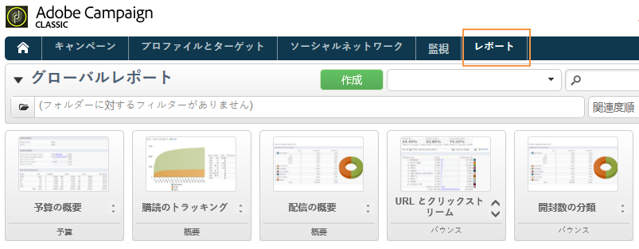

レポートを表示するには、その名前をクリックします。次のレポートはデフォルトで使用可能です。

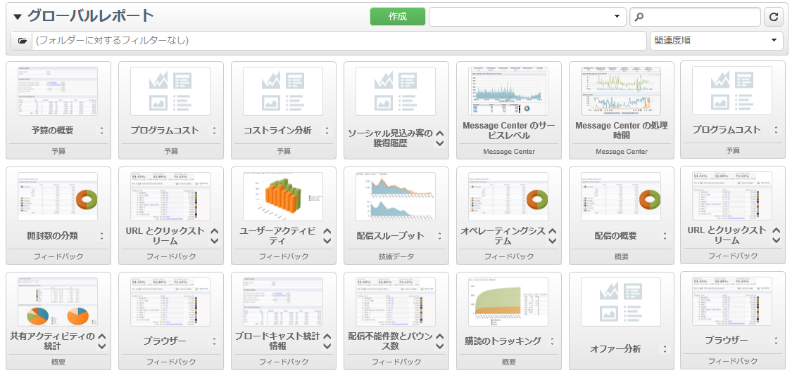

>[!CAUTION]
>
>この節では、配信にリンクされたレポートのみを表示しています。

* **[!UICONTROL Delivery throughput]** :「配信スループ [ット」を参照](#delivery-throughput)。
* **[!UICONTROL Browsers]** :「ブラウザ [ー](#browsers)」を参照。
* **[!UICONTROL Sharing to social networks]** :ソーシャルネッ [トワークへの共有を参照してください](#sharing-to-social-networks)。
* **[!UICONTROL Statistics on sharing activities]** :共有アクティビティ [に関する統計情報を参照してください](#statistics-on-sharing-activities)。
* **[!UICONTROL Operating systems]** :オペレーティングシス [テムを参照してくださ](#operating-systems)い。
* **[!UICONTROL URLs and click streams]** :URLを参照し、 [ストリームをクリックします](#urls-and-click-streams)。
* **[!UICONTROL Tracking indicators]** :トラッキングインジケ [ーターを参照してくださ](#tracking-indicators)い。
* **[!UICONTROL Non-deliverables and bounces]** :配信不能件 [数とバウンスを参照](#non-deliverables-and-bounces)。
* **[!UICONTROL User activities]** :詳しくは、ユーザーア [クティビティを参照し](#user-activities)。
* **[!UICONTROL Subscription tracking]** :購読の追跡を [参照してください](#subscription-tracking)。
* **[!UICONTROL Delivery summary]** :「配信の概 [要」を参照](#delivery-summary)。
* **[!UICONTROL Delivery statistics]** :詳しくは、配信統計 [情報を参照してください](#delivery-statistics)。
* **[!UICONTROL Breakdown of opens]** :詳しくは、「開 [く内訳」を参照してください](#breakdown-of-opens)。

## 配信スループット {#delivery-throughput}

このレポートには、一定期間のプラットフォーム全体の配信スループットに関する情報が含まれます。メッセージが配信される速度を測定するには、1 時間に送信されたメッセージの数とメッセージのサイズ（bps）が基準になります。次の例では、最初のグラフに正常な配信を青で、誤った配信をオレンジで示しています。

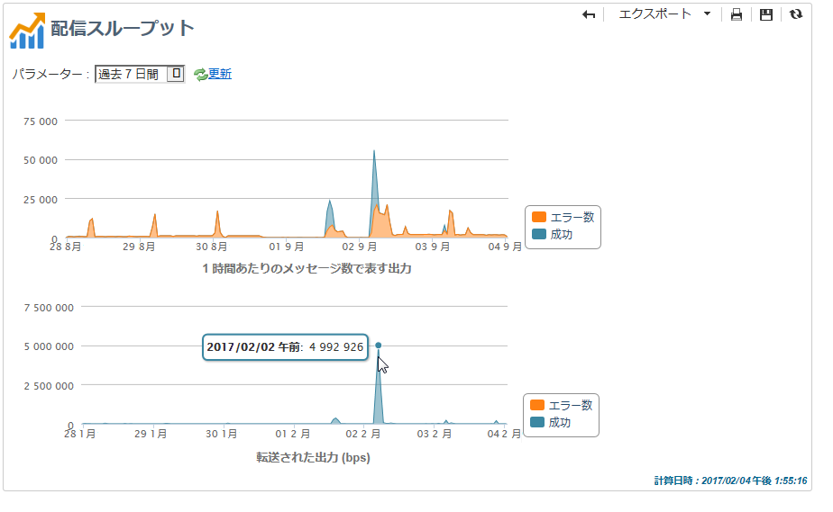

タイムスケールを変更して、表示する値を設定できます。1時間表示、3時間表示、24時間表示など Click **[!UICONTROL Refresh]** to confirm your selection.

## ユーザーアクティビティ {#user-activities}

このレポートは、30 分、1 時間または 1 日あたりの開封数、クリック数およびトランザクション数の分類をグラフ形式で表示します。

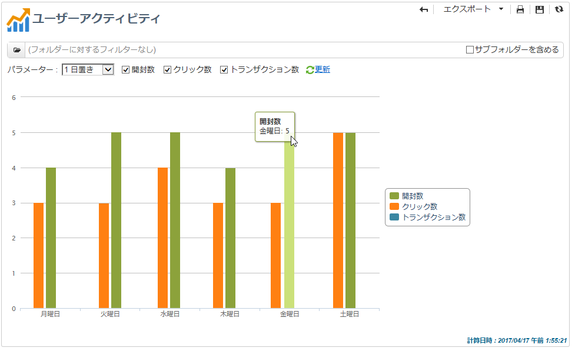

次のオプションを使用できます。

* **[!UICONTROL Opens]** :開かれたメッセージの合計数です。 テキスト形式の E メールは考慮されません。For more information on tracking opens, refer to [Tracking opens](#tracking-opens-).
* **[!UICONTROL Clicks]** :配信内のリンクの合計クリック数。 購読解除のリンクおよびミラーページでのクリック数は考慮されません。
* **[!UICONTROL Transactions]** :メッセージの受信後のトランザクションの合計数。 トランザクションが考慮されるようにするには、トランザクションのタイプの Web トラッキングタグを対応する Web ページに挿入する必要があります。Web トラッキングの設定は、[この節](../../configuration/using/about-web-tracking.md)で説明しています。

## 配信不能件数とバウンス数 {#non-deliverables-and-bounces}

このレポートは、配信不能件数の分類だけでなく、インターネットドメインごとのバウンス数の分類についても表示します。

は、配 **[!UICONTROL Number of messages processed]** 信サーバーが処理したメッセージの合計数を表します。 この値は、一部の配信が（サーバーによって処理される前に）停止されるか一時停止されると、配信されるメッセージ数よりも小さくなります。

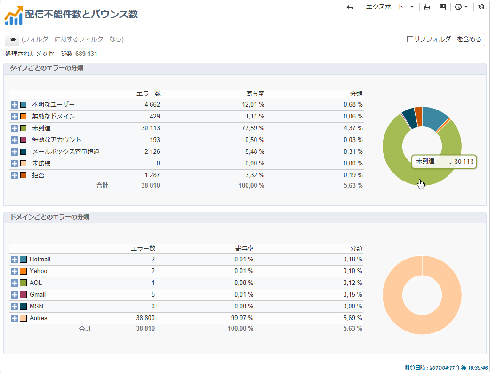

**[!UICONTROL Breakdown of errors by type]**

>[!NOTE]
>
>このレポートに表示されるエラーにより、強制隔離プロセスが実行されることになります。強制隔離の管理について詳しくは、[強制隔離管理](../../delivery/using/understanding-quarantine-management.md)を参照してください。

このレポートの最初のセクションには、配信不能件数の分類が値のテーブルとグラフの形式で表示されます。

それぞれのエラータイプには、次の内容が含まれます。

* このタイプのエラーメッセージの数。
* エラーを含むメッセージの合計数に対する、このタイプのエラーを含むメッセージの割合。
* 処理されたメッセージの合計数に対する、このタイプのエラーメッセージの割合。

次の指標が使用されています。

* **[!UICONTROL User unknown]** :電子メールアドレスが無効であることを示す、配信中に生成されたエラータイプ。
* **[!UICONTROL Invalid domain]** :電子メールアドレスのドメインが間違っているか、存在しないことを示す、配信の送信時に生成されるエラータイプ。
* **[!UICONTROL Inbox full]** :受信者の受信トレイに含まれるメッセージが多すぎることを示す5回の配信後に生成されるエラータイプ。
* **[!UICONTROL Account disabled]** :配信の送信時に、アドレスが存在しないことを示すエラータイプが生成されました。
* **[!UICONTROL Rejected]** :IAP（インターネットアクセスプロバイダ）がアドレスを拒否した場合、例えばセキュリティ規則（スパム対策ソフトウェア）の適用後に発生するエラータイプ。
* **[!UICONTROL Unreachable]** :メッセージ配布文字列で発生するエラータイプ：SMTPリレー、ドメインの一時的な到達不能などに関する問題
* **[!UICONTROL Not connected]** :受信者の携帯電話が送信時にネットワークから切断された、または切断されたことを示すエラータイプ。

   >[!NOTE]
   >
   >この指標は、モバイルチャネルでの配信のみに該当します。詳しくは、[この節](../../delivery/using/sms-channel.md)を参照してください。

   You can open up each line of the value table by clicking the [+] symbol. それぞれのエラータイプについて、ドメインごとにエラーメッセージの分類を表示できます。

   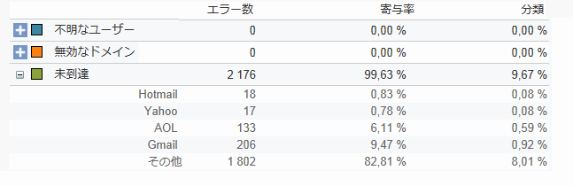

**[!UICONTROL Breakdown of errors per domain]**

このレポートの 2 つ目のセクションには、インターネットドメインごとのエラーの分類が値のテーブルとグラフの形式で表示されます。

それぞれのドメイン名には、次の内容が含まれます。

* このドメインでエラーを含むメッセージの数。
* このドメインで処理されたメッセージの合計数に対する、このドメインでエラーを含むメッセージの割合。
* エラーメッセージの合計数に対する、このドメインでのエラーメッセージの割合。

You can open up each line of the value table by clicking the [+] symbol. それぞれのドメインタイプについて、エラータイプごとにエラーメッセージの分類を表示できます。

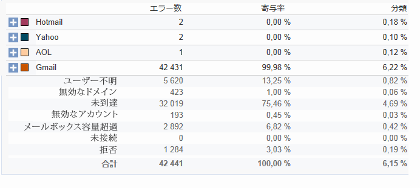

>[!NOTE]
>
>このレポートに表示されるドメイン名は、キューブレベルで定義されます。これらの値を変更するには、キューブを編集 **[!UICONTROL Delivery logs (broadlogrcp)]** します。 詳しくは、[この節](../../reporting/using/about-cubes.md)を参照してください。The **[!UICONTROL Others]** category includes domain names that don&#39;t belong to a specific class.

## ブラウザー {#browsers}

このレポートは、該当する期間中、配信の受信者によって使用されるインターネットブラウザーの分類を表示します。

>[!NOTE]
>
>このレポートに表示される値は推定値であり、配信でクリックした受信者のみが考慮されます。

**グローバル統計**

ブラウザー使用のグローバル統計は、値のテーブルとグラフの形式で表示されます。

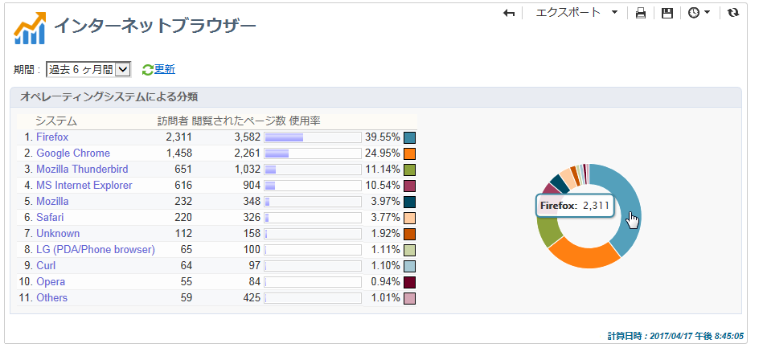

次の指標が使用されています。

* **[!UICONTROL Visitors]** :ターゲット設定された（インターネットブラウザーごとの）受信者で、配信を少なくとも1回クリックした受信者の合計数です。
* **[!UICONTROL Pages viewed]** :すべての配信に対する、配信内のリンクのクリック数の合計（インターネットブラウザーごと）。
* **[!UICONTROL Usage rate]** :この率は、訪問者数の合計に対する訪問者数の内訳（インターネットブラウザごと）を表します。

**ブラウザーごとの統計**

グローバル統計の値のテーブルで、各ブラウザー名をクリックすると、使用統計を表示できます。

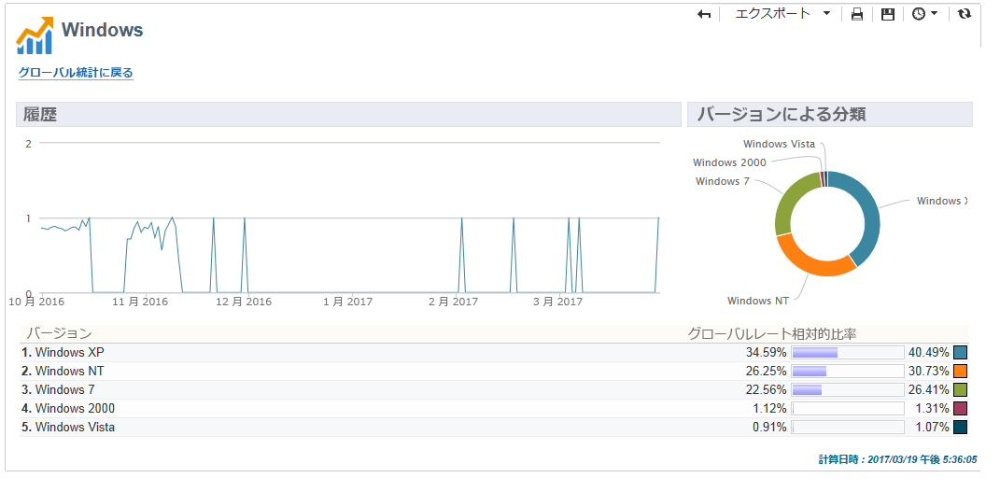

統計は曲線、グラフおよび値のテーブルの形式で表示されます。

The **[!UICONTROL History]** curve represents the attendance rate of this browser per day. この率は、最も高い稼動率が測定された日の訪問者数に対する、（このブラウザーでの）1 日あたりの訪問者数の割合です。

The **[!UICONTROL Breakdown per version]** chart represents the breakdown of visitors per version compared to the total number of visitors (on this browser).

値のテーブルでは、次の指標が使用されています。

* **[!UICONTROL Global rate]** :この率は、（すべてのブラウザーでの）合計訪問者数に対する、バージョンごとの訪問者数の内訳を表します。
* **[!UICONTROL Relative rate]** :この率は、（このブラウザーでの）合計訪問者数に対する、バージョンごとの訪問者数の内訳を表します。

### ソーシャルネットワークへの共有 {#sharing-to-social-networks}

バイラルマーケティングによって、配信の受信者は連絡先のネットワークと情報を共有できるようになります。プロフィールにリンクを追加したり（Facebook、Twitter など）、友達にメッセージを送信したりできます。それぞれの共有と、共有した情報へのアクセスは、配信内でトラッキングされます。バイラルマーケティングについて詳しくは、[この節](../../delivery/using/viral-and-social-marketing.md)を参照してください。

このレポートは、ソーシャルネットワーク（Facebook、Twitter など）ごと、および／または E メールで共有されて開封されたメッセージの分類を表示します。

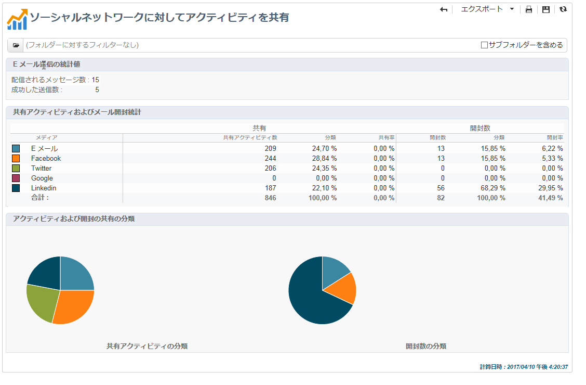

**[!UICONTROL Email delivery statistics]**

E メールの配信統計には、2 つの値が表示されます。

* **[!UICONTROL Number of messages to be delivered]** :配信分析中に処理されたメッセージの合計数。
* **[!UICONTROL Number of successful deliveries]** :正常に処理されたメッセージの数です。

**[!UICONTROL Sharing activities and mail open statistics]**

中央のテーブルは、E メールの共有と開封に関する統計を示しています。

In the **[!UICONTROL Shares]** column, we have the following indicators:

* **[!UICONTROL No. of sharing activities]** :各ソーシャルネットワークで共有されたメッセージの合計数です。 この値は、一致するパーソナライゼーションブロックのアイコンのクリック数の合 **[!UICONTROL Links for sharing to social networks]** 計と等しくなります。
* **[!UICONTROL Breakdown]** :この率は、共有の総数に対する、ソーシャルネットワークあたりの共有の内訳を表します。
* **[!UICONTROL Sharing rate]** :この率は、配信されるメッセージ数に対するソーシャルネットワークごとの共有の内訳を表します。

In the **[!UICONTROL Opens]** column, we have the following indicators:

* **[!UICONTROL No. of opens]** :メッセージが転送された（パーソナライゼーションブロックを介して）ユーザーが開いた **[!UICONTROL Links for sharing to social networks]** メッセージの合計数です。 この値は、ミラーページが表示された回数と等しくなります。配信の受信者による開封数は考慮されません。
* **[!UICONTROL Breakdown]** :この率は、ソーシャルネットワークごとの開封数の合計数に対する内訳を表します。
* **[!UICONTROL Rate of opens]** :この率は、共有の総数に関する、ソーシャルネットワークごとの開封の内訳を表します。

**[!UICONTROL Breakdown of sharing activities and opens]**

このセクションには、ソーシャルネットワークごとの共有アクティビティと開封の分類を示す 2 つのグラフが含まれています。

## 共有アクティビティの統計 {#statistics-on-sharing-activities}

このレポートは、ある期間のソーシャルネットワーク（Facebook、Twitter、E メールなど）への共有の展開を表示しています。

バイラルマーケティングについて詳しくは、[この節](../../delivery/using/viral-and-social-marketing.md)を参照してください。

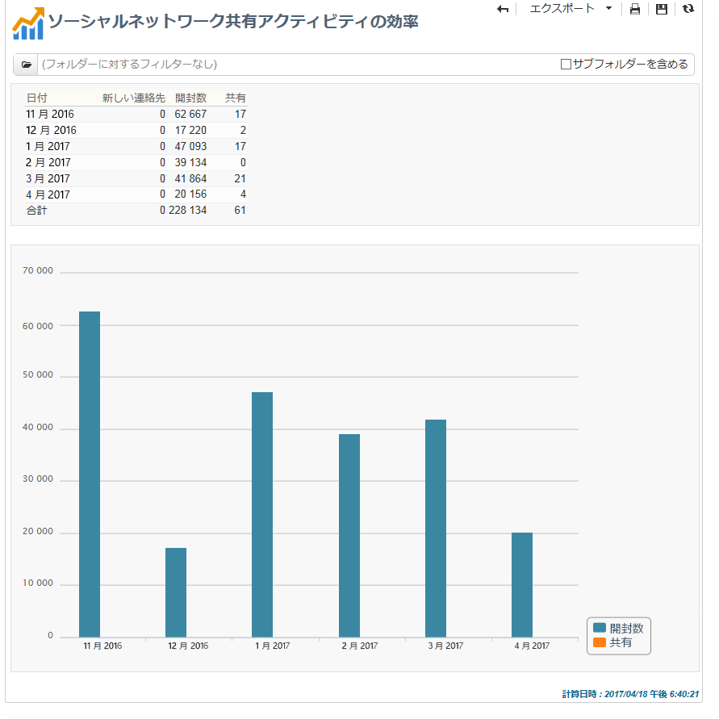

統計は、値のテーブルとグラフの形式で表示されます。

次の指標が使用されています。

* **[!UICONTROL New contacts]** :電子メールで共有されたメッセージの受信後の新しい購読の数です。 This value matches the number of people who received a message shared via email, clicked the **[!UICONTROL Subscription link]** and filled in the subscription form.
* **[!UICONTROL Opens]** :メッセージの転送先（パーソナライゼーションブロックを介して）によって開かれたメッ **[!UICONTROL Link for sharing to social networks]** セージの合計数です。 この値は、ミラーページが表示された回数と等しくなります。配信の受信者による開封数は考慮されません。
* **[!UICONTROL Sharing activities]** :ソーシャルネットワーク経由で共有されたメッセージの合計数です。 この値は、パーソナライゼーションブロックのアイコンのクリック数の合計 **[!UICONTROL Links for sharing to social networks]** と一致します。

## オペレーティングシステム {#operating-systems}

このレポートは、該当する期間中、配信の受信者によって使用されるオペレーティングシステムの分類を表示します。

>[!NOTE]
>
>このレポートに表示される値は推定値であり、配信でクリックした受信者のみが考慮されます。

**グローバル統計**

オペレーティングシステムのグローバル使用統計は、値のテーブルとグラフの形式で表示されます。

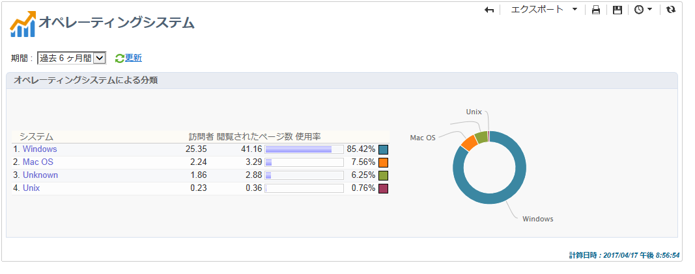

次の指標が使用されています。

* **[!UICONTROL Visitors]** :配信を少なくとも1回クリックした、ターゲット設定された受信者（オペレーティングシステムごと）の合計数の1日平均です。
* **[!UICONTROL Pages viewed]** :すべての配信に関する、（オペレーティングシステムごとの）配信リンクの合計クリック数の1日平均。
* **[!UICONTROL Rate of use]** :この率は、訪問者の総数に対する訪問者の内訳（オペレーティングシステム別）を表します。

**オペレーティングシステムごとの統計**

グローバル統計の値のテーブルで、各オペレーティングシステムの名前をクリックすると、オペレーティングシステムごとの統計を表示できます。

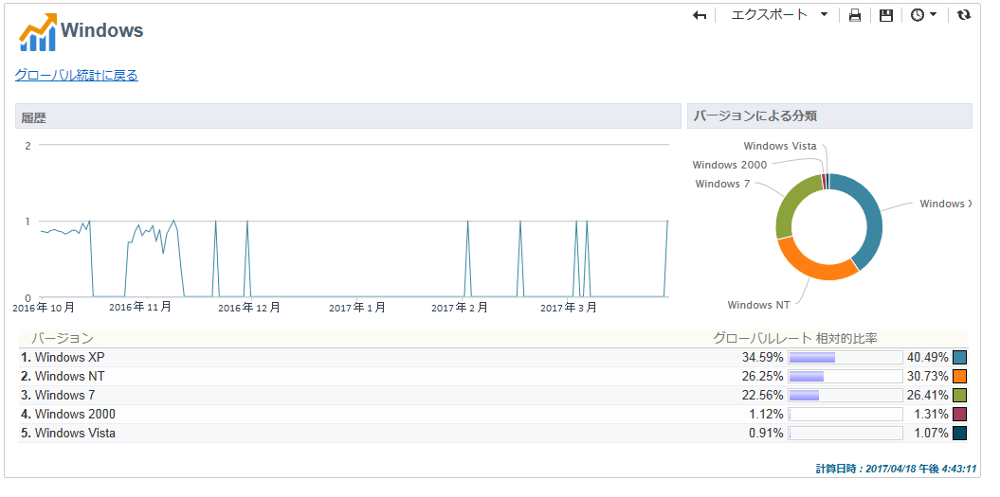

統計は曲線、グラフおよび値のテーブルの形式で表示されます。

The **[!UICONTROL History]** curve represents the rate of use of this operating system per day. この率は、最も高い稼動率が測定された日の訪問者数に対する、（このオペレーティングシステムでの）1 日あたりの訪問者数の割合です。

The **[!UICONTROL Breakdown by version]** chart represents the breakdown of visitors per version in relation to the total number of visitors on this operating system.

値のテーブルでは、次の指標が使用されています。

* **[!UICONTROL Global rate]** :この率は、オペレーティングシステム全体の合計訪問者数に関する訪問者数（バージョンあたり）の内訳を表します。
* **[!UICONTROL Relative rate]** :この率は、このオペレーティングシステムの合計訪問者数に関する訪問者数（バージョンあたり）の内訳を表します。

## 購読トラッキング {#subscription-tracking}

このレポートでは、情報サービスの購読を監視できます。購読および購読解除について表示されます。

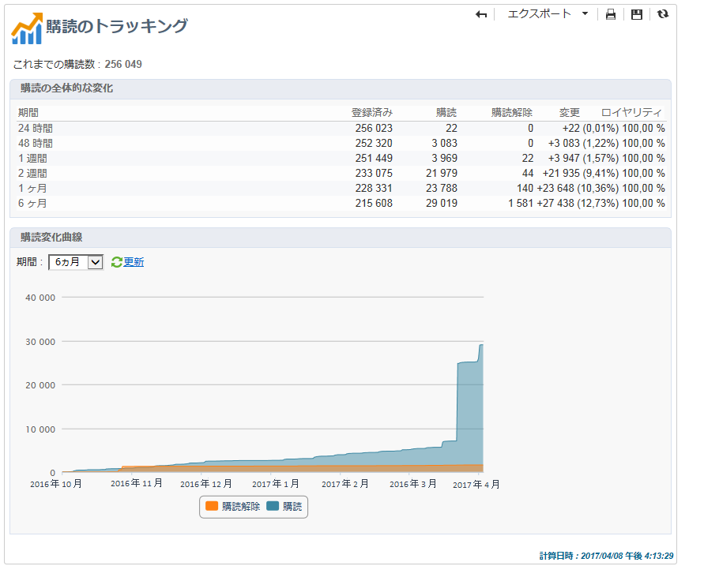

ホームページまたはエクスプローラーのノードをクリックする **[!UICONTROL Profiles and targets > Services and subscriptions]** と、購読に対して表示できます。 Select the desired subscription, and then click the **[!UICONTROL Reports]** tab. デフォルト **[!UICONTROL Subscriptions tracking]** では、レポートを使用できます。 購読および購読解除の動向と、一定の期間のロイヤリティ率を確認できます。ドロップダウンリストでこのデータの表示を設定できます。Click **[!UICONTROL Refresh]** to validate the selected configuration.

詳しくは、[このページ](../../delivery/using/managing-subscriptions.md)を参照してください。

は、現 **[!UICONTROL Number subscribed to date]** 在登録されている人の合計数を表します。

**[!UICONTROL Overall evolution of subscriptions]**

値のテーブルでは、次の指標が使用されています。

* **[!UICONTROL Subscribers]** :該当期間のサブスクライバーの合計数です。
* **[!UICONTROL Subscriptions]** :該当期間の購読数。
* **[!UICONTROL Unsubscriptions]** :該当期間の購読解除数。
* **[!UICONTROL Evolution]** :購読解除数から購読数を引いた数。 この率は、購読者の合計数に基づいて計算されます。
* **[!UICONTROL Loyalty]** :該当期間の購読者の忠誠度率。

**[!UICONTROL Subscription evolution curves]**

このグラフは、該当する期間中の、購読と購読解除の推移を示しています。

## 配信統計 {#delivery-statistics}

このレポートは、処理されて送信されたすべてのメッセージのハードバウンスやソフトバウンス、開封数、クリック数、購読解除数をインターネットドメインごとに分類表示します。

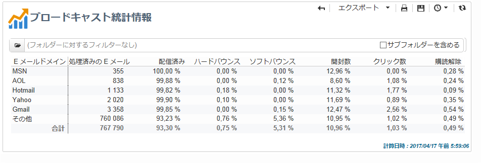

次の指標が使用されています。

* **[!UICONTROL Emails processed]** :配信サーバーが処理したメッセージの合計数です。
* **[!UICONTROL Delivered]** :正常に処理されたメッセージの数と処理されたメッセージの合計数の割合。
* **[!UICONTROL Hard bounces]** :処理されたメッセージの合計数に対する「ハード」バウンスの数の割合。
* **[!UICONTROL Soft bounces]** :処理されたメッセージの合計数に対する「ソフト」バウンスの数の割合。

   >[!NOTE]
   >
   >ハードバウンスおよびソフトバウンスについて詳しくは、[強制隔離管理](../../delivery/using/understanding-quarantine-management.md)を参照してください。

* **[!UICONTROL Opens]** :正常に処理されたメッセージの数と比較して、少なくとも1回メッセージを開いたターゲット受信者の数の割合。
* **[!UICONTROL Clicks]** : percentage of the number of people who clicked in a delivery at least once compared to the number of messages processed successfully.
* **[!UICONTROL Unsubscription]** :正常に処理されたメッセージ数と比較した、購読解除リンクのクリック数の割合。

## 開封の分類 {#breakdown-of-opens}

このレポートは、該当する期間中の、オペレーティングシステム、デバイスおよびブラウザーごとの開封の分類を表示します。それぞれのカテゴリで、2 つのグラフが使用されます。最初のグラフは、コンピューターおよびモバイルデバイスでの開封数に関する統計を示しています。2 つ目のグラフはモバイルデバイスでの開封数のみに関する統計を示しています。

開封数は、開封されたメッセージの合計数に対応しています。テキスト形式の E メールはカウントされません。For more information on Tracking opens, refer to the [Tracking opens](#tracking-opens-) section.

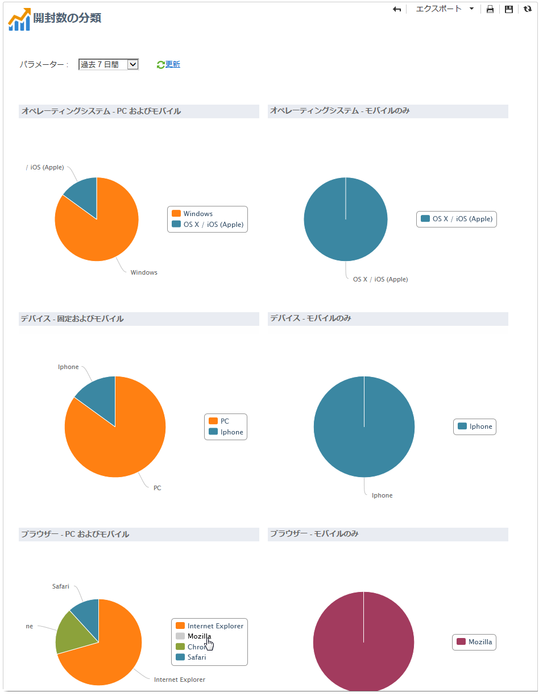

>[!NOTE]
>
>ブラウザーとオペレーティングシステムの名前は、メールが開封されたブラウザーのユーザーエージェントによって送信される情報に含まれています。Adobe Campaign は、そのデバイス情報を使用してデバイスのタイプを推測します。