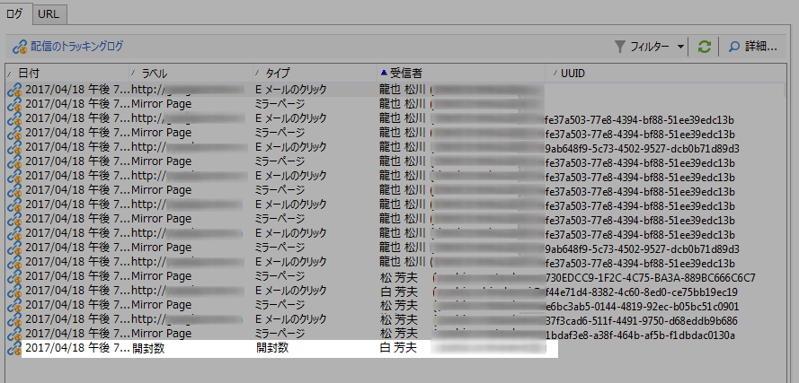
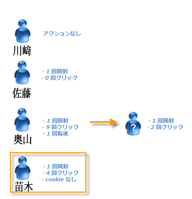

# 人／ユーザーと受信者 {#person-people-and-recipients}

このサンプルは、Adobe Campaign における人／ユーザーと受信者との違いを理解するのに役立ちます。ここでは、次の指標に対する計算方式を説明しながら、ユーザーと受信者の違いに注目するために何人かのユーザーに配信を送信します。

* **[!UICONTROL クリック数]**
* **[!UICONTROL リーチした母集団のユニーククリック数]**
* **[!UICONTROL リーチした母集団のユニーク開封数]**
* **[!UICONTROL 推定転送数]**
* **[!UICONTROL 反応率（生データ）]**

>[!NOTE]
>
>これらの指標は、**[!UICONTROL トラッキング指標]**&#x200B;レポートで使用されます。詳しくは、[トラッキング指標](../../reporting/using/delivery-reports.md#tracking-indicators)を参照してください。

3 つのリンクが配信に追加されています。これが 4 人の受信者に送信されます。

* **[!UICONTROL John Davis]**：この受信者は E メールを開封していません（したがって、リンクもクリックしていません）。
* **[!UICONTROL Marie Stuart]**：E メールを開封しましたが、リンクはクリックしていません。
* **[!UICONTROL Florian David]**：E メールを開封してリンクを 9 回クリックしました。また、この E メールを他のユーザーに転送し、このユーザーが E メールを開封してリンクを 2 回クリックしました。
* **[!UICONTROL Henry Macdonald]**：この受信者は、インターネットブラウザーで cookie を拒否するように設定しています。E メールを開封してリンクを 4 回クリックしました。

次のトラッキングログが返されます。

ユーザーと受信者のカウント方法についてより明確に理解するために、各プロファイルのログを分析します。

## 手順 1：John {#step-1--john}

**[!UICONTROL John Davis]** は E メールを開封していません（したがって、リンクもクリックしていません）。

John は E メールを開封しておらずクリックもしていないので、ログには表示されません。

**中間計算：**

|  | クリックした受信者数 | クリックしたユーザー数 | 開封した受信者数 |
|---|---|---|---|
| John | - | - | - |
| 小計 | 0 | 0 | 0 |

## 手順 2：Marie {#step-2--marie}

**[!UICONTROL Marie Stuart]** は E メールを開封しましたが、リンクはクリックしていません。

Marie の開封は次のログに表示されています。

開封は受信者である Marie に割り当てられます。Adobe Campaign によって新しい受信者がカウントに追加されます。

**中間計算：**

|  | クリックした受信者数 | クリックしたユーザー数 | 開封した受信者数 |
|---|---|---|---|
| John | - | - | - |
| Marie | - | - | +1 |
| 小計 | 0 | 0 | 1 |

## 手順 3：Florian {#step-3--florian}

**[!UICONTROL Florian David]** は、E メールを開封してリンクを 9 回クリックしました。また、この E メールを他のユーザーに転送し、このユーザーが E メールを開封してリンクを 2 回クリックしました。

Florian のアクション（1 回の開封と 9 回のクリック）は、次のログに表示されています。

**受信者**：開封とクリックは同じ受信者（Florian）に割り当てられています。受信者が前の受信者（Marile）と異なるので、Adobe Campaign によって新しい受信者がカウントに追加されます。

ユーザー：この受信者のブラウザーは cookie を許可しているので、同じ識別子（**`fe37a503 [...]`**）がすべてのクリックログに割り当てられています。Adobe Campaign は、これらのクリックが同じユーザーに属することを正しく識別します。新しいユーザーがカウントに追加されます。

**中間計算：**

|  | クリックした受信者数 | クリックしたユーザー数 | 開封した受信者数 |
|---|---|---|---|
| John | - | - | - |
| Marie | - | - | +1 |
| Florian | +1 | +1 | +1 |
| 小計 | 1 | 1 | 2 |

次のログは、Florian が E メールを転送したユーザーによって実行された開封および 2 回のクリックと一致します。

**受信者**：開封とクリックは E メールを転送した受信者（Florian）に割り当てられています。この受信者は既にカウントされているので、受信者のカウントは同じままです。

**ユーザー**：クリックについては、同じ識別子（UUID）がすべてのログに割り当てられています。**`9ab648f9 [...]`**&#x200B;この識別子はまだカウントされていません。したがって、新しいユーザーがカウントに追加されます。

**中間計算：**

|  | クリックした受信者数 | クリックしたユーザー数 | 開封した受信者数 |
|---|---|---|---|
| John | - | - | - |
| Marie | - | - | +1 |
| Florian | +1 | +1 | +1 |
| 不明なユーザー | - | +1 | - |
| 小計 | 1 | 2 | 2 |

## 手順 4：Henry {#step-4--henry}

**[!UICONTROL Henry Macdonald]** は、インターネットブラウザーで cookie を拒否するように設定しています。E メールを開封してリンクを 4 回クリックしました。

Henry が実行した開封と 4 回のクリックは、次のログに表示されています。

**受信者**：開封とクリックは同じ受信者（Henry）に割り当てられています。この受信者はまだカウントされていないので、Adobe Campaign によって 1 人の受信者がカウントに追加されます。

**ユーザー**：Henry のブラウザーは cookie を許可していないので、各クリックに対して新しい識別子（UUID）が生成されます。4 回のクリックのそれぞれを、異なるユーザーがおこなっていると解釈されます。これらの識別子はまだカウントされていないので、カウントに追加されます。

**中間計算：**

|  | クリックした受信者数 | クリックしたユーザー数 | 開封した受信者数 |
|---|---|---|---|
| John | - | - | - |
| Marie | - | - | +1 |
| Florian | +1 | +1 | +1 |
| 不明なユーザー | - | +1 | - |
| Henry | +1 | +4 | +1 |
| 小計 | 2 | 6 | 3 |

## まとめ {#summary}

配信レベルでは、次の結果が得られます。

* **[!UICONTROL クリック数]**（クリックした受信者数）：2
* **[!UICONTROL リーチした母集団のユニーククリック数]**（クリックしたユーザー数）：6
* **[!UICONTROL リーチした母集団のユニーク開封数]**（開封した受信者数）：3

反応率（生データ）と推定転送数は、下記のように計算されます。

* **[!UICONTROL 推定転送数]** = **B - A**（したがって 6 - 2 = 4）
* **[!UICONTROL 反応率（生データ）]** = **A / C**（したがって 2 / 3 = 66.67％）

>[!NOTE]
>
>この計算式について：
>
>* A は「**[!UICONTROL クリック数]**」の指標（クリックした受信者数）を表します。
>* B は「**[!UICONTROL リーチした母集団のユニーククリック数]**」の指標（クリックしたユーザー数）を表します。
>* C は「**[!UICONTROL リーチした母集団のユニーク開封数]**」の指標（開封した受信者数）を表します。